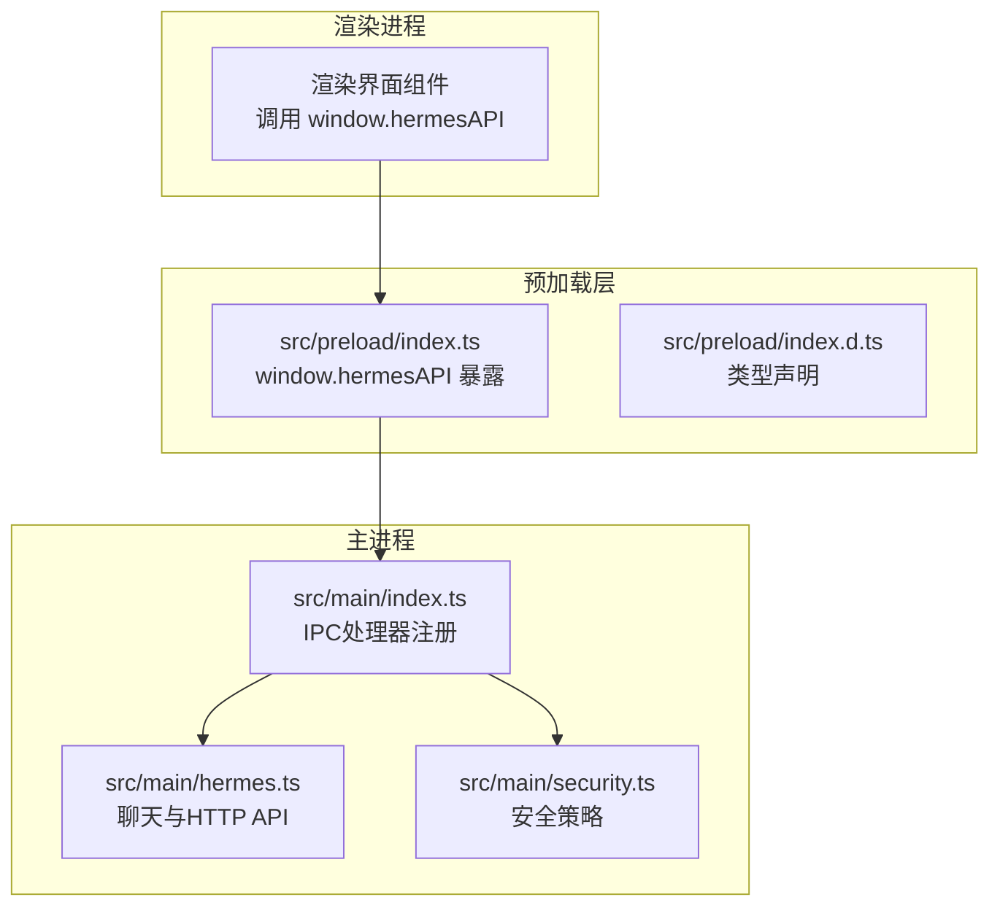
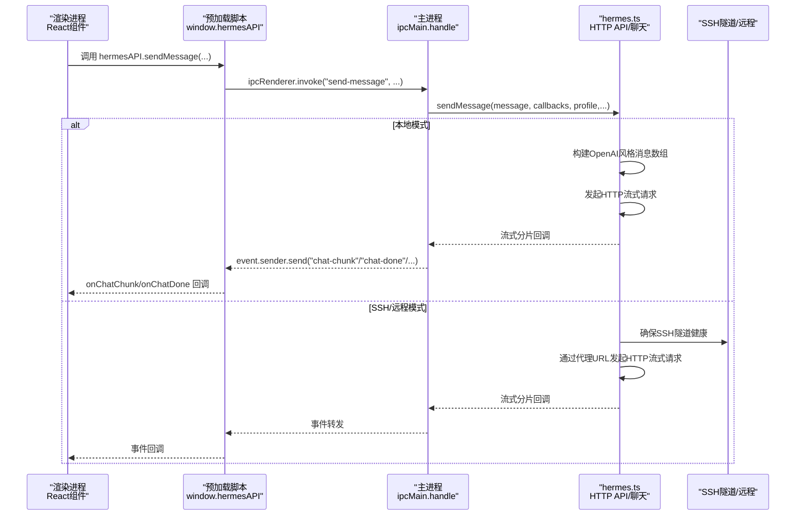
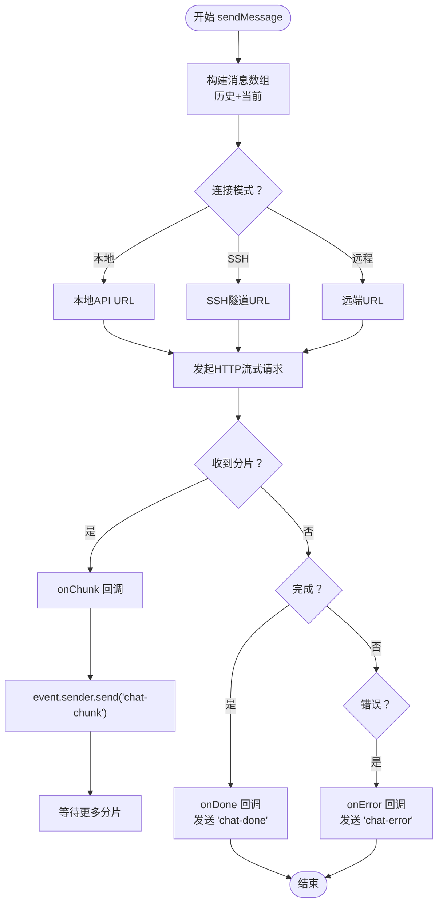
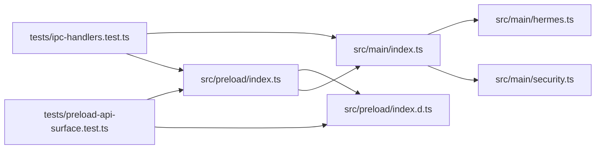

# IPC通信机制

<cite>
**本文档引用的文件**
- [src/main/index.ts](file://src/main/index.ts)
- [src/preload/index.ts](file://src/preload/index.ts)
- [src/preload/index.d.ts](file://src/preload/index.d.ts)
- [src/main/hermes.ts](file://src/main/hermes.ts)
- [src/main/security.ts](file://src/main/security.ts)
- [tests/ipc-handlers.test.ts](file://tests/ipc-handlers.test.ts)
- [tests/preload-api-surface.test.ts](file://tests/preload-api-surface.test.ts)
- [docs/hermes-desktop-architecture.md](file://docs/hermes-desktop-architecture.md)
</cite>

## 目录
1. [简介](#简介)
2. [项目结构](#项目结构)
3. [核心组件](#核心组件)
4. [架构总览](#架构总览)
5. [详细组件分析](#详细组件分析)
6. [依赖关系分析](#依赖关系分析)
7. [性能考量](#性能考量)
8. [故障排除指南](#故障排除指南)
9. [结论](#结论)

## 简介
本文件系统性阐述Hermes Desktop在Electron环境中的IPC（进程间通信）机制，重点覆盖主进程与渲染进程之间的通信架构、预加载脚本的安全隔离、IPC通道设计模式、消息传递协议与数据序列化机制，并提供最佳实践、性能优化建议与安全考虑。文档同时给出IPC调用示例路径与调试技巧，帮助开发者快速理解并正确使用IPC。

## 项目结构
Hermes Desktop的IPC相关代码主要分布在以下位置：
- 主进程入口与IPC处理器注册：src/main/index.ts
- 预加载脚本与window.hermesAPI暴露：src/preload/index.ts 及类型声明 src/preload/index.d.ts
- 安全策略与导航控制：src/main/security.ts
- 聊天与HTTP API交互：src/main/hermes.ts
- IPC一致性与API表面测试：tests/ipc-handlers.test.ts、tests/preload-api-surface.test.ts
- 架构文档参考：docs/hermes-desktop-architecture.md

图表来源
- [src/main/index.ts:290-1005](file://src/main/index.ts#L290-L1005)
- [src/preload/index.ts:15-686](file://src/preload/index.ts#L15-L686)
- [src/preload/index.d.ts:29-471](file://src/preload/index.d.ts#L29-L471)
- [src/main/hermes.ts:22-200](file://src/main/hermes.ts#L22-L200)
- [src/main/security.ts:1-78](file://src/main/security.ts#L1-L78)

章节来源
- [src/main/index.ts:196-288](file://src/main/index.ts#L196-L288)
- [src/preload/index.ts:688-700](file://src/preload/index.ts#L688-L700)

## 核心组件
- 预加载脚本（contextBridge + window.hermesAPI）
  - 通过contextBridge.exposeInMainWorld在渲染上下文中安全暴露hermesAPI对象，封装所有IPC调用。
  - 提供统一的invoke/on/removeListener接口，确保类型安全与一致的错误处理。
- 主进程IPC处理器（ipcMain.handle）
  - 在src/main/index.ts集中注册各类IPC通道，覆盖安装、配置、聊天、会话、技能、模型、Claw3D、更新、日志等模块。
  - 大部分通道支持本地与SSH远程两种模式，通过getConnectionConfig动态切换。
- 安全隔离与导航控制
  - 严格的contextIsolation、sandbox启用，禁止nodeIntegration，限制webview与外部链接访问。
  - 对webview进行偏好加固，阻止不安全的preload注入。

章节来源
- [src/preload/index.ts:15-686](file://src/preload/index.ts#L15-L686)
- [src/main/index.ts:290-1005](file://src/main/index.ts#L290-L1005)
- [src/main/security.ts:1-78](file://src/main/security.ts#L1-L78)

## 架构总览
下图展示从渲染进程到主进程的关键调用链路，以及主进程内部对本地与SSH远程模式的处理：

图表来源
- [src/preload/index.ts:158-233](file://src/preload/index.ts#L158-L233)
- [src/main/index.ts:544-640](file://src/main/index.ts#L544-L640)
- [src/main/hermes.ts:168-200](file://src/main/hermes.ts#L168-L200)

## 详细组件分析

### 预加载脚本与window.hermesAPI
- 设计目标
  - 将主进程能力以类型安全的方式暴露给渲染进程，避免直接访问Node/Electron API。
  - 统一管理IPC通道名、参数校验与回调生命周期（on/removeListener）。
- 关键特性
  - 使用contextBridge.exposeInMainWorld在隔离环境中暴露对象。
  - 所有invoke调用均使用带引号的字符串通道名，遵循kebab-case命名约定。
  - 提供onXxx系列监听器，返回解绑函数，防止内存泄漏。
- 类型声明
  - index.d.ts定义完整的HermesAPI接口，确保编译期检查与IDE智能提示。

```mermaid
classDiagram
class HermesAPI {
+checkInstall()
+verifyInstall()
+startInstall()
+onInstallProgress(cb)
+getHermesVersion()
+refreshHermesVersion()
+runHermesDoctor()
+runHermesUpdate()
+getLocale()
+setLocale()
+getEnv(profile?)
+setEnv(key,value,profile?)
+getConfig(key,profile?)
+setConfig(key,value,profile?)
+getHermesHome(profile?)
+getModelConfig(profile?)
+setModelConfig(provider,model,baseUrl,profile?)
+isRemoteMode()
+isRemoteOnlyMode()
+getConnectionConfig()
+setConnectionConfig(mode,url,apiKey?)
+setSshConfig(...)
+testRemoteConnection(url,apiKey?)
+testSshConnection(...)
+isSshTunnelActive()
+startSshTunnel()
+stopSshTunnel()
+sendMessage(message,profile?,resumeSessionId?,history?)
+abortChat()
+onChatChunk(cb)
+onChatDone(cb)
+onChatToolProgress(cb)
+onChatUsage(cb)
+onChatError(cb)
+startGateway()
+stopGateway()
+gatewayStatus()
+getPlatformEnabled(profile?)
+setPlatformEnabled(platform,enabled,profile?)
+listSessions(limit?,offset?)
+getSessionMessages(sessionId)
+listProfiles()
+createProfile(name,clone)
+deleteProfile(name)
+setActiveProfile(name)
+readMemory(profile?)
+addMemoryEntry(content,profile?)
+updateMemoryEntry(index,content,profile?)
+removeMemoryEntry(index,profile?)
+writeUserProfile(content,profile?)
+readSoul(profile?)
+writeSoul(content,profile?)
+resetSoul(profile?)
+getToolsets(profile?)
+setToolsetEnabled(key,enabled,profile?)
+listInstalledSkills(profile?)
+listBundledSkills()
+getSkillContent(skillPath)
+installSkill(identifier,profile?)
+uninstallSkill(name,profile?)
+listCachedSessions(limit?,offset?)
+syncSessionCache()
+updateSessionTitle(sessionId,title)
+deleteSession(sessionId)
+searchSessions(query,limit?)
+getCredentialPool()
+setCredentialPool(provider,entries)
+listModels()
+addModel(name,provider,model,baseUrl)
+removeModel(id)
+updateModel(id,fields)
+claw3dStatus()
+claw3dSetup()
+onClaw3dSetupProgress(cb)
+claw3dGetPort()
+claw3dSetPort(port)
+claw3dGetWsUrl()
+claw3dSetWsUrl(url)
+claw3dStartAll()
+claw3dStopAll()
+claw3dGetLogs()
+claw3dStartDev()
+claw3dStopDev()
+claw3dStartAdapter()
+claw3dStopAdapter()
+checkForUpdates()
+downloadUpdate()
+installUpdate()
+getAppVersion()
+onUpdateAvailable(cb)
+onUpdateDownloadProgress(cb)
+onUpdateDownloaded(cb)
+onMenuNewChat(cb)
+onMenuSearchSessions(cb)
+listCronJobs(includeDisabled?,profile?)
+createCronJob(schedule,prompt?,name?,deliver?,profile?)
+removeCronJob(jobId,profile?)
+pauseCronJob(jobId,profile?)
+resumeCronJob(jobId,profile?)
+triggerCronJob(jobId,profile?)
+openExternal(url)
+runHermesBackup(profile?)
+runHermesImport(archivePath,profile?)
+runHermesDump()
+discoverMemoryProviders(profile?)
+listMcpServers(profile?)
+readLogs(logFile?,lines?)
}
```

图表来源
- [src/preload/index.ts:15-686](file://src/preload/index.ts#L15-L686)
- [src/preload/index.d.ts:29-471](file://src/preload/index.d.ts#L29-L471)

章节来源
- [src/preload/index.ts:15-686](file://src/preload/index.ts#L15-L686)
- [src/preload/index.d.ts:29-471](file://src/preload/index.d.ts#L29-L471)

### 主进程IPC处理器注册
- 注册范围
  - 安装与更新：check-install、start-install、run-hermes-update、refresh-hermes-version等。
  - 配置与连接：get-env、set-env、get-config、set-config、model-config、connection-config、SSH隧道等。
  - 聊天与网关：send-message、abort-chat、start-gateway、stop-gateway、gateway-status。
  - 会话与缓存：list-sessions、get-session-messages、list-cached-sessions、sync-session-cache、search-sessions。
  - 记忆与人格：read-memory、write-user-profile、read-soul、write-soul、reset-soul。
  - 工具与技能：get-toolsets、set-toolset-enabled、list-installed-skills、install-skill、uninstall-skill。
  - 模型管理：list-models、add-model、remove-model、update-model。
  - Claw3D：claw3d-status、claw3d-setup、start/stop dev/adapter、端口与WS URL管理。
  - 更新与日志：check-for-updates、download-update、install-update、read-logs。
  - 其他：backup/import、dump、MCP服务器、内存提供者发现、菜单事件转发等。
- 模式适配
  - 大多数通道根据getConnectionConfig().mode自动选择本地或SSH远程实现。
  - SSH模式下通过ssh前缀函数与隧道URL进行通信。

章节来源
- [src/main/index.ts:290-1005](file://src/main/index.ts#L290-L1005)

### 聊天与HTTP API流式传输
- 请求构建
  - 将历史消息与当前消息转换为标准OpenAI格式的消息数组。
  - 通过getApiUrl()与getRemoteAuthHeader()决定本地、SSH隧道或远程HTTP的访问方式。
- 流式回调
  - onChunk：实时接收文本片段并转发到渲染进程。
  - onDone：完成时携带会话ID，触发桌面通知（窗口失焦且耗时较长时）。
  - onError：错误回调，同样触发通知。
  - onToolProgress/onUsage：工具进度与用量统计事件。
- 中断机制
  - 支持AbortController中断当前聊天请求，避免并发冲突。

图表来源
- [src/main/index.ts:544-640](file://src/main/index.ts#L544-L640)
- [src/main/hermes.ts:168-200](file://src/main/hermes.ts#L168-L200)

章节来源
- [src/main/index.ts:544-640](file://src/main/index.ts#L544-L640)
- [src/main/hermes.ts:153-200](file://src/main/hermes.ts#L153-L200)

### 安全隔离与导航控制
- 预加载安全
  - contextIsolation: true，禁用nodeIntegration，启用sandbox，限制webview与外部链接。
  - 对webview偏好进行加固，移除preload，强制contextIsolation。
- 导航与外链
  - isAllowedAppNavigationUrl：仅允许指向应用HTML文件或开发服务器。
  - isAllowedExternalUrl：仅允许https/http/mailto协议。
  - isAllowedWebviewUrl：仅允许本地主机与合法端口范围。
- webContents加固
  - 对已附加的webview内容进行窗口打开与导航拦截。

章节来源
- [src/main/security.ts:1-78](file://src/main/security.ts#L1-L78)
- [src/main/index.ts:250-281](file://src/main/index.ts#L250-L281)

## 依赖关系分析
- 预加载与主进程的强一致性
  - tests/ipc-handlers.test.ts验证每个ipcRenderer.invoke都有对应的ipcMain.handle。
  - tests/preload-api-surface.test.ts验证每个hermesAPI方法在类型声明中均有对应签名。
- 命名约定与一致性
  - 所有IPC通道名采用带引号的字符串，遵循kebab-case，便于静态分析与重构。
- 模块耦合
  - hermes.ts作为HTTP API与聊天的核心模块，被主进程多处通道复用。
  - security.ts提供跨模块共享的安全策略。

图表来源
- [src/preload/index.ts:15-686](file://src/preload/index.ts#L15-L686)
- [src/preload/index.d.ts:29-471](file://src/preload/index.d.ts#L29-L471)
- [src/main/index.ts:290-1005](file://src/main/index.ts#L290-L1005)
- [src/main/hermes.ts:22-200](file://src/main/hermes.ts#L22-L200)
- [src/main/security.ts:1-78](file://src/main/security.ts#L1-L78)
- [tests/ipc-handlers.test.ts:1-117](file://tests/ipc-handlers.test.ts#L1-L117)
- [tests/preload-api-surface.test.ts:1-213](file://tests/preload-api-surface.test.ts#L1-L213)

章节来源
- [tests/ipc-handlers.test.ts:1-117](file://tests/ipc-handlers.test.ts#L1-L117)
- [tests/preload-api-surface.test.ts:1-213](file://tests/preload-api-surface.test.ts#L1-L213)

## 性能考量
- 流式传输优先
  - 聊天与安装进度均采用流式事件，避免一次性大响应导致UI阻塞。
- 缓存与懒启动
  - 首次发送消息时才启动网关，减少资源占用。
  - SSH隧道按需启动与健康检查，避免不必要的网络开销。
- 事件去抖与内存管理
  - onXxx监听器返回解绑函数，避免重复订阅与内存泄漏。
- 并发控制
  - 当前聊天请求支持abort，避免多个并发请求互相干扰。

## 故障排除指南
- 通道不匹配
  - 症状：渲染进程调用hermesAPI方法时报“未找到处理器”。
  - 排查：运行测试用例确认ipc-handlers一致性；检查通道名是否为kebab-case且引号包裹。
- 类型不匹配
  - 症状：TypeScript编译报错或IDE提示方法不存在。
  - 排查：确认index.d.ts与preload实现一一对应；避免遗漏或拼写错误。
- 安全拦截
  - 症状：外链无法打开、webview无法加载或导航被阻止。
  - 排查：核对isAllowedExternalUrl/isAllowedAppNavigationUrl/isAllowedWebviewUrl逻辑；确保URL格式正确。
- SSH隧道问题
  - 症状：远程模式下聊天失败或超时。
  - 排查：检查isSshTunnelActive/isSshTunnelHealthy；确认SSH配置与远端服务状态。
- 错误事件
  - 症状：onChatError触发但无详细信息。
  - 排查：在渲染侧注册onChatError监听器，结合主进程日志定位具体错误。

章节来源
- [tests/ipc-handlers.test.ts:38-56](file://tests/ipc-handlers.test.ts#L38-L56)
- [tests/preload-api-surface.test.ts:45-63](file://tests/preload-api-surface.test.ts#L45-L63)
- [src/main/security.ts:20-77](file://src/main/security.ts#L20-L77)
- [src/main/index.ts:642-647](file://src/main/index.ts#L642-L647)

## 结论
Hermes Desktop的IPC体系通过预加载脚本与主进程处理器的清晰分工，实现了安全、可维护且高性能的通信机制。预加载层提供类型安全的API表面，主进程集中处理业务逻辑并适配本地与SSH远程模式。配合严格的安全策略与完善的测试保障，该架构能够稳定支撑复杂的功能模块与良好的用户体验。