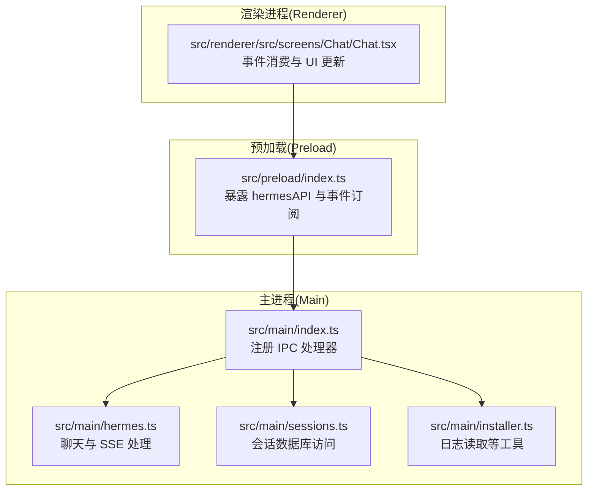
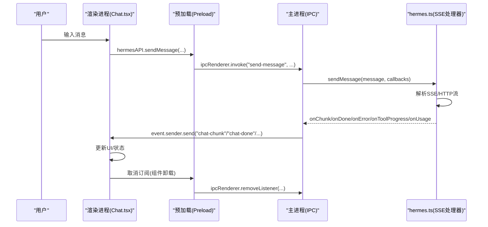
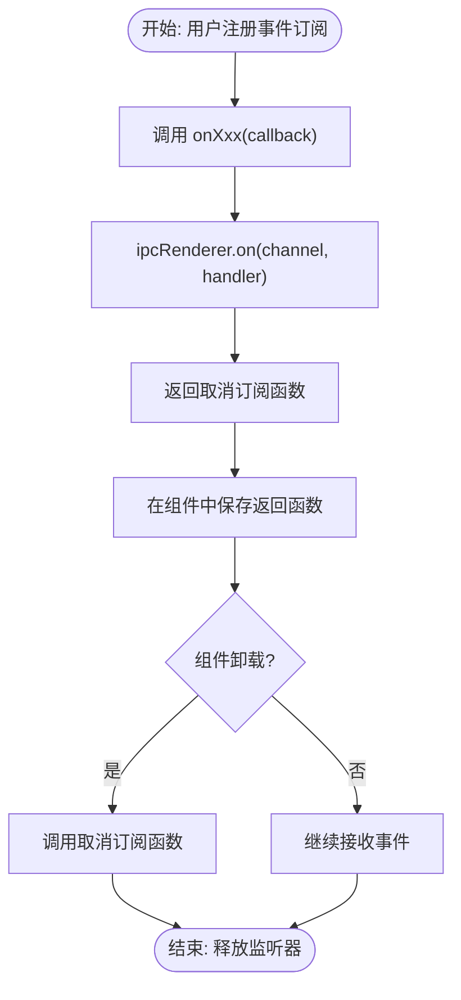
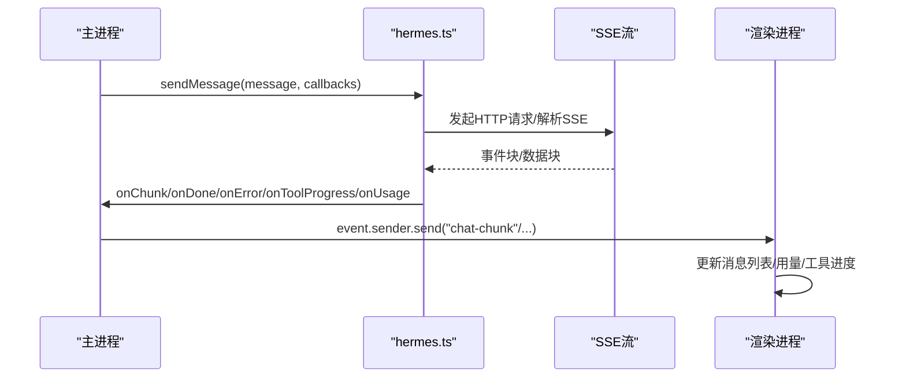
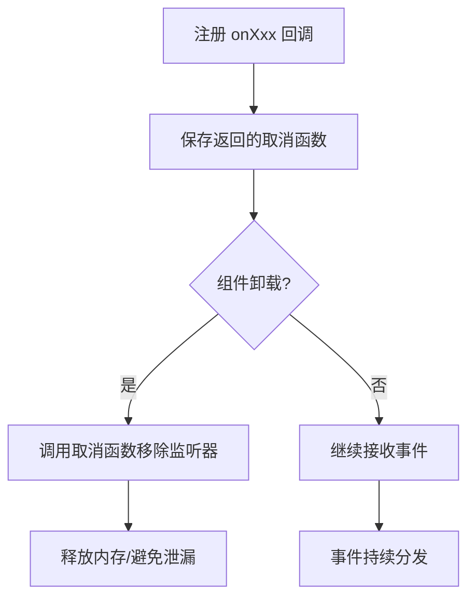
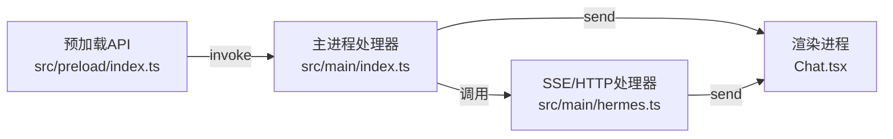

# 事件处理机制

<cite>
**本文档引用的文件**
- [src/main/index.ts](file://src/main/index.ts)
- [src/main/hermes.ts](file://src/main/hermes.ts)
- [src/preload/index.ts](file://src/preload/index.ts)
- [src/renderer/src/screens/Chat/Chat.tsx](file://src/renderer/src/screens/Chat/Chat.tsx)
- [tests/ipc-handlers.test.ts](file://tests/ipc-handlers.test.ts)
- [tests/preload-api-surface.test.ts](file://tests/preload-api-surface.test.ts)
- [src/main/sessions.ts](file://src/main/sessions.ts)
- [src/main/installer.ts](file://src/main/installer.ts)
</cite>

## 目录
1. [简介](#简介)
2. [项目结构](#项目结构)
3. [核心组件](#核心组件)
4. [架构总览](#架构总览)
5. [详细组件分析](#详细组件分析)
6. [依赖关系分析](#依赖关系分析)
7. [性能考虑](#性能考虑)
8. [故障排除指南](#故障排除指南)
9. [结论](#结论)
10. [附录](#附录)

## 简介
本文件系统性梳理 Hermes Desktop 的事件处理机制，重点覆盖以下方面：
- IPC 事件的订阅、取消订阅与生命周期管理
- 事件回调函数的注册机制、内存泄漏防护与异步事件处理模式
- 事件优先级、事件队列管理与事件过滤策略
- 性能优化技巧、错误恢复机制与调试方法
- 具体事件监听示例与最佳实践

通过源码分析与测试用例验证，确保文档内容与实际实现保持一致。

## 项目结构
Hermes Desktop 的事件处理主要由三部分组成：
- 主进程（Main）：负责注册 IPC 处理器、转发事件到渲染进程、管理会话与网关状态
- 预加载脚本（Preload）：在隔离上下文中暴露安全的 API，并封装事件订阅/取消订阅
- 渲染进程（Renderer）：接收事件并更新 UI，同时触发新的 IPC 请求

**图表来源**
- [src/main/index.ts:290-1005](file://src/main/index.ts#L290-L1005)
- [src/main/hermes.ts:153-434](file://src/main/hermes.ts#L153-L434)
- [src/preload/index.ts:15-701](file://src/preload/index.ts#L15-L701)
- [src/renderer/src/screens/Chat/Chat.tsx:106-200](file://src/renderer/src/screens/Chat/Chat.tsx#L106-L200)

**章节来源**
- [src/main/index.ts:290-1005](file://src/main/index.ts#L290-L1005)
- [src/preload/index.ts:15-701](file://src/preload/index.ts#L15-L701)
- [src/main/hermes.ts:153-434](file://src/main/hermes.ts#L153-L434)

## 核心组件
- 主进程 IPC 注册器：集中注册所有 IPC 处理器，包括聊天、网关、配置、会话、技能、模型、日志等
- 预加载事件订阅器：提供 onXxx 回调注册方法，返回取消订阅函数；统一使用 ipcRenderer.on/onRemoveListener
- 渲染进程事件消费者：在组件中注册事件回调，处理聊天片段、完成、错误、工具进度、用量等
- 聊天与 SSE 处理器：解析 SSE 事件，分发自定义事件与数据块，支持工具进度与用量上报

关键职责与交互路径：
- 主进程通过 ipcMain.handle 接收请求，内部调用 hermes.ts 的发送逻辑
- hermes.ts 将 SSE 数据拆分为片段并通过 event.sender.send 分发到渲染进程
- 预加载层封装事件订阅，返回移除监听器的函数，避免内存泄漏
- 渲染层在组件卸载时自动清理订阅，确保生命周期正确

**章节来源**
- [src/main/index.ts:544-640](file://src/main/index.ts#L544-L640)
- [src/main/hermes.ts:268-434](file://src/main/hermes.ts#L268-L434)
- [src/preload/index.ts:175-228](file://src/preload/index.ts#L175-L228)

## 架构总览
下图展示从用户输入到事件分发与 UI 更新的完整流程：

**图表来源**
- [src/renderer/src/screens/Chat/Chat.tsx:106-200](file://src/renderer/src/screens/Chat/Chat.tsx#L106-L200)
- [src/preload/index.ts:159-173](file://src/preload/index.ts#L159-L173)
- [src/main/index.ts:544-640](file://src/main/index.ts#L544-L640)
- [src/main/hermes.ts:168-434](file://src/main/hermes.ts#L168-L434)

## 详细组件分析

### 组件A：IPC 事件订阅与取消订阅（预加载层）
- 订阅机制：每个 onXxx 方法内部调用 ipcRenderer.on 注册处理器，返回一个移除监听器的函数
- 取消订阅：调用返回的函数，内部通过 ipcRenderer.removeListener 移除对应监听器
- 生命周期管理：建议在组件卸载时调用取消订阅函数，防止内存泄漏
- 一致性保证：测试用例验证了所有 onXxx 通道名称与对应的 ipcRenderer.on 使用保持一致

**图表来源**
- [src/preload/index.ts:175-228](file://src/preload/index.ts#L175-L228)
- [tests/preload-api-surface.test.ts:193-212](file://tests/preload-api-surface.test.ts#L193-L212)

**章节来源**
- [src/preload/index.ts:175-228](file://src/preload/index.ts#L175-L228)
- [tests/preload-api-surface.test.ts:193-212](file://tests/preload-api-surface.test.ts#L193-L212)

### 组件B：聊天事件分发（主进程与 hermes.ts）
- 主进程注册 "send-message" 处理器，内部启动网关、确保隧道健康后调用 sendMessage
- hermes.ts 的 sendMessageViaApi 解析 SSE 块，识别自定义事件（如 hermes.tool.progress）与数据块
- 主进程将 onChunk/onDone/onError/onToolProgress/onUsage 通过 event.sender.send 分发给渲染进程
- 渲染进程在 Chat.tsx 中注册相应回调，更新 UI 并处理通知

**图表来源**
- [src/main/index.ts:544-640](file://src/main/index.ts#L544-L640)
- [src/main/hermes.ts:268-434](file://src/main/hermes.ts#L268-L434)

**章节来源**
- [src/main/index.ts:544-640](file://src/main/index.ts#L544-L640)
- [src/main/hermes.ts:268-434](file://src/main/hermes.ts#L268-L434)

### 组件C：事件回调注册与内存泄漏防护
- 注册方式：每个 onXxx 返回一个可调用的取消函数，用于移除监听器
- 防护策略：在组件卸载时调用取消函数；主进程在应用退出前清理当前聊天的中断句柄
- 一致性校验：测试用例确保所有 onXxx 通道名与 on/removeListener 使用一致

**图表来源**
- [src/preload/index.ts:175-228](file://src/preload/index.ts#L175-L228)
- [src/main/index.ts:1224-1233](file://src/main/index.ts#L1224-L1233)

**章节来源**
- [src/preload/index.ts:175-228](file://src/preload/index.ts#L175-L228)
- [src/main/index.ts:1224-1233](file://src/main/index.ts#L1224-L1233)

### 组件D：事件优先级、队列管理与过滤策略
- 事件优先级：主进程按回调顺序分发事件，未见显式优先级队列实现
- 事件队列：SSE 流式解析逐块处理，无额外队列缓存
- 过滤策略：SSE 自定义事件仅在匹配 eventType 时处理，普通数据块按 [DONE] 与错误字段过滤
- 会话与日志：会话查询与日志读取在主进程侧进行，避免渲染进程直接访问底层资源

**章节来源**
- [src/main/hermes.ts:268-434](file://src/main/hermes.ts#L268-L434)
- [src/main/sessions.ts:46-186](file://src/main/sessions.ts#L46-L186)
- [src/main/installer.ts:1107-1129](file://src/main/installer.ts#L1107-L1129)

### 组件E：异步事件处理模式与错误恢复
- 异步模式：ipcRenderer.invoke 返回 Promise，主进程通过 event.sender.send 异步分发事件
- 错误恢复：SSE 流空响应时探测非流式请求以揭示真实错误；聊天错误通过 onError 回调上抛
- 通知机制：窗口失焦时对长时间响应或错误发送桌面通知

**章节来源**
- [src/main/index.ts:544-640](file://src/main/index.ts#L544-L640)
- [src/main/hermes.ts:218-266](file://src/main/hermes.ts#L218-L266)

### 组件F：事件监听示例与最佳实践
- 示例场景：在 Chat.tsx 中注册 onChatChunk/onChatDone/onChatError/onChatToolProgress/onChatUsage
- 最佳实践：
  - 在 useEffect 中注册事件，在返回的清理函数中调用取消订阅
  - 对于长耗时操作，结合 onChatToolProgress 提供即时反馈
  - 使用 onChatUsage 获取用量统计，便于成本控制与限流提示
  - 对于菜单事件（如新建会话），通过 onMenuNewChat 订阅原生菜单动作

**章节来源**
- [src/renderer/src/screens/Chat/Chat.tsx:106-200](file://src/renderer/src/screens/Chat/Chat.tsx#L106-L200)
- [src/preload/index.ts:566-576](file://src/preload/index.ts#L566-L576)

## 依赖关系分析
- 预加载到主进程：通过 ipcRenderer.invoke 与 ipcMain.handle 建立单向请求通道
- 主进程到渲染进程：通过 event.sender.send 建立单向事件通道
- hermes.ts 作为中间层：封装 HTTP/SSE 与 CLI 两种路径，统一分发事件回调

**图表来源**
- [src/preload/index.ts:15-701](file://src/preload/index.ts#L15-L701)
- [src/main/index.ts:290-1005](file://src/main/index.ts#L290-L1005)
- [src/main/hermes.ts:153-434](file://src/main/hermes.ts#L153-L434)

**章节来源**
- [src/preload/index.ts:15-701](file://src/preload/index.ts#L15-L701)
- [src/main/index.ts:290-1005](file://src/main/index.ts#L290-L1005)
- [src/main/hermes.ts:153-434](file://src/main/hermes.ts#L153-L434)

## 性能考虑
- SSE 流式解析：逐块处理，减少内存占用；遇到 [DONE] 或错误时提前结束
- 健康检查与轮询：主进程对 API 服务器进行周期性健康检查，可用后停止轮询
- 事件去抖与滚动：渲染层根据用户滚动位置决定是否自动滚动到底部，避免不必要的重排
- 通知节流：仅在窗口失焦且响应时间超过阈值时发送桌面通知，降低打扰

[本节为通用指导，无需具体文件来源]

## 故障排除指南
- 通道一致性问题：测试用例确保所有 ipcRenderer.invoke 与 ipcMain.handle 的通道名一致
- 事件未触发：确认 onXxx 订阅已注册且未被提前取消；检查主进程处理器是否存在
- 内存泄漏：确保在组件卸载时调用取消订阅函数；主进程在 before-quit 时清理当前聊天中断句柄
- 错误定位：利用 onChatError 获取错误信息；必要时启用日志读取功能查看 agent.log

**章节来源**
- [tests/ipc-handlers.test.ts:38-117](file://tests/ipc-handlers.test.ts#L38-L117)
- [src/main/index.ts:1224-1233](file://src/main/index.ts#L1224-L1233)
- [src/main/installer.ts:1107-1129](file://src/main/installer.ts#L1107-L1129)

## 结论
Hermes Desktop 的事件处理机制以 Electron IPC 为核心，通过预加载层的安全封装与主进程的集中调度，实现了稳定可靠的异步事件分发。其设计强调：
- 明确的订阅/取消订阅生命周期
- SSE 流式解析与错误恢复
- 渲染层的事件消费与 UI 即时反馈
- 通过测试保障通道一致性与 API 表面完整性

建议在实际开发中遵循“注册即清理”的原则，配合工具进度与用量回调提升用户体验，并通过日志与错误回调完善可观测性。

[本节为总结性内容，无需具体文件来源]

## 附录
- 事件通道一致性测试：验证主进程处理器与预加载调用的一致性
- 预加载 API 表面测试：验证 onXxx 通道名与 on/removeListener 使用一致性
- 会话与日志工具：提供会话查询与日志读取能力，辅助调试

**章节来源**
- [tests/ipc-handlers.test.ts:38-117](file://tests/ipc-handlers.test.ts#L38-L117)
- [tests/preload-api-surface.test.ts:193-212](file://tests/preload-api-surface.test.ts#L193-L212)
- [src/main/sessions.ts:46-186](file://src/main/sessions.ts#L46-L186)
- [src/main/installer.ts:1107-1129](file://src/main/installer.ts#L1107-L1129)