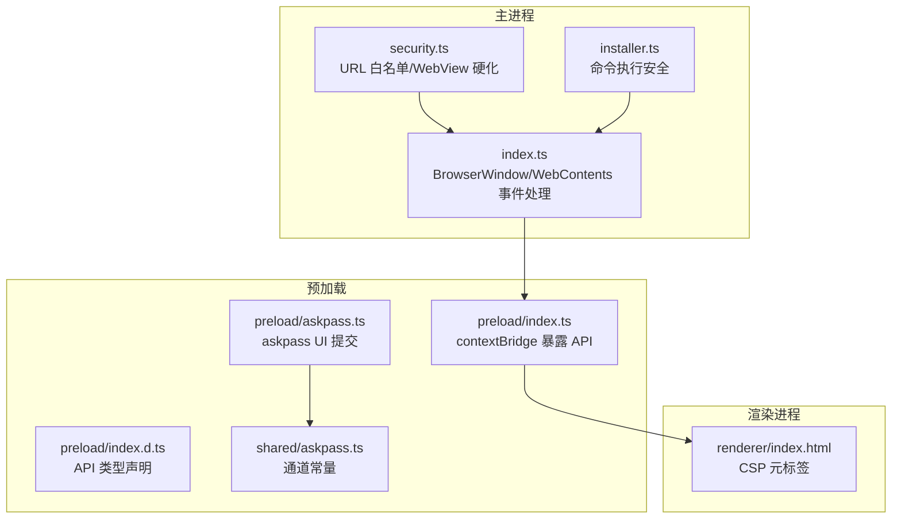
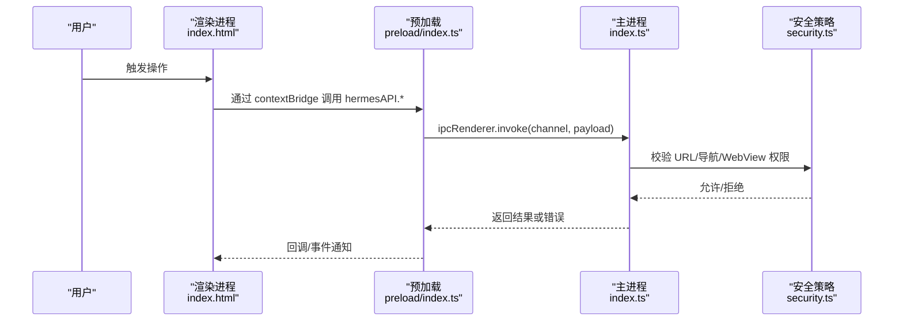
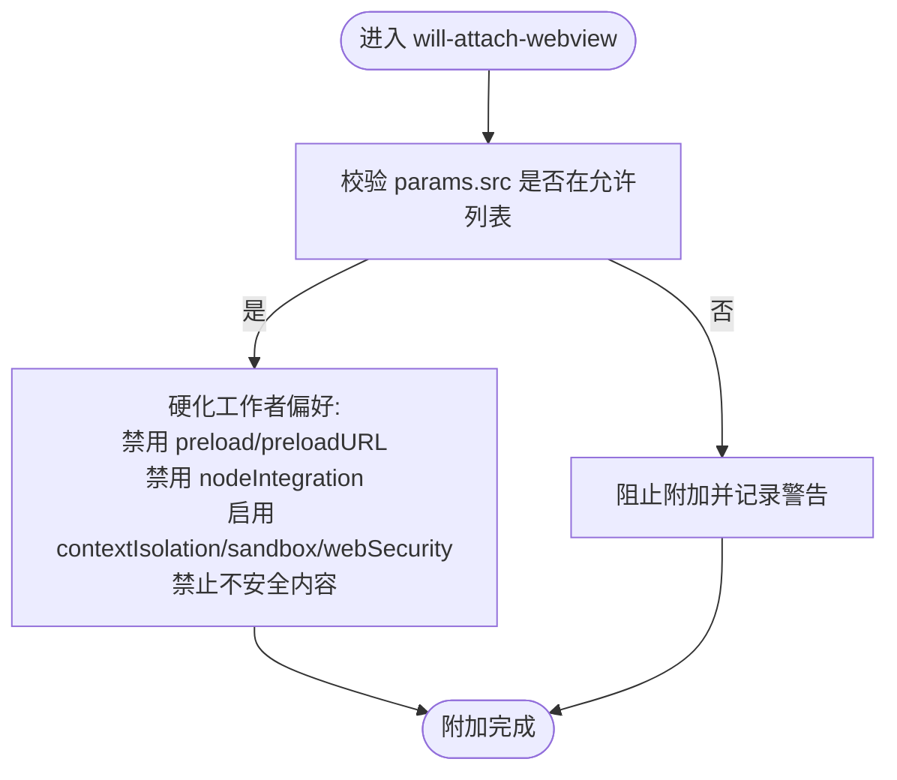
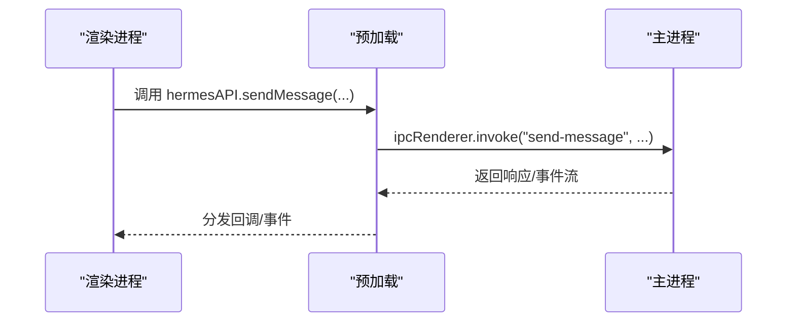
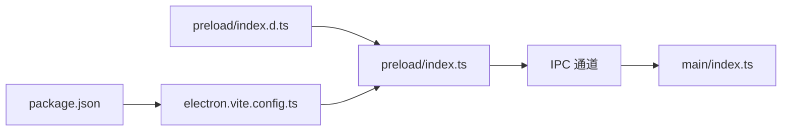

# 安全隔离机制

<cite>
**本文引用的文件**
- [src/main/security.ts](file://src/main/security.ts)
- [src/main/index.ts](file://src/main/index.ts)
- [src/preload/index.ts](file://src/preload/index.ts)
- [src/preload/index.d.ts](file://src/preload/index.d.ts)
- [src/preload/askpass.ts](file://src/preload/askpass.ts)
- [src/renderer/index.html](file://src/renderer/index.html)
- [src/shared/askpass.ts](file://src/shared/askpass.ts)
- [src/main/installer.ts](file://src/main/installer.ts)
- [electron.vite.config.ts](file://electron.vite.config.ts)
- [package.json](file://package.json)
- [tests/electron-security.test.ts](file://tests/electron-security.test.ts)
- [tests/preload-api-surface.test.ts](file://tests/preload-api-surface.test.ts)
</cite>

## 目录
1. [引言](#引言)
2. [项目结构](#项目结构)
3. [核心组件](#核心组件)
4. [架构总览](#架构总览)
5. [详细组件分析](#详细组件分析)
6. [依赖关系分析](#依赖关系分析)
7. [性能考量](#性能考量)
8. [故障排查指南](#故障排查指南)
9. [结论](#结论)
10. [附录](#附录)

## 引言
本文件系统性阐述 Hermes Desktop 的安全隔离机制，聚焦于 Electron 上下文隔离、预加载脚本（Preload）的 API 暴露面、CSP 策略、Node.js 集成限制与恶意代码防护，并提供安全审计清单、漏洞检测方法与最佳实践。内容基于仓库中的源码与测试用例进行归纳总结，确保技术细节可追溯至实际实现。

## 项目结构
Hermes Desktop 的安全相关代码主要分布在以下模块：
- 主进程安全策略与窗口/WebView 硬化：src/main/security.ts、src/main/index.ts
- 预加载脚本与类型声明：src/preload/index.ts、src/preload/index.d.ts、src/preload/askpass.ts
- 渲染进程 CSP：src/renderer/index.html
- 安装器与命令执行安全：src/main/installer.ts
- 构建配置与依赖：electron.vite.config.ts、package.json
- 安全测试：tests/electron-security.test.ts、tests/preload-api-surface.test.ts

**图表来源**
- [src/main/security.ts:1-78](file://src/main/security.ts#L1-L78)
- [src/main/index.ts:196-288](file://src/main/index.ts#L196-L288)
- [src/preload/index.ts:1-701](file://src/preload/index.ts#L1-L701)
- [src/preload/index.d.ts:1-479](file://src/preload/index.d.ts#L1-L479)
- [src/preload/askpass.ts:1-28](file://src/preload/askpass.ts#L1-L28)
- [src/shared/askpass.ts:1-2](file://src/shared/askpass.ts#L1-L2)
- [src/renderer/index.html:1-16](file://src/renderer/index.html#L1-L16)
- [src/main/installer.ts:1-200](file://src/main/installer.ts#L1-L200)

**章节来源**
- [src/main/security.ts:1-78](file://src/main/security.ts#L1-L78)
- [src/main/index.ts:196-288](file://src/main/index.ts#L196-L288)
- [src/preload/index.ts:1-701](file://src/preload/index.ts#L1-L701)
- [src/preload/index.d.ts:1-479](file://src/preload/index.d.ts#L1-L479)
- [src/preload/askpass.ts:1-28](file://src/preload/askpass.ts#L1-L28)
- [src/renderer/index.html:1-16](file://src/renderer/index.html#L1-L16)
- [src/main/installer.ts:1-200](file://src/main/installer.ts#L1-L200)
- [electron.vite.config.ts:1-33](file://electron.vite.config.ts#L1-L33)
- [package.json:1-70](file://package.json#L1-L70)

## 核心组件
- 上下文隔离与 WebView 硬化：通过安全策略函数与 WebContents 事件拦截，限制导航与 WebView 附加行为，强制启用沙箱与隔离。
- 预加载脚本 API 暴露面：仅通过 contextBridge 暴露受控 API，避免直接暴露 Node/Electron 能力。
- CSP 策略：在渲染进程 HTML 中声明最小化的内容安全策略，限制资源来源。
- Node 集成限制：主进程窗口禁用 nodeIntegration，严格限制 webviewTag 使用场景并硬化工作者进程偏好。
- 恶意代码防护：统一外部链接打开入口、URL 白名单校验、SSH/远程模式下的安全桥接。

**章节来源**
- [src/main/security.ts:53-78](file://src/main/security.ts#L53-L78)
- [src/main/index.ts:196-288](file://src/main/index.ts#L196-L288)
- [src/preload/index.ts:688-701](file://src/preload/index.ts#L688-L701)
- [src/renderer/index.html:6-9](file://src/renderer/index.html#L6-L9)
- [tests/electron-security.test.ts:18-70](file://tests/electron-security.test.ts#L18-L70)

## 架构总览
下图展示从用户交互到主进程处理、再到预加载脚本暴露 API 的关键路径，以及安全边界如何在各层之间建立。

**图表来源**
- [src/renderer/index.html:1-16](file://src/renderer/index.html#L1-L16)
- [src/preload/index.ts:1-701](file://src/preload/index.ts#L1-L701)
- [src/main/index.ts:196-288](file://src/main/index.ts#L196-L288)
- [src/main/security.ts:20-78](file://src/main/security.ts#L20-L78)

## 详细组件分析

### 组件一：上下文隔离与 WebView 硬化
- 关键点
  - 主进程 BrowserWindow 创建时禁用 nodeIntegration、启用 contextIsolation、sandbox、webSecurity，并禁止运行不安全内容。
  - setWindowOpenHandler 拒绝新窗口；will-navigate 将未授权导航重定向到外部浏览器。
  - will-attach-webview 事件中对 src 进行白名单校验，并在附加前移除 preload/preloadURL，关闭 nodeIntegration，开启隔离与沙箱。
  - 对已附加的 webContents，阻止离开允许范围的导航与重定向。
- 安全收益
  - 有效阻断 XSS、点击劫持与不安全资源加载风险。
  - 降低 WebView 被滥用的风险，防止其获得 Node 能力。

**图表来源**
- [src/main/index.ts:270-281](file://src/main/index.ts#L270-L281)
- [src/main/security.ts:44-63](file://src/main/security.ts#L44-L63)
- [src/main/security.ts:65-77](file://src/main/security.ts#L65-L77)

**章节来源**
- [src/main/index.ts:196-288](file://src/main/index.ts#L196-L288)
- [src/main/security.ts:20-78](file://src/main/security.ts#L20-L78)
- [tests/electron-security.test.ts:27-40](file://tests/electron-security.test.ts#L27-L40)

### 组件二：预加载脚本的安全作用与 API 访问控制
- 关键点
  - 仅通过 contextBridge.exposeInMainWorld 暴露有限 API 面（electronAPI 与 hermesAPI），避免直接注入全局对象。
  - hermesAPI 通过 ipcRenderer.invoke 与主进程通信，通道名均为小写短横线命名，便于审计与一致性检查。
  - 预加载类型声明与实现一一对应，保证类型安全与接口稳定性。
  - askpass 预加载页面负责密码输入提交，通过专用通道与主进程交互，避免通用 API 泄露。
- 安全收益
  - 将渲染进程与 Node/Electron 能力隔离，仅暴露受控 IPC 接口。
  - 通过类型声明与测试保障 API 表面稳定，减少无意暴露。

**图表来源**
- [src/preload/index.ts:15-686](file://src/preload/index.ts#L15-L686)
- [src/preload/index.d.ts:29-471](file://src/preload/index.d.ts#L29-L471)
- [src/preload/askpass.ts:1-28](file://src/preload/askpass.ts#L1-L28)
- [src/shared/askpass.ts:1-2](file://src/shared/askpass.ts#L1-L2)

**章节来源**
- [src/preload/index.ts:688-701](file://src/preload/index.ts#L688-L701)
- [tests/preload-api-surface.test.ts:45-63](file://tests/preload-api-surface.test.ts#L45-L63)
- [tests/preload-api-surface.test.ts:193-212](file://tests/preload-api-surface.test.ts#L193-L212)

### 组件三：CSP 策略与资源加载限制
- 关键点
  - 渲染进程 HTML 设置 Content-Security-Policy，限制默认来源、脚本来源、样式来源与图片来源。
  - 该策略与主进程 webPreferences 的 webSecurity、allowRunningInsecureContent 配置协同，共同约束资源加载。
- 安全收益
  - 降低 XSS 与注入攻击面，限制外链资源与内联脚本/样式。

**章节来源**
- [src/renderer/index.html:6-9](file://src/renderer/index.html#L6-L9)
- [src/main/index.ts:211-219](file://src/main/index.ts#L211-L219)

### 组件四：Node.js 集成限制与命令执行安全
- 关键点
  - 主进程窗口禁用 nodeIntegration，避免渲染进程直接使用 Node 能力。
  - 安装器在执行外部命令时采用参数数组拼接而非模板字符串，避免命令注入风险。
  - 在 Linux 平台支持 sudo 凭据预缓存流程，减少交互式提权带来的风险暴露。
- 安全收益
  - 降低因误用 Node 能力导致的任意命令执行风险。
  - 通过严格的命令构建方式与平台特定流程，提升安装与维护阶段的安全性。

**章节来源**
- [src/main/index.ts:211-219](file://src/main/index.ts#L211-L219)
- [src/main/installer.ts:34-39](file://src/main/installer.ts#L34-L39)
- [tests/electron-security.test.ts:54-69](file://tests/electron-security.test.ts#L54-L69)

### 组件五：SSH/远程模式下的安全桥接
- 关键点
  - 当连接模式为 SSH 时，主进程通过 SSH 通道代理调用本地功能，避免直接暴露 Node 能力给渲染进程。
  - 会话隧道健康检查与远程密钥缓存逻辑在安全边界内完成，不向渲染进程暴露底层细节。
- 安全收益
  - 在远程/SSH 场景下保持一致的安全边界，防止越权访问与信息泄露。

**章节来源**
- [src/main/index.ts:310-351](file://src/main/index.ts#L310-L351)
- [src/main/index.ts:524-542](file://src/main/index.ts#L524-L542)

## 依赖关系分析
- 预加载与主进程的 IPC 通道由预加载脚本集中定义，类型声明与实现一一对应，测试用例验证通道命名规范与一致性。
- 构建配置 electron-vite 将 preload 单独打包，避免与主进程共享运行时依赖，降低攻击面。
- 依赖包中包含 @electron-toolkit/utils 等工具库，但预加载脚本未引入 @electron-toolkit/preload，进一步缩小 API 暴露面。

**图表来源**
- [src/preload/index.ts:1-701](file://src/preload/index.ts#L1-L701)
- [src/preload/index.d.ts:1-479](file://src/preload/index.d.ts#L1-L479)
- [electron.vite.config.ts:14-23](file://electron.vite.config.ts#L14-L23)
- [package.json:28-38](file://package.json#L28-L38)

**章节来源**
- [tests/preload-api-surface.test.ts:193-212](file://tests/preload-api-surface.test.ts#L193-L212)
- [electron.vite.config.ts:14-23](file://electron.vite.config.ts#L14-L23)
- [package.json:28-38](file://package.json#L28-L38)

## 性能考量
- 上下文隔离与沙箱启用会带来轻微的 IPC 通信开销，但换来显著的安全收益。
- 预加载 API 表面精简，避免不必要的 IPC 调用，有助于降低延迟。
- CSP 限制资源来源可能影响第三方资源加载速度，建议在生产环境固定资源版本以提升缓存命中率。

## 故障排查指南
- 外部链接被阻止
  - 现象：点击链接后无反应或被拒绝。
  - 排查：确认 URL 是否在允许列表（仅 https/http/mailto），检查 openExternal 路径是否通过安全函数。
  - 参考：[src/main/index.ts:185-194](file://src/main/index.ts#L185-L194)、[src/main/security.ts:20-23](file://src/main/security.ts#L20-L23)
- WebView 无法附加
  - 现象：嵌入的 webview 不显示或报错。
  - 排查：确认 src 是否为 loopback HTTP 且端口在允许范围内，附加前是否被硬化工作者偏好。
  - 参考：[src/main/index.ts:270-281](file://src/main/index.ts#L270-L281)、[src/main/security.ts:44-63](file://src/main/security.ts#L44-L63)
- 预加载 API 缺失或类型不匹配
  - 现象：渲染进程调用 hermesAPI 报错或 TS 类型错误。
  - 排查：核对预加载导出方法与类型声明是否一致，IPC 通道命名是否符合规范。
  - 参考：[tests/preload-api-surface.test.ts:45-63](file://tests/preload-api-surface.test.ts#L45-L63)
- 安装器命令执行失败
  - 现象：安装/更新过程报错。
  - 排查：确认命令参数数组构建方式正确，平台 PATH 与依赖可用。
  - 参考：[src/main/installer.ts:34-39](file://src/main/installer.ts#L34-L39)

**章节来源**
- [src/main/index.ts:185-194](file://src/main/index.ts#L185-L194)
- [src/main/security.ts:20-63](file://src/main/security.ts#L20-L63)
- [tests/preload-api-surface.test.ts:45-63](file://tests/preload-api-surface.test.ts#L45-L63)
- [src/main/installer.ts:34-39](file://src/main/installer.ts#L34-L39)

## 结论
Hermes Desktop 通过严格的上下文隔离、WebView 硬化、CSP 策略与受控的预加载 API 暴露面，构建了清晰的安全边界。配合统一的外部链接策略、IPC 通道一致性检查与安装器命令执行安全实践，整体安全态势良好。建议持续关注 WebView 附加后的动态行为与 CSP 策略调整，以应对新的威胁场景。

## 附录

### 安全审计清单
- 主进程窗口
  - [ ] 已禁用 nodeIntegration
  - [ ] 已启用 contextIsolation
  - [ ] 已启用 sandbox
  - [ ] 已启用 webSecurity
  - [ ] 已禁止 allowRunningInsecureContent
  - [ ] setWindowOpenHandler 拒绝新窗口
  - [ ] will-navigate 仅允许受控 URL
- WebView
  - [ ] will-attach-webview 有 URL 白名单校验
  - [ ] 附加前硬化工作者偏好（禁用 preload/preloadURL、禁用 nodeIntegration、启用隔离与沙箱）
  - [ ] 已附加的 webContents 阻止离开允许范围的导航/重定向
- 预加载
  - [ ] 仅通过 contextBridge 暴露 API
  - [ ] hermesAPI 方法与类型声明一一对应
  - [ ] IPC 通道命名规范（小写短横线）
- 渲染进程
  - [ ] 已设置 CSP 元标签
- 安装器与命令执行
  - [ ] 命令参数数组构建，避免模板字符串
  - [ ] Linux 平台 sudo 凭据预缓存流程存在
- 测试覆盖
  - [ ] 安全策略单元测试通过
  - [ ] 预加载 API 表面一致性测试通过

**章节来源**
- [src/main/index.ts:211-219](file://src/main/index.ts#L211-L219)
- [src/main/index.ts:270-281](file://src/main/index.ts#L270-L281)
- [src/main/security.ts:53-78](file://src/main/security.ts#L53-L78)
- [src/preload/index.ts:688-701](file://src/preload/index.ts#L688-L701)
- [src/preload/index.d.ts:1-479](file://src/preload/index.d.ts#L1-L479)
- [src/renderer/index.html:6-9](file://src/renderer/index.html#L6-L9)
- [src/main/installer.ts:34-39](file://src/main/installer.ts#L34-L39)
- [tests/electron-security.test.ts:18-70](file://tests/electron-security.test.ts#L18-L70)
- [tests/preload-api-surface.test.ts:45-63](file://tests/preload-api-surface.test.ts#L45-L63)

### 威胁模型与缓解
- 模型一：XSS 注入
  - 威胁：渲染进程注入脚本执行。
  - 缓解：启用 CSP、禁用不安全资源、限制脚本来源。
- 模型二：WebView 滥用
  - 威胁：WebView 获取 Node 能力或加载不受控内容。
  - 缓解：附加前硬化工作者偏好，仅允许 loopback HTTP 且受控端口。
- 模型三：不安全外部链接
  - 威胁：用户点击钓鱼链接。
  - 缓解：统一 openExternal 入口与协议白名单。
- 模型四：命令注入
  - 威胁：安装/维护阶段执行恶意命令。
  - 缓解：参数数组构建、平台特定安全流程。

**章节来源**
- [src/renderer/index.html:6-9](file://src/renderer/index.html#L6-L9)
- [src/main/security.ts:44-63](file://src/main/security.ts#L44-L63)
- [src/main/index.ts:185-194](file://src/main/index.ts#L185-L194)
- [src/main/installer.ts:34-39](file://src/main/installer.ts#L34-L39)