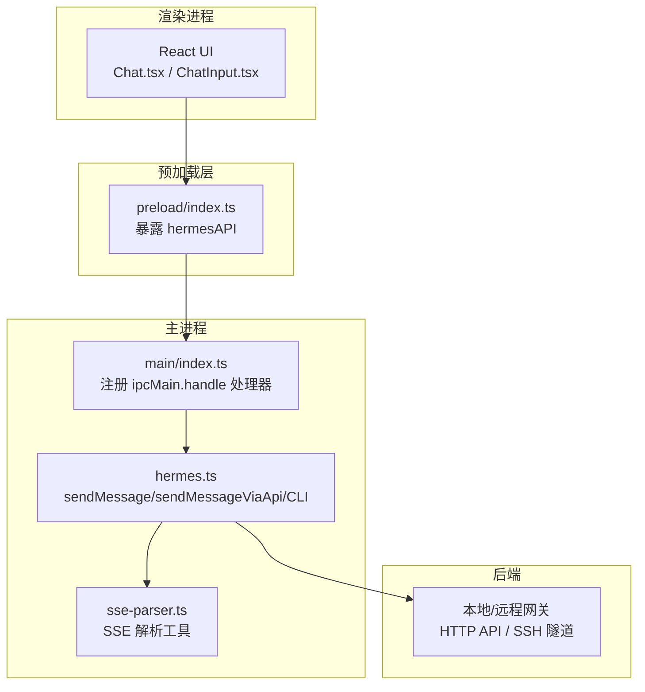
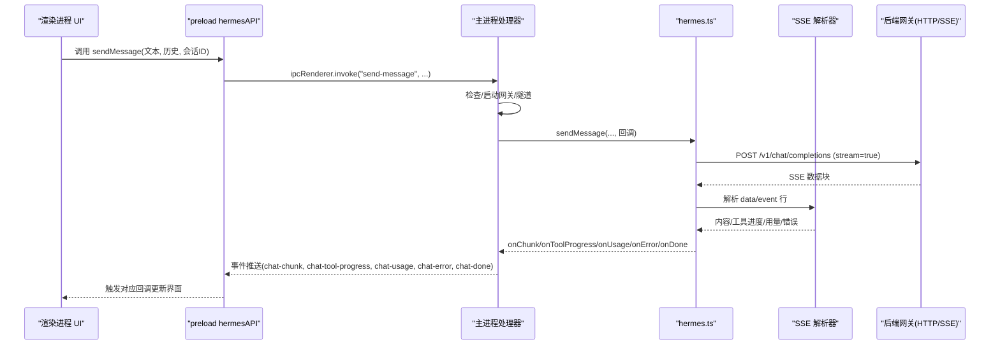
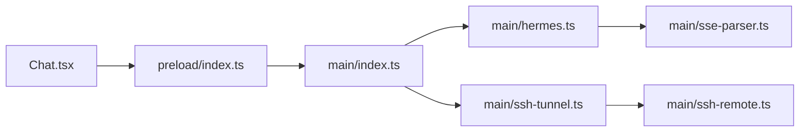

# 消息传递协议

<cite>
**本文引用的文件**
- [src/main/index.ts](file://src/main/index.ts)
- [src/main/hermes.ts](file://src/main/hermes.ts)
- [src/preload/index.ts](file://src/preload/index.ts)
- [src/main/sse-parser.ts](file://src/main/sse-parser.ts)
- [src/renderer/src/screens/Chat/Chat.tsx](file://src/renderer/src/screens/Chat/Chat.tsx)
- [src/renderer/src/screens/Chat/ChatInput.tsx](file://src/renderer/src/screens/Chat/ChatInput.tsx)
- [tests/ipc-handlers.test.ts](file://tests/ipc-handlers.test.ts)
- [tests/sse-parser.test.ts](file://tests/sse-parser.test.ts)
- [src/main/ssh-tunnel.ts](file://src/main/ssh-tunnel.ts)
- [src/main/ssh-remote.ts](file://src/main/ssh-remote.ts)
</cite>

## 目录
1. [简介](#简介)
2. [项目结构](#项目结构)
3. [核心组件](#核心组件)
4. [架构总览](#架构总览)
5. [详细组件分析](#详细组件分析)
6. [依赖关系分析](#依赖关系分析)
7. [性能考量](#性能考量)
8. [故障排查指南](#故障排查指南)
9. [结论](#结论)
10. [附录](#附录)

## 简介
本文件系统性阐述 Hermes Desktop 的消息传递协议与 IPC（进程间通信）实现，重点覆盖以下方面：
- IPC 消息格式规范：通道名、参数结构、回调事件类型
- 数据序列化机制：HTTP SSE 流式传输、JSON 负载、错误透传
- 消息路由规则：渲染进程通过 preload 暴露的 API 调用主进程处理器
- invoke 与 send 两种模式：请求-响应与事件广播的差异与使用场景
- 消息 ID 生成与会话管理：会话标识、历史上下文拼接
- 超时处理、重试策略与错误传播
- 性能优化、内存管理与并发控制
- 具体消息格式示例与调试方法

## 项目结构
Hermes Desktop 的消息传递围绕 Electron 的 ipcRenderer/ipcMain 机制展开，结合 preload 桥接层与后端网关（本地或远程），形成“渲染进程 -> preload -> 主进程 -> 后端”的链路。

图表来源
- [src/renderer/src/screens/Chat/Chat.tsx:360-420](file://src/renderer/src/screens/Chat/Chat.tsx#L360-L420)
- [src/preload/index.ts:15-230](file://src/preload/index.ts#L15-L230)
- [src/main/index.ts:544-640](file://src/main/index.ts#L544-L640)
- [src/main/hermes.ts:168-434](file://src/main/hermes.ts#L168-L434)
- [src/main/sse-parser.ts:1-131](file://src/main/sse-parser.ts#L1-L131)

章节来源
- [src/preload/index.ts:15-230](file://src/preload/index.ts#L15-L230)
- [src/main/index.ts:544-640](file://src/main/index.ts#L544-L640)
- [src/main/hermes.ts:168-434](file://src/main/hermes.ts#L168-L434)
- [src/main/sse-parser.ts:1-131](file://src/main/sse-parser.ts#L1-L131)

## 核心组件
- 渲染进程 UI：负责用户输入与展示，触发消息发送并订阅事件回调
- preload 暴露 API：封装 ipcRenderer.invoke 与 ipcRenderer.on，统一对外接口
- 主进程处理器：注册各通道的处理函数，协调网关与 UI 事件
- hermes.ts：实现消息发送逻辑，支持 HTTP API 流式与 CLI 回退路径
- SSE 解析器：独立可测试的 SSE 块解析与事件分发
- SSH 隧道与远程控制：在 SSH/远程模式下建立安全通道与健康检查

章节来源
- [src/renderer/src/screens/Chat/Chat.tsx:360-420](file://src/renderer/src/screens/Chat/Chat.tsx#L360-L420)
- [src/preload/index.ts:15-230](file://src/preload/index.ts#L15-L230)
- [src/main/index.ts:544-640](file://src/main/index.ts#L544-L640)
- [src/main/hermes.ts:168-434](file://src/main/hermes.ts#L168-L434)
- [src/main/sse-parser.ts:1-131](file://src/main/sse-parser.ts#L1-L131)
- [src/main/ssh-tunnel.ts:59-80](file://src/main/ssh-tunnel.ts#L59-L80)
- [src/main/ssh-remote.ts:64-102](file://src/main/ssh-remote.ts#L64-L102)

## 架构总览
消息从渲染进程发起，经 preload 封装为 invoke 请求，主进程处理器启动网关（如需）、调用 hermes.ts 发送消息，并通过 SSE 推送增量内容到 UI；同时支持 abort 中止当前聊天。

图表来源
- [src/renderer/src/screens/Chat/Chat.tsx:360-420](file://src/renderer/src/screens/Chat/Chat.tsx#L360-L420)
- [src/preload/index.ts:159-230](file://src/preload/index.ts#L159-L230)
- [src/main/index.ts:544-640](file://src/main/index.ts#L544-L640)
- [src/main/hermes.ts:168-434](file://src/main/hermes.ts#L168-L434)
- [src/main/sse-parser.ts:58-130](file://src/main/sse-parser.ts#L58-L130)

## 详细组件分析

### IPC 通道与消息格式规范
- 通道命名与职责
  - "send-message"：请求-响应模式，发送消息并返回最终结果
  - "abort-chat"：中止当前聊天
  - "chat-chunk"/"chat-done"/"chat-error"/"chat-tool-progress"/"chat-usage"：事件广播，用于流式增量更新
  - "start-gateway"/"stop-gateway"/"gateway-status"：网关生命周期管理
  - "get-model-config"/"set-model-config" 等：配置读写
- 参数与返回值
  - sendMessage：文本、可选 profile、可选 resumeSessionId、可选历史数组
  - 历史数组元素包含 role 与 content 字段，遵循标准 OpenAI 风格
  - 返回 Promise<{ response: string; sessionId?: string }>
- 事件回调
  - onChatChunk：增量文本
  - onChatDone：完成，携带 sessionId
  - onChatError：错误信息
  - onChatToolProgress：工具执行进度
  - onChatUsage：token 使用统计（prompt/completion/total 及可选 cost/rate limit）

章节来源
- [src/preload/index.ts:159-230](file://src/preload/index.ts#L159-L230)
- [src/main/index.ts:544-640](file://src/main/index.ts#L544-L640)
- [src/main/hermes.ts:153-166](file://src/main/hermes.ts#L153-L166)
- [tests/ipc-handlers.test.ts:40-117](file://tests/ipc-handlers.test.ts#L40-L117)

### 数据序列化机制与 SSE 流
- HTTP 请求体
  - JSON 序列化，字段包括 model、messages（历史+当前用户消息）、stream=true
  - messages 中 role 统一映射：agent 映射为 assistant
- SSE 数据块
  - 支持 event/data 行组合，自定义事件如 hermes.tool.progress
  - [DONE] 标记结束；usage 在最终块中携带
- 错误透传
  - SSE 中的 error 字段会被捕获并上报
  - 若流为空，自动发起非流式探测请求以揭示真实错误

章节来源
- [src/main/hermes.ts:168-434](file://src/main/hermes.ts#L168-L434)
- [src/main/sse-parser.ts:1-131](file://src/main/sse-parser.ts#L1-L131)
- [tests/sse-parser.test.ts:1-196](file://tests/sse-parser.test.ts#L1-L196)

### 消息路由规则与 invoke vs send
- invoke 模式（请求-响应）
  - 渲染进程通过 preload 的 ipcRenderer.invoke 调用主进程处理器
  - 主进程处理器返回 Promise 结果，适合 sendMessage
- send 模式（事件广播）
  - 主进程通过 event.sender.send 推送增量事件到渲染进程
  - 适合 chat-chunk、chat-done、chat-error、chat-tool-progress、chat-usage 等
- 一致性校验
  - 单元测试确保所有通道在 preload 与主进程两侧均成对存在

章节来源
- [src/preload/index.ts:159-230](file://src/preload/index.ts#L159-L230)
- [src/main/index.ts:544-640](file://src/main/index.ts#L544-L640)
- [tests/ipc-handlers.test.ts:40-117](file://tests/ipc-handlers.test.ts#L40-L117)

### invoke 与 send 的区别与使用场景
- invoke（请求-响应）
  - 场景：一次性查询、配置变更、启动/停止网关等
  - 特点：有明确的请求与响应，便于错误处理与状态管理
- send（事件广播）
  - 场景：流式对话、工具进度、用量统计、错误提示
  - 特点：低延迟增量推送，UI 实时更新

章节来源
- [src/preload/index.ts:159-230](file://src/preload/index.ts#L159-L230)
- [src/main/index.ts:544-640](file://src/main/index.ts#L544-L640)

### 消息 ID 生成与会话管理
- 会话标识
  - 通过 X-Hermes-Session-ID 响应头由后端注入
  - 前端在首次收到该头时记录 sessionId，并在后续调用中作为 resumeSessionId 传回
- 历史上下文
  - 前端将历史消息与当前消息合并，role 统一为 user/assistant
  - 支持从上次会话恢复

章节来源
- [src/main/hermes.ts:168-200](file://src/main/hermes.ts#L168-L200)
- [src/main/hermes.ts:335-347](file://src/main/hermes.ts#L335-L347)
- [src/main/index.ts:544-640](file://src/main/index.ts#L544-L640)

### 超时处理、重试机制与错误传播
- 超时
  - HTTP 请求设置超时时间（例如 120 秒），并在超时后主动销毁连接并上报
- 健康检查与重试
  - 主进程定期探测 API 服务器健康状态，可用后停止轮询
  - SSH 模式下，隧道健康检查失败会抛出异常并要求修复
- 错误传播
  - SSE 中的 error 字段直接透传
  - CLI 回退路径将 stderr 与退出码转化为用户可见错误
  - UI 层收到 chat-error 事件进行展示

章节来源
- [src/main/hermes.ts:102-121](file://src/main/hermes.ts#L102-L121)
- [src/main/hermes.ts:417-424](file://src/main/hermes.ts#L417-L424)
- [src/main/ssh-tunnel.ts:59-80](file://src/main/ssh-tunnel.ts#L59-L80)
- [src/main/ssh-tunnel.ts:145-153](file://src/main/ssh-tunnel.ts#L145-L153)

### 并发控制与中止机制
- 并发
  - 主进程在同一时刻仅维护一个活跃聊天句柄，新消息到来时会中止上一次聊天
- 中止
  - 渲染进程调用 abort-chat 或直接调用返回的 abort 函数
  - HTTP 使用 AbortController；CLI 使用 SIGTERM/SIGKILL

章节来源
- [src/main/index.ts:571-573](file://src/main/index.ts#L571-L573)
- [src/main/index.ts:642-647](file://src/main/index.ts#L642-L647)
- [src/main/hermes.ts:429-446](file://src/main/hermes.ts#L429-L446)

### 远程模式与 SSH 隧道
- 远程模式
  - 通过 SSH 隧道或纯远程 HTTP 访问后端 API
  - 自动注入 Authorization 头（Bearer）
- 隧道健康
  - 启动后等待本地端口就绪与健康检查通过
  - 不健康时抛出错误并清理状态

章节来源
- [src/main/hermes.ts:20-62](file://src/main/hermes.ts#L20-L62)
- [src/main/ssh-tunnel.ts:127-153](file://src/main/ssh-tunnel.ts#L127-L153)
- [src/main/ssh-remote.ts:64-102](file://src/main/ssh-remote.ts#L64-L102)

## 依赖关系分析

图表来源
- [src/renderer/src/screens/Chat/Chat.tsx:360-420](file://src/renderer/src/screens/Chat/Chat.tsx#L360-L420)
- [src/preload/index.ts:15-230](file://src/preload/index.ts#L15-L230)
- [src/main/index.ts:544-640](file://src/main/index.ts#L544-L640)
- [src/main/hermes.ts:168-434](file://src/main/hermes.ts#L168-L434)
- [src/main/sse-parser.ts:1-131](file://src/main/sse-parser.ts#L1-L131)
- [src/main/ssh-tunnel.ts:59-80](file://src/main/ssh-tunnel.ts#L59-L80)
- [src/main/ssh-remote.ts:64-102](file://src/main/ssh-remote.ts#L64-L102)

章节来源
- [src/renderer/src/screens/Chat/Chat.tsx:360-420](file://src/renderer/src/screens/Chat/Chat.tsx#L360-L420)
- [src/preload/index.ts:15-230](file://src/preload/index.ts#L15-L230)
- [src/main/index.ts:544-640](file://src/main/index.ts#L544-L640)
- [src/main/hermes.ts:168-434](file://src/main/hermes.ts#L168-L434)
- [src/main/sse-parser.ts:1-131](file://src/main/sse-parser.ts#L1-L131)
- [src/main/ssh-tunnel.ts:59-80](file://src/main/ssh-tunnel.ts#L59-L80)
- [src/main/ssh-remote.ts:64-102](file://src/main/ssh-remote.ts#L64-L102)

## 性能考量
- 流式优先：HTTP API 使用 SSE 流式传输，避免大响应阻塞
- 增量更新：UI 逐块渲染，降低首帧延迟
- 健康轮询：API 可用性缓存与定时轮询，减少不必要的探测
- CLI 回退：仅在 API 不可用时启用，避免额外进程开销
- SSH 隧道：启动后进行端口与健康检查，失败快速失败并清理
- 内存管理：SSE 解析器独立模块，按块处理，避免大对象驻留

章节来源
- [src/main/hermes.ts:168-434](file://src/main/hermes.ts#L168-L434)
- [src/main/sse-parser.ts:1-131](file://src/main/sse-parser.ts#L1-L131)
- [src/main/ssh-tunnel.ts:59-80](file://src/main/ssh-tunnel.ts#L59-L80)

## 故障排查指南
- 常见问题定位
  - API 不可用：检查本地端口占用与健康检查；查看 onChatError 事件
  - SSH 隧道失败：确认主机密钥、认证与隧道端口可达；查看隧道健康检查日志
  - 流为空：自动探测非流式请求以揭示真实错误
  - CLI 异常：查看 stderr 输出与退出码
- 调试建议
  - 使用 "read-logs" 通道读取应用日志
  - 使用 "run-hermes-dump" 获取运行时快照
  - 在单元测试中验证通道配对与 SSE 解析行为

章节来源
- [src/main/hermes.ts:218-266](file://src/main/hermes.ts#L218-L266)
- [src/main/ssh-tunnel.ts:145-153](file://src/main/ssh-tunnel.ts#L145-L153)
- [src/preload/index.ts:681-685](file://src/preload/index.ts#L681-L685)
- [tests/sse-parser.test.ts:1-196](file://tests/sse-parser.test.ts#L1-L196)

## 结论
Hermes Desktop 的消息传递协议以 Electron IPC 为核心，结合 HTTP SSE 流式传输与 SSH 隧道，实现了高效、可观测且可扩展的跨进程通信。通过 invoke 请求-响应与 send 事件广播的双模式设计，既满足交互式操作的即时反馈，又支持长连接的增量更新。完善的超时、健康检查与错误透传机制保障了稳定性；独立的 SSE 解析器提升了可测试性与可维护性。

## 附录

### 消息格式示例（路径引用）
- 请求体（HTTP API）
  - [请求体构建与发送:190-194](file://src/main/hermes.ts#L190-L194)
  - [SSE 数据块解析:58-110](file://src/main/sse-parser.ts#L58-L110)
- 事件类型
  - [自定义事件处理:29-46](file://src/main/sse-parser.ts#L29-L46)
  - [主进程事件推送:589-630](file://src/main/index.ts#L589-L630)
- 通道清单
  - [通道一致性测试:40-117](file://tests/ipc-handlers.test.ts#L40-L117)