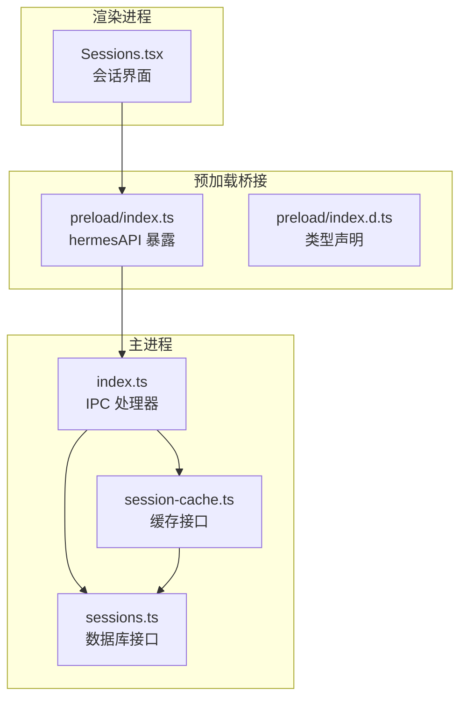
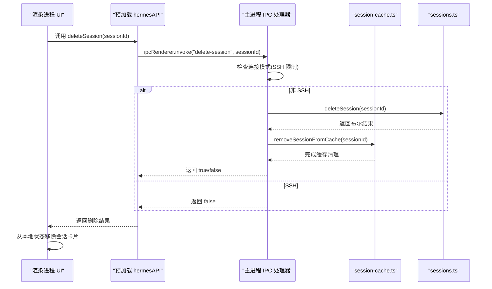
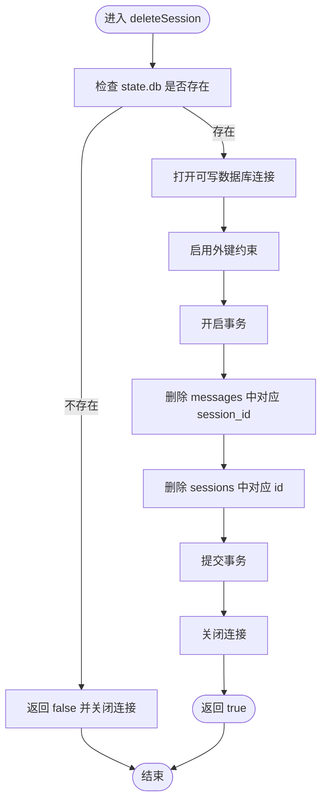
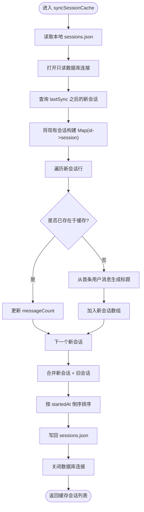
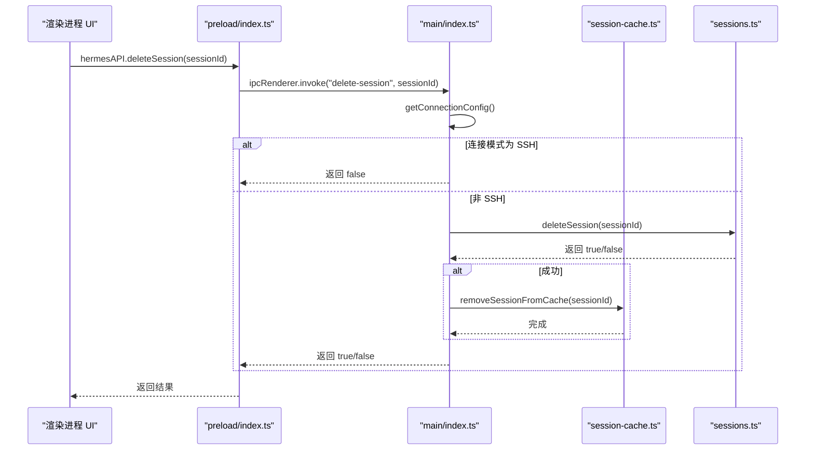
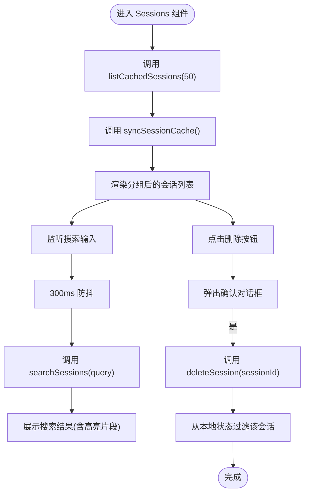
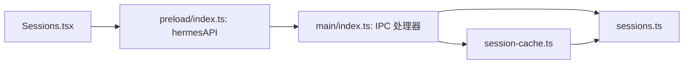
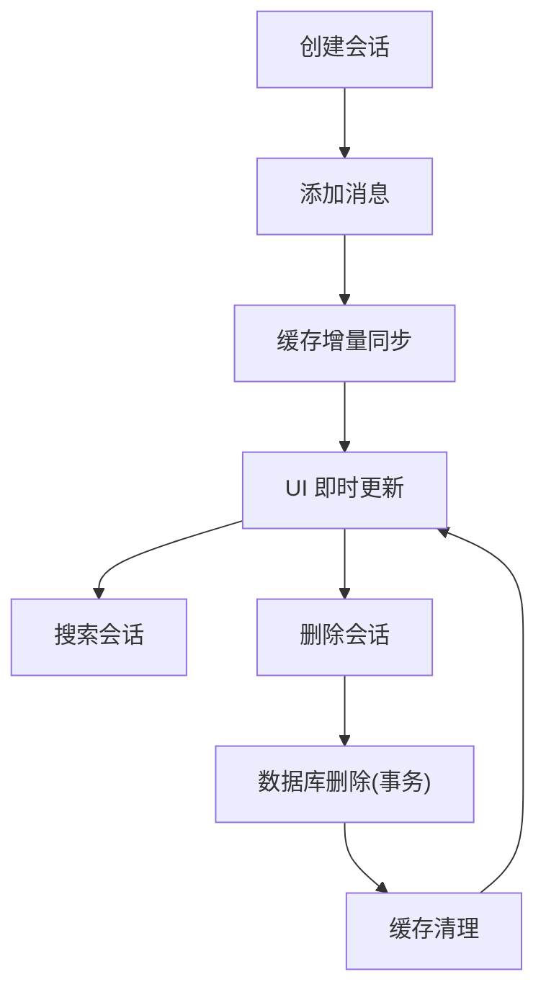

# 会话管理模块

<cite>
**本文档引用的文件**
- [sessions.ts](file://src/main/sessions.ts)
- [session-cache.ts](file://src/main/session-cache.ts)
- [Sessions.tsx](file://src/renderer/src/screens/Sessions/Sessions.tsx)
- [index.ts](file://src/main/index.ts)
- [index.ts](file://src/preload/index.ts)
- [index.d.ts](file://src/preload/index.d.ts)
- [sessions.ts](file://src/shared/i18n/locales/zh-CN/sessions.ts)
- [sessions-delete-feature.md](file://docs/sessions-delete-feature.md)
- [session-cache-sync.test.ts](file://tests/session-cache-sync.test.ts)
</cite>

## 目录
1. [简介](#简介)
2. [项目结构](#项目结构)
3. [核心组件](#核心组件)
4. [架构总览](#架构总览)
5. [详细组件分析](#详细组件分析)
6. [依赖关系分析](#依赖关系分析)
7. [性能考虑](#性能考虑)
8. [故障排除指南](#故障排除指南)
9. [结论](#结论)
10. [附录](#附录)

## 简介
本文件系统性阐述 Hermes Desktop 的会话管理模块，覆盖会话的创建、存储、检索与删除机制；详解会话缓存策略、内存管理与会话搜索功能；并提供会话数据结构、会话历史记录与会话元数据管理说明。文档包含完整的会话操作流程图与数据持久化示例，帮助开发者理解会话系统的完整生命周期，并给出性能优化与大数据量处理策略。

## 项目结构
会话管理涉及三层协作：
- 主进程数据库层：负责 SQLite 存储、全文检索与事务删除
- 主进程缓存层：负责本地 JSON 缓存与标题生成
- 渲染进程 UI 层：负责会话列表展示、搜索与交互

图表来源
- [sessions.ts:1-212](file://src/main/sessions.ts#L1-L212)
- [session-cache.ts:1-252](file://src/main/session-cache.ts#L1-L252)
- [index.ts:834-857](file://src/main/index.ts#L834-L857)
- [index.ts:409-410](file://src/preload/index.ts#L409-L410)
- [index.d.ts:282-282](file://src/preload/index.d.ts#L282-L282)
- [Sessions.tsx:171-383](file://src/renderer/src/screens/Sessions/Sessions.tsx#L171-L383)

章节来源
- [sessions.ts:1-212](file://src/main/sessions.ts#L1-L212)
- [session-cache.ts:1-252](file://src/main/session-cache.ts#L1-L252)
- [index.ts:834-857](file://src/main/index.ts#L834-L857)
- [index.ts:409-410](file://src/preload/index.ts#L409-L410)
- [index.d.ts:282-282](file://src/preload/index.d.ts#L282-L282)
- [Sessions.tsx:171-383](file://src/renderer/src/screens/Sessions/Sessions.tsx#L171-L383)

## 核心组件
- 会话数据库接口：提供会话列表、全文搜索、消息查询与删除能力
- 会话缓存接口：提供快速读取、增量同步、标题生成与删除清理
- IPC 处理器：在主进程中注册会话相关 IPC 处理器，统一处理不同连接模式
- 预加载桥接：向渲染进程暴露 hermesAPI.deleteSession 等方法
- 渲染界面：负责会话列表展示、分组、搜索与删除交互

章节来源
- [sessions.ts:46-211](file://src/main/sessions.ts#L46-L211)
- [session-cache.ts:83-251](file://src/main/session-cache.ts#L83-L251)
- [index.ts:845-857](file://src/main/index.ts#L845-L857)
- [index.ts:409-410](file://src/preload/index.ts#L409-L410)
- [Sessions.tsx:171-383](file://src/renderer/src/screens/Sessions/Sessions.tsx#L171-L383)

## 架构总览
会话管理采用“数据库 + 本地缓存”的双层设计，渲染进程通过 hermesAPI 调用 IPC，主进程根据连接模式选择本地或远程实现，确保在 SSH 模式下的安全限制与一致性。

图表来源
- [index.ts:845-850](file://src/main/index.ts#L845-L850)
- [sessions.ts:188-211](file://src/main/sessions.ts#L188-L211)
- [session-cache.ts:191-198](file://src/main/session-cache.ts#L191-L198)
- [index.ts:409-410](file://src/preload/index.ts#L409-L410)
- [Sessions.tsx:186-197](file://src/renderer/src/screens/Sessions/Sessions.tsx#L186-L197)

## 详细组件分析

### 会话数据库接口（sessions.ts）
- 数据结构
  - 会话摘要：包含 id、source、startedAt、endedAt、messageCount、model、title、preview
  - 会话消息：包含 id、role、content、timestamp
  - 搜索结果：包含 sessionId、title、startedAt、source、messageCount、model、snippet
- 关键能力
  - 列表查询：按时间倒序分页列出会话摘要
  - 全文搜索：基于 FTS5 虚拟表进行全文检索，返回高亮片段
  - 消息查询：按时间与 ID 排序返回用户与助手消息
  - 删除会话：开启外键约束，事务删除 messages 与 sessions
- 性能与健壮性
  - 只读连接用于查询，可写连接用于删除，避免并发冲突
  - 事务保证删除一致性，异常回滚
  - FTS 表存在性检查，防止缺失时直接报错

图表来源
- [sessions.ts:188-211](file://src/main/sessions.ts#L188-L211)

章节来源
- [sessions.ts:8-34](file://src/main/sessions.ts#L8-L34)
- [sessions.ts:46-89](file://src/main/sessions.ts#L46-L89)
- [sessions.ts:91-156](file://src/main/sessions.ts#L91-L156)
- [sessions.ts:158-186](file://src/main/sessions.ts#L158-L186)
- [sessions.ts:188-211](file://src/main/sessions.ts#L188-L211)

### 会话缓存接口（session-cache.ts）
- 数据结构
  - 缓存项：id、title、startedAt、source、messageCount、model
  - 缓存数据：sessions 数组 + lastSync 时间戳
- 关键能力
  - 增量同步：仅拉取 lastSync 之后的新会话，避免全量扫描
  - 标题生成：从首条用户消息提取并清洗，生成可读标题
  - 快速读取：直接从本地 JSON 读取，无需访问数据库
  - 删除清理：从缓存中移除指定会话
- 性能优化
  - 使用 Map 将现有会话按 id 索引，O(1) 查找，避免 O(N²) 合并成本
  - 合并新旧会话后按 startedAt 倒序排序，保持最新在前

图表来源
- [session-cache.ts:83-167](file://src/main/session-cache.ts#L83-L167)

章节来源
- [session-cache.ts:15-27](file://src/main/session-cache.ts#L15-L27)
- [session-cache.ts:83-167](file://src/main/session-cache.ts#L83-L167)
- [session-cache.ts:169-176](file://src/main/session-cache.ts#L169-L176)
- [session-cache.ts:178-189](file://src/main/session-cache.ts#L178-L189)
- [session-cache.ts:191-198](file://src/main/session-cache.ts#L191-L198)
- [session-cache.ts:200-251](file://src/main/session-cache.ts#L200-L251)

### IPC 处理器与预加载桥接
- 主进程处理器
  - delete-session：SSH 模式下返回 false；否则调用 deleteSessionComplete 执行删除与缓存清理
  - search-sessions：SSH 模式下走远程实现；否则调用本地 searchSessions
- 预加载桥接
  - hermesAPI 暴露 deleteSession 方法，渲染进程通过 ipcRenderer.invoke 调用
  - 类型声明明确参数与返回值

图表来源
- [index.ts:845-850](file://src/main/index.ts#L845-L850)
- [index.ts:409-410](file://src/preload/index.ts#L409-L410)
- [session-cache.ts:191-198](file://src/main/session-cache.ts#L191-L198)
- [sessions.ts:188-211](file://src/main/sessions.ts#L188-L211)

章节来源
- [index.ts:845-857](file://src/main/index.ts#L845-L857)
- [index.ts:409-410](file://src/preload/index.ts#L409-L410)
- [index.d.ts:282-282](file://src/preload/index.d.ts#L282-L282)

### 渲染界面（Sessions.tsx）
- 功能特性
  - 加载与刷新：首次加载缓存，随后同步数据库；可见时自动刷新
  - 分组展示：按“今天/昨天/本周/更早”分组，提升可读性
  - 搜索：防抖输入，300ms 后发起搜索请求，支持高亮片段
  - 删除：确认对话框，删除成功后从本地状态移除
- 交互流程
  - 用户点击“新建聊天”触发 onNewChat
  - 点击会话卡片触发 onResumeSession
  - 点击删除按钮触发 handleDelete

图表来源
- [Sessions.tsx:199-220](file://src/renderer/src/screens/Sessions/Sessions.tsx#L199-L220)
- [Sessions.tsx:222-238](file://src/renderer/src/screens/Sessions/Sessions.tsx#L222-L238)
- [Sessions.tsx:186-197](file://src/renderer/src/screens/Sessions/Sessions.tsx#L186-L197)

章节来源
- [Sessions.tsx:171-383](file://src/renderer/src/screens/Sessions/Sessions.tsx#L171-L383)
- [sessions.ts:1-19](file://src/shared/i18n/locales/zh-CN/sessions.ts#L1-L19)

## 依赖关系分析
- 组件耦合
  - Sessions.tsx 依赖 hermesAPI（由 preload 暴露），间接依赖主进程 IPC 处理器
  - 主进程 IPC 处理器同时依赖 sessions.ts 与 session-cache.ts
  - session-cache.ts 依赖 sessions.ts（生成标题时查询首条消息）
- 外部依赖
  - better-sqlite3：SQLite 访问
  - FTS5：全文检索虚拟表
  - 文件系统：本地 sessions.json 缓存与 webui 会话目录

图表来源
- [Sessions.tsx:171-383](file://src/renderer/src/screens/Sessions/Sessions.tsx#L171-L383)
- [index.ts:409-410](file://src/preload/index.ts#L409-L410)
- [index.ts:834-857](file://src/main/index.ts#L834-L857)
- [sessions.ts:1-212](file://src/main/sessions.ts#L1-L212)
- [session-cache.ts:1-252](file://src/main/session-cache.ts#L1-L252)

章节来源
- [index.ts:834-857](file://src/main/index.ts#L834-L857)
- [index.ts:409-410](file://src/preload/index.ts#L409-L410)
- [sessions.ts:1-212](file://src/main/sessions.ts#L1-L212)
- [session-cache.ts:1-252](file://src/main/session-cache.ts#L1-L252)

## 性能考虑
- 查询性能
  - 会话列表使用索引列排序与 LIMIT/OFFSET 分页，避免全表扫描
  - 搜索使用 FTS5 虚拟表与 rank 排序，返回 snippet 高亮片段
- 写入与删除
  - 删除使用事务，先删子表再删父表，保证外键一致性
  - 增量缓存同步使用 Map 索引，避免 O(N²) 合并成本
- 内存管理
  - 渲染进程按需加载（分页/防抖），减少一次性渲染压力
  - 缓存层仅维护最近会话摘要与标题，降低内存占用
- 大数据量策略
  - 增量同步窗口（lastSync - 300 秒）控制每次同步的数据量
  - 列表默认限制数量，配合分页加载
  - 搜索结果限制数量，避免超大结果集

章节来源
- [sessions.ts:46-89](file://src/main/sessions.ts#L46-L89)
- [sessions.ts:91-156](file://src/main/sessions.ts#L91-L156)
- [session-cache.ts:83-167](file://src/main/session-cache.ts#L83-L167)
- [Sessions.tsx:222-238](file://src/renderer/src/screens/Sessions/Sessions.tsx#L222-L238)

## 故障排除指南
- 删除失败
  - 检查 state.db 是否存在与可写
  - 确认连接模式是否为 SSH（SSH 模式下删除被禁用）
  - 查看控制台日志中的错误信息
- 搜索无结果
  - 确认 FTS5 表是否存在（缺失时返回空）
  - 检查查询词是否为空或过短
- 缓存不同步
  - 确认 syncSessionCache 是否被调用
  - 检查 sessions.json 是否被正确写入
  - 验证 lastSync 时间戳逻辑

章节来源
- [sessions.ts:188-211](file://src/main/sessions.ts#L188-L211)
- [sessions.ts:91-103](file://src/main/sessions.ts#L91-L103)
- [session-cache.ts:83-167](file://src/main/session-cache.ts#L83-L167)
- [sessions-delete-feature.md:1-216](file://docs/sessions-delete-feature.md#L1-L216)

## 结论
会话管理模块通过“数据库 + 本地缓存”的双层设计，在保证数据一致性的同时提升了用户体验。渲染进程通过轻量的缓存与防抖搜索实现流畅交互；主进程在 IPC 层面统一处理不同连接模式，确保安全性与一致性。针对大数据量场景，模块采用增量同步、分页与事务删除等策略，具备良好的扩展性与稳定性。

## 附录

### 会话数据结构与字段说明
- 会话摘要（SessionSummary）
  - id：会话唯一标识
  - source：来源（如本地/远程）
  - startedAt：开始时间（秒）
  - endedAt：结束时间（秒，可能为空）
  - messageCount：消息总数
  - model：模型标识
  - title：标题（可能为空）
  - preview：预览文本（当前为空）
- 会话消息（SessionMessage）
  - id：消息自增 ID
  - role：角色（user/assistant/tool）
  - content：内容（可能为空）
  - timestamp：时间戳
- 搜索结果（SearchResult）
  - sessionId：会话 ID
  - title：标题
  - startedAt：开始时间
  - source：来源
  - messageCount：消息数
  - model：模型
  - snippet：高亮片段

章节来源
- [sessions.ts:8-34](file://src/main/sessions.ts#L8-L34)

### 会话生命周期流程图

图表来源
- [sessions.ts:188-211](file://src/main/sessions.ts#L188-L211)
- [session-cache.ts:191-198](file://src/main/session-cache.ts#L191-L198)
- [Sessions.tsx:186-197](file://src/renderer/src/screens/Sessions/Sessions.tsx#L186-L197)

### 数据持久化示例
- 本地缓存文件：桌面缓存目录下的 sessions.json，包含 sessions 数组与 lastSync 时间戳
- 数据库文件：Hermes HOME 目录下的 state.db，包含 sessions 与 messages 表，以及 FTS5 虚拟表

章节来源
- [session-cache.ts:9-13](file://src/main/session-cache.ts#L9-L13)
- [sessions.ts:6-6](file://src/main/sessions.ts#L6-L6)