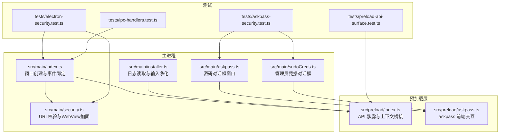
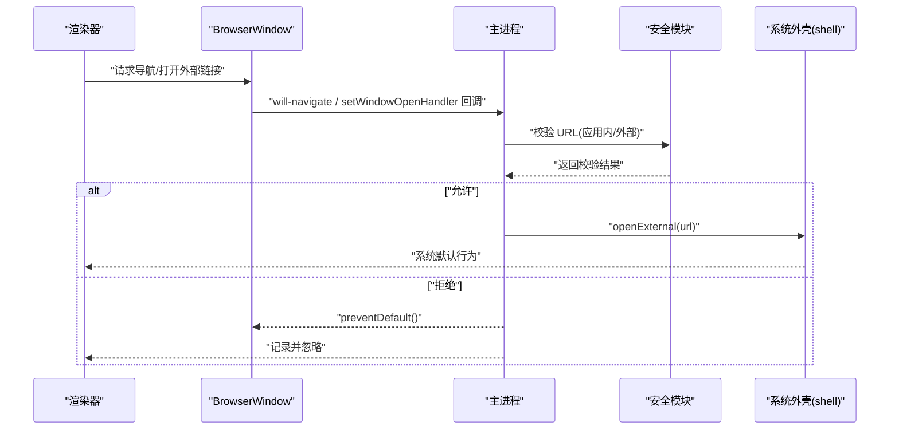
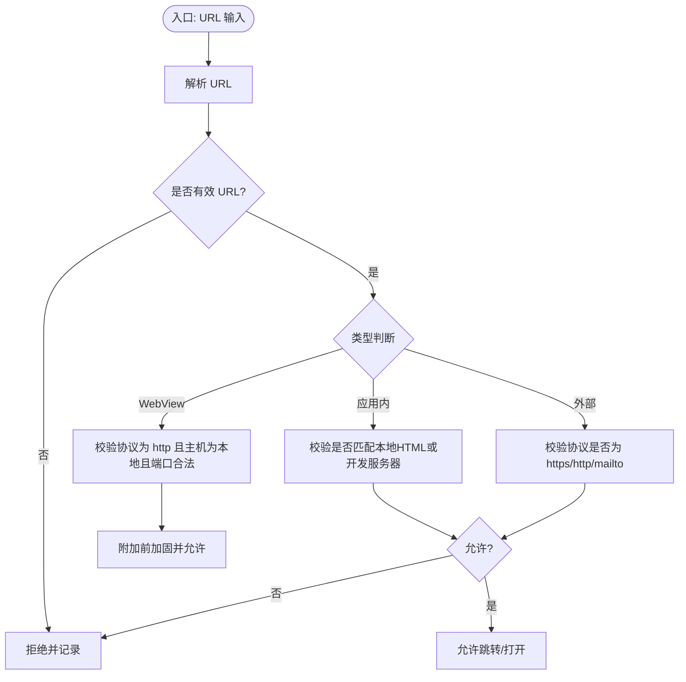
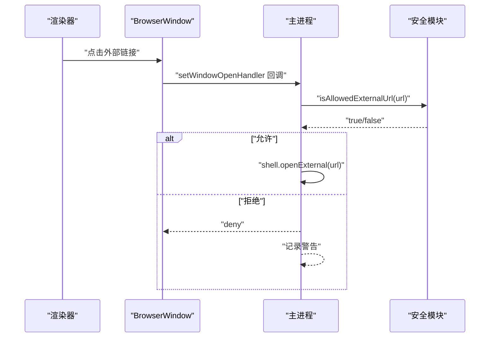
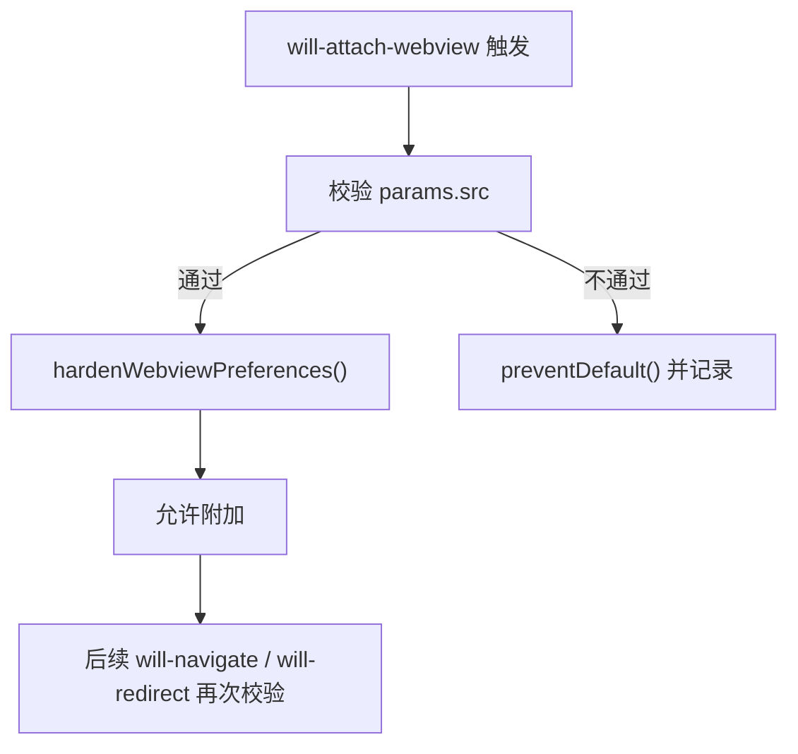
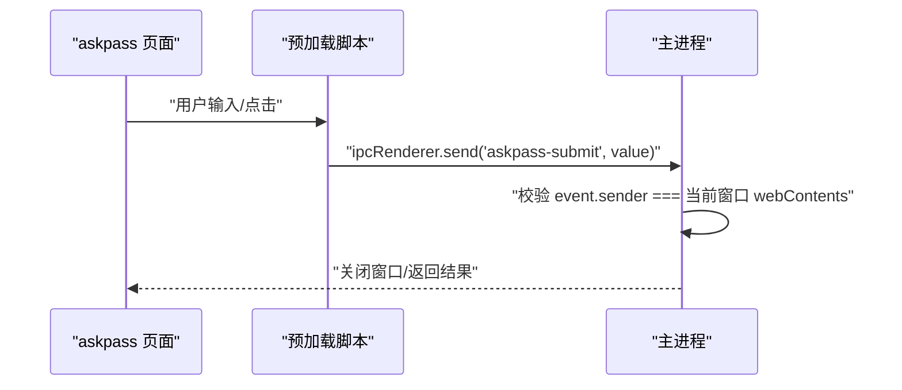
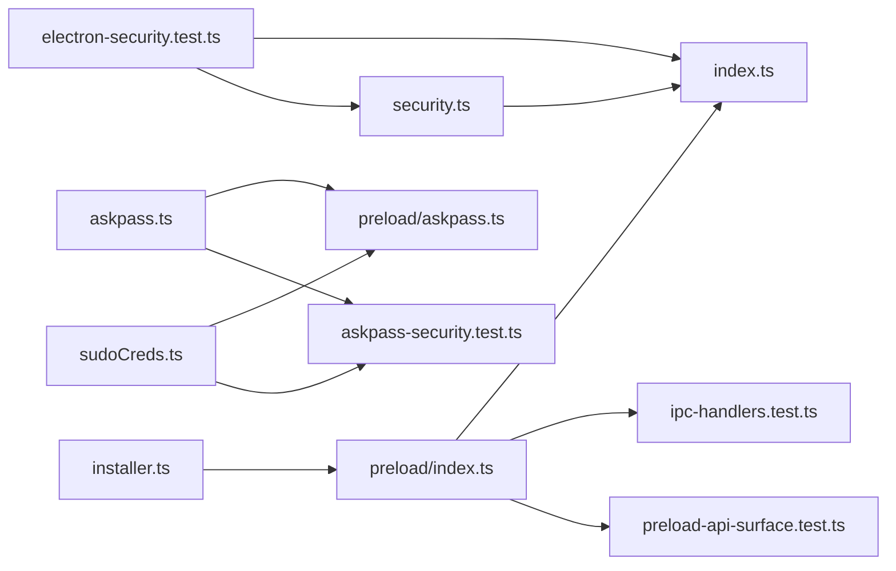

# 安全模块

<cite>
**本文引用的文件**
- [src/main/security.ts](file://src/main/security.ts)
- [src/main/index.ts](file://src/main/index.ts)
- [src/preload/index.ts](file://src/preload/index.ts)
- [src/preload/index.d.ts](file://src/preload/index.d.ts)
- [src/preload/askpass.ts](file://src/preload/askpass.ts)
- [src/main/askpass.ts](file://src/main/askpass.ts)
- [src/main/sudoCreds.ts](file://src/main/sudoCreds.ts)
- [src/main/installer.ts](file://src/main/installer.ts)
- [tests/electron-security.test.ts](file://tests/electron-security.test.ts)
- [tests/ipc-handlers.test.ts](file://tests/ipc-handlers.test.ts)
- [tests/preload-api-surface.test.ts](file://tests/preload-api-surface.test.ts)
- [tests/askpass-security.test.ts](file://tests/askpass-security.test.ts)
</cite>

## 目录
1. [简介](#简介)
2. [项目结构](#项目结构)
3. [核心组件](#核心组件)
4. [架构总览](#架构总览)
5. [详细组件分析](#详细组件分析)
6. [依赖关系分析](#依赖关系分析)
7. [性能考量](#性能考量)
8. [故障排查指南](#故障排查指南)
9. [结论](#结论)
10. [附录：安全配置与最佳实践](#附录安全配置与最佳实践)

## 简介
本文件系统性梳理 Hermes Desktop 的安全模块，重点覆盖以下方面：
- 上下文隔离与渲染器加固：通过严格的 WebPreferences 配置与上下文桥接策略，确保渲染器无法直接访问 Node.js 能力。
- IPC 安全与通道一致性：以测试驱动的方式保证 IPC 通道在主进程与预加载层的一致性与最小化暴露面。
- 外部链接防护：统一的外部链接打开策略与 URL 校验，阻断潜在的恶意导航与协议滥用。
- 预加载脚本的安全 API 暴露：仅暴露受控方法，并通过类型声明与运行时保护双重约束。
- URL 验证与权限控制：对应用内导航、WebView 附加与外部链接进行细粒度校验。
- 安全配置选项、威胁防护与审计能力：结合测试用例与实现细节，给出可操作的安全配置建议与常见问题处理方案。

## 项目结构
安全相关代码主要分布在以下位置：
- 主进程安全策略与窗口事件处理：src/main/index.ts、src/main/security.ts
- 预加载层 API 暴露与类型定义：src/preload/index.ts、src/preload/index.d.ts
- 密码对话框（askpass）的独立窗口与 CSP：src/main/askpass.ts、src/preload/askpass.ts、src/main/sudoCreds.ts
- 日志读取等敏感操作的输入净化：src/main/installer.ts
- 安全与 IPC 一致性测试：tests/electron-security.test.ts、tests/ipc-handlers.test.ts、tests/preload-api-surface.test.ts、tests/askpass-security.test.ts

**图表来源**
- [src/main/index.ts:196-288](file://src/main/index.ts#L196-L288)
- [src/main/security.ts:11-77](file://src/main/security.ts#L11-L77)
- [src/preload/index.ts:688-701](file://src/preload/index.ts#L688-L701)
- [src/main/askpass.ts:130-182](file://src/main/askpass.ts#L130-L182)
- [src/main/sudoCreds.ts:110-165](file://src/main/sudoCreds.ts#L110-L165)
- [src/main/installer.ts:1107-1129](file://src/main/installer.ts#L1107-L1129)

**章节来源**
- [src/main/index.ts:196-288](file://src/main/index.ts#L196-L288)
- [src/main/security.ts:11-77](file://src/main/security.ts#L11-L77)
- [src/preload/index.ts:688-701](file://src/preload/index.ts#L688-L701)

## 核心组件
- URL 校验与导航控制
  - 应用内导航校验：限制仅允许指向本地 HTML 文件或开发服务器地址。
  - 外部链接校验：仅允许 https/http/mailto 协议。
  - WebView URL 校验：仅允许本地 http 地址且端口范围合法。
- WebView 附加前加固
  - 强制移除 preload、禁用 Node 集成、启用沙箱与上下文隔离、启用 webSecurity、禁止不安全内容。
- 渲染器上下文隔离与 API 暴露
  - 仅通过 contextBridge 暴露受控 API，避免全局污染。
- 外部链接打开策略
  - 统一经由主进程校验后交由系统 shell 打开，未通过校验则记录并拒绝。
- 密码对话框安全
  - 独立窗口、严格 CSP、禁用 webview、拦截导航与弹窗、限定 IPC 提交来源。
- 日志读取输入净化
  - 对日志文件名进行白名单校验，防止路径穿越。

**章节来源**
- [src/main/security.ts:20-77](file://src/main/security.ts#L20-L77)
- [src/main/index.ts:185-194](file://src/main/index.ts#L185-L194)
- [src/preload/index.ts:688-701](file://src/preload/index.ts#L688-L701)
- [src/main/askpass.ts:130-182](file://src/main/askpass.ts#L130-L182)
- [src/main/sudoCreds.ts:110-165](file://src/main/sudoCreds.ts#L110-L165)
- [src/main/installer.ts:1107-1129](file://src/main/installer.ts#L1107-L1129)

## 架构总览
下图展示从用户触发到主进程安全策略执行的关键路径，包括应用内导航、外部链接与 WebView 附加三个场景。

**图表来源**
- [src/main/index.ts:250-268](file://src/main/index.ts#L250-L268)
- [src/main/index.ts:185-194](file://src/main/index.ts#L185-L194)
- [src/main/security.ts:25-42](file://src/main/security.ts#L25-L42)

## 详细组件分析

### 组件A：URL 校验与导航控制
- 应用内导航校验
  - 通过将传入 URL 与本地 HTML 文件 URL 或开发服务器 URL 进行 origin 对比，确保仅允许合法跳转。
- 外部链接校验
  - 仅允许 https/http/mailto 协议，拒绝 file/ftp/javascript 等高风险协议。
- WebView URL 校验
  - 仅允许 http 协议，主机名限定为 localhost/127.0.0.1/[::1]/::1，端口必须在 1024-65535 范围内。
- WebView 附加前加固
  - 在 will-attach-webview 中移除 preload/preloadURL，关闭 Node 集成，开启沙箱与上下文隔离，启用 webSecurity，禁止不安全内容。

**图表来源**
- [src/main/security.ts:11-77](file://src/main/security.ts#L11-L77)

**章节来源**
- [src/main/security.ts:20-77](file://src/main/security.ts#L20-L77)
- [src/main/index.ts:250-281](file://src/main/index.ts#L250-L281)

### 组件B：预加载脚本的安全 API 暴露
- 仅暴露受控方法
  - 通过 contextBridge.exposeInMainWorld 暴露有限的 hermesAPI 与 electronAPI，避免全局污染。
- 类型声明与实现一致性
  - TypeScript 接口与实现一一对应，测试确保两者一致，避免类型与实现脱节。
- IPC 通道一致性
  - 测试验证主进程 ipcMain.handle 与预加载 ipcRenderer.invoke 的通道名称一致，且均为短横线命名风格，降低注入风险。

```mermaid
classDiagram
class PreloadAPI {
+checkInstall()
+verifyInstall()
+startInstall()
+getHermesVersion()
+refreshHermesVersion()
+runHermesDoctor()
+runHermesUpdate()
+getLocale()
+setLocale()
+getEnv()
+setEnv()
+getConfig()
+setConfig()
+getHermesHome()
+getModelConfig()
+setModelConfig()
+isRemoteMode()
+isRemoteOnlyMode()
+getConnectionConfig()
+setConnectionConfig()
+setSshConfig()
+testRemoteConnection()
+testSshConnection()
+isSshTunnelActive()
+startSshTunnel()
+stopSshTunnel()
+sendMessage()
+abortChat()
+onChatChunk()
+onChatDone()
+onChatToolProgress()
+onChatUsage()
+onChatError()
+startGateway()
+stopGateway()
+gatewayStatus()
+getPlatformEnabled()
+setPlatformEnabled()
+listSessions()
+getSessionMessages()
+listProfiles()
+createProfile()
+deleteProfile()
+setActiveProfile()
+readMemory()
+addMemoryEntry()
+updateMemoryEntry()
+removeMemoryEntry()
+writeUserProfile()
+readSoul()
+writeSoul()
+resetSoul()
+getToolsets()
+setToolsetEnabled()
+listInstalledSkills()
+listBundledSkills()
+getSkillContent()
+installSkill()
+uninstallSkill()
+listModels()
+addModel()
+removeModel()
+updateModel()
+claw3dStatus()
+claw3dSetup()
+onClaw3dSetupProgress()
+claw3dGetPort()
+claw3dSetPort()
+claw3dGetWsUrl()
+claw3dSetWsUrl()
+claw3dStartAll()
+claw3dStopAll()
+claw3dGetLogs()
+claw3dStartDev()
+claw3dStopDev()
+claw3dStartAdapter()
+claw3dStopAdapter()
+checkForUpdates()
+downloadUpdate()
+installUpdate()
+getAppVersion()
+onUpdateAvailable()
+onUpdateDownloadProgress()
+onUpdateDownloaded()
+onMenuNewChat()
+onMenuSearchSessions()
+listCronJobs()
+createCronJob()
+removeCronJob()
+pauseCronJob()
+resumeCronJob()
+triggerCronJob()
+openExternal()
+runHermesBackup()
+runHermesImport()
+runHermesDump()
+discoverMemoryProviders()
+listMcpServers()
+readLogs()
}
class Types {
<<interface>>
}
PreloadAPI <.. Types : "类型声明约束"
```

**图表来源**
- [src/preload/index.ts:4-686](file://src/preload/index.ts#L4-L686)
- [src/preload/index.d.ts:29-471](file://src/preload/index.d.ts#L29-L471)

**章节来源**
- [src/preload/index.ts:688-701](file://src/preload/index.ts#L688-L701)
- [src/preload/index.d.ts:29-471](file://src/preload/index.d.ts#L29-L471)
- [tests/preload-api-surface.test.ts:45-63](file://tests/preload-api-surface.test.ts#L45-L63)
- [tests/ipc-handlers.test.ts:38-56](file://tests/ipc-handlers.test.ts#L38-L56)

### 组件C：外部链接打开与 URL 验证
- 统一入口
  - setWindowOpenHandler 与 will-navigate 事件中调用 isAllowedExternalUrl 与 isAllowedAppNavigationUrl。
- 行为策略
  - 通过 isAllowedExternalUrl 校验后，交由 shell.openExternal；否则记录警告并忽略。
- 开发模式支持
  - 开发服务器 URL 可通过环境变量注入，校验时按 origin 对比，避免误杀。

**图表来源**
- [src/main/index.ts:250-268](file://src/main/index.ts#L250-L268)
- [src/main/index.ts:185-194](file://src/main/index.ts#L185-L194)
- [src/main/security.ts:20-42](file://src/main/security.ts#L20-L42)

**章节来源**
- [src/main/index.ts:185-194](file://src/main/index.ts#L185-L194)
- [src/main/security.ts:20-42](file://src/main/security.ts#L20-L42)

### 组件D：WebView 安全与附加控制
- will-attach-webview 阶段
  - 使用 isAllowedWebviewUrl 校验 src，不通过则阻止附加。
  - 调用 hardenWebviewPreferences 移除 preload/preloadURL，关闭 Node 集成，开启沙箱与上下文隔离，启用 webSecurity，禁止不安全内容。
- will-navigate / will-redirect
  - 对导航与重定向进行二次校验，确保仅允许本地 http URL。

**图表来源**
- [src/main/index.ts:270-281](file://src/main/index.ts#L270-L281)
- [src/main/security.ts:44-77](file://src/main/security.ts#L44-L77)

**章节来源**
- [src/main/index.ts:270-281](file://src/main/index.ts#L270-L281)
- [src/main/security.ts:44-77](file://src/main/security.ts#L44-L77)

### 组件E：密码对话框（askpass）安全
- 窗口配置
  - 独立窗口、禁用 webview、严格 CSP、禁用 Node 集成、启用沙箱与上下文隔离。
- 交互流程
  - 预加载脚本监听按钮与键盘事件，通过 ipcRenderer 发送提交值。
  - 主进程仅接受来自当前窗口 webContents 的提交，防止跨窗口伪造。
- 导航与弹窗拦截
  - setWindowOpenHandler、will-navigate、will-attach-webview 全部拦截，杜绝逃逸。

**图表来源**
- [src/main/askpass.ts:130-182](file://src/main/askpass.ts#L130-L182)
- [src/preload/askpass.ts:4-27](file://src/preload/askpass.ts#L4-L27)
- [src/main/sudoCreds.ts:110-165](file://src/main/sudoCreds.ts#L110-L165)

**章节来源**
- [src/main/askpass.ts:130-182](file://src/main/askpass.ts#L130-L182)
- [src/preload/askpass.ts:4-27](file://src/preload/askpass.ts#L4-L27)
- [src/main/sudoCreds.ts:110-165](file://src/main/sudoCreds.ts#L110-L165)
- [tests/askpass-security.test.ts:18-94](file://tests/askpass-security.test.ts#L18-L94)

### 组件F：日志读取与输入净化
- 白名单策略
  - 仅允许读取 agent.log、errors.log、gateway.log，其他文件名一律回退到默认文件。
- 安全读取
  - 读取失败或不存在时返回空内容，避免泄露系统信息。
- 性能与审计
  - 仅返回最后 N 行，便于快速定位问题。

**章节来源**
- [src/main/installer.ts:1107-1129](file://src/main/installer.ts#L1107-L1129)
- [tests/installer-utils.test.ts:37-48](file://tests/installer-utils.test.ts#L37-L48)

## 依赖关系分析
- 主进程窗口创建依赖安全模块提供的 URL 校验与 WebView 加固函数。
- 预加载层 API 暴露依赖类型声明与测试保障，确保通道一致性。
- askpass 窗口作为独立安全边界，依赖预加载脚本与主进程 IPC。
- 日志读取属于敏感操作，依赖白名单策略与最小暴露原则。

**图表来源**
- [src/main/index.ts:122-127](file://src/main/index.ts#L122-L127)
- [src/main/security.ts:11-77](file://src/main/security.ts#L11-L77)
- [src/preload/index.ts:4-686](file://src/preload/index.ts#L4-L686)
- [src/main/askpass.ts:130-182](file://src/main/askpass.ts#L130-L182)
- [src/main/sudoCreds.ts:110-165](file://src/main/sudoCreds.ts#L110-L165)
- [src/main/installer.ts:1107-1129](file://src/main/installer.ts#L1107-L1129)

**章节来源**
- [src/main/index.ts:122-127](file://src/main/index.ts#L122-L127)
- [tests/electron-security.test.ts:18-32](file://tests/electron-security.test.ts#L18-L32)
- [tests/ipc-handlers.test.ts:38-56](file://tests/ipc-handlers.test.ts#L38-L56)
- [tests/preload-api-surface.test.ts:45-63](file://tests/preload-api-surface.test.ts#L45-L63)
- [tests/askpass-security.test.ts:18-94](file://tests/askpass-security.test.ts#L18-L94)

## 性能考量
- URL 解析与校验为常量时间操作，开销极低。
- WebView 加固在 will-attach-webview 阶段一次性完成，避免重复计算。
- 预加载 API 方法数量较多但均为轻量 IPC 调用，性能瓶颈不在安全模块本身。
- 日志读取仅返回尾部 N 行，避免大文件扫描带来的 IO 压力。

## 故障排查指南
- 外部链接无法打开
  - 检查 URL 是否为 https/http/mailto 协议；确认主进程 openExternal 调用链路未被拦截。
  - 参考：[src/main/index.ts:185-194](file://src/main/index.ts#L185-L194)、[src/main/security.ts:20-23](file://src/main/security.ts#L20-L23)
- 应用内导航被拒绝
  - 确认目标 URL 与本地 HTML 文件或开发服务器 origin 匹配；开发模式需正确设置环境变量。
  - 参考：[src/main/index.ts:255-268](file://src/main/index.ts#L255-L268)、[src/main/security.ts:25-42](file://src/main/security.ts#L25-L42)
- WebView 无法加载
  - 确认 src 为 http 协议且主机为本地地址，端口在 1024-65535 范围内；检查是否被 will-attach-webview 阶段拦截。
  - 参考：[src/main/index.ts:270-281](file://src/main/index.ts#L270-L281)、[src/main/security.ts:44-51](file://src/main/security.ts#L44-L51)
- askpass 对话框无响应
  - 检查 CSP 是否禁用了脚本；确认 IPC 提交通道名称一致且仅来自当前窗口 webContents。
  - 参考：[src/main/askpass.ts:130-182](file://src/main/askpass.ts#L130-L182)、[tests/askpass-security.test.ts:47-69](file://tests/askpass-security.test.ts#L47-L69)
- 日志读取为空
  - 确认文件名在白名单内；检查文件是否存在且可读。
  - 参考：[src/main/installer.ts:1107-1129](file://src/main/installer.ts#L1107-L1129)

**章节来源**
- [src/main/index.ts:185-194](file://src/main/index.ts#L185-L194)
- [src/main/index.ts:255-268](file://src/main/index.ts#L255-L268)
- [src/main/index.ts:270-281](file://src/main/index.ts#L270-L281)
- [src/main/askpass.ts:130-182](file://src/main/askpass.ts#L130-L182)
- [src/main/installer.ts:1107-1129](file://src/main/installer.ts#L1107-L1129)
- [tests/askpass-security.test.ts:47-69](file://tests/askpass-security.test.ts#L47-L69)

## 结论
Hermes Desktop 的安全模块通过“最小暴露面 + 最强隔离”的设计，实现了：
- 渲染器与 Node.js 的彻底隔离；
- 外部链接与应用内导航的细粒度控制；
- WebView 附加前的强制加固；
- 预加载层 API 的类型与实现一致性保障；
- 密码对话框的独立安全边界与 CSP；
- 日志读取的输入净化与白名单策略。

这些措施共同构建了桌面应用的安全基线，建议在后续版本中持续完善 CSP、引入更严格的 CSP 策略与审计日志。

## 附录：安全配置与最佳实践
- WebPreferences 最小化
  - 禁用 nodeIntegration、启用 contextIsolation、启用 sandbox、启用 webSecurity、禁止 allowRunningInsecureContent。
  - 参考：[src/main/index.ts:211-219](file://src/main/index.ts#L211-L219)、[src/main/security.ts:53-63](file://src/main/security.ts#L53-L63)
- WebView 安全加固
  - 在 will-attach-webview 中调用 hardenWebviewPreferences，移除 preload/preloadURL，关闭 Node 集成，开启沙箱与上下文隔离。
  - 参考：[src/main/index.ts:279-280](file://src/main/index.ts#L279-L280)、[src/main/security.ts:53-63](file://src/main/security.ts#L53-L63)
- URL 校验策略
  - 外部链接仅允许 https/http/mailto；应用内导航仅允许本地 HTML 或开发服务器 origin；WebView 仅允许本地 http 且端口合法。
  - 参考：[src/main/security.ts:20-51](file://src/main/security.ts#L20-L51)
- 外部链接打开
  - 统一经由 openExternal 打开，未通过校验则记录并拒绝。
  - 参考：[src/main/index.ts:185-194](file://src/main/index.ts#L185-L194)
- 预加载 API 暴露
  - 仅暴露必要方法，保持接口与类型声明一致，定期运行 IPC 一致性测试。
  - 参考：[src/preload/index.ts:688-701](file://src/preload/index.ts#L688-L701)、[tests/ipc-handlers.test.ts:38-56](file://tests/ipc-handlers.test.ts#L38-L56)
- askpass 安全边界
  - 独立窗口、严格 CSP、禁用 webview、拦截导航与弹窗、限定 IPC 来源。
  - 参考：[src/main/askpass.ts:130-182](file://src/main/askpass.ts#L130-L182)、[tests/askpass-security.test.ts:61-69](file://tests/askpass-security.test.ts#L61-L69)
- 日志读取输入净化
  - 仅允许白名单文件名，读取失败返回空内容。
  - 参考：[src/main/installer.ts:1107-1129](file://src/main/installer.ts#L1107-L1129)