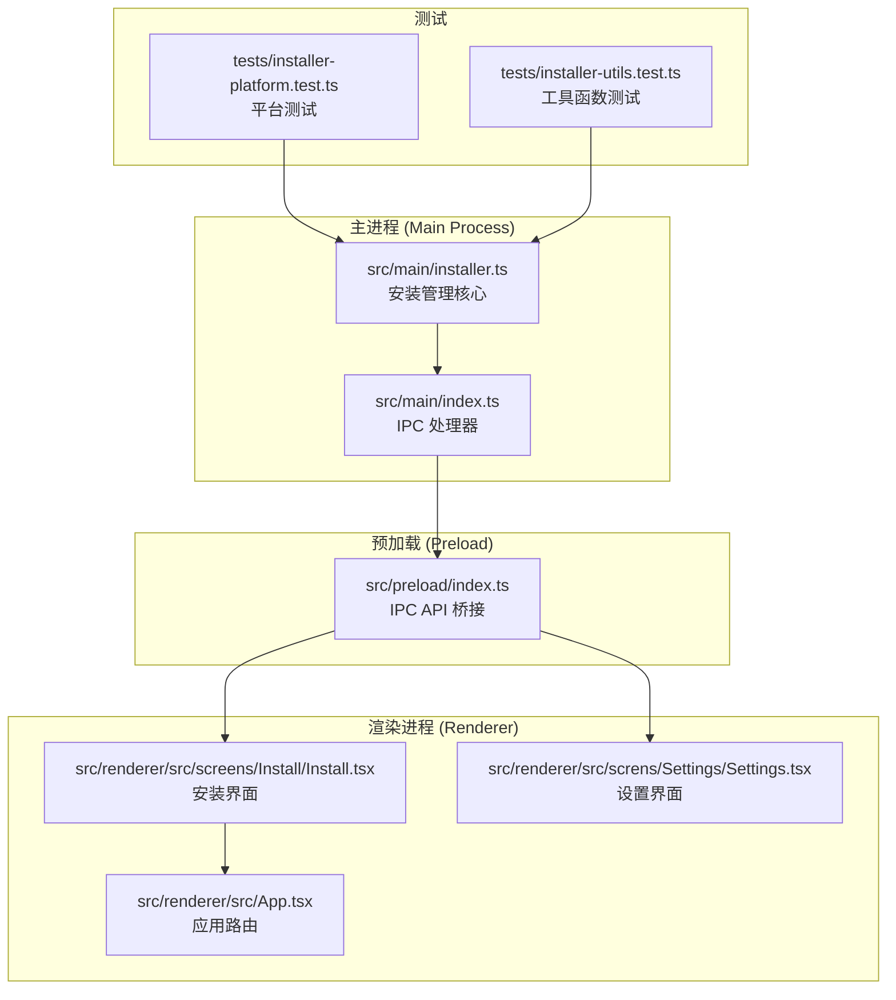
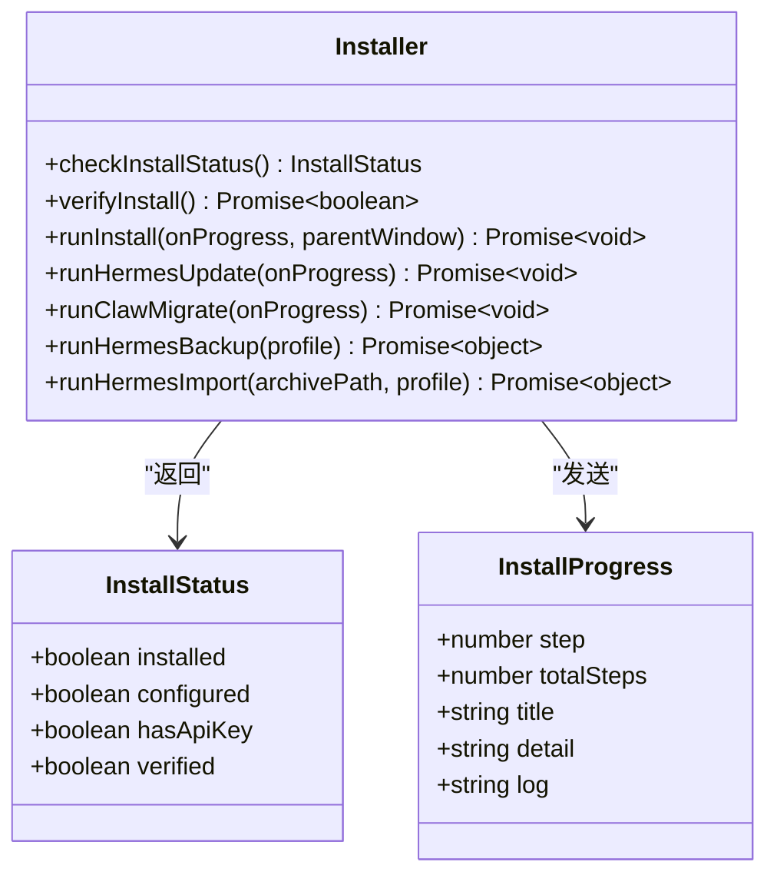
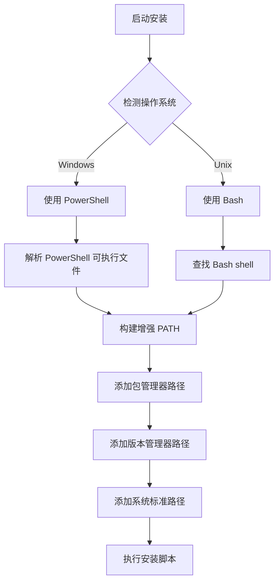
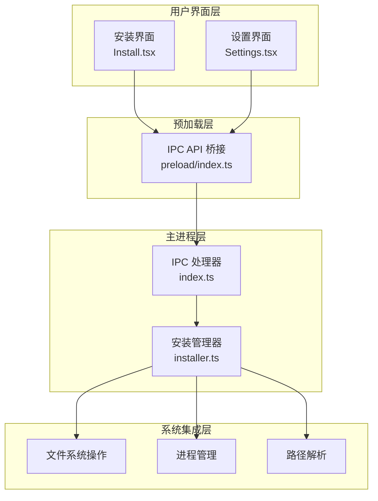
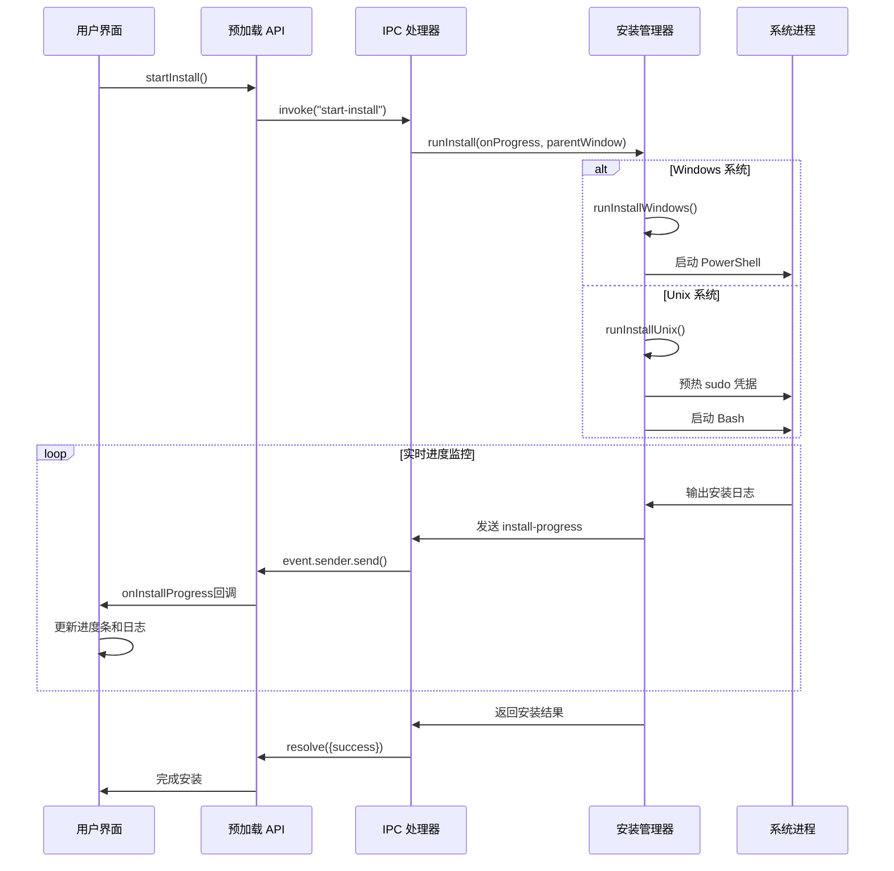
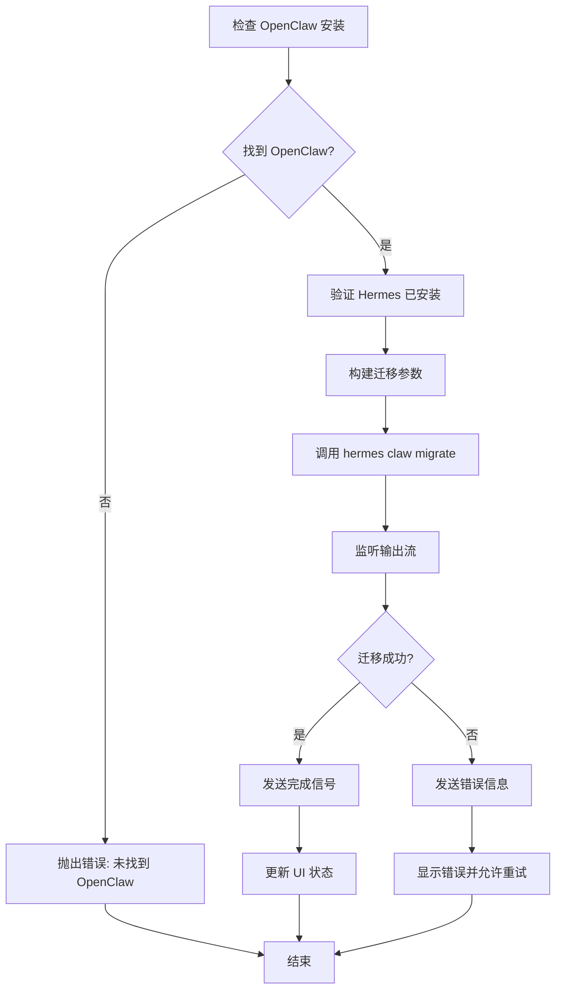
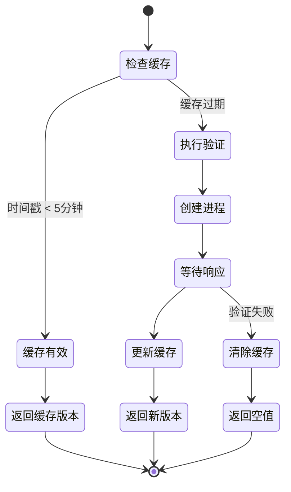
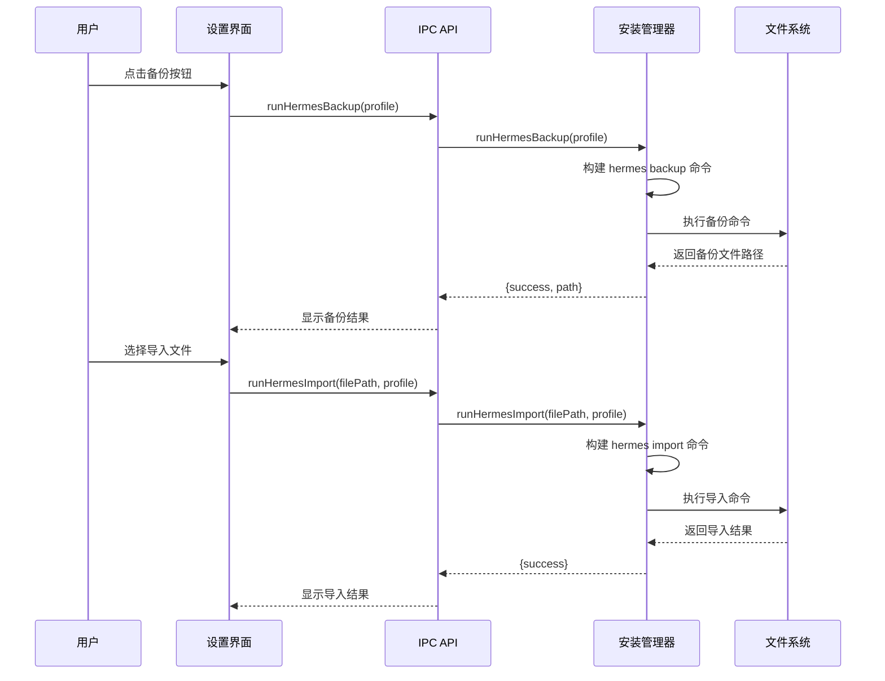
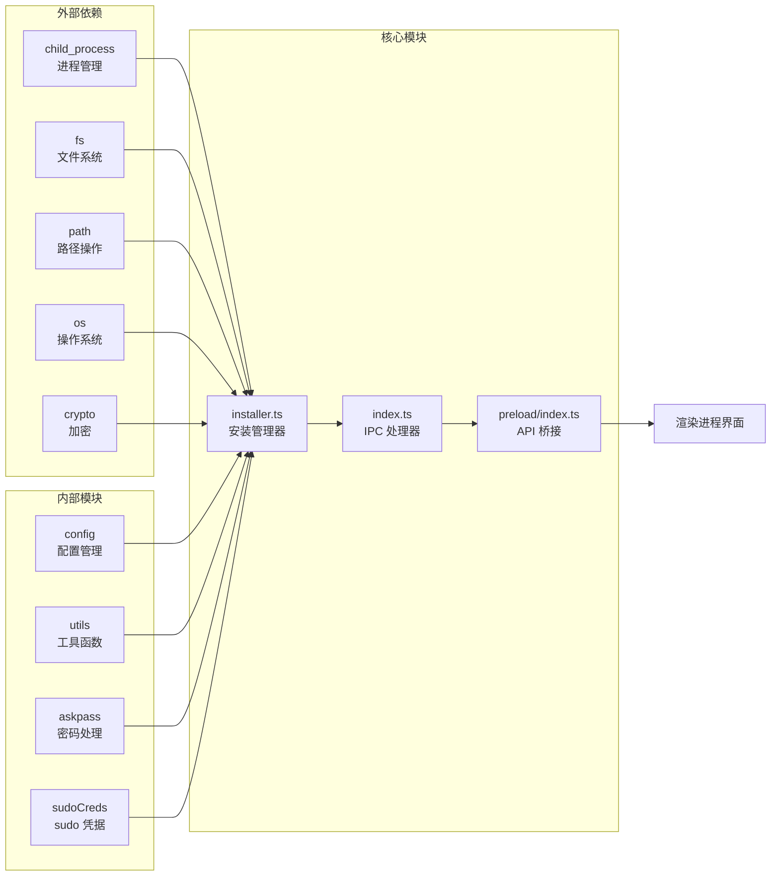
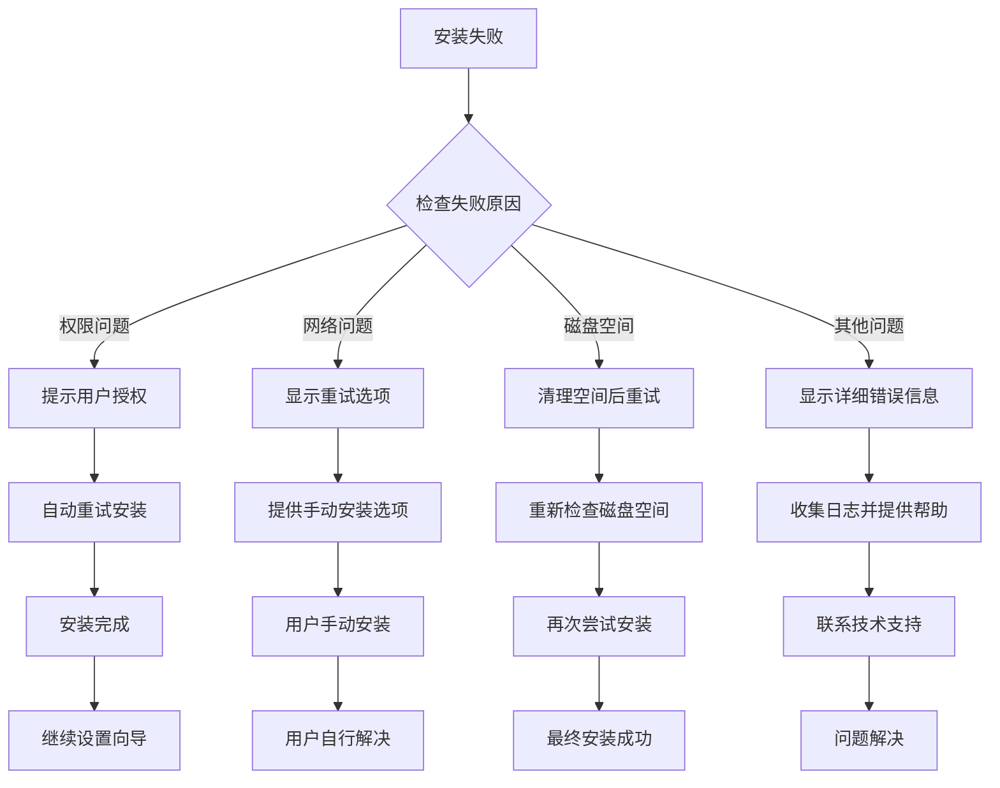

# 安装管理模块

<cite>
**本文档引用的文件**
- [src/main/installer.ts](file://src/main/installer.ts)
- [src/main/index.ts](file://src/main/index.ts)
- [src/preload/index.ts](file://src/preload/index.ts)
- [src/renderer/src/screens/Install/Install.tsx](file://src/renderer/src/screens/Install/Install.tsx)
- [src/renderer/src/App.tsx](file://src/renderer/src/App.tsx)
- [src/renderer/src/screns/Settings/Settings.tsx](file://src/renderer/src/screns/Settings/Settings.tsx)
- [tests/installer-platform.test.ts](file://tests/installer-platform.test.ts)
- [tests/installer-utils.test.ts](file://tests/installer-utils.test.ts)
- [src/shared/i18n/locales/zh-CN/install.ts](file://src/shared/i18n/locales/zh-CN/install.ts)
- [src/shared/i18n/locales/en/install.ts](file://src/shared/i18n/locales/en/install.ts)
</cite>

## 目录
1. [简介](#简介)
2. [项目结构](#项目结构)
3. [核心组件](#核心组件)
4. [架构概览](#架构概览)
5. [详细组件分析](#详细组件分析)
6. [依赖关系分析](#依赖关系分析)
7. [性能考虑](#性能考虑)
8. [故障排除指南](#故障排除指南)
9. [结论](#结论)

## 简介

Hermes Desktop 的安装管理模块是一个完整的系统，负责管理 Hermes Agent 的安装、更新、迁移和备份机制。该模块提供了跨平台的安装支持，包括 Windows PowerShell 和 Unix bash 环境，并实现了智能的状态检查、依赖验证和错误恢复策略。

该模块的核心功能包括：
- 自动化安装流程，支持 Windows 和 Unix 系统
- 智能状态检查和验证机制
- OpenClaw 迁移支持
- 备份和导入功能
- 实时进度跟踪和日志记录
- 错误处理和恢复策略

## 项目结构

安装管理模块主要分布在以下文件中：

**图表来源**
- [src/main/installer.ts:1-1130](file://src/main/installer.ts#L1-L1130)
- [src/main/index.ts:290-381](file://src/main/index.ts#L290-L381)
- [src/preload/index.ts:15-72](file://src/preload/index.ts#L15-L72)

**章节来源**
- [src/main/installer.ts:1-1130](file://src/main/installer.ts#L1-L1130)
- [src/main/index.ts:1-800](file://src/main/index.ts#L1-L800)

## 核心组件

### 安装状态管理

安装状态通过 `InstallStatus` 接口进行管理，包含以下关键属性：

**图表来源**
- [src/main/installer.ts:41-54](file://src/main/installer.ts#L41-L54)
- [src/main/installer.ts:153-213](file://src/main/installer.ts#L153-L213)

### 跨平台路径管理

系统实现了智能的路径解析机制，支持多种包管理器和版本管理器：

**图表来源**
- [src/main/installer.ts:56-104](file://src/main/installer.ts#L56-L104)
- [src/main/installer.ts:657-674](file://src/main/installer.ts#L657-L674)

**章节来源**
- [src/main/installer.ts:41-296](file://src/main/installer.ts#L41-L296)

## 架构概览

安装管理模块采用分层架构设计，确保了良好的可维护性和扩展性：

**图表来源**
- [src/renderer/src/screens/Install/Install.tsx:20-59](file://src/renderer/src/screens/Install/Install.tsx#L20-L59)
- [src/preload/index.ts:15-72](file://src/preload/index.ts#L15-L72)
- [src/main/index.ts:290-381](file://src/main/index.ts#L290-L381)

## 详细组件分析

### 安装流程管理

安装流程通过 `runInstall` 函数统一管理，支持 7 个阶段的详细进度跟踪：

**图表来源**
- [src/main/installer.ts:517-650](file://src/main/installer.ts#L517-L650)
- [src/main/index.ts:298-307](file://src/main/index.ts#L298-L307)
- [src/preload/index.ts:25-52](file://src/preload/index.ts#L25-L52)

### OpenClaw 迁移机制

系统提供了完整的 OpenClaw 到 Hermes 的迁移支持：

**图表来源**
- [src/main/installer.ts:323-396](file://src/main/installer.ts#L323-L396)
- [src/main/installer.ts:333-396](file://src/main/installer.ts#L333-L396)

**章节来源**
- [src/main/installer.ts:321-396](file://src/main/installer.ts#L321-L396)

### 版本管理和更新机制

版本管理通过智能缓存和延迟验证实现高效性能：

**图表来源**
- [src/main/installer.ts:248-296](file://src/main/installer.ts#L248-L296)

**章节来源**
- [src/main/installer.ts:248-296](file://src/main/installer.ts#L248-L296)

### 备份和导入系统

备份和导入功能提供了数据持久化的完整解决方案：

**图表来源**
- [src/main/installer.ts:805-890](file://src/main/installer.ts#L805-L890)
- [src/renderer/src/screns/Settings/Settings.tsx:254-285](file://src/renderer/src/screns/Settings/Settings.tsx#L254-L285)

**章节来源**
- [src/main/installer.ts:805-890](file://src/main/installer.ts#L805-L890)

## 依赖关系分析

安装管理模块的依赖关系清晰明确，遵循单一职责原则：

**图表来源**
- [src/main/installer.ts:1-16](file://src/main/installer.ts#L1-L16)
- [src/main/index.ts:13-30](file://src/main/index.ts#L13-L30)
- [src/preload/index.ts:1-13](file://src/preload/index.ts#L1-L13)

**章节来源**
- [src/main/installer.ts:1-16](file://src/main/installer.ts#L1-L16)
- [src/main/index.ts:13-30](file://src/main/index.ts#L13-L30)

## 性能考虑

安装管理模块在性能方面采用了多项优化策略：

### 缓存机制
- **版本缓存**: 5分钟内重复查询直接返回缓存结果
- **验证缓存**: 避免重复的 Python 版本检查
- **PATH 缓存**: 预计算增强的 PATH 环境变量

### 异步处理
- **非阻塞安装**: 使用异步进程管理，避免界面冻结
- **流式日志**: 实时输出安装进度，提升用户体验
- **并发控制**: 防止重复的版本查询请求

### 内存优化
- **渐进式文件读取**: 日志文件只读取最后 N 行
- **资源清理**: 及时清理临时文件和进程句柄
- **错误隔离**: 单个操作失败不影响整体系统稳定性

## 故障排除指南

### 常见安装问题

| 问题类型 | 症状 | 解决方案 |
|---------|------|----------|
| 权限不足 | 安装过程中提示权限错误 | 使用 sudo 或管理员权限运行 |
| 网络连接 | 下载依赖时超时 | 检查网络连接，使用代理设置 |
| 磁盘空间 | 空间不足导致安装失败 | 清理磁盘空间或调整安装位置 |
| 端口冲突 | 端口被占用 | 修改端口配置或关闭占用程序 |

### 错误恢复策略

### 调试和诊断

系统提供了多种调试工具：

1. **医生检查**: `runHermesDoctor()` 提供详细的系统诊断
2. **日志查看**: 支持查看 agent.log、errors.log、gateway.log
3. **版本信息**: 获取当前安装的 Hermes 版本
4. **环境检查**: 验证 PATH 和依赖项状态

**章节来源**
- [src/main/installer.ts:298-319](file://src/main/installer.ts#L298-L319)
- [src/main/installer.ts:1107-1129](file://src/main/installer.ts#L1107-L1129)

## 结论

Hermes Desktop 的安装管理模块是一个设计精良、功能完整的系统。它通过以下特点确保了优秀的用户体验：

### 技术优势
- **跨平台兼容**: 统一的安装体验，支持 Windows 和 Unix 系统
- **智能状态管理**: 实时状态检查和验证，确保系统完整性
- **完善的错误处理**: 全面的错误捕获和恢复机制
- **高性能设计**: 多种缓存策略和异步处理优化

### 用户体验
- **实时进度跟踪**: 详细的安装进度和日志显示
- **友好的错误提示**: 清晰的错误信息和解决方案建议
- **灵活的恢复选项**: 多种故障恢复策略
- **国际化支持**: 多语言界面和错误信息

### 扩展性
- **模块化设计**: 清晰的职责分离，便于功能扩展
- **标准化接口**: 统一的 IPC API，支持未来功能集成
- **测试覆盖**: 完善的单元测试和集成测试

该模块为 Hermes Desktop 提供了稳定可靠的安装基础，确保用户能够顺利部署和使用系统的所有功能。