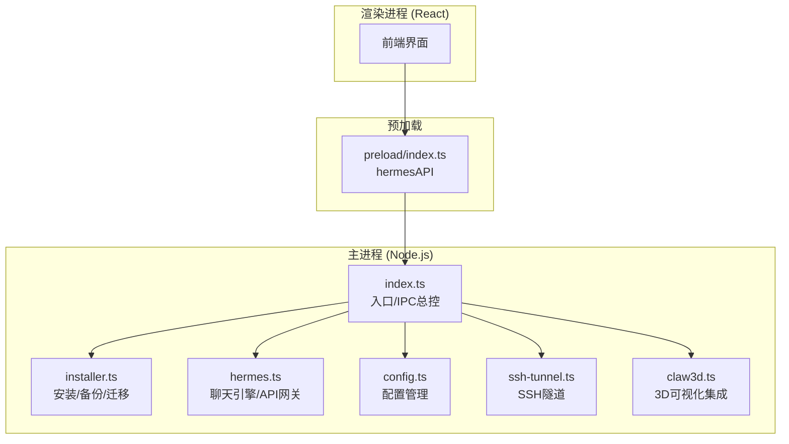
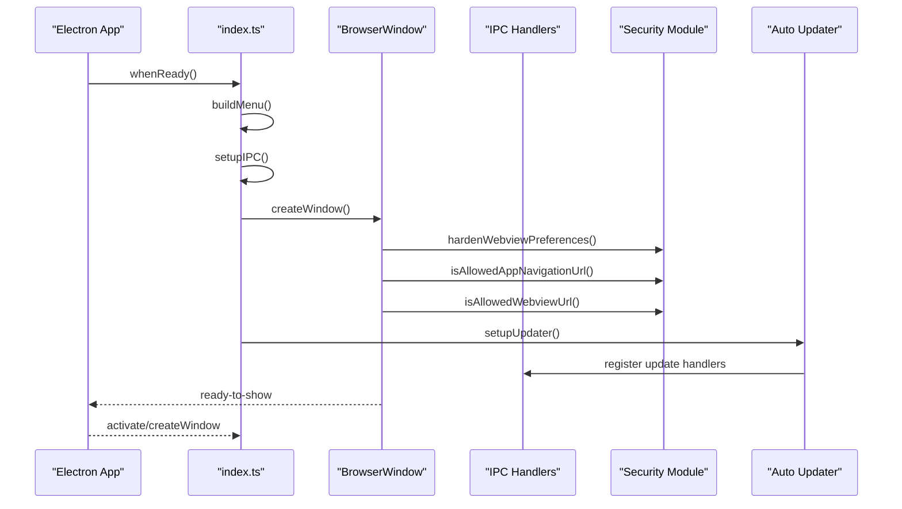
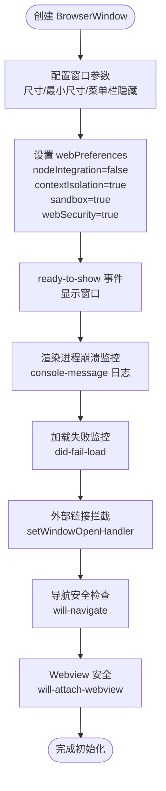
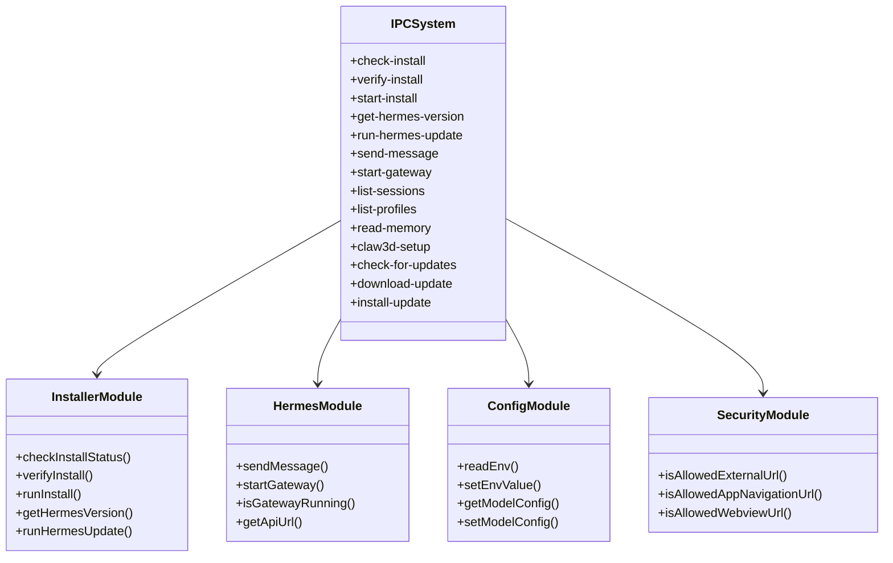
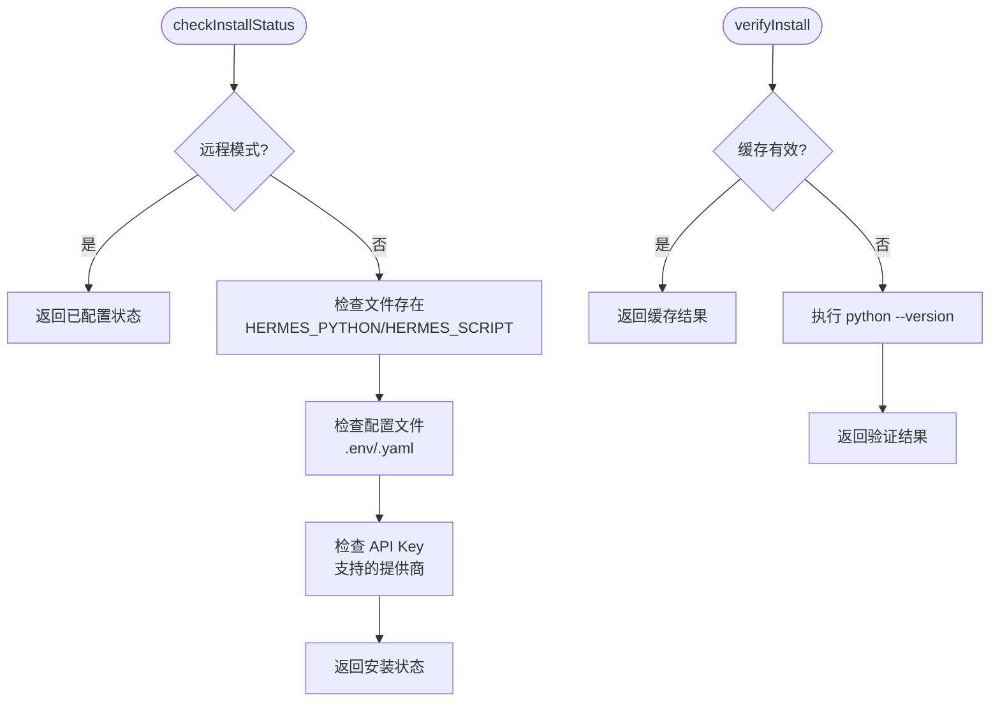
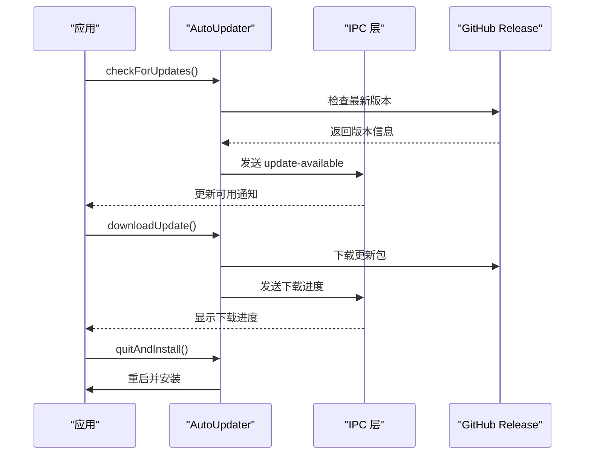
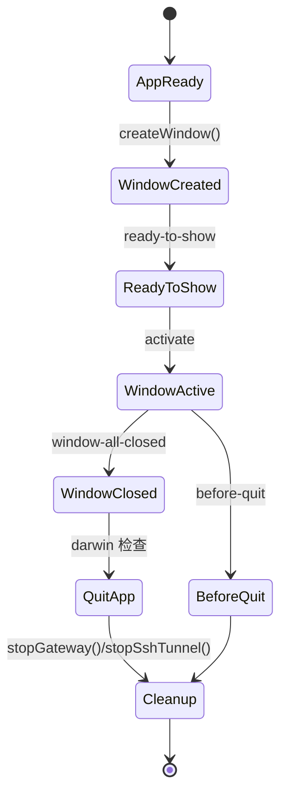
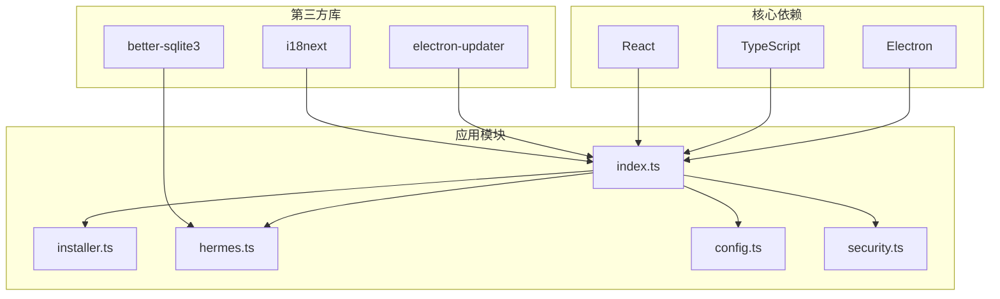

# 应用初始化模块

<cite>
**本文引用的文件列表**
- [src/main/index.ts](file://src/main/index.ts)
- [src/main/hermes.ts](file://src/main/hermes.ts)
- [src/main/installer.ts](file://src/main/installer.ts)
- [src/main/security.ts](file://src/main/security.ts)
- [src/main/config.ts](file://src/main/config.ts)
- [src/main/ssh-tunnel.ts](file://src/main/ssh-tunnel.ts)
- [src/main/claw3d.ts](file://src/main/claw3d.ts)
- [src/preload/index.ts](file://src/preload/index.ts)
- [docs/hermes-desktop-architecture.md](file://docs/hermes-desktop-architecture.md)
- [package.json](file://package.json)
</cite>

## 目录
1. [简介](#简介)
2. [项目结构](#项目结构)
3. [核心组件](#核心组件)
4. [架构总览](#架构总览)
5. [详细组件分析](#详细组件分析)
6. [依赖关系分析](#依赖关系分析)
7. [性能考虑](#性能考虑)
8. [故障排除指南](#故障排除指南)
9. [结论](#结论)

## 简介
本文档深入解析 Hermes Desktop 的应用初始化模块，涵盖从 Electron 主进程启动到 BrowserWindow 创建、窗口配置、安全设置、事件监听器初始化的完整流程。文档还详细说明了安装状态检查、配置验证、应用更新机制的实现，并提供应用生命周期管理、错误处理机制和异常捕获策略。通过时序图和关键初始化步骤的代码示例，帮助开发者理解应用从启动到可用的完整过程。

## 项目结构
Hermes Desktop 采用 Electron + React 架构，主进程负责系统集成、安装管理、聊天引擎、远程连接等核心功能，预加载脚本通过 contextBridge 暴露安全的 IPC 接口给渲染进程。

**图表来源**
- [src/main/index.ts:1176-1234](file://src/main/index.ts#L1176-L1234)
- [src/main/installer.ts:1-120](file://src/main/installer.ts#L1-L120)
- [src/main/hermes.ts:1-120](file://src/main/hermes.ts#L1-L120)
- [src/main/config.ts:1-120](file://src/main/config.ts#L1-L120)
- [src/main/ssh-tunnel.ts:1-120](file://src/main/ssh-tunnel.ts#L1-L120)
- [src/main/claw3d.ts:1-120](file://src/main/claw3d.ts#L1-L120)
- [src/preload/index.ts:1-120](file://src/preload/index.ts#L1-L120)

**章节来源**
- [docs/hermes-desktop-architecture.md:18-90](file://docs/hermes-desktop-architecture.md#L18-L90)

## 核心组件
应用初始化模块围绕以下核心组件展开：

- **BrowserWindow 创建与配置**：负责窗口尺寸、安全策略、事件监听器设置
- **IPC 通信系统**：通过 ipcMain.handle 注册 50+ 个处理器，提供完整的功能接口
- **安全策略**：严格的 URL 白名单、webview 预加载隔离、外部链接拦截
- **安装状态检查**：检测 Hermes 安装状态、配置验证、版本缓存管理
- **应用更新机制**：基于 electron-updater 的自动更新系统
- **生命周期管理**：窗口创建、激活、关闭、退出时的清理工作

**章节来源**
- [src/main/index.ts:196-288](file://src/main/index.ts#L196-L288)
- [src/main/index.ts:290-1005](file://src/main/index.ts#L290-L1005)
- [src/main/security.ts:1-78](file://src/main/security.ts#L1-L78)

## 架构总览
应用初始化遵循标准的 Electron 启动序列，但增加了复杂的功能模块集成：

**图表来源**
- [src/main/index.ts:1176-1234](file://src/main/index.ts#L1176-L1234)
- [src/main/security.ts:53-77](file://src/main/security.ts#L53-L77)

## 详细组件分析

### BrowserWindow 创建与安全配置

应用初始化的核心是 createWindow 函数，它创建了安全的 BrowserWindow 实例：

**图表来源**
- [src/main/index.ts:196-288](file://src/main/index.ts#L196-L288)
- [src/main/security.ts:20-51](file://src/main/security.ts#L20-L51)

关键安全配置包括：
- **上下文隔离**：确保渲染进程无法直接访问 Node.js API
- **沙箱模式**：限制渲染进程的系统权限
- **webSecurity**：启用同源策略
- **webviewTag**：允许使用 webview，但必须经过严格的安全检查

**章节来源**
- [src/main/index.ts:196-288](file://src/main/index.ts#L196-L288)
- [src/main/security.ts:53-77](file://src/main/security.ts#L53-L77)

### IPC 通信系统初始化

setupIPC 函数注册了 50+ 个 IPC 处理器，按功能模块组织：

**图表来源**
- [src/main/index.ts:290-1005](file://src/main/index.ts#L290-L1005)
- [src/main/installer.ts:153-246](file://src/main/installer.ts#L153-L246)
- [src/main/hermes.ts:654-679](file://src/main/hermes.ts#L654-L679)
- [src/main/config.ts:101-167](file://src/main/config.ts#L101-L167)
- [src/main/security.ts:20-51](file://src/main/security.ts#L20-L51)

**章节来源**
- [src/main/index.ts:290-1005](file://src/main/index.ts#L290-L1005)

### 安装状态检查与配置验证

安装状态检查采用分层策略：

**图表来源**
- [src/main/installer.ts:153-246](file://src/main/installer.ts#L153-L246)

关键特性：
- **快速 UI 响应**：文件存在性检查避免冷启动延迟
- **惰性验证**：实际 Python 验证在 UI 启动后异步执行
- **版本缓存**：5分钟 TTL 缓存避免重复验证

**章节来源**
- [src/main/installer.ts:153-296](file://src/main/installer.ts#L153-L296)

### 应用更新机制

应用更新通过 electron-updater 实现：

**图表来源**
- [src/main/index.ts:1111-1174](file://src/main/index.ts#L1111-L1174)

开发模式特殊处理：
- 开发模式下禁用自动更新
- 使用动态导入避免 dev 环境中的 updater 问题

**章节来源**
- [src/main/index.ts:1111-1174](file://src/main/index.ts#L1111-L1174)

### 生命周期管理

应用生命周期通过多个事件钩子管理：

**图表来源**
- [src/main/index.ts:1210-1234](file://src/main/index.ts#L1210-L1234)

关键清理操作：
- 停止聊天会话
- 关闭网关进程
- 断开 SSH 隧道
- 停止 Claw3D 服务

**章节来源**
- [src/main/index.ts:1210-1234](file://src/main/index.ts#L1210-L1234)

## 依赖关系分析

初始化模块的依赖关系呈现清晰的分层结构：

**图表来源**
- [package.json:27-68](file://package.json#L27-L68)
- [src/main/index.ts:1-50](file://src/main/index.ts#L1-L50)

**章节来源**
- [package.json:27-68](file://package.json#L27-L68)

## 性能考虑

初始化性能优化策略：

1. **安装状态检查优化**
   - 文件存在性检查避免 Python 冷启动延迟
   - 验证结果 5 分钟缓存
   - 版本查询防抖机制

2. **内存管理**
   - IPC 处理器按需注册，避免不必要的开销
   - 窗口事件监听器及时清理
   - SSH 隧道进程生命周期管理

3. **网络优化**
   - API 健康检查轮询间隔 15 秒
   - SSH 隧道健康检查超时控制
   - 流式响应处理减少内存占用

4. **启动时间优化**
   - 预加载脚本提前暴露 API 接口
   - 异步初始化非关键功能
   - 缓存常用配置和状态

## 故障排除指南

### 常见初始化问题

**问题 1：窗口无法显示**
- 检查 ready-to-show 事件是否触发
- 验证 webPreferences 配置
- 确认安全策略未阻止内容加载

**问题 2：IPC 调用失败**
- 确认对应 ipcMain.handle 已注册
- 检查 preload 脚本是否正确暴露 hermesAPI
- 验证参数类型和数量

**问题 3：安装检查异常**
- 检查 HERMES_HOME 环境变量
- 验证文件权限和路径
- 查看缓存失效时间

**问题 4：SSH 隧道连接失败**
- 确认 SSH 凭据正确性
- 检查防火墙和网络连接
- 验证远程主机可达性

**章节来源**
- [src/main/index.ts:174-180](file://src/main/index.ts#L174-L180)
- [src/main/security.ts:20-51](file://src/main/security.ts#L20-L51)

## 结论

Hermes Desktop 的应用初始化模块展现了现代 Electron 应用的最佳实践：

1. **安全性优先**：严格的上下文隔离、URL 白名单、webview 安全检查
2. **模块化设计**：清晰的功能分离和依赖管理
3. **性能优化**：惰性加载、缓存策略、异步初始化
4. **用户体验**：完整的错误处理、进度反馈、优雅降级
5. **可维护性**：清晰的代码结构、完善的注释和文档

该初始化模块为整个应用提供了坚实的基础，通过合理的架构设计和安全策略，确保了应用的稳定性、性能和用户体验。