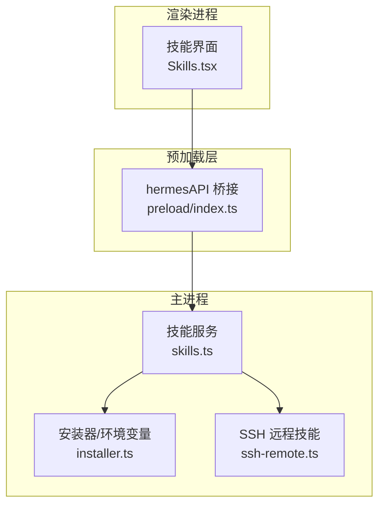
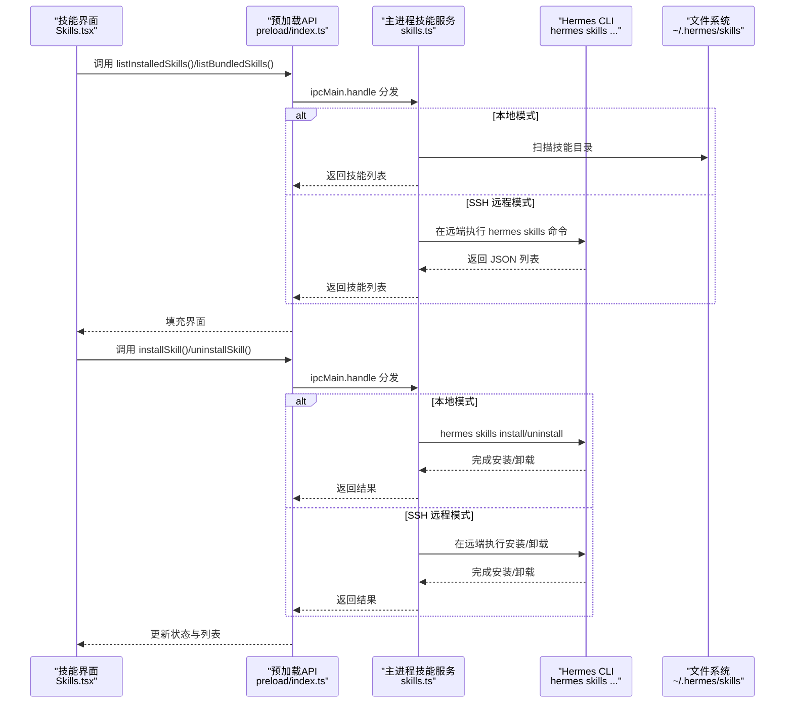
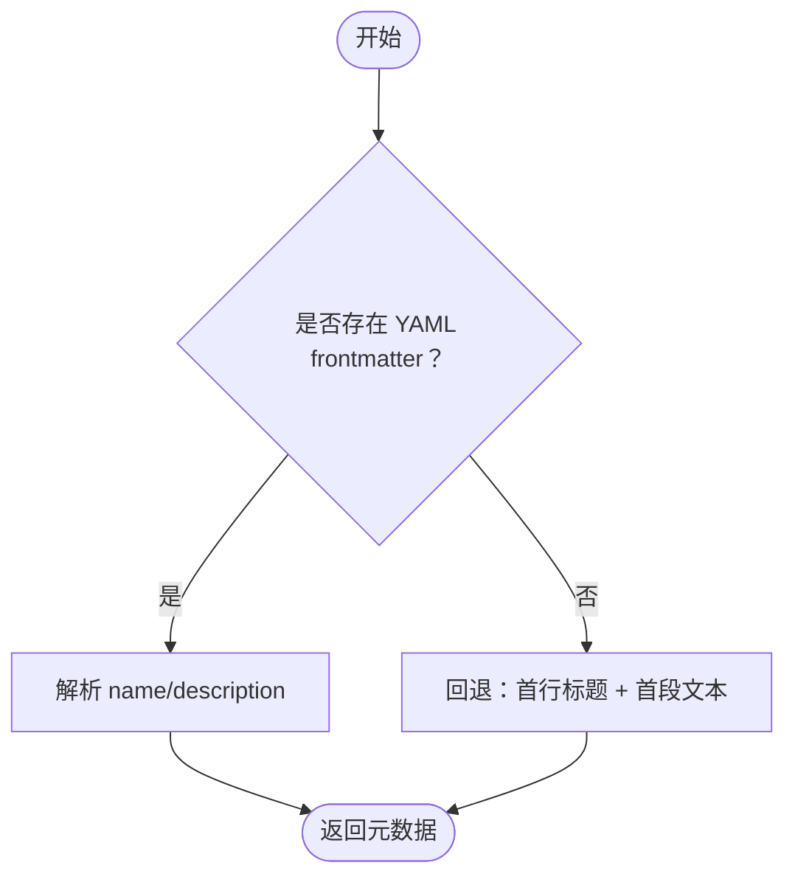
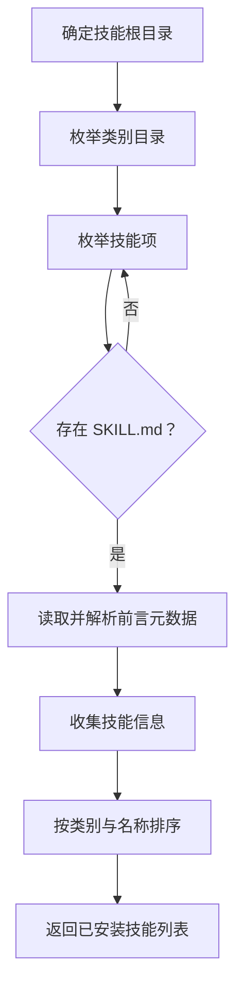
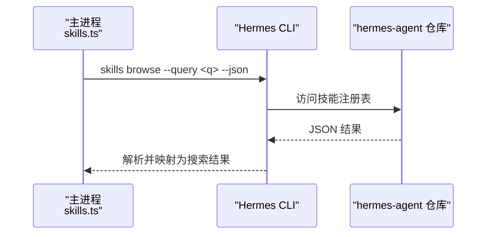
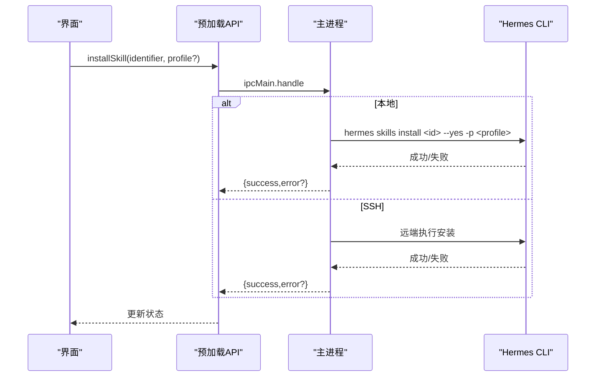
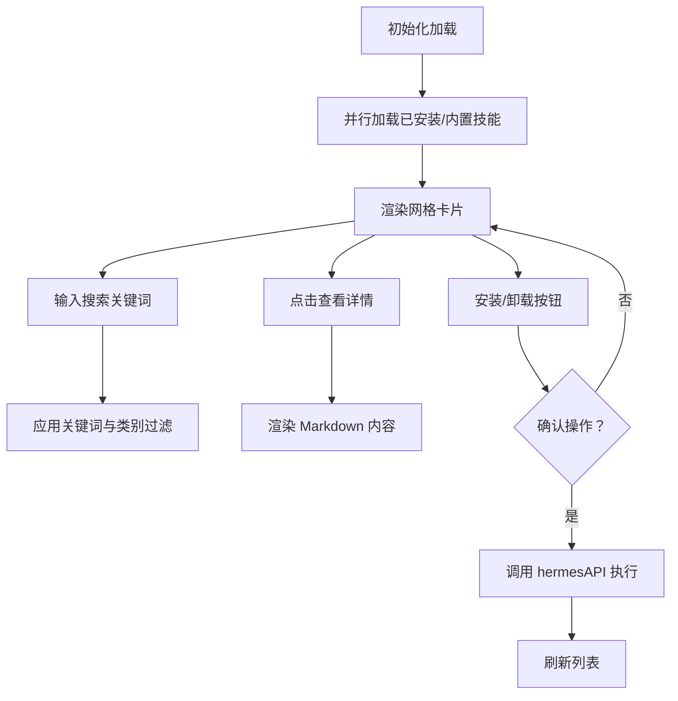
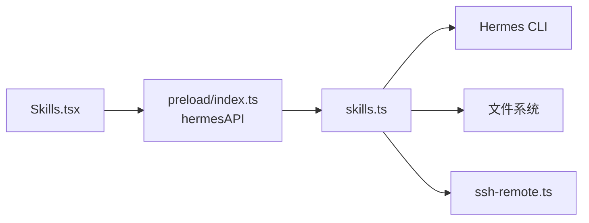

# 技能系统模块

<cite>
**本文档引用的文件**
- [skills.ts](file://src/main/skills.ts)
- [Skills.tsx](file://src/renderer/src/screens/Skills/Skills.tsx)
- [index.ts](file://src/main/index.ts)
- [index.ts](file://src/preload/index.ts)
- [security.ts](file://src/main/security.ts)
- [skills.ts](file://src/shared/i18n/locales/zh-CN/skills.ts)
- [SKILL.md](file://.agents/skills/hermes-agent/SKILL.md)
- [SKILL.md](file://.agents/skills/electron-pro/SKILL.md)
- [SKILL.md](file://.agents/skills/typescript-expert/SKILL.md)
- [ssh-remote.ts](file://src/main/ssh-remote.ts)
- [skills-lock.json](file://skills-lock.json)
</cite>

## 目录
1. [简介](#简介)
2. [项目结构](#项目结构)
3. [核心组件](#核心组件)
4. [架构总览](#架构总览)
5. [详细组件分析](#详细组件分析)
6. [依赖关系分析](#依赖关系分析)
7. [性能考虑](#性能考虑)
8. [故障排除指南](#故障排除指南)
9. [结论](#结论)
10. [附录](#附录)

## 简介
本文件面向Hermes Desktop的技能系统模块，系统性阐述技能的定义、安装、管理与调用机制，覆盖技能配置文件格式、内容解析与执行流程，并提供内置技能与自定义技能的开发指南、示例与配置模板，帮助开发者理解技能系统的扩展性与灵活性。同时，文档包含安全机制与性能优化建议，确保在桌面应用环境中安全、高效地使用技能。

## 项目结构
技能系统由三部分组成：
- 主进程（Main）：负责扫描本地已安装技能、读取技能内容、调用hermes CLI进行技能注册表搜索与安装/卸载。
- 预加载层（Preload）：桥接渲染进程与主进程，暴露hermesAPI接口，供UI调用。
- 渲染进程（Renderer）：提供技能管理界面，支持已安装技能与内置技能的浏览、搜索、详情查看与安装/卸载操作。

图表来源
- [Skills.tsx:1-363](file://src/renderer/src/screens/Skills/Skills.tsx#L1-363)
- [index.ts:352-379](file://src/preload/index.ts#L352-L379)
- [skills.ts:1-293](file://src/main/skills.ts#L1-L293)
- [ssh-remote.ts:127-189](file://src/main/ssh-remote.ts#L127-L189)

章节来源
- [Skills.tsx:1-363](file://src/renderer/src/screens/Skills/Skills.tsx#L1-363)
- [index.ts:352-379](file://src/preload/index.ts#L352-L379)
- [skills.ts:1-293](file://src/main/skills.ts#L1-L293)

## 核心组件
- 已安装技能模型：包含技能名称、类别、描述与路径。
- 技能搜索结果模型：包含名称、描述、类别、来源与是否已安装标记。
- 主进程技能服务：提供列出已安装技能、读取技能内容、搜索技能注册表、安装/卸载技能等能力。
- 预加载层API：将主进程能力暴露给渲染进程，统一异步调用接口。
- 渲染进程界面：提供技能列表、搜索、分类过滤、详情弹窗与安装/卸载操作。

章节来源
- [skills.ts:14-27](file://src/main/skills.ts#L14-L27)
- [skills.ts:14-293](file://src/main/skills.ts#L14-L293)
- [index.ts:352-379](file://src/preload/index.ts#L352-L379)
- [Skills.tsx:6-19](file://src/renderer/src/screens/Skills/Skills.tsx#L6-L19)

## 架构总览
技能系统采用“主进程服务 + 预加载桥接 + 渲染界面”的分层设计。渲染进程通过hermesAPI发起请求，主进程根据当前连接模式（本地/SSH）选择本地实现或远程实现，最终完成技能的列举、搜索、安装与卸载。

图表来源
- [Skills.tsx:41-90](file://src/renderer/src/screens/Skills/Skills.tsx#L41-L90)
- [index.ts:352-379](file://src/preload/index.ts#L352-L379)
- [skills.ts:236-292](file://src/main/skills.ts#L236-L292)
- [ssh-remote.ts:190-206](file://src/main/ssh-remote.ts#L190-L206)

章节来源
- [Skills.tsx:41-90](file://src/renderer/src/screens/Skills/Skills.tsx#L41-L90)
- [index.ts:352-379](file://src/preload/index.ts#L352-L379)
- [skills.ts:236-292](file://src/main/skills.ts#L236-L292)
- [ssh-remote.ts:190-206](file://src/main/ssh-remote.ts#L190-L206)

## 详细组件分析

### 技能配置文件格式与解析
- 文件位置：每个技能以独立目录存放，根目录包含一个名为 SKILL.md 的文档。
- 元数据提取：优先解析 YAML frontmatter（以 "---" 包裹），从中提取 name 与 description；若无 frontmatter，则回退到首行标题与首段文本作为名称与描述。
- 内容读取：详情页读取完整 SKILL.md 文本，用于 Markdown 渲染展示。

图表来源
- [skills.ts:29-62](file://src/main/skills.ts#L29-L62)

章节来源
- [skills.ts:29-62](file://src/main/skills.ts#L29-L62)

### 已安装技能扫描与排序
- 目录结构：~/.hermes/profiles/<profile>/skills 或 ~/.hermes/skills（默认）
- 扫描逻辑：遍历类别目录与技能子目录，定位 SKILL.md 并提取元数据。
- 排序规则：先按类别排序，再按名称排序。

图表来源
- [skills.ts:68-117](file://src/main/skills.ts#L68-L117)
- [ssh-remote.ts:128-181](file://src/main/ssh-remote.ts#L128-L181)

章节来源
- [skills.ts:68-117](file://src/main/skills.ts#L68-L117)
- [ssh-remote.ts:128-181](file://src/main/ssh-remote.ts#L128-L181)

### 技能注册表搜索与内置技能列表
- 注册表搜索：通过 hermes CLI 的 skills browse 子命令查询技能注册表，支持 JSON 输出与关键词查询。
- 内置技能列表：从 hermes-agent 仓库的 skills 目录中读取，结构与已安装技能一致，但标记为未安装。

图表来源
- [skills.ts:136-178](file://src/main/skills.ts#L136-L178)
- [skills.ts:183-234](file://src/main/skills.ts#L183-L234)

章节来源
- [skills.ts:136-178](file://src/main/skills.ts#L136-L178)
- [skills.ts:183-234](file://src/main/skills.ts#L183-L234)

### 技能安装与卸载
- 本地安装：调用 hermes CLI 的 skills install/uninstall 子命令，传入 --yes 自动确认，支持指定 profile。
- 远程安装：通过 SSH 在远端执行 hermes skills install/uninstall。
- 错误处理：捕获 CLI 标准错误输出，返回用户可读的错误消息。

图表来源
- [Skills.tsx:67-77](file://src/renderer/src/screens/Skills/Skills.tsx#L67-L77)
- [index.ts:369-378](file://src/preload/index.ts#L369-L378)
- [skills.ts:236-263](file://src/main/skills.ts#L236-L263)
- [ssh-remote.ts:190-197](file://src/main/ssh-remote.ts#L190-L197)

章节来源
- [Skills.tsx:67-77](file://src/renderer/src/screens/Skills/Skills.tsx#L67-L77)
- [index.ts:369-378](file://src/preload/index.ts#L369-L378)
- [skills.ts:236-263](file://src/main/skills.ts#L236-L263)
- [ssh-remote.ts:190-197](file://src/main/ssh-remote.ts#L190-L197)

### 渲染界面与交互流程
- 并行加载：同时加载已安装技能与内置技能列表，提升响应速度。
- 搜索与过滤：支持关键词搜索与类别筛选；已安装列表支持多字段匹配。
- 详情弹窗：点击卡片打开详情弹窗，展示完整 SKILL.md 内容。
- 安装/卸载：按钮禁用期间防止重复操作；成功后刷新列表；失败显示错误提示。

图表来源
- [Skills.tsx:41-125](file://src/renderer/src/screens/Skills/Skills.tsx#L41-L125)
- [Skills.tsx:160-183](file://src/renderer/src/screens/Skills/Skills.tsx#L160-L183)

章节来源
- [Skills.tsx:41-125](file://src/renderer/src/screens/Skills/Skills.tsx#L41-L125)
- [Skills.tsx:160-183](file://src/renderer/src/screens/Skills/Skills.tsx#L160-L183)

### 内置技能与自定义技能开发指南
- 内置技能示例：仓库内包含多个技能示例，如 hermes-agent、electron-pro、typescript-expert，展示了不同领域的技能模板与最佳实践。
- 自定义技能开发步骤：
  1) 创建技能目录：在 ~/.hermes/profiles/<profile>/skills/<category>/<skill-name> 下创建目录。
  2) 编写 SKILL.md：使用 YAML frontmatter 提供 name 与 description，正文为技能说明与使用指南。
  3) 安装技能：通过技能界面或 CLI 安装，系统会自动扫描并显示。
  4) 验证与迭代：在聊天界面中验证技能行为，必要时更新 SKILL.md 与相关工具。

章节来源
- [.agents/skills/hermes-agent/SKILL.md:1-120](file://.agents/skills/hermes-agent/SKILL.md#L1-L120)
- [.agents/skills/electron-pro/SKILL.md:1-153](file://.agents/skills/electron-pro/SKILL.md#L1-L153)
- [.agents/skills/typescript-expert/SKILL.md:1-120](file://.agents/skills/typescript-expert/SKILL.md#L1-L120)

### 技能配置模板
- 基础模板（YAML frontmatter）：
  - name：技能名称
  - description：技能描述
  - category：技能类别（用于分类筛选）
  - risk：风险等级（可选）
  - source：来源（可选）
  - date_added：添加日期（可选）

章节来源
- [.agents/skills/typescript-expert/SKILL.md:1-8](file://.agents/skills/typescript-expert/SKILL.md#L1-L8)

### 技能执行流程
- 调用路径：渲染界面 -> hermesAPI -> 主进程 -> hermes CLI -> 文件系统/注册表。
- 关键点：profile 支持、SSH 远程模式、错误传播与 UI 反馈。

章节来源
- [Skills.tsx:67-90](file://src/renderer/src/screens/Skills/Skills.tsx#L67-L90)
- [index.ts:369-378](file://src/preload/index.ts#L369-L378)
- [skills.ts:236-292](file://src/main/skills.ts#L236-L292)

## 依赖关系分析
- 组件耦合：
  - 渲染进程仅依赖预加载层提供的 hermesAPI，降低直接访问主进程复杂度。
  - 主进程技能服务依赖 hermes CLI 与文件系统，具备本地与 SSH 两种执行路径。
- 外部依赖：
  - hermes CLI：提供技能注册表查询、安装/卸载能力。
  - 文件系统：技能元数据与内容存储于 SKILL.md。
  - SSH：远程模式下通过 SSH 执行 CLI 命令。

图表来源
- [Skills.tsx:1-363](file://src/renderer/src/screens/Skills/Skills.tsx#L1-363)
- [index.ts:352-379](file://src/preload/index.ts#L352-L379)
- [skills.ts:1-293](file://src/main/skills.ts#L1-L293)
- [ssh-remote.ts:127-189](file://src/main/ssh-remote.ts#L127-L189)

章节来源
- [Skills.tsx:1-363](file://src/renderer/src/screens/Skills/Skills.tsx#L1-363)
- [index.ts:352-379](file://src/preload/index.ts#L352-L379)
- [skills.ts:1-293](file://src/main/skills.ts#L1-L293)
- [ssh-remote.ts:127-189](file://src/main/ssh-remote.ts#L127-L189)

## 性能考虑
- 并行加载：已安装与内置技能列表并行获取，减少首屏等待时间。
- 本地缓存：技能内容按需读取，避免一次性加载过多 Markdown。
- CLI 超时控制：安装/卸载与搜索设置合理超时，防止阻塞 UI。
- SSH 远程：远程执行时尽量减少往返次数，合并操作或使用批量脚本。
- 建议：
  - 对大型技能内容采用懒加载与分页展示。
  - 为搜索结果增加本地缓存，降低重复查询成本。
  - 在 SSH 模式下，对频繁操作进行节流与去抖。

## 故障排除指南
- 安装失败：
  - 检查 CLI 输出与网络连通性；确认 hermes CLI 可执行且版本兼容。
  - 若为 SSH 模式，检查远端环境变量与权限。
- 卸载失败：
  - 确认技能名称正确；查看错误信息并重试。
- 无法显示技能详情：
  - 确认 SKILL.md 存在且可读；检查文件编码与大小限制。
- 本地与 SSH 模式差异：
  - 确认连接配置与远端路径前缀；SSH 模式下路径需带 REMOTE_PREFIX。

章节来源
- [Skills.tsx:74-89](file://src/renderer/src/screens/Skills/Skills.tsx#L74-L89)
- [skills.ts:258-262](file://src/main/skills.ts#L258-L262)
- [ssh-remote.ts:183-189](file://src/main/ssh-remote.ts#L183-L189)

## 结论
Hermes Desktop 的技能系统通过清晰的分层设计与标准化的配置文件格式，实现了对内置与自定义技能的统一管理与灵活扩展。借助 hermes CLI 与文件系统，系统在本地与 SSH 远程模式下均能稳定运行。配合完善的错误处理与性能优化策略，开发者可以快速构建高质量的技能并集成到桌面应用中。

## 附录

### 技能安全机制
- 上下文隔离与权限控制：预加载层启用上下文隔离，禁止 Node 集成，限制 Webview 权限，防止不安全导航与内容加载。
- 外部链接与导航校验：仅允许受控协议与主机，避免恶意跳转。
- 远程执行安全：SSH 模式下通过远端执行 CLI，避免本地直接调用潜在危险命令。

章节来源
- [security.ts:20-51](file://src/main/security.ts#L20-L51)
- [security.ts:65-77](file://src/main/security.ts#L65-L77)

### 技能锁文件与来源校验
- skills-lock.json：记录已锁定的技能来源与哈希值，便于版本一致性与完整性校验。
- 使用场景：CI/CD 中验证技能来源可信，防止篡改。

章节来源
- [skills-lock.json:1-26](file://skills-lock.json#L1-L26)

### 国际化支持
- 技能界面文案：提供多语言支持，包括技能标题、搜索占位符、安装/卸载按钮等。
- 本地化文件：位于共享国际化资源目录，便于新增语言与维护。

章节来源
- [skills.ts:1-24](file://src/shared/i18n/locales/zh-CN/skills.ts#L1-L24)