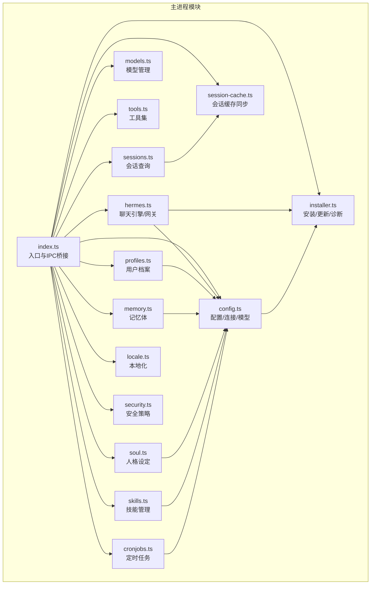
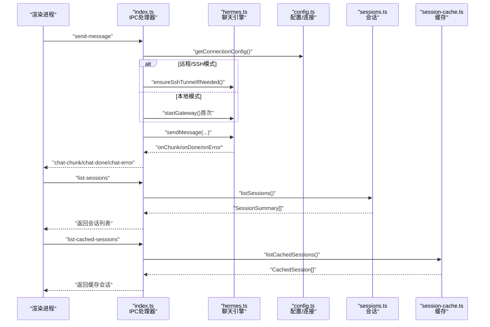
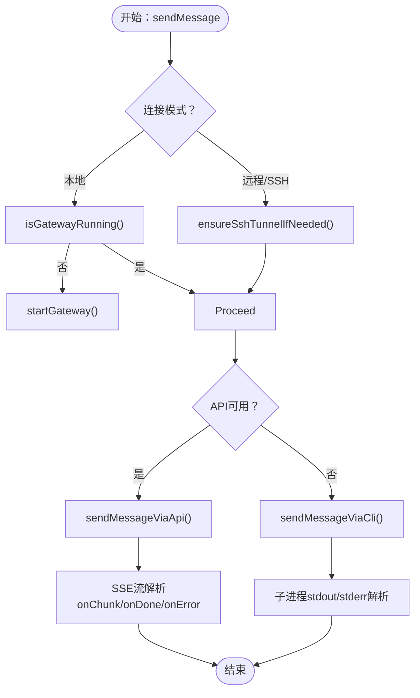
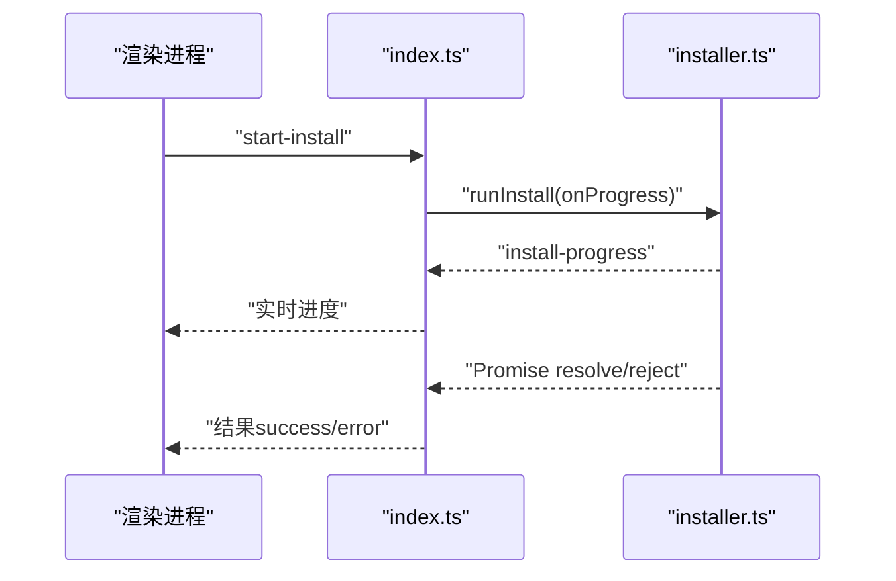
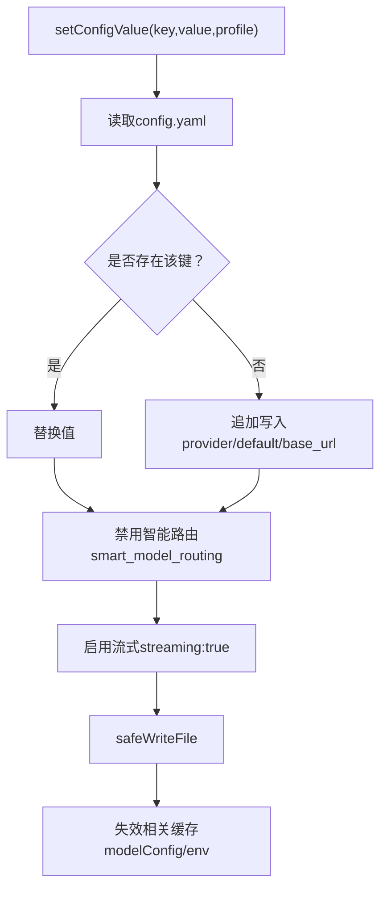
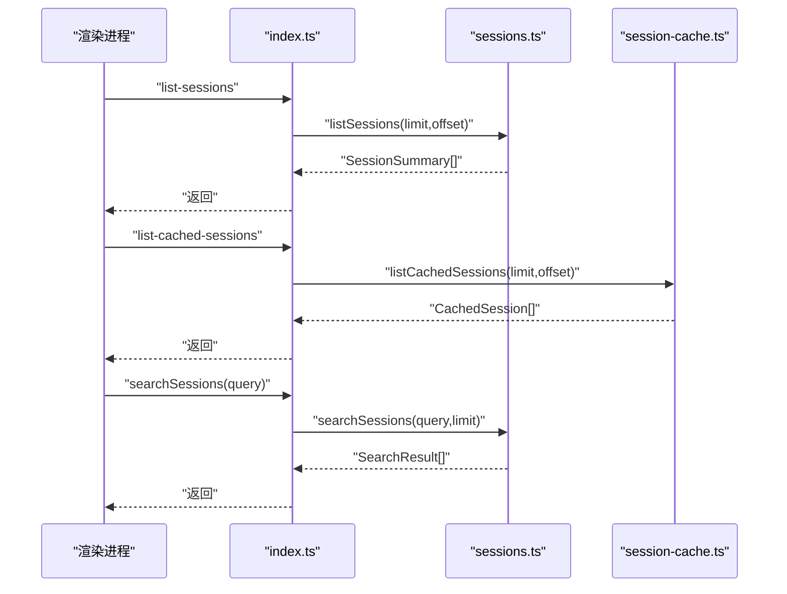
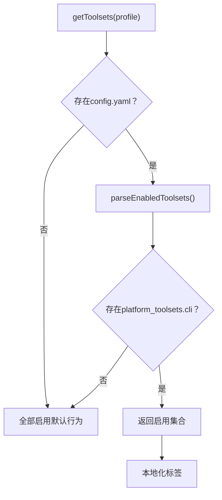
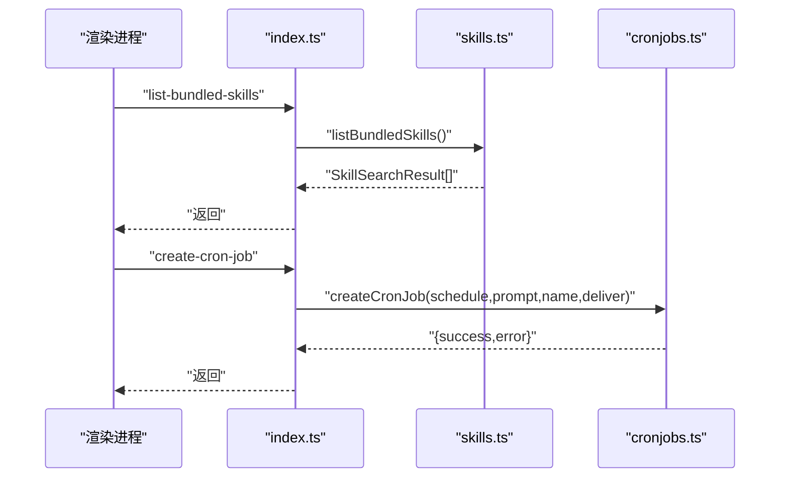
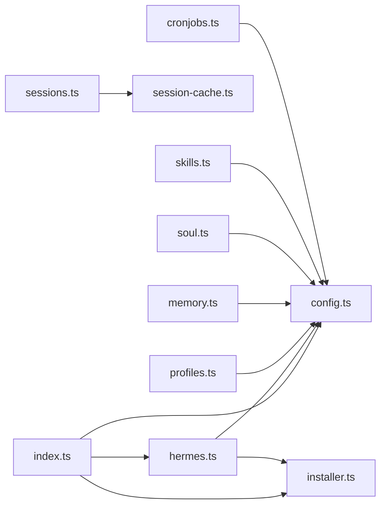

# 核心模块设计

<cite>
**本文档引用的文件**
- [src/main/index.ts](file://src/main/index.ts)
- [src/main/hermes.ts](file://src/main/hermes.ts)
- [src/main/config.ts](file://src/main/config.ts)
- [src/main/sessions.ts](file://src/main/sessions.ts)
- [src/main/session-cache.ts](file://src/main/session-cache.ts)
- [src/main/models.ts](file://src/main/models.ts)
- [src/main/profiles.ts](file://src/main/profiles.ts)
- [src/main/memory.ts](file://src/main/memory.ts)
- [src/main/soul.ts](file://src/main/soul.ts)
- [src/main/tools.ts](file://src/main/tools.ts)
- [src/main/skills.ts](file://src/main/skills.ts)
- [src/main/cronjobs.ts](file://src/main/cronjobs.ts)
- [src/main/locale.ts](file://src/main/locale.ts)
- [src/main/security.ts](file://src/main/security.ts)
- [src/main/installer.ts](file://src/main/installer.ts)
</cite>

## 目录
1. [引言](#引言)
2. [项目结构](#项目结构)
3. [核心组件](#核心组件)
4. [架构总览](#架构总览)
5. [详细组件分析](#详细组件分析)
6. [依赖分析](#依赖分析)
7. [性能考虑](#性能考虑)
8. [故障排除指南](#故障排除指南)
9. [结论](#结论)

## 引言
本文件面向Hermes Desktop主进程模块，系统性梳理其核心模块架构与职责边界，重点覆盖以下方面：
- 主进程模块的职责划分与接口设计
- 聊天引擎模块、安装管理模块、配置管理模块、会话管理模块等核心功能模块的设计理念与实现方式
- 模块间依赖关系、初始化顺序与生命周期管理
- 错误传播机制与安全策略
- 提供模块依赖图与模块交互时序图，帮助开发者快速理解系统整体结构与耦合关系

## 项目结构
Hermes Desktop主进程采用按功能域分层的模块化组织方式，核心模块均位于 src/main 目录下，通过统一的 IPC 接口向渲染进程暴露能力。主要模块包括：
- 安装与环境管理：installer.ts
- 配置与连接模式：config.ts、locale.ts、security.ts
- 聊天引擎与网关：hermes.ts
- 会话与缓存：sessions.ts、session-cache.ts
- 模型与平台工具集：models.ts、tools.ts
- 用户资料与记忆体：profiles.ts、memory.ts、soul.ts
- 技能与定时任务：skills.ts、cronjobs.ts

图表来源
- [src/main/index.ts:290-800](file://src/main/index.ts#L290-L800)
- [src/main/hermes.ts:1-800](file://src/main/hermes.ts#L1-L800)
- [src/main/config.ts:1-440](file://src/main/config.ts#L1-L440)
- [src/main/installer.ts:1-800](file://src/main/installer.ts#L1-L800)
- [src/main/sessions.ts:1-212](file://src/main/sessions.ts#L1-L212)
- [src/main/session-cache.ts:1-252](file://src/main/session-cache.ts#L1-L252)
- [src/main/models.ts:1-169](file://src/main/models.ts#L1-L169)
- [src/main/tools.ts:1-294](file://src/main/tools.ts#L1-L294)
- [src/main/profiles.ts:1-284](file://src/main/profiles.ts#L1-L284)
- [src/main/memory.ts:1-207](file://src/main/memory.ts#L1-L207)
- [src/main/soul.ts:1-38](file://src/main/soul.ts#L1-L38)
- [src/main/skills.ts:1-293](file://src/main/skills.ts#L1-L293)
- [src/main/cronjobs.ts:1-281](file://src/main/cronjobs.ts#L1-L281)
- [src/main/locale.ts:1-15](file://src/main/locale.ts#L1-L15)
- [src/main/security.ts:1-78](file://src/main/security.ts#L1-L78)

章节来源
- [src/main/index.ts:1-288](file://src/main/index.ts#L1-L288)
- [src/main/installer.ts:1-120](file://src/main/installer.ts#L1-L120)

## 核心组件
本节从职责、接口与实现角度，系统梳理各核心模块。

- 安装管理模块（installer.ts）
  - 职责：安装/更新/诊断、环境路径增强、版本缓存、OpenClaw迁移
  - 关键接口：checkInstallStatus、verifyInstall、runInstall、runHermesUpdate、runHermesDoctor、runClawMigrate、getHermesVersion
  - 设计要点：跨平台安装脚本适配、进度上报、缓存与幂等、错误降级与提示

- 配置管理模块（config.ts）
  - 职责：连接模式（本地/远程/SSH）、环境变量与模型配置读写、平台启用状态、凭据池
  - 关键接口：getConnectionConfig、setConnectionConfig、readEnv、setEnvValue、getModelConfig、setModelConfig、getPlatformEnabled、setPlatformEnabled、getCredentialPool、setCredentialPool
  - 设计要点：内存缓存（带TTL）、正则解析、安全校验、配置变更触发网关重启

- 聊天引擎模块（hermes.ts）
  - 职责：聊天消息发送、HTTP API流式处理、CLI回退、网关启动/健康检查、SSH隧道集成
  - 关键接口：sendMessage、startGateway、isGatewayRunning、ensureSshTunnelIfNeeded、getApiUrl、getRemoteAuthHeader
  - 设计要点：自动探测API可用性、HTTP SSE流式解析、错误探针、AbortController中断、健康轮询

- 会话管理模块（sessions.ts、session-cache.ts）
  - 职责：会话列表、消息检索、全文检索、删除；桌面端会话缓存同步与标题生成
  - 关键接口：listSessions、getSessionMessages、searchSessions、syncSessionCache、listCachedSessions、updateSessionTitle、deleteSessionComplete
  - 设计要点：SQLite只读访问、FTS5检索、缓存去重与索引优化、跨文件系统与数据库一致性

- 模型与工具模块（models.ts、tools.ts）
  - 职责：模型清单管理、默认模型种子、自定义提供者注入；工具集启用控制
  - 关键接口：listModels、addModel、removeModel、updateModel、getToolsets、setToolsetEnabled
  - 设计要点：JSON持久化、自定义提供者解析、工具集本地化与配置注入

- 用户资料与记忆体（profiles.ts、memory.ts、soul.ts）
  - 职责：多档案管理、记忆体条目增删改查、用户档案写入、人格设定读写重置
  - 关键接口：listProfiles、createProfile、deleteProfile、setActiveProfile、readMemory、addMemoryEntry、updateMemoryEntry、removeMemoryEntry、writeUserProfile、readSoul、writeSoul、resetSoul
  - 设计要点：档案目录结构、文件权限与字符限制、统计信息聚合

- 技能与定时任务（skills.ts、cronjobs.ts）
  - 职责：技能浏览/安装/卸载、内置技能枚举；定时任务CRUD与执行
  - 关键接口：listInstalledSkills、getSkillContent、searchSkills、listBundledSkills、installSkill、uninstallSkill、listCronJobs、createCronJob、removeCronJob、pauseCronJob、resumeCronJob、triggerCronJob
  - 设计要点：CLI委派、JSON输出解析、远程模式HTTP代理

- 本地化与安全（locale.ts、security.ts）
  - 职责：应用语言环境、导航/外链/WebView安全策略
  - 关键接口：getAppLocale、setAppLocale、isAllowedAppNavigationUrl、isAllowedExternalUrl、isAllowedWebviewUrl、hardenWebviewPreferences、hardenAttachedWebContents

章节来源
- [src/main/installer.ts:153-454](file://src/main/installer.ts#L153-L454)
- [src/main/config.ts:47-394](file://src/main/config.ts#L47-L394)
- [src/main/hermes.ts:153-767](file://src/main/hermes.ts#L153-L767)
- [src/main/sessions.ts:46-212](file://src/main/sessions.ts#L46-L212)
- [src/main/session-cache.ts:83-252](file://src/main/session-cache.ts#L83-L252)
- [src/main/models.ts:116-169](file://src/main/models.ts#L116-L169)
- [src/main/tools.ts:170-294](file://src/main/tools.ts#L170-L294)
- [src/main/profiles.ts:111-284](file://src/main/profiles.ts#L111-L284)
- [src/main/memory.ts:110-207](file://src/main/memory.ts#L110-L207)
- [src/main/soul.ts:12-38](file://src/main/soul.ts#L12-L38)
- [src/main/skills.ts:68-293](file://src/main/skills.ts#L68-L293)
- [src/main/cronjobs.ts:87-281](file://src/main/cronjobs.ts#L87-L281)
- [src/main/locale.ts:8-15](file://src/main/locale.ts#L8-L15)
- [src/main/security.ts:20-78](file://src/main/security.ts#L20-L78)

## 架构总览
主进程通过 index.ts 统一注册 IPC 处理器，将渲染进程请求路由到对应模块。聊天流程在 hermes.ts 中完成 HTTP 流式或 CLI 回退，并根据连接模式决定是否使用 SSH 隧道。配置变更通过 config.ts 触发网关重启，确保新参数生效。

图表来源
- [src/main/index.ts:544-640](file://src/main/index.ts#L544-L640)
- [src/main/hermes.ts:648-767](file://src/main/hermes.ts#L648-L767)
- [src/main/config.ts:47-74](file://src/main/config.ts#L47-L74)
- [src/main/sessions.ts:46-89](file://src/main/sessions.ts#L46-L89)
- [src/main/session-cache.ts:170-176](file://src/main/session-cache.ts#L170-L176)

## 详细组件分析

### 聊天引擎模块（hermes.ts）
- 设计理念
  - 双通道：优先HTTP API流式（SSE），失败回退到CLI子进程
  - 懒初始化：首次聊天或网关启动时才配置API服务器
  - 远程模式：支持HTTP与SSH隧道两种远程访问路径
- 关键流程
  - 健康检查：定期轮询API可用性，避免冷启动延迟
  - 认证头：根据连接模式动态注入Authorization
  - 流式解析：SSE事件解析、工具进度事件、用量回调
  - 中断控制：AbortController用于取消进行中的请求
- 生命周期
  - 初始化：ensureInitialized（配置API服务器、启动健康轮询）
  - 网关：startGateway（注入环境变量、守护进程、PID检测）
  - 健康：startHealthPolling/stopHealthPolling
- 错误传播
  - HTTP错误：解析响应体或状态码
  - 流式错误：嵌入式error字段透传
  - CLI错误：stderr缓冲与退出码组合反馈

图表来源
- [src/main/hermes.ts:654-767](file://src/main/hermes.ts#L654-L767)
- [src/main/hermes.ts:168-434](file://src/main/hermes.ts#L168-L434)
- [src/main/hermes.ts:442-646](file://src/main/hermes.ts#L442-L646)

章节来源
- [src/main/hermes.ts:94-166](file://src/main/hermes.ts#L94-L166)
- [src/main/hermes.ts:681-711](file://src/main/hermes.ts#L681-L711)
- [src/main/hermes.ts:720-767](file://src/main/hermes.ts#L720-L767)

### 安装管理模块（installer.ts）
- 设计理念
  - 跨平台安装脚本适配（Windows PowerShell与类Unix Bash）
  - 进度解析与阶段识别，提供可感知的安装体验
  - 版本与诊断缓存，减少重复开销
- 关键流程
  - 运行安装：runInstall（Windows包装器/Unix脚本）
  - 更新与诊断：runHermesUpdate、runHermesDoctor
  - OpenClaw迁移：runClawMigrate
  - 版本查询：getHermesVersion（带并发保护与缓存）
- 错误传播
  - 子进程非零退出：容忍部分警告但二进制树存在即视为成功
  - Windows缺失PowerShell：明确提示

图表来源
- [src/main/index.ts:298-307](file://src/main/index.ts#L298-L307)
- [src/main/installer.ts:517-650](file://src/main/installer.ts#L517-L650)

章节来源
- [src/main/installer.ts:517-650](file://src/main/installer.ts#L517-L650)
- [src/main/installer.ts:398-454](file://src/main/installer.ts#L398-L454)
- [src/main/installer.ts:298-319](file://src/main/installer.ts#L298-L319)

### 配置管理模块（config.ts）
- 设计理念
  - 连接模式抽象：本地/远程/SSH三态切换
  - 配置隔离：按档案读写独立的 .env 与 config.yaml
  - 变更驱动：配置变化触发网关重启，确保一致性
- 关键流程
  - 环境变量：readEnv/setEnvValue（含缓存与校验）
  - 模型配置：getModelConfig/setModelConfig（智能写入与禁用路由）
  - 平台启用：getPlatformEnabled/setPlatformEnabled（YAML结构化维护）
  - 凭据池：getCredentialPool/setCredentialPool（auth.json）
- 错误传播
  - 解析异常：捕获并返回空/默认值
  - 写入失败：safeWriteFile保证原子性

图表来源
- [src/main/config.ts:194-301](file://src/main/config.ts#L194-L301)
- [src/main/config.ts:101-132](file://src/main/config.ts#L101-L132)

章节来源
- [src/main/config.ts:47-74](file://src/main/config.ts#L47-L74)
- [src/main/config.ts:181-213](file://src/main/config.ts#L181-L213)
- [src/main/config.ts:248-301](file://src/main/config.ts#L248-L301)
- [src/main/config.ts:317-394](file://src/main/config.ts#L317-L394)

### 会话管理模块（sessions.ts、session-cache.ts）
- 设计理念
  - SQLite只读访问，避免写竞争
  - FTS5全文检索，提升搜索体验
  - 桌面端缓存与远端数据库双轨同步，兼顾性能与一致性
- 关键流程
  - 列表与搜索：listSessions/searchSessions（FTS5）
  - 缓存同步：syncSessionCache（增量同步、标题生成、去重）
  - 删除：deleteSessionComplete（文件系统+数据库+缓存）
- 性能优化
  - 增量同步：仅拉取上次同步时间后的会话
  - 标题生成：基于首条用户消息，带截断与清理

图表来源
- [src/main/index.ts:691-702](file://src/main/index.ts#L691-L702)
- [src/main/sessions.ts:46-156](file://src/main/sessions.ts#L46-L156)
- [src/main/session-cache.ts:170-176](file://src/main/session-cache.ts#L170-L176)

章节来源
- [src/main/sessions.ts:46-156](file://src/main/sessions.ts#L46-L156)
- [src/main/session-cache.ts:83-167](file://src/main/session-cache.ts#L83-L167)

### 模型与工具模块（models.ts、tools.ts）
- 设计理念
  - 模型清单：JSON持久化，支持默认种子与自定义提供者
  - 工具集：基于配置的CLI工具集启用/禁用，支持本地化标签
- 关键流程
  - 模型：listModels（不存在则种子默认）、add/remove/update
  - 工具：getToolsets（解析platform_toolsets.cli）、setToolsetEnabled（重建配置）

图表来源
- [src/main/tools.ts:170-191](file://src/main/tools.ts#L170-L191)
- [src/main/tools.ts:123-168](file://src/main/tools.ts#L123-L168)

章节来源
- [src/main/models.ts:116-169](file://src/main/models.ts#L116-L169)
- [src/main/tools.ts:170-294](file://src/main/tools.ts#L170-L294)

### 用户资料与记忆体（profiles.ts、memory.ts、soul.ts）
- 设计理念
  - 多档案隔离：默认档案与命名档案，独立配置与数据
  - 记忆体：分隔 MEMORY 与 USER，带字符上限与条目序列化
  - 人格：SOUL.md 默认内容与重置能力
- 关键流程
  - 档案：listProfiles/createProfile/deleteProfile/setActiveProfile
  - 记忆体：readMemory/addMemoryEntry/updateMemoryEntry/removeMemoryEntry/writeUserProfile
  - 人格：readSoul/writeSoul/resetSoul

章节来源
- [src/main/profiles.ts:111-284](file://src/main/profiles.ts#L111-L284)
- [src/main/memory.ts:110-207](file://src/main/memory.ts#L110-L207)
- [src/main/soul.ts:12-38](file://src/main/soul.ts#L12-L38)

### 技能与定时任务（skills.ts、cronjobs.ts）
- 设计理念
  - 技能：通过CLI浏览/安装/卸载，内置技能枚举与前端元数据
  - 定时任务：本地文件或远程API两种后端，统一CRUD与执行接口
- 关键流程
  - 技能：listInstalledSkills/getSkillContent/searchSkills/listBundledSkills/installSkill/uninstallSkill
  - 定时：listCronJobs/createCronJob/removeCronJob/pauseCronJob/resumeCronJob/triggerCronJob

图表来源
- [src/main/skills.ts:183-234](file://src/main/skills.ts#L183-L234)
- [src/main/cronjobs.ts:171-210](file://src/main/cronjobs.ts#L171-L210)

章节来源
- [src/main/skills.ts:68-293](file://src/main/skills.ts#L68-L293)
- [src/main/cronjobs.ts:87-281](file://src/main/cronjobs.ts#L87-L281)

### 本地化与安全（locale.ts、security.ts）
- 设计理念
  - 本地化：共享i18n库，主进程仅做转发
  - 安全：严格限制外链、导航与WebView来源，硬编码安全偏好
- 关键流程
  - locale：getAppLocale/setAppLocale
  - security：URL白名单校验、WebView安全加固、窗口打开拦截

章节来源
- [src/main/locale.ts:8-15](file://src/main/locale.ts#L8-L15)
- [src/main/security.ts:20-78](file://src/main/security.ts#L20-L78)

## 依赖分析
- 模块内聚与耦合
  - index.ts 作为单一入口，高内聚地封装IPC路由，降低渲染进程复杂度
  - hermes.ts 与 config.ts、installer.ts 强关联（连接模式、API URL、SSH隧道）
  - sessions.ts 与 session-cache.ts 互补：前者专注查询，后者专注缓存
  - profiles.ts 与 memory.ts/soul.ts/skills.ts/cronjobs.ts 共同构成用户空间
- 外部依赖
  - child_process：安装、聊天CLI回退、技能/定时任务CLI委派
  - better-sqlite3：会话数据库访问
  - net/http(s)：API健康检查与聊天HTTP流式
- 循环依赖
  - 未发现直接循环依赖；hermes.ts 通过 config.ts 间接依赖，属于单向调用

图表来源
- [src/main/index.ts:290-800](file://src/main/index.ts#L290-L800)
- [src/main/hermes.ts:1-800](file://src/main/hermes.ts#L1-L800)
- [src/main/config.ts:1-440](file://src/main/config.ts#L1-L440)
- [src/main/installer.ts:1-800](file://src/main/installer.ts#L1-L800)
- [src/main/sessions.ts:1-212](file://src/main/sessions.ts#L1-L212)
- [src/main/session-cache.ts:1-252](file://src/main/session-cache.ts#L1-L252)
- [src/main/profiles.ts:1-284](file://src/main/profiles.ts#L1-L284)
- [src/main/memory.ts:1-207](file://src/main/memory.ts#L1-L207)
- [src/main/soul.ts:1-38](file://src/main/soul.ts#L1-L38)
- [src/main/skills.ts:1-293](file://src/main/skills.ts#L1-L293)
- [src/main/cronjobs.ts:1-281](file://src/main/cronjobs.ts#L1-L281)

章节来源
- [src/main/index.ts:290-800](file://src/main/index.ts#L290-L800)

## 性能考虑
- 缓存策略
  - config.ts 使用内存缓存（TTL=5s）减少频繁磁盘读取
  - hermes.ts 对API可用性进行健康轮询与缓存，避免每次请求都做网络探测
- 数据库访问
  - sessions.ts 使用SQLite只读连接，避免写锁争用
  - session-cache.ts 增量同步，仅处理新增/更新会话，降低IO压力
- I/O与子进程
  - installer.ts 与 skills.ts/cronjobs.ts 通过CLI委派，避免在主进程中引入额外依赖
- 渲染进程交互
  - index.ts 将长耗时操作（安装、更新、诊断）拆分为事件流，避免阻塞UI

## 故障排除指南
- 安装失败
  - 现象：安装脚本非零退出
  - 处理：installer.ts 容忍警告但二进制树存在即成功；Windows缺少PowerShell需手动运行安装脚本
  - 参考：[src/main/installer.ts:619-640](file://src/main/installer.ts#L619-L640)
- 聊天无响应
  - 现象：无流式输出或超时
  - 处理：确认API可用性（健康轮询）、检查SSH隧道状态、查看认证头是否正确注入
  - 参考：[src/main/hermes.ts:694-711](file://src/main/hermes.ts#L694-L711)
- 配置不生效
  - 现象：修改API密钥或模型后未生效
  - 处理：config.ts 在特定键变更后自动重启网关；检查缓存失效与写入是否成功
  - 参考：[src/main/config.ts:387-396](file://src/main/config.ts#L387-L396)
- 会话搜索为空
  - 现象：FTS5表不存在或查询为空
  - 处理：确认数据库存在与FTS5表存在；清理查询中的特殊字符
  - 参考：[src/main/sessions.ts:91-156](file://src/main/sessions.ts#L91-L156)
- WebView/外链问题
  - 现象：无法打开外部链接或WebView加载失败
  - 处理：security.ts 校验协议与主机名；确保遵循安全策略
  - 参考：[src/main/security.ts:20-78](file://src/main/security.ts#L20-L78)

章节来源
- [src/main/installer.ts:619-640](file://src/main/installer.ts#L619-L640)
- [src/main/hermes.ts:694-711](file://src/main/hermes.ts#L694-L711)
- [src/main/config.ts:387-396](file://src/main/config.ts#L387-L396)
- [src/main/sessions.ts:91-156](file://src/main/sessions.ts#L91-L156)
- [src/main/security.ts:20-78](file://src/main/security.ts#L20-L78)

## 结论
Hermes Desktop 主进程模块围绕“可插拔、可远程、可扩展”的设计理念构建，通过清晰的职责划分与严格的接口约束，实现了安装、配置、聊天、会话、模型、工具、档案、记忆体、技能与定时任务的完整闭环。建议在后续迭代中：
- 进一步细化错误码与日志分级，便于定位问题
- 对高频读取接口增加批量/预取策略，降低I/O次数
- 在远程模式下增强重试与降级策略，提升鲁棒性