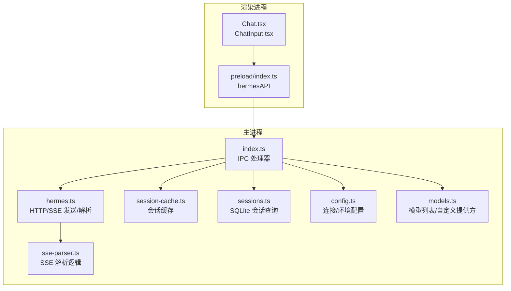
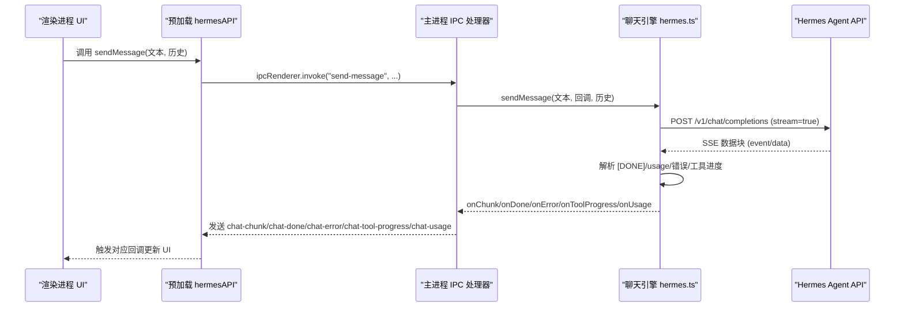
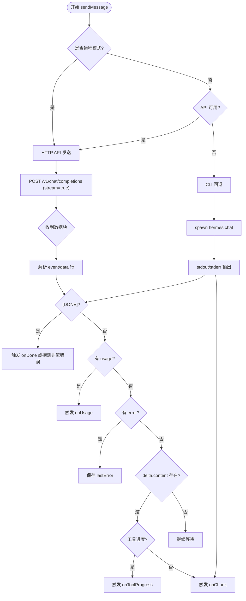
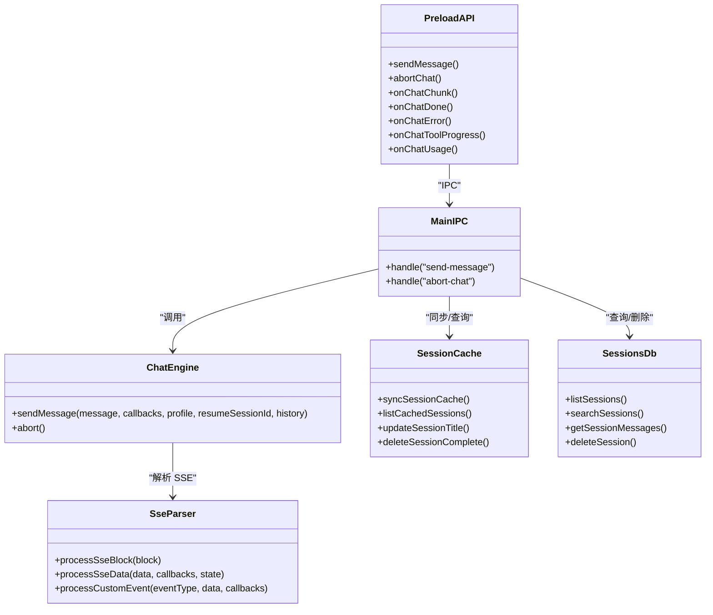
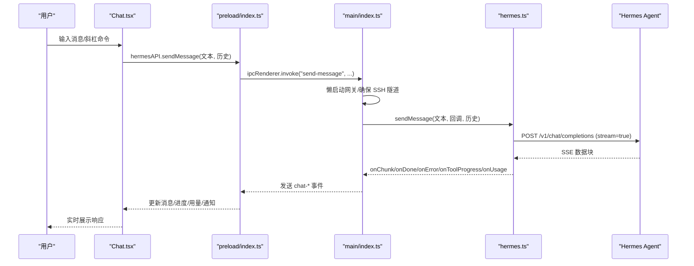

# 聊天引擎模块

<cite>
**本文档引用的文件**
- [hermes.ts](file://src/main/hermes.ts)
- [sse-parser.ts](file://src/main/sse-parser.ts)
- [session-cache.ts](file://src/main/session-cache.ts)
- [sessions.ts](file://src/main/sessions.ts)
- [Chat.tsx](file://src/renderer/src/screens/Chat/Chat.tsx)
- [ChatInput.tsx](file://src/renderer/src/screens/Chat/ChatInput.tsx)
- [index.ts](file://src/main/index.ts)
- [index.ts](file://src/preload/index.ts)
- [config.ts](file://src/main/config.ts)
- [models.ts](file://src/main/models.ts)
- [chat.ts](file://src/shared/i18n/locales/zh-CN/chat.ts)
</cite>

## 目录
1. [简介](#简介)
2. [项目结构](#项目结构)
3. [核心组件](#核心组件)
4. [架构总览](#架构总览)
5. [详细组件分析](#详细组件分析)
6. [依赖关系分析](#依赖关系分析)
7. [性能考虑](#性能考虑)
8. [故障排除指南](#故障排除指南)
9. [结论](#结论)
10. [附录](#附录)

## 简介
本文件为 Hermes Desktop 的聊天引擎模块技术文档，面向开发者与维护者，系统性阐述聊天系统的架构设计、与 Hermes Agent 的通信协议、SSE 流式传输处理、消息缓存机制、工具调用机制以及会话管理。文档同时覆盖聊天状态管理、错误处理与超时机制，并提供交互时序图与消息流转示例，帮助读者快速理解实时聊天功能的实现原理。最后给出性能优化策略与调试技巧，便于在复杂场景下进行排障与调优。

## 项目结构
聊天引擎模块横跨主进程与渲染进程：
- 主进程负责与 Hermes Agent 的通信、SSE 解析、会话持久化与缓存同步、网关启动与健康检查。
- 渲染进程负责用户界面、输入处理、本地命令解析、实时消息展示与工具进度反馈。
- 预加载层通过 IPC 暴露统一的 hermesAPI 接口，屏蔽底层细节。

图表来源
- [Chat.tsx:1-895](file://src/renderer/src/screens/Chat/Chat.tsx#L1-L895)
- [ChatInput.tsx:1-330](file://src/renderer/src/screens/Chat/ChatInput.tsx#L1-L330)
- [index.ts:1-1234](file://src/main/index.ts#L1-L1234)
- [hermes.ts:1-887](file://src/main/hermes.ts#L1-L887)
- [sse-parser.ts:1-131](file://src/main/sse-parser.ts#L1-L131)
- [session-cache.ts:1-252](file://src/main/session-cache.ts#L1-L252)
- [sessions.ts:1-212](file://src/main/sessions.ts#L1-L212)
- [config.ts:1-440](file://src/main/config.ts#L1-L440)
- [models.ts:1-169](file://src/main/models.ts#L1-L169)

章节来源
- [Chat.tsx:1-895](file://src/renderer/src/screens/Chat/Chat.tsx#L1-L895)
- [ChatInput.tsx:1-330](file://src/renderer/src/screens/Chat/ChatInput.tsx#L1-L330)
- [index.ts:1-1234](file://src/main/index.ts#L1-L1234)
- [hermes.ts:1-887](file://src/main/hermes.ts#L1-L887)

## 核心组件
- 主进程聊天引擎：封装 HTTP 请求与 SSE 流解析，支持远程/本地/SSH 三种模式，提供回调接口 onChunk/onDone/onError/onToolProgress/onUsage。
- SSE 解析器：独立可测试的 SSE 数据块解析逻辑，支持 [DONE] 结束信号、usage 统计、工具进度事件与错误转发。
- 会话缓存：基于本地 JSON 文件与 SQLite 的双层缓存，支持增量同步、标题生成与删除清理。
- 会话数据库：SQLite 查询接口，支持分页、全文检索与消息明细读取。
- 渲染进程聊天界面：负责输入、本地命令、工具进度展示、令牌用量统计与通知。
- 预加载层 hermesAPI：统一暴露 IPC 方法，屏蔽主进程细节。

章节来源
- [hermes.ts:153-434](file://src/main/hermes.ts#L153-L434)
- [sse-parser.ts:14-131](file://src/main/sse-parser.ts#L14-L131)
- [session-cache.ts:15-167](file://src/main/session-cache.ts#L15-L167)
- [sessions.ts:8-186](file://src/main/sessions.ts#L8-L186)
- [Chat.tsx:106-895](file://src/renderer/src/screens/Chat/Chat.tsx#L106-L895)
- [index.ts:15-701](file://src/preload/index.ts#L15-L701)

## 架构总览
聊天引擎采用“主进程 HTTP/SSE + 渲染进程 UI”的分层架构。主进程负责与 Hermes Agent 通信，渲染进程负责用户交互与展示。IPC 层通过 hermesAPI 将主进程能力暴露给前端。

图表来源
- [index.ts:544-640](file://src/main/index.ts#L544-L640)
- [hermes.ts:168-434](file://src/main/hermes.ts#L168-L434)
- [index.ts:158-230](file://src/preload/index.ts#L158-L230)

## 详细组件分析

### 主进程聊天引擎（hermes.ts）
- 运行模式检测：支持 local/remote/ssh 三种模式，自动选择 HTTP API 或 CLI 回退路径。
- API 服务器健康检查：定期轮询 /health，缓存结果以减少不必要的请求。
- HTTP 发送：构建标准 OpenAI 风格 messages 数组，发送 POST /v1/chat/completions，开启流式响应。
- SSE 解析：逐块解析 event/data 行，识别 [DONE]、usage、错误与工具进度事件 hermes.tool.progress。
- 工具进度：支持两种来源：SSE 自定义事件与 legacy 内容中的表情行格式。
- 错误处理：捕获 HTTP 错误码、流中错误对象、空流探测与超时处理。
- 会话管理：从响应头提取 x-hermes-session-id，用于后续会话操作与缓存同步。

图表来源
- [hermes.ts:168-434](file://src/main/hermes.ts#L168-L434)
- [sse-parser.ts:58-110](file://src/main/sse-parser.ts#L58-L110)

章节来源
- [hermes.ts:153-434](file://src/main/hermes.ts#L153-L434)
- [index.ts:544-640](file://src/main/index.ts#L544-L640)

### SSE 解析器（sse-parser.ts）
- 抽象出可测试的 SSE 解析逻辑，支持：
  - 自定义事件 hermes.tool.progress 的解析与转发。
  - usage 字段的提取与回调。
  - [DONE] 结束信号与错误回传。
  - 非法块的容错处理。

章节来源
- [sse-parser.ts:14-131](file://src/main/sse-parser.ts#L14-L131)

### 会话缓存与数据库（session-cache.ts 与 sessions.ts）
- 会话缓存：
  - 本地 JSON 文件 sessions.json，包含最近会话列表与上次同步时间戳。
  - 增量同步：仅拉取上次同步之后新增或变更的会话，避免全量扫描。
  - 标题生成：从第一条用户消息生成简洁标题，支持国际化。
  - 删除清理：支持从文件系统与数据库中删除会话。
- 会话数据库：
  - SQLite 查询接口，支持分页、全文检索（FTS5）与消息明细读取。
  - 事务删除：保证消息与会话的一致性。

章节来源
- [session-cache.ts:82-167](file://src/main/session-cache.ts#L82-L167)
- [session-cache.ts:169-251](file://src/main/session-cache.ts#L169-L251)
- [sessions.ts:46-186](file://src/main/sessions.ts#L46-L186)

### 渲染进程聊天界面（Chat.tsx 与 ChatInput.tsx）
- 输入处理：支持多行输入、历史记录、斜杠命令菜单、快速旁支问题（/btw）。
- 本地命令：对部分命令（如 /new、/clear、/model、/memory、/tools、/skills、/persona、/version、/fast、/usage、/help）在前端直接处理，不发送后端。
- 实时展示：监听 chat-chunk、chat-done、chat-error、chat-tool-progress、chat-usage 事件，动态更新消息、工具进度与用量统计。
- 会话控制：支持中止请求、清空聊天、批准/拒绝待执行操作。
- 通知：窗口失焦时对长时间响应发送桌面通知。

章节来源
- [Chat.tsx:106-895](file://src/renderer/src/screens/Chat/Chat.tsx#L106-L895)
- [ChatInput.tsx:28-330](file://src/renderer/src/screens/Chat/ChatInput.tsx#L28-L330)
- [slashCommands.ts:1-102](file://src/renderer/src/screens/Chat/slashCommands.ts#L1-L102)

### 预加载与 IPC（preload/index.ts 与 main/index.ts）
- 预加载层通过 contextBridge 暴露 hermesAPI，包含：
  - sendMessage/abortChat
  - onChatChunk/onChatDone/onChatError/onChatToolProgress/onChatUsage
  - 会话缓存与数据库相关方法
  - 配置、模型、内存、工具、技能等 API
- 主进程 IPC 处理器：
  - 注册 "send-message"，在首次消息时懒启动网关，确保 SSH 隧道健康，然后调用聊天引擎。
  - 将 onChunk/onDone/onError/onToolProgress/onUsage 转发到渲染进程。

章节来源
- [index.ts:15-701](file://src/preload/index.ts#L15-L701)
- [index.ts:544-640](file://src/main/index.ts#L544-L640)

### 配置与模型（config.ts 与 models.ts）
- 连接配置：支持 local/remote/ssh 三种模式，SSH 支持隧道参数与远程密钥缓存。
- 环境变量：读取与写入 .env 文件，带 TTL 缓存与校验。
- 模型管理：内置默认模型，支持自定义提供方（含 API 模式与密钥注入），并生成 models.json。

章节来源
- [config.ts:47-200](file://src/main/config.ts#L47-L200)
- [models.ts:20-169](file://src/main/models.ts#L20-L169)

## 依赖关系分析

图表来源
- [hermes.ts:168-434](file://src/main/hermes.ts#L168-L434)
- [sse-parser.ts:58-131](file://src/main/sse-parser.ts#L58-L131)
- [session-cache.ts:82-167](file://src/main/session-cache.ts#L82-L167)
- [sessions.ts:46-186](file://src/main/sessions.ts#L46-L186)
- [index.ts:544-640](file://src/main/index.ts#L544-L640)
- [index.ts:158-230](file://src/preload/index.ts#L158-L230)

章节来源
- [hermes.ts:1-887](file://src/main/hermes.ts#L1-L887)
- [index.ts:1-1234](file://src/main/index.ts#L1-L1234)
- [index.ts:1-701](file://src/preload/index.ts#L1-L701)

## 性能考虑
- SSE 流式解析：主进程按块解析，避免一次性缓冲大块数据；SSE 解析器独立模块，便于单元测试与性能验证。
- 健康检查缓存：主进程对 API 服务器健康状态进行缓存，减少频繁探测带来的开销。
- 会话缓存增量同步：仅同步新增/变更会话，避免全量扫描；标题生成在缓存层完成，减少数据库访问。
- SQLite 查询优化：分页与全文检索（FTS5）提升查询效率；事务删除保证一致性。
- UI 更新节流：渲染进程按块追加消息，避免频繁重渲染；滚动锁定与自动滚动策略减少 UI 抖动。
- 超时与中止：HTTP 请求设置超时，支持 AbortController 中止，防止长时间阻塞。
- 本地命令：前端处理常见命令，减少后端往返。

[本节为通用性能建议，无需特定文件引用]

## 故障排除指南
- API 服务器不可用：
  - 确认本地网关已启动且端口 8642 可用；检查健康检查缓存是否过期。
  - 远程模式下确认 remoteUrl 正确与网络连通性。
- SSH 隧道异常：
  - 确认 SSH 隧道已启动且健康；检查密钥与端口映射；必要时重启隧道与远程网关。
- SSE 流为空：
  - 引擎会在空流时发起非流探测请求以获取真实错误；检查后端日志与模型配置。
- 工具进度不显示：
  - 确认后端是否发送 hermes.tool.progress 事件或 legacy 内容格式；前端 onToolProgress 回调需正确注册。
- 会话标题异常：
  - 检查缓存文件与数据库一致性；必要时触发 syncSessionCache。
- 令牌用量统计缺失：
  - 确认后端返回 usage 字段；前端 onUsage 回调需正确累加。
- 通知未触发：
  - 确认窗口失焦且响应时间超过阈值；检查系统通知权限。

章节来源
- [hermes.ts:102-121](file://src/main/hermes.ts#L102-L121)
- [hermes.ts:218-266](file://src/main/hermes.ts#L218-L266)
- [Chat.tsx:244-308](file://src/renderer/src/screens/Chat/Chat.tsx#L244-L308)

## 结论
Hermes Desktop 的聊天引擎模块通过清晰的分层设计与稳健的错误处理机制，实现了跨本地、远程与 SSH 场景的统一聊天体验。SSE 流式传输与工具进度事件使交互更即时，会话缓存与数据库查询保障了历史记录的高效管理。配合渲染进程的本地命令与 UI 优化，整体具备良好的可用性与可维护性。建议在生产环境中结合本文档的性能与故障排除建议进行持续优化与监控。

[本节为总结性内容，无需特定文件引用]

## 附录

### 聊天交互时序图（完整）

图表来源
- [Chat.tsx:341-390](file://src/renderer/src/screens/Chat/Chat.tsx#L341-L390)
- [index.ts:544-640](file://src/main/index.ts#L544-L640)
- [hermes.ts:168-434](file://src/main/hermes.ts#L168-L434)
- [index.ts:158-230](file://src/preload/index.ts#L158-L230)

### 消息流转示例（简化）
- 用户输入“你好” → 渲染进程组装历史与当前消息 → IPC 调用主进程 → 主进程 HTTP 发送 → SSE 分块到达 → 渲染进程 onChunk 追加显示 → 最终 onDone 同步会话缓存 → UI 显示完成。

章节来源
- [Chat.tsx:244-308](file://src/renderer/src/screens/Chat/Chat.tsx#L244-L308)
- [index.ts:586-639](file://src/main/index.ts#L586-L639)