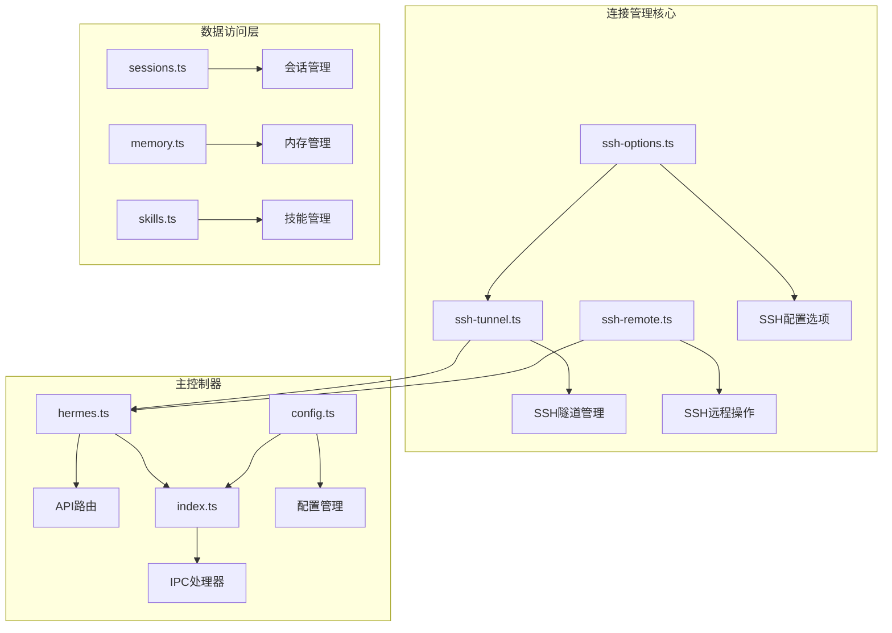
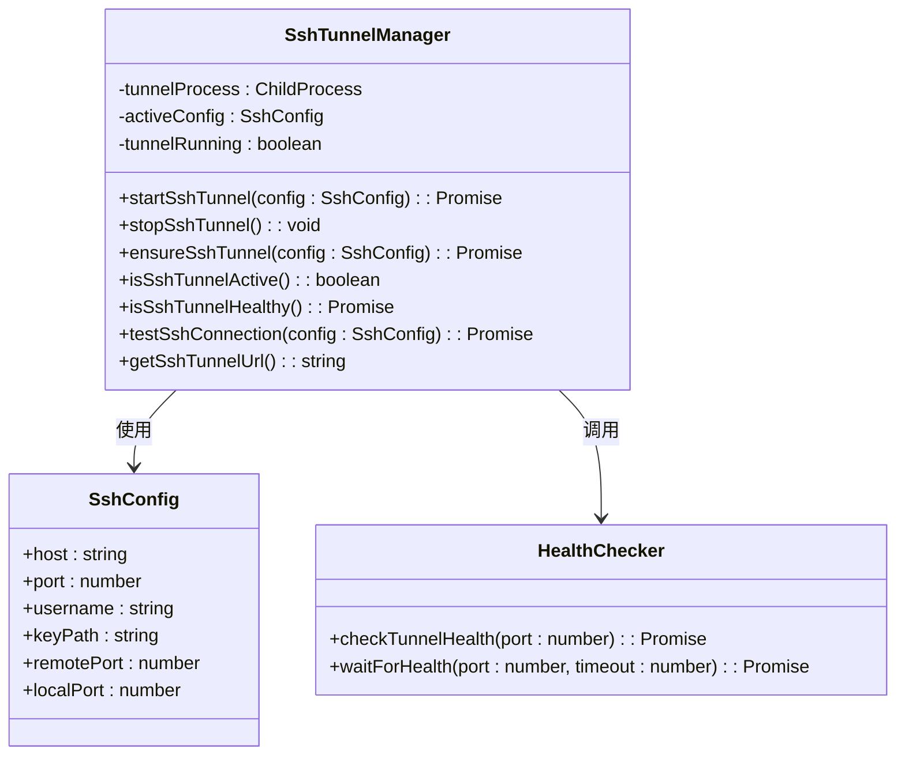
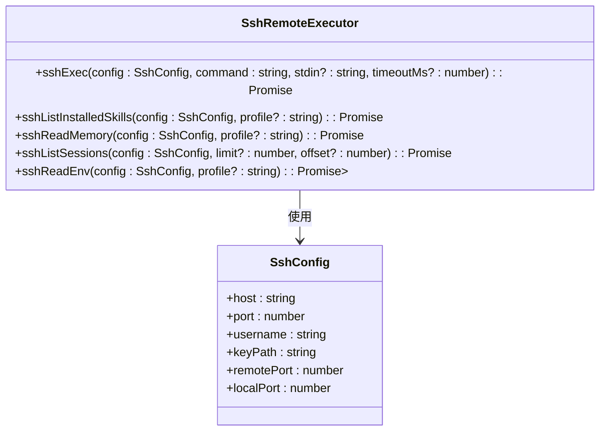
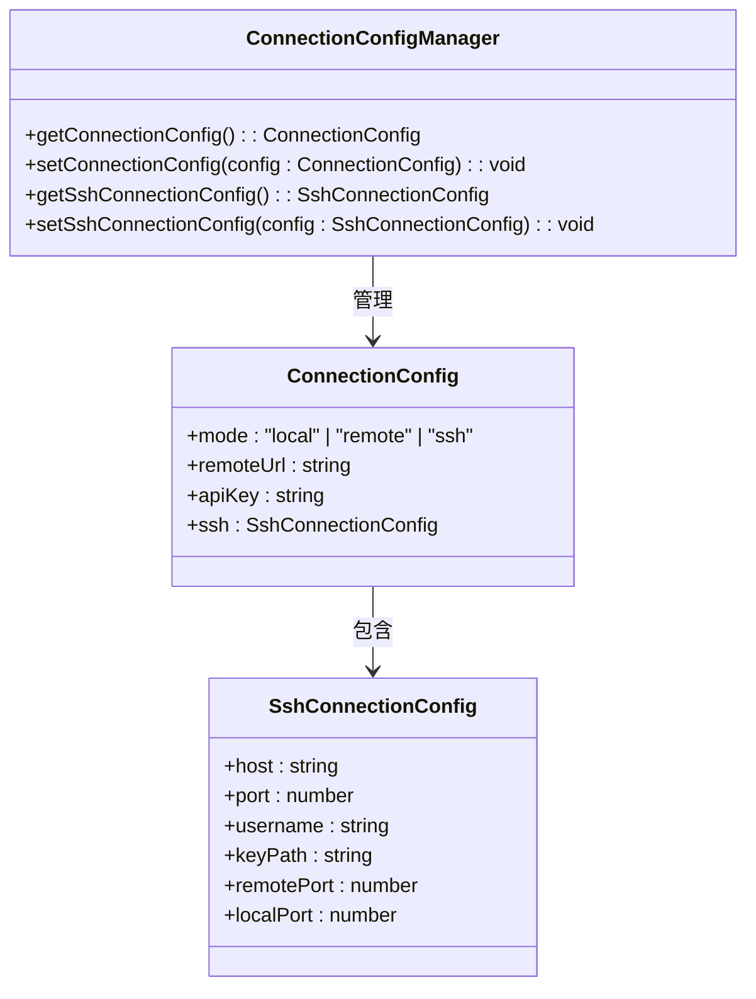
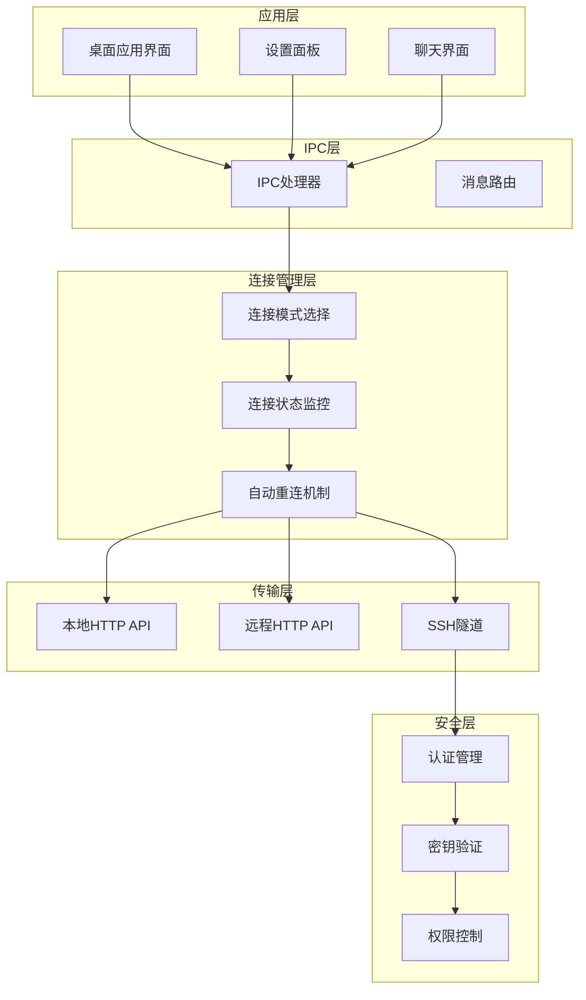
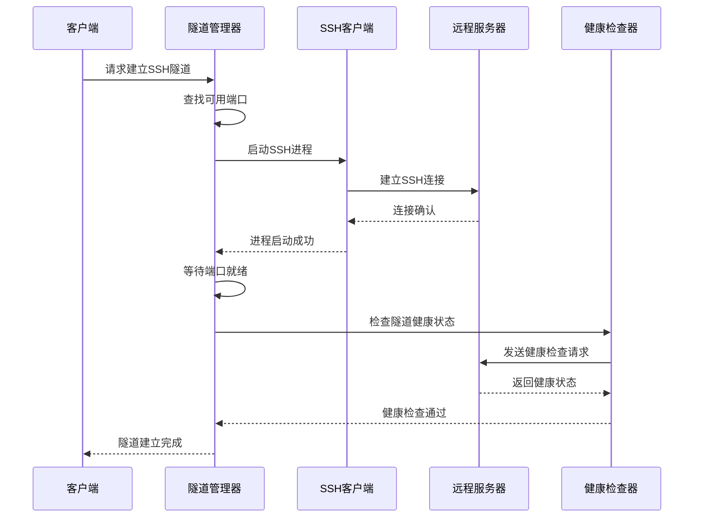
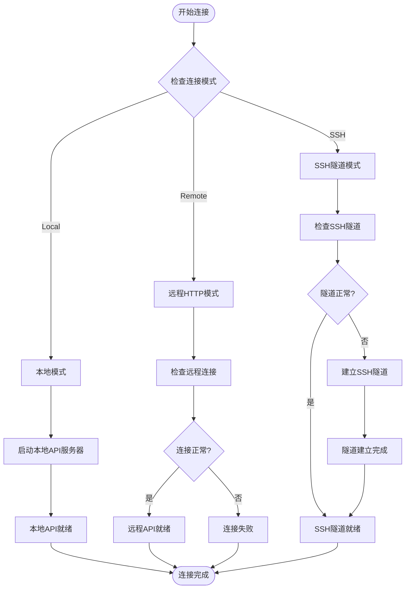
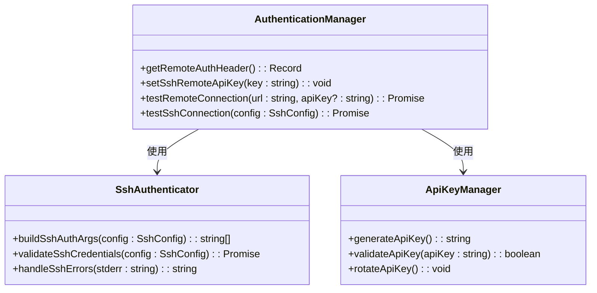
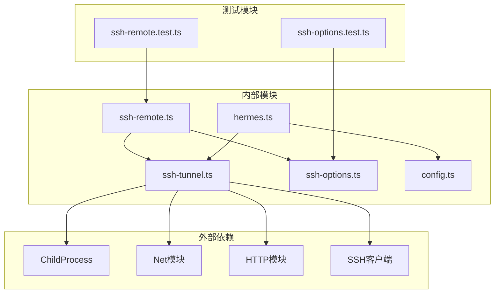

# 连接管理模块

<cite>
**本文档引用的文件**
- [ssh-tunnel.ts](file://src/main/ssh-tunnel.ts)
- [ssh-remote.ts](file://src/main/ssh-remote.ts)
- [ssh-options.ts](file://src/main/ssh-options.ts)
- [hermes.ts](file://src/main/hermes.ts)
- [config.ts](file://src/main/config.ts)
- [index.ts](file://src/main/index.ts)
- [sessions.ts](file://src/main/sessions.ts)
- [memory.ts](file://src/main/memory.ts)
- [skills.ts](file://src/main/skills.ts)
- [ssh-options.test.ts](file://tests/ssh-options.test.ts)
- [ssh-remote.test.ts](file://tests/ssh-remote.test.ts)
</cite>

## 目录
1. [简介](#简介)
2. [项目结构](#项目结构)
3. [核心组件](#核心组件)
4. [架构概览](#架构概览)
5. [详细组件分析](#详细组件分析)
6. [依赖关系分析](#依赖关系分析)
7. [性能考虑](#性能考虑)
8. [故障排除指南](#故障排除指南)
9. [结论](#结论)

## 简介

Hermes Desktop的连接管理模块是一个关键的基础设施组件，负责在本地、远程和SSH三种连接模式之间进行智能切换和管理。该模块提供了统一的接口来处理不同类型的连接，确保应用程序能够在各种部署环境中无缝运行。

该模块的核心功能包括：
- 多模式连接支持（本地、远程HTTP、SSH隧道）
- 动态SSH隧道建立和维护
- 连接状态监控和健康检查
- 自动化连接故障恢复
- 安全的认证机制管理

## 项目结构

连接管理模块主要分布在以下文件中：

**图表来源**
- [ssh-tunnel.ts:1-220](file://src/main/ssh-tunnel.ts#L1-L220)
- [ssh-remote.ts:1-800](file://src/main/ssh-remote.ts#L1-L800)
- [hermes.ts:1-887](file://src/main/hermes.ts#L1-L887)

**章节来源**
- [ssh-tunnel.ts:1-220](file://src/main/ssh-tunnel.ts#L1-L220)
- [ssh-remote.ts:1-800](file://src/main/ssh-remote.ts#L1-L800)
- [hermes.ts:1-887](file://src/main/hermes.ts#L1-L887)

## 核心组件

### SSH隧道管理器

SSH隧道管理器是连接管理模块的核心组件，负责建立和维护SSH隧道连接。

**图表来源**
- [ssh-tunnel.ts:8-166](file://src/main/ssh-tunnel.ts#L8-L166)

### SSH远程操作器

SSH远程操作器提供了通过SSH执行远程命令和文件操作的能力。

**图表来源**
- [ssh-remote.ts:24-65](file://src/main/ssh-remote.ts#L24-L65)
- [ssh-remote.ts:128-181](file://src/main/ssh-remote.ts#L128-L181)

### 连接配置管理器

连接配置管理器负责管理不同连接模式的配置信息。

**图表来源**
- [config.ts:17-74](file://src/main/config.ts#L17-L74)

**章节来源**
- [ssh-tunnel.ts:1-220](file://src/main/ssh-tunnel.ts#L1-L220)
- [ssh-remote.ts:1-800](file://src/main/ssh-remote.ts#L1-L800)
- [config.ts:1-440](file://src/main/config.ts#L1-L440)

## 架构概览

连接管理模块采用分层架构设计，实现了清晰的职责分离和模块化组织。

**图表来源**
- [index.ts:290-800](file://src/main/index.ts#L290-L800)
- [hermes.ts:22-62](file://src/main/hermes.ts#L22-L62)

## 详细组件分析

### SSH隧道建立流程

SSH隧道建立是一个复杂的过程，涉及多个步骤和错误处理机制。

**图表来源**
- [ssh-tunnel.ts:120-153](file://src/main/ssh-tunnel.ts#L120-L153)
- [ssh-tunnel.ts:30-48](file://src/main/ssh-tunnel.ts#L30-L48)

### 连接模式切换机制

系统支持三种连接模式，每种模式都有特定的使用场景和配置要求。

**图表来源**
- [hermes.ts:22-33](file://src/main/hermes.ts#L22-L33)
- [hermes.ts:64-69](file://src/main/hermes.ts#L64-L69)

### 认证机制实现

认证机制根据不同的连接模式采用相应的安全策略。

**图表来源**
- [hermes.ts:52-62](file://src/main/hermes.ts#L52-L62)
- [ssh-remote.ts:74-89](file://src/main/ssh-remote.ts#L74-L89)

**章节来源**
- [ssh-tunnel.ts:120-166](file://src/main/ssh-tunnel.ts#L120-L166)
- [hermes.ts:22-62](file://src/main/hermes.ts#L22-L62)
- [ssh-remote.ts:74-89](file://src/main/ssh-remote.ts#L74-L89)

## 依赖关系分析

连接管理模块的依赖关系体现了良好的模块化设计原则。

**图表来源**
- [ssh-tunnel.ts:1-6](file://src/main/ssh-tunnel.ts#L1-L6)
- [ssh-remote.ts:7-11](file://src/main/ssh-remote.ts#L7-L11)
- [ssh-options.ts:1-21](file://src/main/ssh-options.ts#L1-L21)

**章节来源**
- [ssh-tunnel.ts:1-220](file://src/main/ssh-tunnel.ts#L1-L220)
- [ssh-remote.ts:1-800](file://src/main/ssh-remote.ts#L1-L800)
- [ssh-options.ts:1-21](file://src/main/ssh-options.ts#L1-L21)

## 性能考虑

连接管理模块在设计时充分考虑了性能优化和资源管理。

### 连接池管理策略

系统实现了智能的连接池管理，避免频繁的连接建立和销毁。

### 缓存机制

- **配置缓存**：连接配置信息具有5秒TTL的内存缓存
- **环境变量缓存**：减少频繁的文件读取操作
- **API服务器状态缓存**：避免重复的健康检查

### 资源优化

- **SSH复用**：非Windows平台启用SSH连接复用
- **延迟初始化**：按需启动网关服务
- **超时控制**：合理的超时设置防止资源泄露

## 故障排除指南

### 常见问题诊断

#### SSH连接问题

1. **认证失败**
   - 检查SSH密钥路径和权限
   - 验证主机密钥是否已添加到known_hosts
   - 确认用户名和端口号正确

2. **隧道无法建立**
   - 检查本地端口是否被占用
   - 验证防火墙设置
   - 确认SSH服务可达性

#### 远程连接问题

1. **API不可达**
   - 检查网络连接
   - 验证API密钥有效性
   - 确认服务器状态

2. **认证错误**
   - 重新生成API密钥
   - 检查密钥格式
   - 验证权限范围

### 调试工具

系统提供了多种调试工具来帮助诊断连接问题：

- **连接测试**：验证不同连接模式的可用性
- **健康检查**：监控连接状态和响应时间
- **日志记录**：详细的连接过程日志

**章节来源**
- [ssh-options.test.ts:1-27](file://tests/ssh-options.test.ts#L1-L27)
- [ssh-remote.test.ts:1-26](file://tests/ssh-remote.test.ts#L1-L26)

## 结论

Hermes Desktop的连接管理模块展现了优秀的软件工程实践，通过模块化设计、清晰的职责分离和完善的错误处理机制，实现了灵活且安全的多模式连接管理。

### 主要优势

1. **灵活性**：支持本地、远程HTTP和SSH三种连接模式
2. **安全性**：实现了多层次的安全保护机制
3. **可靠性**：具备自动故障检测和恢复能力
4. **可扩展性**：模块化设计便于功能扩展和维护

### 技术亮点

- 智能的连接模式切换机制
- 高效的SSH隧道管理和复用
- 完善的认证和授权体系
- 实时的连接状态监控

该模块为Hermes Desktop提供了稳定可靠的连接基础，支持用户在不同部署环境中的无缝体验。