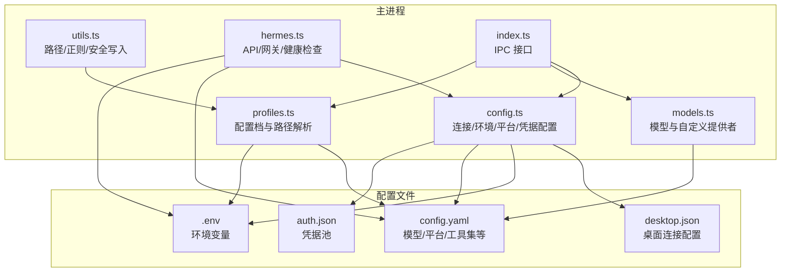
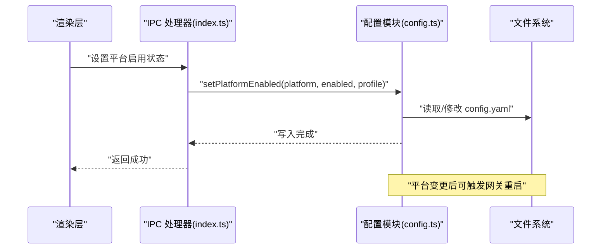
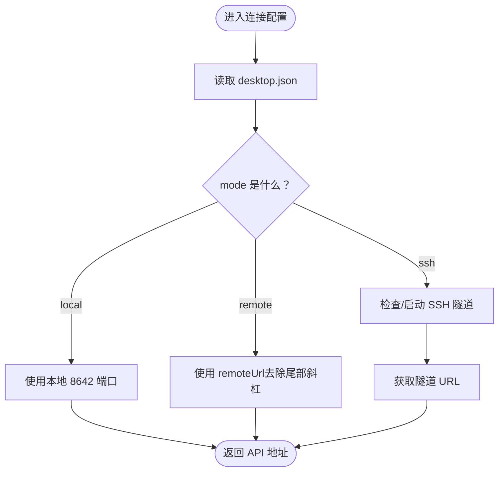
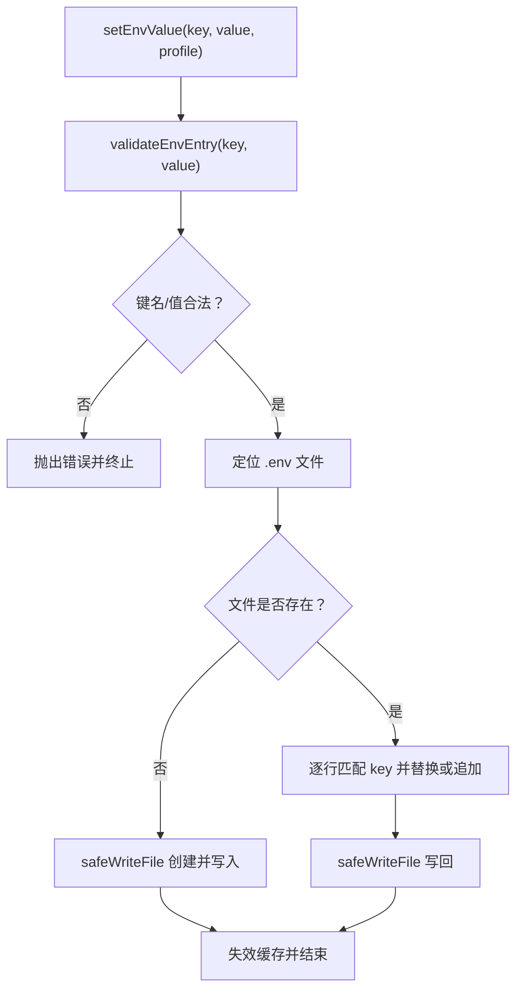
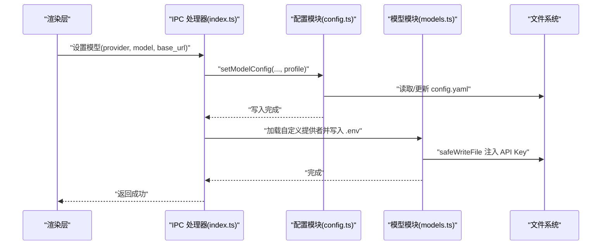
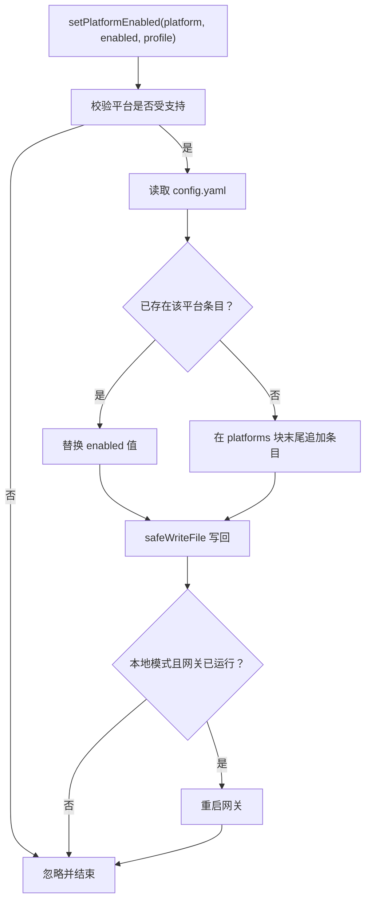
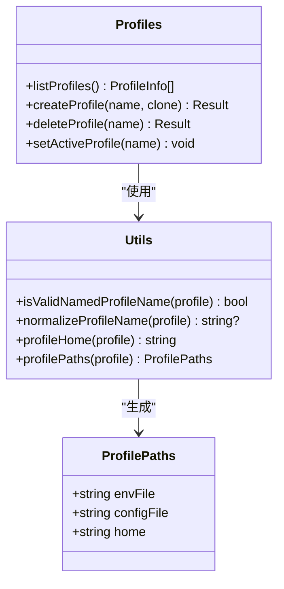
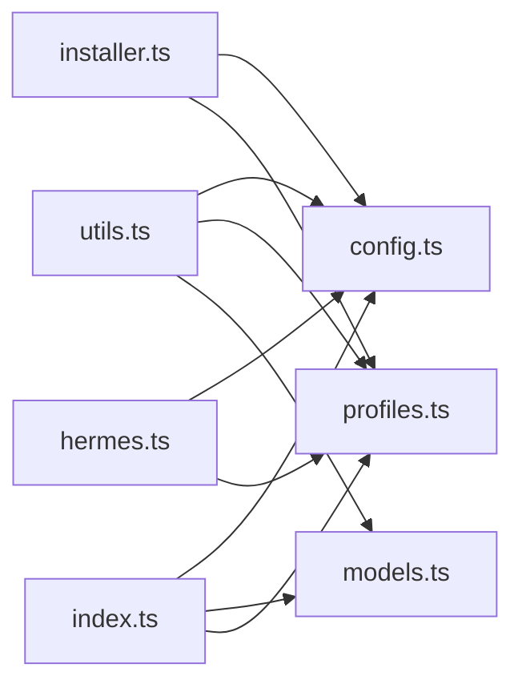

# 配置管理系统

<cite>
**本文引用的文件**
- [src/main/config.ts](file://src/main/config.ts)
- [src/main/hermes.ts](file://src/main/hermes.ts)
- [src/main/models.ts](file://src/main/models.ts)
- [src/main/profiles.ts](file://src/main/profiles.ts)
- [src/main/utils.ts](file://src/main/utils.ts)
- [src/main/default-models.ts](file://src/main/default-models.ts)
- [src/shared/i18n/config.ts](file://src/shared/i18n/config.ts)
- [src/shared/i18n/types.ts](file://src/shared/i18n/types.ts)
- [src/main/index.ts](file://src/main/index.ts)
- [tests/env-validation.test.ts](file://tests/env-validation.test.ts)
- [tests/profile-validation.test.ts](file://tests/profile-validation.test.ts)
</cite>

## 目录
1. [简介](#简介)
2. [项目结构](#项目结构)
3. [核心组件](#核心组件)
4. [架构总览](#架构总览)
5. [详细组件分析](#详细组件分析)
6. [依赖关系分析](#依赖关系分析)
7. [性能考量](#性能考量)
8. [故障排查指南](#故障排查指南)
9. [结论](#结论)
10. [附录：配置文件格式与示例](#附录配置文件格式与示例)

## 简介
本文件系统性阐述 Hermes Desktop 的配置管理系统，覆盖以下方面：
- 配置文件结构与存储位置（桌面级 desktop.json、用户级 config.yaml 与 .env、认证凭据 auth.json）
- 环境变量管理与校验机制
- 多配置文件与多配置档（Profiles）支持
- 连接配置（本地/远程/SSH）、模型配置、平台配置与本地化配置
- 配置验证、配置同步与热更新机制
- 安全最佳实践与性能优化建议

## 项目结构
配置系统围绕主进程模块组织，关键文件如下：
- 主配置读写与缓存：src/main/config.ts
- 模型与自定义提供者：src/main/models.ts、src/main/default-models.ts
- 配置档与路径解析：src/main/profiles.ts、src/main/utils.ts
- 应用内核集成：src/main/hermes.ts
- 渲染层 IPC 接口：src/main/index.ts
- 本地化默认值：src/shared/i18n/config.ts、src/shared/i18n/types.ts
- 测试用例：tests/env-validation.test.ts、tests/profile-validation.test.ts

图表来源
- [src/main/config.ts:1-440](file://src/main/config.ts#L1-L440)
- [src/main/hermes.ts:1-887](file://src/main/hermes.ts#L1-L887)
- [src/main/models.ts:1-169](file://src/main/models.ts#L1-L169)
- [src/main/profiles.ts:1-284](file://src/main/profiles.ts#L1-L284)
- [src/main/utils.ts:1-85](file://src/main/utils.ts#L1-L85)
- [src/main/index.ts:660-859](file://src/main/index.ts#L660-L859)

章节来源
- [src/main/config.ts:1-440](file://src/main/config.ts#L1-L440)
- [src/main/hermes.ts:1-887](file://src/main/hermes.ts#L1-L887)
- [src/main/models.ts:1-169](file://src/main/models.ts#L1-L169)
- [src/main/profiles.ts:1-284](file://src/main/profiles.ts#L1-L284)
- [src/main/utils.ts:1-85](file://src/main/utils.ts#L1-L85)
- [src/main/index.ts:660-859](file://src/main/index.ts#L660-L859)

## 核心组件
- 连接配置（本地/远程/SSH）：desktop.json 中保存连接模式、远端地址、API Key 与 SSH 参数；运行时通过 getConnectionConfig/setConnectionConfig 读取/写入。
- 环境变量管理：.env 文件按行解析，支持键值对、单引号/双引号包裹、注释与空行；setEnvValue 提供安全写入与校验。
- 模型配置：config.yaml 的 provider/default/base_url 字段；getModelConfig/setModelConfig 支持读取与更新，并自动处理智能路由开关与流式输出。
- 平台配置：config.yaml platforms 块下的 enabled 开关；getPlatformEnabled/setPlatformEnabled 支持动态启用/禁用平台并触发网关重启。
- 凭据池：auth.json 的 credential_pool 结构，用于集中管理各提供者的凭据条目。
- 多配置档：通过 profilePaths 解析每个配置档的 home、.env、config.yaml 路径；listProfiles/createProfile/deleteProfile/setActiveProfile 管理配置档生命周期。
- 本地化默认值：i18n 配置导出默认语言、回退语言与可用语言列表。

章节来源
- [src/main/config.ts:47-74](file://src/main/config.ts#L47-L74)
- [src/main/config.ts:101-167](file://src/main/config.ts#L101-L167)
- [src/main/config.ts:215-301](file://src/main/config.ts#L215-L301)
- [src/main/config.ts:317-394](file://src/main/config.ts#L317-L394)
- [src/main/config.ts:421-439](file://src/main/config.ts#L421-L439)
- [src/main/utils.ts:55-66](file://src/main/utils.ts#L55-L66)
- [src/main/profiles.ts:111-193](file://src/main/profiles.ts#L111-L193)
- [src/shared/i18n/config.ts:1-7](file://src/shared/i18n/config.ts#L1-L7)

## 架构总览
配置系统在主进程中以“文件读写 + 内存缓存 + IPC 接口”的方式工作：
- 文件层：desktop.json、config.yaml、.env、auth.json
- 缓存层：基于 Map 的 TTL 缓存（默认 5 秒），降低频繁读取开销
- 业务层：连接/模型/平台/凭据等读写函数
- 集成层：hermes.ts 与 index.ts 将配置注入到聊天、网关、工具集等流程中

图表来源
- [src/main/index.ts:667-689](file://src/main/index.ts#L667-L689)
- [src/main/config.ts:337-394](file://src/main/config.ts#L337-L394)

章节来源
- [src/main/index.ts:660-859](file://src/main/index.ts#L660-L859)
- [src/main/config.ts:1-440](file://src/main/config.ts#L1-L440)

## 详细组件分析

### 连接配置（本地/远程/SSH）
- 数据结构：ConnectionConfig 包含 mode、remoteUrl、apiKey、ssh 子对象
- 读取：getConnectionConfig 从 desktop.json 解析，缺失字段使用默认值
- 写入：setConnectionConfig 合并并写回 desktop.json
- SSH 特性：当 mode 为 ssh 时，确保隧道可用且健康，再进行 API 访问

图表来源
- [src/main/config.ts:47-74](file://src/main/config.ts#L47-L74)
- [src/main/hermes.ts:22-62](file://src/main/hermes.ts#L22-L62)

章节来源
- [src/main/config.ts:47-74](file://src/main/config.ts#L47-L74)
- [src/main/hermes.ts:22-62](file://src/main/hermes.ts#L22-L62)

### 环境变量管理与校验
- 读取：readEnv 从 .env 解析键值对，支持注释与引号包裹
- 写入：setEnvValue 在存在 .env 时更新对应行，不存在时新建；支持追加新键
- 校验：validateEnvEntry 对键名与值进行严格校验（仅字母数字下划线、无换行/空字符）

图表来源
- [src/main/config.ts:134-179](file://src/main/config.ts#L134-L179)
- [src/main/config.ts:101-132](file://src/main/config.ts#L101-L132)
- [src/main/utils.ts:80-84](file://src/main/utils.ts#L80-L84)

章节来源
- [src/main/config.ts:101-179](file://src/main/config.ts#L101-L179)
- [src/main/utils.ts:80-84](file://src/main/utils.ts#L80-L84)
- [tests/env-validation.test.ts:30-75](file://tests/env-validation.test.ts#L30-L75)

### 模型配置（provider/default/base_url）
- 读取：getModelConfig 从 config.yaml 提取 provider、default、base_url，默认值为 auto、空字符串
- 写入：setModelConfig 更新 provider/default/base_url，必要时插入 base_url 行；禁用智能路由开关，启用流式输出
- 自定义提供者：models.ts 从 config.yaml 的 custom_providers 段落解析自定义模型，并将 API Key 注入 .env

图表来源
- [src/main/config.ts:248-301](file://src/main/config.ts#L248-L301)
- [src/main/models.ts:42-114](file://src/main/models.ts#L42-L114)
- [src/main/index.ts:704-724](file://src/main/index.ts#L704-L724)

章节来源
- [src/main/config.ts:215-301](file://src/main/config.ts#L215-L301)
- [src/main/models.ts:1-169](file://src/main/models.ts#L1-L169)
- [src/main/default-models.ts:1-48](file://src/main/default-models.ts#L1-L48)

### 平台配置（config.yaml platforms）
- 读取：getPlatformEnabled 遍历支持的平台，提取 enabled 值
- 写入：setPlatformEnabled 更新或新增平台 enabled 条目，并在本地模式下尝试重启网关以应用变更
- 支持平台：telegram、discord、slack、whatsapp、signal

图表来源
- [src/main/config.ts:337-394](file://src/main/config.ts#L337-L394)
- [src/main/index.ts:667-689](file://src/main/index.ts#L667-L689)

章节来源
- [src/main/config.ts:317-394](file://src/main/config.ts#L317-L394)
- [src/main/index.ts:667-689](file://src/main/index.ts#L667-L689)

### 凭据池（auth.json）
- 读取：getCredentialPool 返回指定提供者的凭据条目数组
- 写入：setCredentialPool 更新 credential_pool 下的对应提供者条目
- 用途：集中管理 OAuth 或其他需要凭据的提供者

章节来源
- [src/main/config.ts:421-439](file://src/main/config.ts#L421-L439)

### 多配置档（Profiles）与路径解析
- 路径解析：profilePaths 返回每个配置档的 home、.env、config.yaml 绝对路径
- 列表：listProfiles 支持默认配置档与命名配置档，统计技能数量、检测网关运行状态
- 创建/删除/切换：createProfile/deleteProfile/setActiveProfile 通过 hermes CLI 执行
- 名称校验：isValidNamedProfileName/normalizeProfileName 限制命名规则，防止路径穿越

图表来源
- [src/main/utils.ts:55-66](file://src/main/utils.ts#L55-L66)
- [src/main/profiles.ts:111-193](file://src/main/profiles.ts#L111-L193)

章节来源
- [src/main/utils.ts:1-85](file://src/main/utils.ts#L1-L85)
- [src/main/profiles.ts:1-284](file://src/main/profiles.ts#L1-L284)
- [tests/profile-validation.test.ts:29-66](file://tests/profile-validation.test.ts#L29-L66)

### 本地化配置
- 默认语言与可用语言：SOURCE_LOCALE/FALLBACK_LOCALE/DEFAULT_ACTIVE_LOCALE/APP_LOCALES
- 类型定义：AppLocale 与 TranslationTree

章节来源
- [src/shared/i18n/config.ts:1-7](file://src/shared/i18n/config.ts#L1-L7)
- [src/shared/i18n/types.ts:1-6](file://src/shared/i18n/types.ts#L1-L6)

## 依赖关系分析
- config.ts 依赖 utils.ts（路径/正则/安全写入）与 installer.ts（HERMES_HOME）
- hermes.ts 依赖 config.ts（连接/模型/环境）与 ssh-tunnel.ts（SSH 隧道）
- models.ts 依赖 default-models.ts 与 utils.ts（安全写入）
- profiles.ts 依赖 utils.ts 与 installer.ts（HERMES_HOME）
- index.ts 作为 IPC 入口，调用 config.ts、models.ts、profiles.ts 等

图表来源
- [src/main/config.ts:1-4](file://src/main/config.ts#L1-L4)
- [src/main/hermes.ts:14-18](file://src/main/hermes.ts#L14-L18)
- [src/main/profiles.ts:6-16](file://src/main/profiles.ts#L6-L16)
- [src/main/models.ts:5-6](file://src/main/models.ts#L5-L6)
- [src/main/index.ts:660-859](file://src/main/index.ts#L660-L859)

章节来源
- [src/main/config.ts:1-440](file://src/main/config.ts#L1-L440)
- [src/main/hermes.ts:1-887](file://src/main/hermes.ts#L1-L887)
- [src/main/models.ts:1-169](file://src/main/models.ts#L1-L169)
- [src/main/profiles.ts:1-284](file://src/main/profiles.ts#L1-L284)
- [src/main/index.ts:660-859](file://src/main/index.ts#L660-L859)

## 性能考量
- 内存缓存：config.ts 使用 Map + TTL（默认 5 秒）缓存 .env 与模型配置，减少重复磁盘 IO
- 延迟初始化：网关健康检查采用轮询并在首次可用后停止，避免常驻开销
- 安全写入：safeWriteFile 自动创建父目录，避免 ENOENT 异常导致的崩溃
- 正则转义：escapeRegex 保证动态构造的正则表达式安全

章节来源
- [src/main/config.ts:76-99](file://src/main/config.ts#L76-L99)
- [src/main/hermes.ts:682-704](file://src/main/hermes.ts#L682-L704)
- [src/main/utils.ts:80-84](file://src/main/utils.ts#L80-L84)
- [src/main/utils.ts:72](file://src/main/utils.ts#L72)

## 故障排查指南
- 环境变量写入失败
  - 现象：setEnvValue 抛错或 .env 未创建
  - 排查：确认键名符合 /^[A-Za-z_][A-Za-z0-9_]*$/，值不含换行/回车/NUL；检查 HERMES_HOME 是否存在
  - 参考测试：tests/env-validation.test.ts
- 配置档名称非法
  - 现象：createProfile/setActiveProfile 抛出错误
  - 排查：仅允许小写字母、数字、下划线、连字符，且不能以连字符开头；禁止路径穿越
  - 参考测试：tests/profile-validation.test.ts
- 平台配置未生效
  - 现象：启用平台后网关未感知
  - 排查：本地模式下 setPlatformEnabled 会尝试重启网关；确认 config.yaml platforms 块正确写入
- SSH 模式下 API 不可用
  - 现象：getApiUrl 抛出“SSH 隧道未激活”
  - 排查：ensureSshTunnelIfNeeded 会在隧道未就绪时启动；检查 SSH 隧道健康度

章节来源
- [tests/env-validation.test.ts:30-75](file://tests/env-validation.test.ts#L30-L75)
- [tests/profile-validation.test.ts:29-66](file://tests/profile-validation.test.ts#L29-L66)
- [src/main/config.ts:337-394](file://src/main/config.ts#L337-L394)
- [src/main/hermes.ts:64-69](file://src/main/hermes.ts#L64-L69)

## 结论
Hermes Desktop 的配置系统以文件为中心、以缓存加速、以 IPC 驱动，实现了对连接、模型、平台、凭据与多配置档的统一管理。通过严格的输入校验、安全写入与延迟初始化，系统在易用性与稳定性之间取得良好平衡。建议在生产环境中结合 SSH 模式与凭据池，配合定期同步与备份策略，进一步提升安全性与可靠性。

## 附录：配置文件格式与示例

- desktop.json（桌面连接配置）
  - 字段：connectionMode（local/remote/ssh）、remoteUrl、remoteApiKey、sshConfig（host/port/username/keyPath/remotePort/localPort）
  - 示例路径：[desktop.json](file://src/main/config.ts#L26)

- config.yaml（模型与平台配置）
  - 模型部分：provider、default、base_url；可选 smart_model_routing 与 streaming
  - 平台部分：platforms 下的 telegram/discord/slack/whatsapp/signal enabled 开关
  - 示例路径：[config.yaml:129-147](file://src/main/hermes.ts#L129-L147)

- .env（环境变量）
  - 格式：KEY=VALUE，支持注释（#）与引号包裹
  - 示例路径：[setEnvValue:134-167](file://src/main/config.ts#L134-L167)

- auth.json（凭据池）
  - 结构：credential_pool（按提供者分组的条目数组）
  - 示例路径：[auth.json:398-439](file://src/main/config.ts#L398-L439)

- 多配置档路径
  - 默认：HERMES_HOME 下的 .env 与 config.yaml
  - 命名配置档：HERMES_HOME/profiles/<name> 下的 .env 与 config.yaml
  - 示例路径：[profilePaths:55-66](file://src/main/utils.ts#L55-L66)

- 本地化配置
  - 默认语言与可用语言：[i18n config:1-7](file://src/shared/i18n/config.ts#L1-L7)

章节来源
- [src/main/config.ts:26](file://src/main/config.ts#L26)
- [src/main/hermes.ts:129-147](file://src/main/hermes.ts#L129-L147)
- [src/main/config.ts:134-167](file://src/main/config.ts#L134-L167)
- [src/main/config.ts:398-439](file://src/main/config.ts#L398-L439)
- [src/main/utils.ts:55-66](file://src/main/utils.ts#L55-L66)
- [src/shared/i18n/config.ts:1-7](file://src/shared/i18n/config.ts#L1-L7)