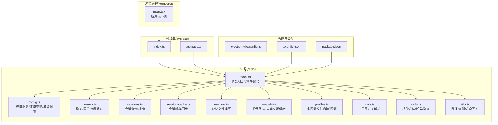
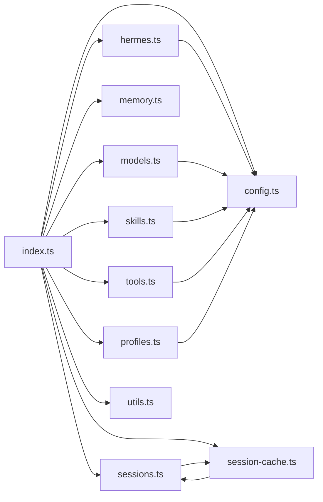
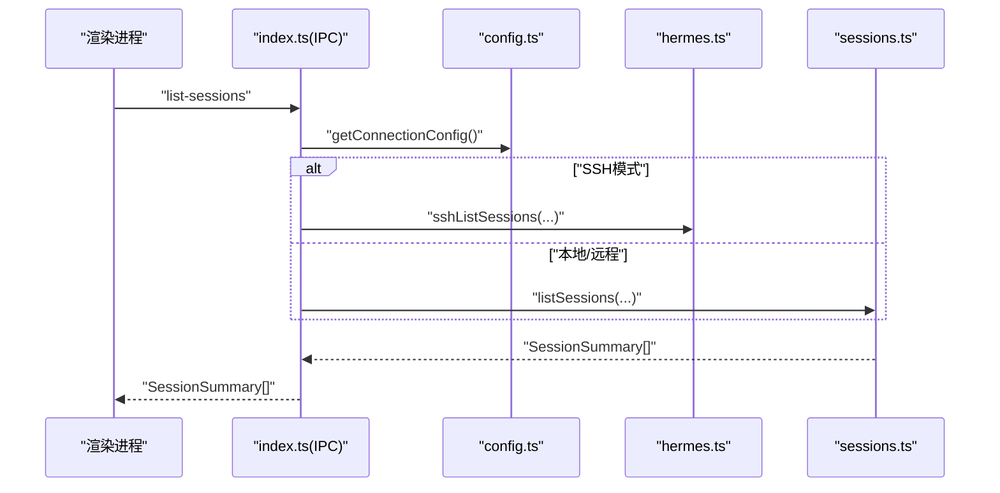
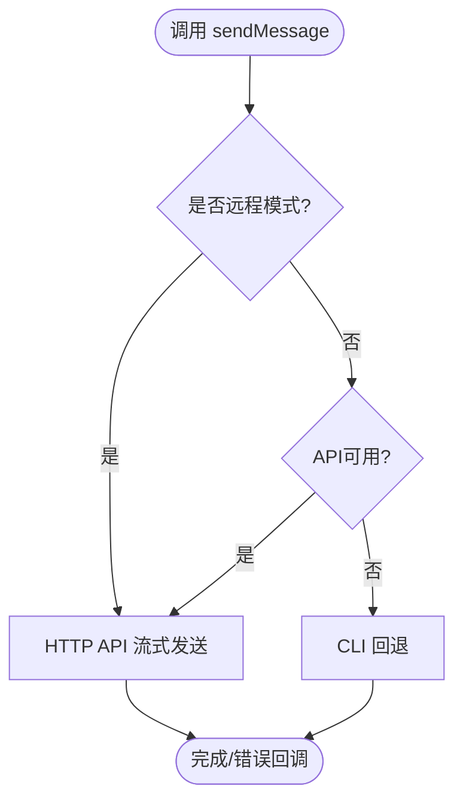
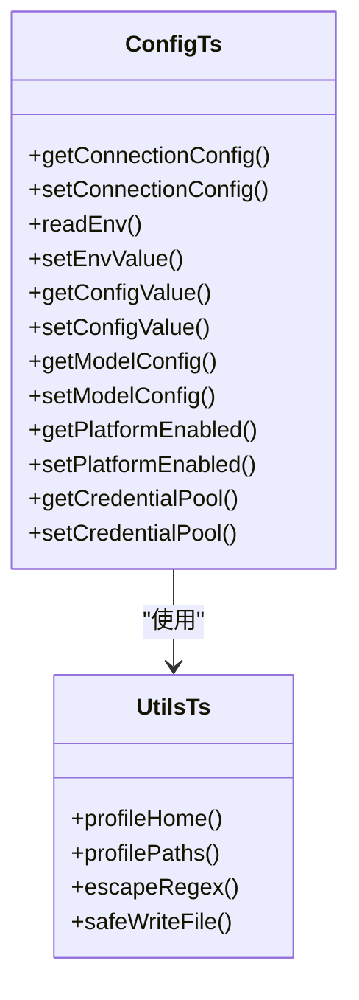
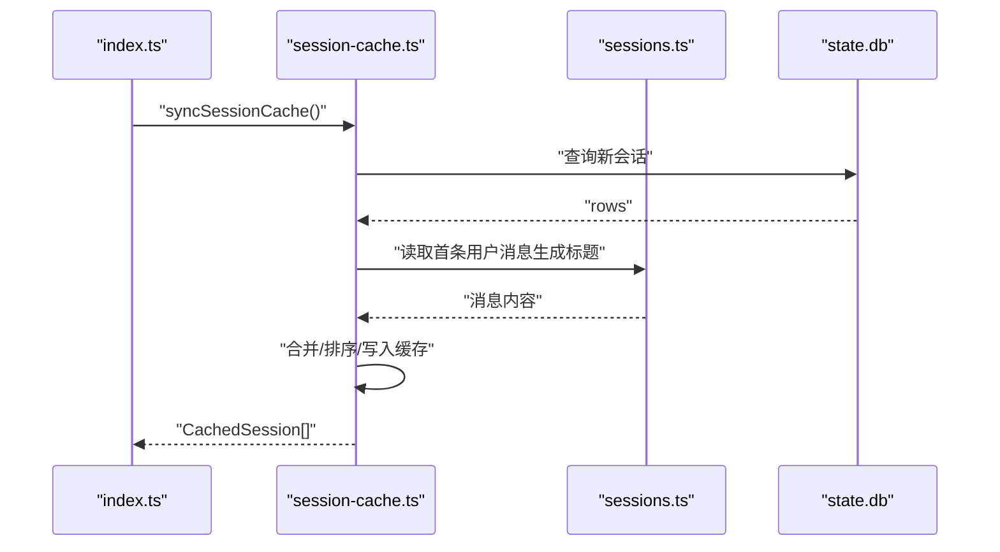
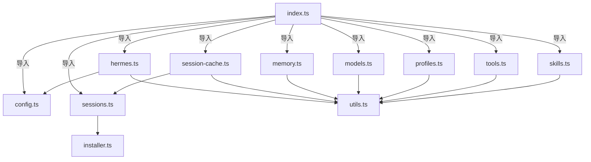
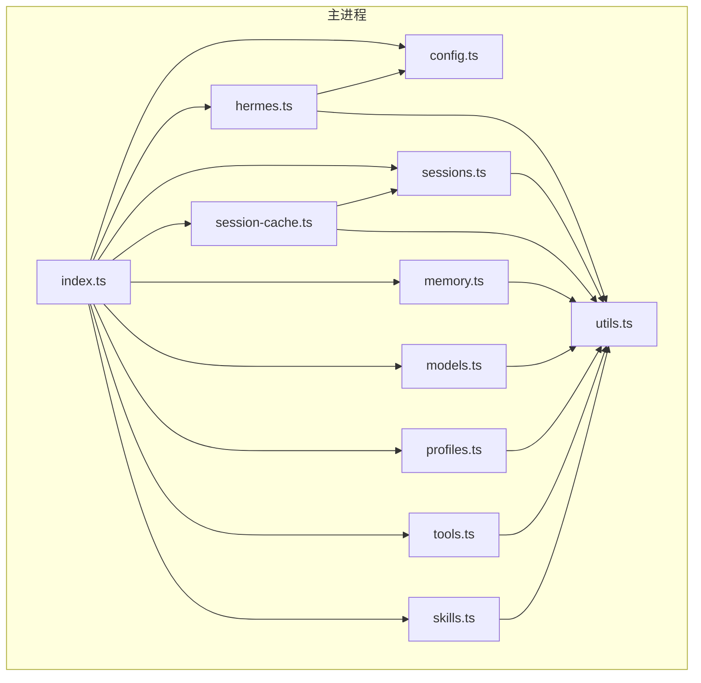

# 模块依赖关系

<cite>
**本文引用的文件**
- [package.json](file://package.json)
- [electron.vite.config.ts](file://electron.vite.config.ts)
- [tsconfig.json](file://tsconfig.json)
- [src/main/index.ts](file://src/main/index.ts)
- [src/main/hermes.ts](file://src/main/hermes.ts)
- [src/main/config.ts](file://src/main/config.ts)
- [src/main/sessions.ts](file://src/main/sessions.ts)
- [src/main/session-cache.ts](file://src/main/session-cache.ts)
- [src/main/memory.ts](file://src/main/memory.ts)
- [src/main/models.ts](file://src/main/models.ts)
- [src/main/profiles.ts](file://src/main/profiles.ts)
- [src/main/tools.ts](file://src/main/tools.ts)
- [src/main/skills.ts](file://src/main/skills.ts)
- [src/main/utils.ts](file://src/main/utils.ts)
- [src/renderer/src/main.tsx](file://src/renderer/src/main.tsx)
</cite>

## 目录
1. [引言](#引言)
2. [项目结构](#项目结构)
3. [核心组件](#核心组件)
4. [架构总览](#架构总览)
5. [详细组件分析](#详细组件分析)
6. [依赖分析](#依赖分析)
7. [性能考量](#性能考量)
8. [故障排查指南](#故障排查指南)
9. [结论](#结论)
10. [附录](#附录)

## 引言
本文件聚焦于Hermes Desktop的模块依赖关系与初始化流程，系统化梳理主进程（Main）各模块之间的导入依赖、功能依赖与数据依赖，解释模块初始化顺序与依赖注入机制，给出避免循环依赖与提升可测试性的策略，并提供模块依赖图与分析工具使用方法。

## 项目结构
Hermes Desktop采用Electron + React技术栈，代码按职责分层组织：
- 主进程（Main）：集中于src/main，负责系统配置、会话持久化、模型与技能管理、网关通信、SSH隧道等。
- 预加载（Preload）：位于src/preload，提供受限的渲染进程API面。
- 渲染进程（Renderer）：位于src/renderer，React应用入口在src/renderer/src/main.tsx。
- 共享资源（Shared）：位于src/shared，包含国际化等共享逻辑。

构建配置通过electron.vite.config.ts定义，TypeScript通过tsconfig.json进行多项目引用。

图表来源
- [src/main/index.ts:1-1234](file://src/main/index.ts#L1-L1234)
- [src/main/config.ts:1-440](file://src/main/config.ts#L1-L440)
- [src/main/hermes.ts:1-887](file://src/main/hermes.ts#L1-L887)
- [src/main/sessions.ts:1-212](file://src/main/sessions.ts#L1-L212)
- [src/main/session-cache.ts:1-252](file://src/main/session-cache.ts#L1-L252)
- [src/main/memory.ts:1-207](file://src/main/memory.ts#L1-L207)
- [src/main/models.ts:1-169](file://src/main/models.ts#L1-L169)
- [src/main/profiles.ts:1-284](file://src/main/profiles.ts#L1-L284)
- [src/main/tools.ts:1-294](file://src/main/tools.ts#L1-L294)
- [src/main/skills.ts:1-293](file://src/main/skills.ts#L1-L293)
- [src/main/utils.ts:1-85](file://src/main/utils.ts#L1-L85)
- [src/renderer/src/main.tsx:1-15](file://src/renderer/src/main.tsx#L1-L15)
- [electron.vite.config.ts:1-33](file://electron.vite.config.ts#L1-L33)
- [tsconfig.json:1-5](file://tsconfig.json#L1-L5)
- [package.json:1-70](file://package.json#L1-L70)

章节来源
- [package.json:1-70](file://package.json#L1-L70)
- [electron.vite.config.ts:1-33](file://electron.vite.config.ts#L1-L33)
- [tsconfig.json:1-5](file://tsconfig.json#L1-L5)

## 核心组件
- 主进程入口与IPC聚合：src/main/index.ts集中注册所有ipcMain.handle处理器，聚合安装、配置、聊天、网关、SSH隧道、会话、内存、工具集、技能、计划任务、语言环境等功能模块。
- 配置与环境：src/main/config.ts提供连接模式（本地/远程/SSH）、环境变量、模型配置、平台启用状态、凭据池等读写能力；配合src/main/utils.ts的路径与安全写入工具。
- 聊天与网关：src/main/hermes.ts封装HTTP API流式聊天、CLI回退、健康检查、网关启动/停止、SSH远程认证头生成与隧道确保。
- 数据访问：src/main/sessions.ts基于SQLite数据库查询会话与消息；src/main/session-cache.ts负责从数据库增量同步到桌面端JSON缓存，优化启动与列表加载。
- 记忆与用户档案：src/main/memory.ts对MEMORY.md与USER.md进行增删改查与字符限制控制。
- 模型与提供者：src/main/models.ts管理模型列表与自定义提供者解析，结合默认模型种子。
- 多配置文件与活动配置：src/main/profiles.ts支持“default”与命名配置文件夹，动态检测网关运行状态与技能数量。
- 工具集：src/main/tools.ts解析config.yaml中的platform_toolsets.cli，实现工具集开关。
- 技能生态：src/main/skills.ts通过hermes CLI实现技能浏览、安装、卸载与内容读取。

章节来源
- [src/main/index.ts:1-1234](file://src/main/index.ts#L1-L1234)
- [src/main/config.ts:1-440](file://src/main/config.ts#L1-L440)
- [src/main/hermes.ts:1-887](file://src/main/hermes.ts#L1-L887)
- [src/main/sessions.ts:1-212](file://src/main/sessions.ts#L1-L212)
- [src/main/session-cache.ts:1-252](file://src/main/session-cache.ts#L1-L252)
- [src/main/memory.ts:1-207](file://src/main/memory.ts#L1-L207)
- [src/main/models.ts:1-169](file://src/main/models.ts#L1-L169)
- [src/main/profiles.ts:1-284](file://src/main/profiles.ts#L1-L284)
- [src/main/tools.ts:1-294](file://src/main/tools.ts#L1-L294)
- [src/main/skills.ts:1-293](file://src/main/skills.ts#L1-L293)
- [src/main/utils.ts:1-85](file://src/main/utils.ts#L1-L85)

## 架构总览
主进程通过index.ts作为单一入口，围绕“配置-聊天-数据-生态”四条主线展开：
- 配置线：config.ts提供连接模式、环境变量、模型配置、平台开关；hermes.ts根据模式选择HTTP或CLI路径，并在SSH模式下注入远程认证头。
- 数据线：sessions.ts与session-cache.ts协同，前者直接查询数据库，后者提供快速缓存读取与增量同步。
- 生态线：models.ts解析自定义提供者；skills.ts通过CLI管理技能；tools.ts解析工具集开关。
- 辅助线：utils.ts提供路径解析、正则转义、安全写入；profiles.ts管理多配置文件与活动配置。

图表来源
- [src/main/index.ts:1-1234](file://src/main/index.ts#L1-L1234)
- [src/main/config.ts:1-440](file://src/main/config.ts#L1-L440)
- [src/main/hermes.ts:1-887](file://src/main/hermes.ts#L1-L887)
- [src/main/sessions.ts:1-212](file://src/main/sessions.ts#L1-L212)
- [src/main/session-cache.ts:1-252](file://src/main/session-cache.ts#L1-L252)
- [src/main/memory.ts:1-207](file://src/main/memory.ts#L1-L207)
- [src/main/models.ts:1-169](file://src/main/models.ts#L1-L169)
- [src/main/profiles.ts:1-284](file://src/main/profiles.ts#L1-L284)
- [src/main/tools.ts:1-294](file://src/main/tools.ts#L1-L294)
- [src/main/skills.ts:1-293](file://src/main/skills.ts#L1-L293)
- [src/main/utils.ts:1-85](file://src/main/utils.ts#L1-L85)

## 详细组件分析

### 组件A：主进程入口与IPC聚合（index.ts）
- 导入依赖：集中导入installer、hermes、ssh-tunnel、config、sessions、session-cache、models、profiles、memory、soul、tools、skills、cronjobs、locale、security、ssh-remote等模块。
- 功能依赖：通过ipcMain.handle将所有业务操作暴露给渲染进程，覆盖安装、版本、诊断、聊天、网关、连接模式、会话、内存、工具集、技能、计划任务、语言环境等。
- 数据依赖：大量调用config.ts读取/写入连接配置、环境变量、模型配置；调用hermes.ts进行聊天与网关管理；调用sessions.ts与session-cache.ts进行会话数据读取与缓存同步。
- 初始化顺序：窗口创建后建立IPC通道；聊天首次触发时按需启动网关与隧道；SSH模式下优先通过SSH隧道与远程网关交互。
- 循环依赖规避：通过延迟导入与惰性调用（如getConnectionConfig在首次使用时才解析），避免模块间直接循环引用。

图表来源
- [src/main/index.ts:691-696](file://src/main/index.ts#L691-L696)
- [src/main/config.ts:47-74](file://src/main/config.ts#L47-L74)
- [src/main/sessions.ts:46-89](file://src/main/sessions.ts#L46-L89)
- [src/main/hermes.ts:1-887](file://src/main/hermes.ts#L1-L887)

章节来源
- [src/main/index.ts:1-1234](file://src/main/index.ts#L1-L1234)

### 组件B：聊天与网关（hermes.ts）
- 导入依赖：依赖config.ts获取连接配置与模型配置；依赖ssh-tunnel.ts确保SSH隧道可用；依赖utils.ts进行ANSI清理。
- 功能依赖：提供sendMessage（HTTP流式优先，失败回退CLI）、startGateway（守护进程）、健康轮询、远程认证头生成、SSH隧道确保。
- 数据依赖：通过getApiUrl与getRemoteAuthHeader在不同模式下切换；在SSH模式下缓存远程API Key以便后续请求复用。
- 初始化顺序：ensureInitialized首次调用时自动配置API服务器并启动健康轮询；sendMessage前先检查API可用性，否则回退CLI。
- 循环依赖规避：通过getConnectionConfig惰性读取避免与config.ts直接循环；通过getSshTunnelUrl间接依赖ssh-tunnel.ts。

图表来源
- [src/main/hermes.ts:654-679](file://src/main/hermes.ts#L654-L679)
- [src/main/hermes.ts:102-121](file://src/main/hermes.ts#L102-L121)
- [src/main/hermes.ts:685-711](file://src/main/hermes.ts#L685-L711)

章节来源
- [src/main/hermes.ts:1-887](file://src/main/hermes.ts#L1-L887)

### 组件C：配置与环境（config.ts + utils.ts）
- 导入依赖：config.ts依赖utils.ts的profilePaths与safeWriteFile；utils.ts依赖installer.ts中的HERMES_HOME（通过延迟函数避免循环）。
- 功能依赖：提供连接模式读写、环境变量读写、模型配置读写、平台启用状态读写、凭据池读写；utils.ts提供路径解析、正则转义、安全写入。
- 数据依赖：桌面配置desktop.json存储连接模式与SSH配置；模型配置来自profile config.yaml；环境变量来自profile .env。
- 初始化顺序：getConnectionConfig惰性读取desktop.json；readEnv/setEnvValue带缓存与失效；getModelConfig/setModelConfig解析与更新config.yaml。
- 循环依赖规避：desktop.json路径通过函数延迟计算；HERMES_HOME在utils.ts中通过函数包装避免直接导入。

图表来源
- [src/main/config.ts:1-440](file://src/main/config.ts#L1-L440)
- [src/main/utils.ts:1-85](file://src/main/utils.ts#L1-L85)

章节来源
- [src/main/config.ts:1-440](file://src/main/config.ts#L1-L440)
- [src/main/utils.ts:1-85](file://src/main/utils.ts#L1-L85)

### 组件D：会话与缓存（sessions.ts + session-cache.ts）
- 导入依赖：sessions.ts依赖better-sqlite3与installer.ts中的HERMES_HOME；session-cache.ts依赖utils.ts与i18n。
- 功能依赖：sessions.ts提供会话列表、全文检索、消息读取与删除；session-cache.ts提供增量同步、标题生成、缓存读写。
- 数据依赖：state.db为SQLite数据库；sessions.json为桌面端缓存；WEBUI目录下的会话文件用于兼容。
- 初始化顺序：首次同步时从数据库拉取新增/变更会话，生成标题并写入缓存；后续列表读取直接走缓存。
- 循环依赖规避：通过常量DB_PATH与CACHE_FILE避免模块间循环；缓存索引Map降低查找复杂度。

图表来源
- [src/main/session-cache.ts:83-167](file://src/main/session-cache.ts#L83-L167)
- [src/main/sessions.ts:46-89](file://src/main/sessions.ts#L46-L89)
- [src/main/sessions.ts:158-186](file://src/main/sessions.ts#L158-L186)

章节来源
- [src/main/sessions.ts:1-212](file://src/main/sessions.ts#L1-L212)
- [src/main/session-cache.ts:1-252](file://src/main/session-cache.ts#L1-L252)

### 组件E：记忆与用户档案（memory.ts）
- 导入依赖：依赖utils.ts的safeWriteFile与profileHome；读写MEMORY.md与USER.md。
- 功能依赖：读取/添加/更新/删除记忆条目；写入用户档案；统计会话数与消息数。
- 数据依赖：基于文件系统，受字符限制与条目分隔符约束。
- 初始化顺序：读取时先检查文件存在与修改时间；写入时通过safeWriteFile保证目录存在。
- 循环依赖规避：仅依赖utils.ts提供的安全写入与路径解析。

章节来源
- [src/main/memory.ts:1-207](file://src/main/memory.ts#L1-L207)
- [src/main/utils.ts:1-85](file://src/main/utils.ts#L1-L85)

### 组件F：模型与提供者（models.ts）
- 导入依赖：依赖installer.ts中的HERMES_HOME与default-models；依赖utils.ts的profilePaths与safeWriteFile。
- 功能依赖：读取/写入模型列表；解析config.yaml中的custom_providers；为自定义提供者生成环境变量键值。
- 数据依赖：models.json为模型持久化文件；config.yaml为自定义提供者配置。
- 初始化顺序：首次运行时播种默认模型与自定义提供者；后续读取直接返回。
- 循环依赖规避：通过常量MODELS_FILE与函数seedDefaults避免循环。

章节来源
- [src/main/models.ts:1-169](file://src/main/models.ts#L1-L169)
- [src/main/utils.ts:1-85](file://src/main/utils.ts#L1-L85)

### 组件G：多配置文件与活动配置（profiles.ts）
- 导入依赖：依赖installer.ts中的HERMES_HOME与hermesCliArgs；依赖utils.ts的路径与校验工具。
- 功能依赖：列出/创建/删除配置文件；设置活动配置；检测网关运行状态与技能数量。
- 数据依赖：~/.hermes与~/.hermes/profiles/<name>目录结构；active_profile文件记录当前配置。
- 初始化顺序：读取active_profile确定当前配置；异步并发读取多个属性以提升性能。
- 循环依赖规避：通过字符串常量与函数调用避免直接导入。

章节来源
- [src/main/profiles.ts:1-284](file://src/main/profiles.ts#L1-L284)
- [src/main/utils.ts:1-85](file://src/main/utils.ts#L1-L85)

### 组件H：工具集（tools.ts）
- 导入依赖：依赖utils.ts与locale.ts；解析config.yaml中的platform_toolsets.cli。
- 功能依赖：读取工具集定义与本地化标签；解析启用集合；写回config.yaml。
- 数据依赖：config.yaml中的platform_toolsets.cli段落。
- 初始化顺序：无显式初始化；按需解析与写回。
- 循环依赖规避：仅依赖utils.ts与locale.ts，保持低耦合。

章节来源
- [src/main/tools.ts:1-294](file://src/main/tools.ts#L1-L294)
- [src/main/utils.ts:1-85](file://src/main/utils.ts#L1-L85)

### 组件I：技能生态（skills.ts）
- 导入依赖：依赖installer.ts中的HERMES_HOME/HERMES_PYTHON/HERMES_REPO与hermesCliArgs；依赖utils.ts的profileHome。
- 功能依赖：列出已安装技能、浏览/搜索技能、安装/卸载技能、读取技能内容。
- 数据依赖：profile skills目录与hermes-agent仓库skills目录；通过CLI与Python解释器执行。
- 初始化顺序：通过execFileSync调用CLI，必要时传入-profile参数。
- 循环依赖规避：通过常量与函数调用避免直接导入。

章节来源
- [src/main/skills.ts:1-293](file://src/main/skills.ts#L1-L293)
- [src/main/utils.ts:1-85](file://src/main/utils.ts#L1-L85)

### 组件J：渲染进程入口（renderer main.tsx）
- 导入依赖：引入I18nProvider与App根组件；创建React根节点。
- 功能依赖：作为渲染进程启动点，承载UI与国际化上下文。
- 初始化顺序：StrictMode包裹，I18nProvider在App外层提供语言环境。
- 循环依赖规避：与主进程通过IPC通信，不直接导入主进程模块。

章节来源
- [src/renderer/src/main.tsx:1-15](file://src/renderer/src/main.tsx#L1-L15)

## 依赖分析
- 模块导入链：
  - index.ts → 所有业务模块（installer、hermes、ssh-tunnel、config、sessions、session-cache、memory、models、profiles、tools、skills、cronjobs、locale、security、ssh-remote）
  - hermes.ts → config.ts、ssh-tunnel.ts、utils.ts
  - sessions.ts → installer.ts（HERMES_HOME）
  - session-cache.ts → utils.ts、i18n、sessions.ts
  - memory.ts → utils.ts
  - models.ts → installer.ts、utils.ts
  - profiles.ts → installer.ts、utils.ts
  - tools.ts → utils.ts、locale.ts
  - skills.ts → installer.ts、utils.ts
  - config.ts → utils.ts
- 耦合与内聚：
  - 高内聚：每个模块专注于单一职责（配置、聊天、会话、记忆、模型、工具集、技能、多配置文件）。
  - 低耦合：通过index.ts统一聚合，模块间通过函数接口与配置文件交互，避免直接互相导入。
- 循环依赖：
  - 通过延迟导入与函数包装（如desktop.json路径、HERMES_HOME）有效避免。
  - config.ts与installer.ts之间通过函数延迟避免直接循环。
- 外部依赖：
  - better-sqlite3用于数据库访问；i18next与react-i18next用于国际化；Electron原生模块用于系统集成。

图表来源
- [src/main/index.ts:1-1234](file://src/main/index.ts#L1-L1234)
- [src/main/hermes.ts:1-887](file://src/main/hermes.ts#L1-L887)
- [src/main/config.ts:1-440](file://src/main/config.ts#L1-L440)
- [src/main/sessions.ts:1-212](file://src/main/sessions.ts#L1-L212)
- [src/main/session-cache.ts:1-252](file://src/main/session-cache.ts#L1-L252)
- [src/main/memory.ts:1-207](file://src/main/memory.ts#L1-L207)
- [src/main/models.ts:1-169](file://src/main/models.ts#L1-L169)
- [src/main/profiles.ts:1-284](file://src/main/profiles.ts#L1-L284)
- [src/main/tools.ts:1-294](file://src/main/tools.ts#L1-L294)
- [src/main/skills.ts:1-293](file://src/main/skills.ts#L1-L293)
- [src/main/utils.ts:1-85](file://src/main/utils.ts#L1-L85)

章节来源
- [src/main/index.ts:1-1234](file://src/main/index.ts#L1-L1234)

## 性能考量
- 缓存与增量同步：session-cache.ts通过lastSync字段与Map索引实现O(N)增量同步，避免全量扫描导致启动卡顿。
- 健康轮询：hermes.ts对API可用性进行定时轮询，确认可用后停止轮询，减少不必要的网络探测。
- 并发读取：profiles.ts对多个属性采用Promise.all并发读取，缩短UI加载等待时间。
- 文件安全写入：utils.ts的safeWriteFile在写入前确保目录存在，避免ENOENT异常与崩溃。
- I/O优化：sessions.ts与memory.ts均采用只读数据库句柄与必要的事务封装，减少锁竞争。

## 故障排查指南
- IPC调用失败：
  - 确认index.ts中对应ipcMain.handle已注册；检查getConnectionConfig返回的连接模式是否正确。
  - 参考：[src/main/index.ts:290-800](file://src/main/index.ts#L290-L800)
- 聊天无响应：
  - 若为远程模式，检查getApiUrl与getRemoteAuthHeader；若为SSH模式，确认隧道状态与远程API Key缓存。
  - 参考：[src/main/hermes.ts:22-62](file://src/main/hermes.ts#L22-L62)
- 会话列表为空：
  - 检查state.db是否存在；确认session-cache.ts缓存是否生成；必要时触发一次syncSessionCache。
  - 参考：[src/main/sessions.ts:36-44](file://src/main/sessions.ts#L36-L44)，[src/main/session-cache.ts:83-167](file://src/main/session-cache.ts#L83-L167)
- 写入失败或崩溃：
  - 使用utils.ts的safeWriteFile替代直接写入；检查目标目录权限。
  - 参考：[src/main/utils.ts:80-84](file://src/main/utils.ts#L80-L84)
- SSH连接问题：
  - 使用testSshConnection与startSshTunnel；确认SSH配置与远端网关状态。
  - 参考：[src/main/hermes.ts:520-522](file://src/main/hermes.ts#L520-L522)，[src/main/hermes.ts:524-542](file://src/main/hermes.ts#L524-L542)

章节来源
- [src/main/index.ts:290-800](file://src/main/index.ts#L290-L800)
- [src/main/hermes.ts:22-62](file://src/main/hermes.ts#L22-L62)
- [src/main/sessions.ts:36-44](file://src/main/sessions.ts#L36-L44)
- [src/main/session-cache.ts:83-167](file://src/main/session-cache.ts#L83-L167)
- [src/main/utils.ts:80-84](file://src/main/utils.ts#L80-L84)

## 结论
Hermes Desktop通过index.ts实现模块聚合与IPC统一入口，围绕配置、聊天、数据与生态四大主线形成清晰的依赖层次。通过延迟导入、函数包装与缓存策略有效规避循环依赖，提升可测试性与可维护性。建议持续完善单元测试覆盖关键模块（config、hermes、sessions、session-cache、memory、models、profiles、tools、skills），并在新模块接入时遵循依赖反转与接口抽象原则，进一步降低耦合度。

## 附录
- 模块依赖图（概念示意）

- 依赖分析工具使用建议
  - 使用TypeScript项目引用（tsconfig.json）与ESLint规则（eslint.config.mjs）进行静态依赖检查。
  - 使用Vitest进行单元测试，重点覆盖config、hermes、sessions、session-cache、memory、models、profiles、tools、skills等模块。
  - 使用electron-vite配置（electron.vite.config.ts）确保主进程外部依赖（如better-sqlite3）正确打包。

章节来源
- [tsconfig.json:1-5](file://tsconfig.json#L1-L5)
- [electron.vite.config.ts:1-33](file://electron.vite.config.ts#L1-L33)
- [package.json:1-70](file://package.json#L1-L70)