# 模块化架构

<cite>
**本文档引用的文件**
- [src/main/index.ts](file://src/main/index.ts)
- [src/main/hermes.ts](file://src/main/hermes.ts)
- [src/main/config.ts](file://src/main/config.ts)
- [src/main/sessions.ts](file://src/main/sessions.ts)
- [src/main/session-cache.ts](file://src/main/session-cache.ts)
- [src/main/models.ts](file://src/main/models.ts)
- [src/main/profiles.ts](file://src/main/profiles.ts)
- [src/main/memory.ts](file://src/main/memory.ts)
- [src/main/skills.ts](file://src/main/skills.ts)
- [src/main/tools.ts](file://src/main/tools.ts)
- [src/main/cronjobs.ts](file://src/main/cronjobs.ts)
- [src/main/soul.ts](file://src/main/soul.ts)
- [src/main/claw3d.ts](file://src/main/claw3d.ts)
- [src/main/ssh-tunnel.ts](file://src/main/ssh-tunnel.ts)
- [src/main/installer.ts](file://src/main/installer.ts)
</cite>

## 目录
1. [简介](#简介)
2. [项目结构](#项目结构)
3. [核心组件](#核心组件)
4. [架构总览](#架构总览)
5. [详细组件分析](#详细组件分析)
6. [依赖分析](#依赖分析)
7. [性能考虑](#性能考虑)
8. [故障排查指南](#故障排查指南)
9. [结论](#结论)

## 简介
本文件面向Hermes Desktop的模块化架构，系统性阐述主进程模块的设计理念与实现方式，包括主进程模块的职责划分、模块间依赖关系与接口设计；详细说明核心模块（聊天引擎、安装管理、配置管理、会话管理、技能、工具集、定时任务、记忆、档案、Claw3D办公套件、SSH隧道）的职责边界与协作方式；覆盖模块初始化顺序、生命周期管理与错误传播机制，并提供模块依赖图与模块交互时序图，帮助开发者快速理解系统的整体结构与模块间的耦合关系。

## 项目结构
Hermes Desktop采用“按功能域分层”的模块组织方式，主进程入口集中注册所有IPC处理函数，各功能域以独立模块形式存在，通过清晰的接口进行解耦。主要目录与职责如下：
- 主进程入口与IPC桥接：src/main/index.ts
- 核心引擎与通信：src/main/hermes.ts、src/main/ssh-tunnel.ts
- 安装与运行环境：src/main/installer.ts
- 配置与模型：src/main/config.ts、src/main/models.ts
- 会话与缓存：src/main/sessions.ts、src/main/session-cache.ts
- 用户资料与记忆：src/main/profiles.ts、src/main/memory.ts、src/main/soul.ts
- 技能与工具集：src/main/skills.ts、src/main/tools.ts
- 定时任务：src/main/cronjobs.ts
- 办公套件集成：src/main/claw3d.ts

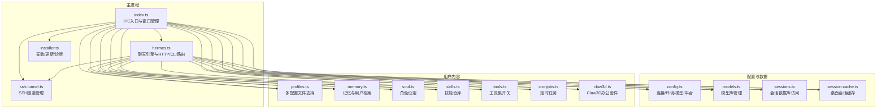

图表来源
- [src/main/index.ts:1-1234](file://src/main/index.ts#L1-L1234)
- [src/main/hermes.ts:1-887](file://src/main/hermes.ts#L1-L887)
- [src/main/ssh-tunnel.ts:1-220](file://src/main/ssh-tunnel.ts#L1-L220)
- [src/main/installer.ts:1-1130](file://src/main/installer.ts#L1-L1130)
- [src/main/config.ts:1-440](file://src/main/config.ts#L1-L440)
- [src/main/models.ts:1-169](file://src/main/models.ts#L1-L169)
- [src/main/sessions.ts:1-212](file://src/main/sessions.ts#L1-L212)
- [src/main/session-cache.ts:1-252](file://src/main/session-cache.ts#L1-L252)
- [src/main/profiles.ts:1-284](file://src/main/profiles.ts#L1-L284)
- [src/main/memory.ts:1-207](file://src/main/memory.ts#L1-L207)
- [src/main/soul.ts:1-38](file://src/main/soul.ts#L1-L38)
- [src/main/skills.ts:1-293](file://src/main/skills.ts#L1-L293)
- [src/main/tools.ts:1-294](file://src/main/tools.ts#L1-L294)
- [src/main/cronjobs.ts:1-281](file://src/main/cronjobs.ts#L1-L281)
- [src/main/claw3d.ts:1-890](file://src/main/claw3d.ts#L1-L890)

章节来源
- [src/main/index.ts:1-1234](file://src/main/index.ts#L1-L1234)

## 核心组件
本节从模块化视角梳理各核心模块的职责与边界，强调接口契约与数据流向。

- 聊天引擎模块（hermes.ts）
  - 负责消息发送、流式响应解析、本地/远程模式切换、HTTP API与CLI回退路径、网关生命周期管理、健康检查与自动重启。
  - 关键接口：sendMessage、startGateway、isGatewayRunning、ensureSshTunnelIfNeeded、getApiUrl、getRemoteAuthHeader。
  - 依赖：config.ts（模型/环境）、ssh-tunnel.ts（SSH隧道）、models.ts（模型配置）。

- 安装管理模块（installer.ts）
  - 负责安装状态检测、版本查询、更新、迁移、诊断命令执行、增强PATH与跨平台可执行解析。
  - 关键接口：checkInstallStatus、getHermesVersion、runInstall、runHermesUpdate、runClawMigrate、runHermesDoctor。
  - 依赖：config.ts（连接模式）、utils（安全写入）。

- 配置管理模块（config.ts）
  - 负责连接模式（本地/远程/SSH）、环境变量（.env）、模型配置（config.yaml）、平台启用开关、凭据池管理。
  - 关键接口：getConnectionConfig、setConnectionConfig、readEnv、setEnvValue、getModelConfig、setModelConfig、getPlatformEnabled、setPlatformEnabled。
  - 依赖：utils（路径/安全写入）、installer.ts（HERMES_HOME）。

- 会话管理模块（sessions.ts + session-cache.ts）
  - 数据库访问：sessions.ts（SQLite Better-SQLite3）提供会话列表、全文检索、消息读取、删除。
  - 桌面缓存：session-cache.ts（JSON）提供标题生成、增量同步、快速读取、删除清理。
  - 关键接口：listSessions、getSessionMessages、searchSessions、syncSessionCache、listCachedSessions。

- 模型管理模块（models.ts）
  - 提供默认模型种子、自定义提供商解析、模型增删改查、API模式映射。
  - 关键接口：listModels、addModel、removeModel、updateModel、seedDefaults。

- 用户资料与记忆（profiles.ts + memory.ts + soul.ts）
  - profiles.ts：多配置文件支持、活动配置切换、技能计数、网关状态探测。
  - memory.ts：记忆条目增删改、用户档案写入、字符限制与统计。
  - soul.ts：角色设定读写重置。

- 技能与工具集（skills.ts + tools.ts）
  - skills.ts：已安装技能枚举、技能内容读取、内置技能浏览、技能安装/卸载。
  - tools.ts：工具集定义、启用项解析与持久化、国际化标签。

- 定时任务（cronjobs.ts）
  - 支持本地与远程模式：本地读取jobs.json，远程通过HTTP API操作。
  - 关键接口：listCronJobs、createCronJob、removeCronJob、pauseCronJob、resumeCronJob、triggerCronJob。

- SSH隧道（ssh-tunnel.ts）
  - 管理SSH端口转发、健康检查、临时连通性测试、端口选择与占用检测。

- Claw3D办公套件（claw3d.ts）
  - 克隆/安装Claw3D、启动开发服务器与适配器、端口与WS地址管理、设置文件生成。

章节来源
- [src/main/hermes.ts:1-887](file://src/main/hermes.ts#L1-L887)
- [src/main/installer.ts:1-1130](file://src/main/installer.ts#L1-L1130)
- [src/main/config.ts:1-440](file://src/main/config.ts#L1-L440)
- [src/main/sessions.ts:1-212](file://src/main/sessions.ts#L1-L212)
- [src/main/session-cache.ts:1-252](file://src/main/session-cache.ts#L1-L252)
- [src/main/models.ts:1-169](file://src/main/models.ts#L1-L169)
- [src/main/profiles.ts:1-284](file://src/main/profiles.ts#L1-L284)
- [src/main/memory.ts:1-207](file://src/main/memory.ts#L1-L207)
- [src/main/soul.ts:1-38](file://src/main/soul.ts#L1-L38)
- [src/main/skills.ts:1-293](file://src/main/skills.ts#L1-L293)
- [src/main/tools.ts:1-294](file://src/main/tools.ts#L1-L294)
- [src/main/cronjobs.ts:1-281](file://src/main/cronjobs.ts#L1-L281)
- [src/main/ssh-tunnel.ts:1-220](file://src/main/ssh-tunnel.ts#L1-L220)
- [src/main/claw3d.ts:1-890](file://src/main/claw3d.ts#L1-L890)

## 架构总览
下图展示主进程模块在运行期的职责划分与交互关系，突出IPC桥接、引擎路由、远程/本地模式切换、以及关键依赖链。

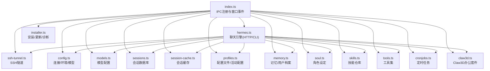

图表来源
- [src/main/index.ts:1-1234](file://src/main/index.ts#L1-L1234)
- [src/main/hermes.ts:1-887](file://src/main/hermes.ts#L1-L887)
- [src/main/ssh-tunnel.ts:1-220](file://src/main/ssh-tunnel.ts#L1-L220)
- [src/main/config.ts:1-440](file://src/main/config.ts#L1-L440)
- [src/main/models.ts:1-169](file://src/main/models.ts#L1-L169)
- [src/main/sessions.ts:1-212](file://src/main/sessions.ts#L1-L212)
- [src/main/session-cache.ts:1-252](file://src/main/session-cache.ts#L1-L252)
- [src/main/profiles.ts:1-284](file://src/main/profiles.ts#L1-L284)
- [src/main/memory.ts:1-207](file://src/main/memory.ts#L1-L207)
- [src/main/soul.ts:1-38](file://src/main/soul.ts#L1-L38)
- [src/main/skills.ts:1-293](file://src/main/skills.ts#L1-L293)
- [src/main/tools.ts:1-294](file://src/main/tools.ts#L1-L294)
- [src/main/cronjobs.ts:1-281](file://src/main/cronjobs.ts#L1-L281)
- [src/main/claw3d.ts:1-890](file://src/main/claw3d.ts#L1-L890)

## 详细组件分析

### 聊天引擎模块（hermes.ts）
- 设计要点
  - 模式感知：根据连接配置自动选择HTTP API或CLI路径，优先使用本地HTTP API，失败时回退到CLI。
  - 健康检查：启动后定期轮询API可用性，动态切换路径。
  - 流式响应：统一解析SSE事件，兼容usage统计、工具进度、错误透传。
  - 网关管理：惰性启动、进程生命周期管理、异常恢复。
- 关键流程（消息发送）
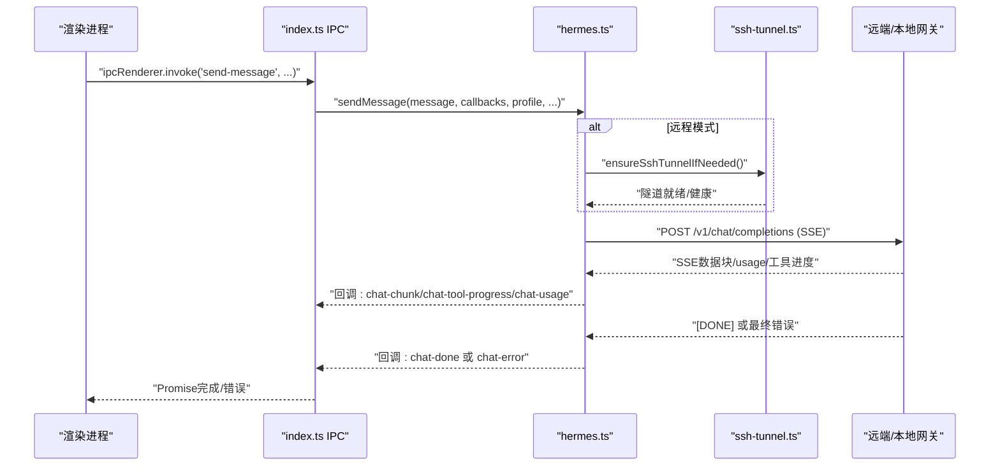

图表来源
- [src/main/index.ts:544-640](file://src/main/index.ts#L544-L640)
- [src/main/hermes.ts:168-434](file://src/main/hermes.ts#L168-L434)
- [src/main/ssh-tunnel.ts:64-69](file://src/main/ssh-tunnel.ts#L64-L69)

章节来源
- [src/main/hermes.ts:1-887](file://src/main/hermes.ts#L1-L887)
- [src/main/index.ts:544-640](file://src/main/index.ts#L544-L640)

### 安装管理模块（installer.ts）
- 设计要点
  - 多平台安装脚本：Windows PowerShell包装，类Unix curl脚本下载安装。
  - 进度解析：基于安装输出中的阶段标记，映射到步骤标题与日志。
  - 缓存与验证：版本查询结果缓存、安装验证缓存、避免重复开销。
  - 诊断与迁移：doctor命令、OpenClaw迁移、Hermes更新。
- 关键流程（安装）
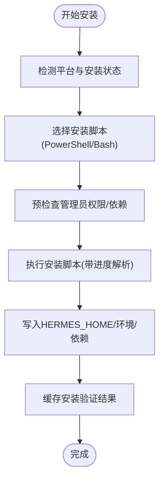

图表来源
- [src/main/installer.ts:517-650](file://src/main/installer.ts#L517-L650)

章节来源
- [src/main/installer.ts:1-1130](file://src/main/installer.ts#L1-L1130)

### 配置管理模块（config.ts）
- 设计要点
  - 连接配置：本地/远程/SSH三态，SSH参数持久化。
  - 环境变量：.env解析与写入，键名校验，缓存TTL。
  - 模型配置：provider/default/base_url解析与写入，智能禁用路由。
  - 平台开关：platforms段落启用/禁用，支持批量修改。
- 关键流程（模型配置变更）
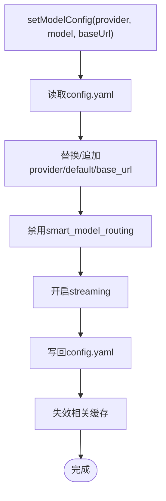

图表来源
- [src/main/config.ts:248-301](file://src/main/config.ts#L248-L301)

章节来源
- [src/main/config.ts:1-440](file://src/main/config.ts#L1-L440)

### 会话管理模块（sessions.ts + session-cache.ts）
- 设计要点
  - 数据一致性：state.db只读查询，桌面缓存提供快速读取与标题生成。
  - 同步策略：增量同步，基于时间戳，O(N)合并，避免全量扫描。
  - 删除策略：先清理WebUI索引与文件，再删除数据库记录，最后清理缓存。
- 关键流程（会话同步）
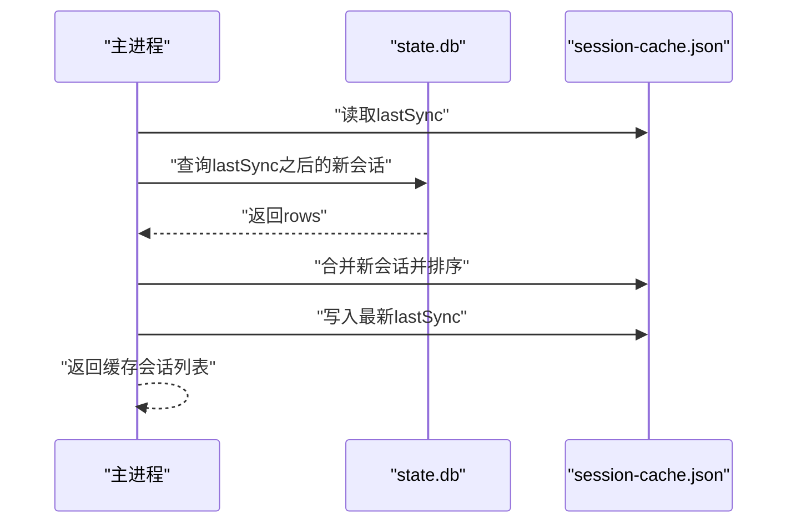

图表来源
- [src/main/session-cache.ts:82-167](file://src/main/session-cache.ts#L82-L167)
- [src/main/sessions.ts:46-89](file://src/main/sessions.ts#L46-L89)

章节来源
- [src/main/sessions.ts:1-212](file://src/main/sessions.ts#L1-L212)
- [src/main/session-cache.ts:1-252](file://src/main/session-cache.ts#L1-L252)

### 技能与工具集（skills.ts + tools.ts）
- 设计要点
  - 技能：遍历skills目录解析SKILL.md，支持内置与已安装技能区分。
  - 工具集：解析platform_toolsets.cli段落，支持启用/禁用与持久化。
- 关键流程（技能安装）
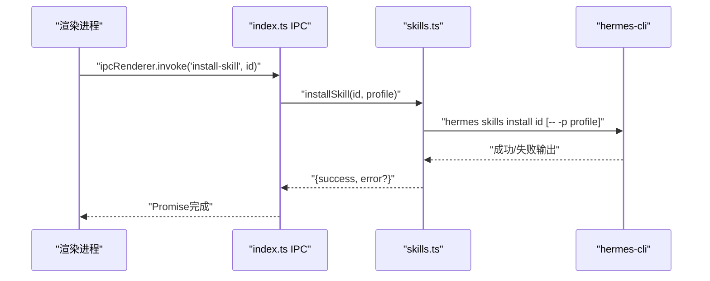

图表来源
- [src/main/skills.ts:236-263](file://src/main/skills.ts#L236-L263)
- [src/main/index.ts:796-794](file://src/main/index.ts#L796-L794)

章节来源
- [src/main/skills.ts:1-293](file://src/main/skills.ts#L1-L293)
- [src/main/tools.ts:1-294](file://src/main/tools.ts#L1-L294)

### 定时任务（cronjobs.ts）
- 设计要点
  - 本地：读取jobs.json，支持创建/删除/暂停/恢复/触发。
  - 远程：通过HTTP API代理，保持一致的返回格式。
- 关键流程（创建任务）
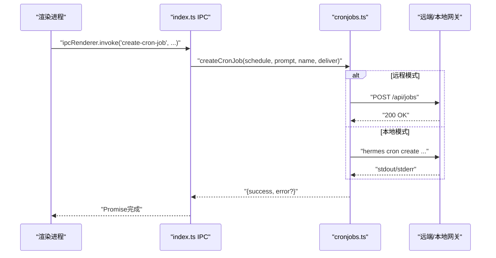

图表来源
- [src/main/cronjobs.ts:171-210](file://src/main/cronjobs.ts#L171-L210)
- [src/main/index.ts:112-119](file://src/main/index.ts#L112-L119)

章节来源
- [src/main/cronjobs.ts:1-281](file://src/main/cronjobs.ts#L1-L281)

### SSH隧道（ssh-tunnel.ts）
- 设计要点
  - 自动端口分配与占用检测，健康检查轮询，临时连通性测试。
  - 参数化控制选项，支持控制Master连接复用与保活。
- 关键流程（隧道启动）
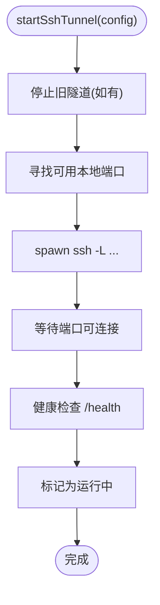

图表来源
- [src/main/ssh-tunnel.ts:120-153](file://src/main/ssh-tunnel.ts#L120-L153)

章节来源
- [src/main/ssh-tunnel.ts:1-220](file://src/main/ssh-tunnel.ts#L1-L220)

### Claw3D办公套件（claw3d.ts）
- 设计要点
  - Git克隆/拉取hermes-office仓库，pnpm安装依赖，生成Claw3D设置与.env。
  - 启动开发服务器与适配器，管理PID文件与日志截断。
- 关键流程（Claw3D设置）
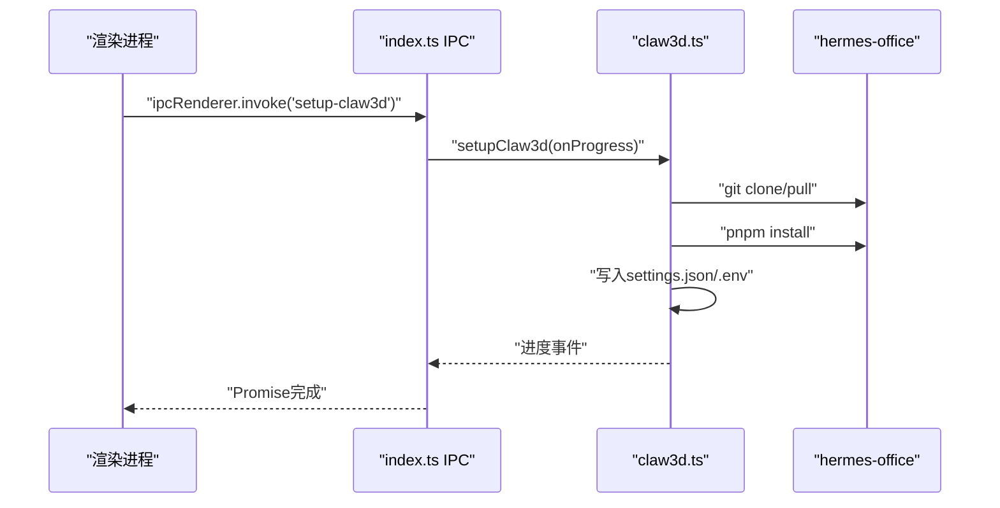

图表来源
- [src/main/claw3d.ts:514-644](file://src/main/claw3d.ts#L514-L644)

章节来源
- [src/main/claw3d.ts:1-890](file://src/main/claw3d.ts#L1-L890)

## 依赖分析
- 模块内聚与耦合
  - hermes.ts与ssh-tunnel.ts强耦合（隧道健康与聊天前置），但通过接口隔离，便于替换。
  - config.ts与models.ts共同驱动模型选择与API路由，形成稳定的数据契约。
  - sessions.ts与session-cache.ts通过state.db与JSON缓存互补，降低IO压力。
  - index.ts作为单一IPC入口，聚合所有模块能力，是高扇出中心。
- 外部依赖
  - child_process用于子进程管理（安装、聊天、网关、SSH、Claw3D）。
  - better-sqlite3用于会话数据库访问。
  - fetch/http用于远程模式下的HTTP调用。
- 循环依赖规避
  - config.ts通过延迟读取desktop.json避免与installer.ts循环导入。

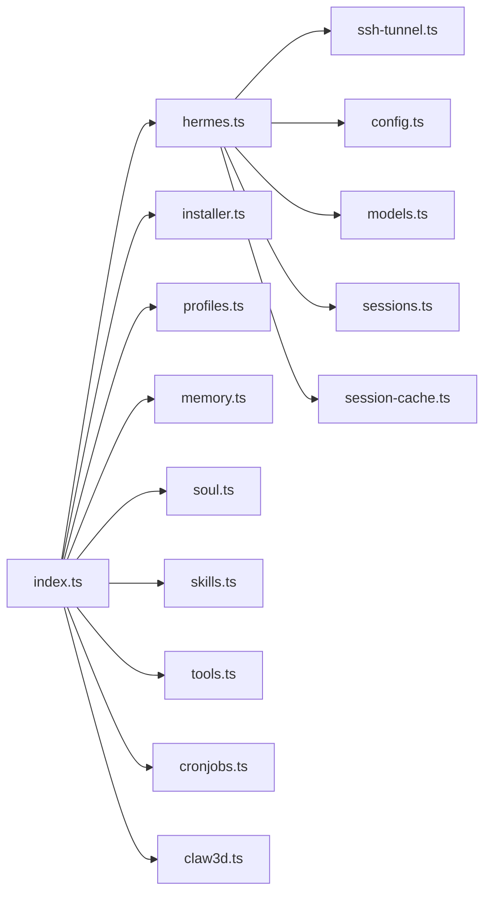

图表来源
- [src/main/index.ts:1-1234](file://src/main/index.ts#L1-L1234)
- [src/main/hermes.ts:1-887](file://src/main/hermes.ts#L1-L887)
- [src/main/ssh-tunnel.ts:1-220](file://src/main/ssh-tunnel.ts#L1-L220)
- [src/main/config.ts:1-440](file://src/main/config.ts#L1-L440)
- [src/main/models.ts:1-169](file://src/main/models.ts#L1-L169)
- [src/main/sessions.ts:1-212](file://src/main/sessions.ts#L1-L212)
- [src/main/session-cache.ts:1-252](file://src/main/session-cache.ts#L1-L252)
- [src/main/installer.ts:1-1130](file://src/main/installer.ts#L1-L1130)
- [src/main/profiles.ts:1-284](file://src/main/profiles.ts#L1-L284)
- [src/main/memory.ts:1-207](file://src/main/memory.ts#L1-L207)
- [src/main/soul.ts:1-38](file://src/main/soul.ts#L1-L38)
- [src/main/skills.ts:1-293](file://src/main/skills.ts#L1-L293)
- [src/main/tools.ts:1-294](file://src/main/tools.ts#L1-L294)
- [src/main/cronjobs.ts:1-281](file://src/main/cronjobs.ts#L1-L281)
- [src/main/claw3d.ts:1-890](file://src/main/claw3d.ts#L1-L890)

章节来源
- [src/main/index.ts:1-1234](file://src/main/index.ts#L1-L1234)

## 性能考虑
- 缓存策略
  - config.ts对.env与模型配置使用内存缓存（TTL），减少频繁磁盘读取。
  - session-cache.ts对会话标题与列表做增量同步，避免全量扫描。
- I/O优化
  - sessions.ts使用Better-SQLite3只读查询，配合缓存降低UI卡顿。
  - installer.ts对版本查询与安装验证结果进行缓存，避免重复子进程开销。
- 子进程管理
  - hermes.ts在远程模式下直接走HTTP API，避免CLI启动开销；本地模式下健康检查与回退策略平衡稳定性与性能。
- 端口与网络
  - ssh-tunnel.ts自动端口分配与健康检查，避免端口冲突与长时间阻塞。

## 故障排查指南
- 安装与更新
  - 使用runHermesDoctor定位环境问题；检查安装缓存与版本缓存是否过期。
  - 参考：[src/main/installer.ts:298-319](file://src/main/installer.ts#L298-L319)
- 聊天无响应
  - 检查网关状态与API可用性；确认SSH隧道健康；查看SSE错误与usage透传。
  - 参考：[src/main/hermes.ts:102-121](file://src/main/hermes.ts#L102-L121)、[src/main/ssh-tunnel.ts:59-63](file://src/main/ssh-tunnel.ts#L59-L63)
- 远程连接失败
  - 使用testSshConnection进行临时连通性测试；核对SSH参数与隧道端口。
  - 参考：[src/main/ssh-tunnel.ts:169-219](file://src/main/ssh-tunnel.ts#L169-L219)
- 会话检索异常
  - 确认state.db存在与FTS表；检查搜索关键词与snippet生成。
  - 参考：[src/main/sessions.ts:91-156](file://src/main/sessions.ts#L91-L156)
- 定时任务失败
  - 远程模式检查HTTP返回；本地模式查看hermes cron输出。
  - 参考：[src/main/cronjobs.ts:87-136](file://src/main/cronjobs.ts#L87-L136)

章节来源
- [src/main/installer.ts:298-319](file://src/main/installer.ts#L298-L319)
- [src/main/hermes.ts:102-121](file://src/main/hermes.ts#L102-L121)
- [src/main/ssh-tunnel.ts:169-219](file://src/main/ssh-tunnel.ts#L169-L219)
- [src/main/sessions.ts:91-156](file://src/main/sessions.ts#L91-L156)
- [src/main/cronjobs.ts:87-136](file://src/main/cronjobs.ts#L87-L136)

## 结论
Hermes Desktop的模块化架构以“主进程IPC桥接 + 功能域独立模块”为核心，通过清晰的接口契约与缓存策略实现了高内聚、低耦合。聊天引擎在本地与远程模式间无缝切换，安装管理与配置管理提供稳健的运行环境，会话与缓存体系兼顾性能与一致性，技能、工具集、定时任务、记忆与档案等模块围绕用户内容形成完整生态。建议在后续迭代中进一步抽象IPC接口与错误传播机制，增强模块间契约的可测试性与可观测性。