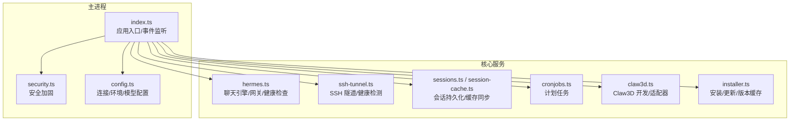
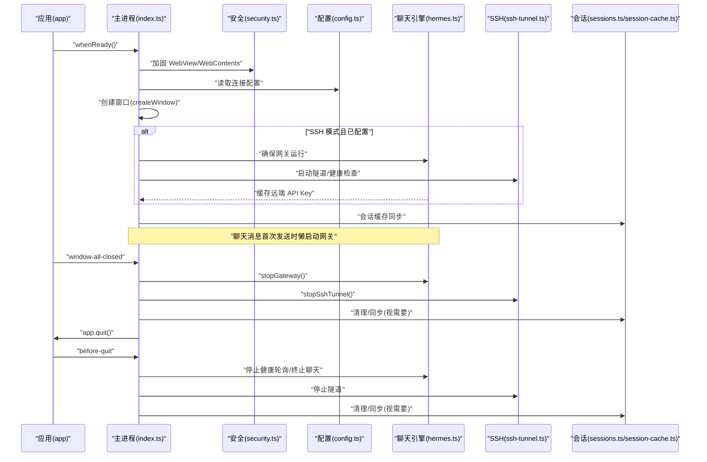
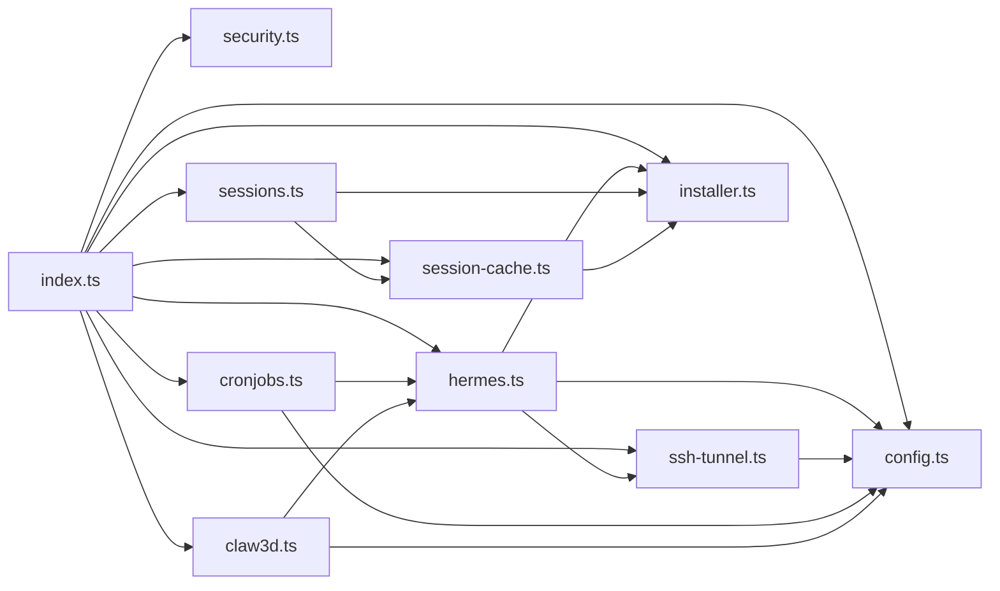

# 生命周期管理

<cite>
**本文引用的文件**
- [src/main/index.ts](file://src/main/index.ts)
- [src/main/hermes.ts](file://src/main/hermes.ts)
- [src/main/ssh-tunnel.ts](file://src/main/ssh-tunnel.ts)
- [src/main/config.ts](file://src/main/config.ts)
- [src/main/sessions.ts](file://src/main/sessions.ts)
- [src/main/session-cache.ts](file://src/main/session-cache.ts)
- [src/main/security.ts](file://src/main/security.ts)
- [src/main/cronjobs.ts](file://src/main/cronjobs.ts)
- [src/main/claw3d.ts](file://src/main/claw3d.ts)
- [src/main/installer.ts](file://src/main/installer.ts)
- [src/main/utils.ts](file://src/main/utils.ts)
</cite>

## 目录
1. [简介](#简介)
2. [项目结构](#项目结构)
3. [核心组件](#核心组件)
4. [架构总览](#架构总览)
5. [详细组件分析](#详细组件分析)
6. [依赖关系分析](#依赖关系分析)
7. [性能考量](#性能考量)
8. [故障排查指南](#故障排查指南)
9. [结论](#结论)
10. [附录](#附录)

## 简介
本文件系统性阐述 Hermes Desktop 的生命周期管理，覆盖从应用启动到关闭的全过程：安装与安全检查、配置验证、依赖初始化、模块启动顺序、懒加载与动态管理（聊天引擎、SSH 隧道）、优雅关闭与资源清理、生命周期事件监控与故障恢复策略，并提供可操作的回调示例与调试技巧。

## 项目结构
Hermes Desktop 的主进程入口负责窗口创建、IPC 消息处理、模块协调与优雅退出；核心模块围绕“聊天引擎”“SSH 隧道”“会话与缓存”“配置与安全”“计划任务”“Claw3D 办公套件”展开，形成清晰的职责边界与调用关系。

图示来源
- [src/main/index.ts:1176-1233](file://src/main/index.ts#L1176-L1233)
- [src/main/hermes.ts:1-120](file://src/main/hermes.ts#L1-L120)
- [src/main/ssh-tunnel.ts:1-60](file://src/main/ssh-tunnel.ts#L1-L60)
- [src/main/config.ts:1-80](file://src/main/config.ts#L1-L80)
- [src/main/sessions.ts:1-45](file://src/main/sessions.ts#L1-L45)
- [src/main/session-cache.ts:1-40](file://src/main/session-cache.ts#L1-L40)
- [src/main/cronjobs.ts:1-40](file://src/main/cronjobs.ts#L1-L40)
- [src/main/claw3d.ts:1-40](file://src/main/claw3d.ts#L1-L40)
- [src/main/installer.ts:1-60](file://src/main/installer.ts#L1-L60)

章节来源
- [src/main/index.ts:1176-1233](file://src/main/index.ts#L1176-L1233)

## 核心组件
- 应用入口与事件流：在就绪时构建菜单、注册 IPC、创建窗口、按需启动 SSH 隧道；窗口全部关闭与退出前触发优雅关闭。
- 聊天引擎与网关：支持本地/远程/SSH 三种模式，自动探测 API 可用性，优先使用 HTTP API，失败回退 CLI；支持懒启动与健康轮询。
- SSH 隧道：动态建立/健康检测/停止；支持测试连通性；与聊天引擎联动。
- 会话与缓存：数据库读写、全文检索、缓存同步与标题生成；删除会话时兼顾文件系统与数据库。
- 配置与安全：连接模式、模型配置、平台开关、环境变量校验与缓存；渲染/WebView 安全加固。
- 计划任务：跨本地/远程模式统一通过 CLI 或 API 访问。
- Claw3D：仓库克隆/依赖安装、开发服务器与适配器进程管理、端口与日志维护。
- 安装与更新：安装进度解析、版本缓存、更新与迁移、医生诊断。

章节来源
- [src/main/index.ts:1176-1233](file://src/main/index.ts#L1176-L1233)
- [src/main/hermes.ts:650-711](file://src/main/hermes.ts#L650-L711)
- [src/main/ssh-tunnel.ts:120-166](file://src/main/ssh-tunnel.ts#L120-L166)
- [src/main/sessions.ts:46-156](file://src/main/sessions.ts#L46-L156)
- [src/main/session-cache.ts:82-167](file://src/main/session-cache.ts#L82-L167)
- [src/main/config.ts:47-100](file://src/main/config.ts#L47-L100)
- [src/main/security.ts:20-77](file://src/main/security.ts#L20-L77)
- [src/main/cronjobs.ts:87-136](file://src/main/cronjobs.ts#L87-L136)
- [src/main/claw3d.ts:514-644](file://src/main/claw3d.ts#L514-L644)
- [src/main/installer.ts:517-650](file://src/main/installer.ts#L517-L650)

## 架构总览
下图展示应用启动到关闭的关键路径与模块交互：

图示来源
- [src/main/index.ts:1176-1233](file://src/main/index.ts#L1176-L1233)
- [src/main/hermes.ts:648-711](file://src/main/hermes.ts#L648-L711)
- [src/main/ssh-tunnel.ts:155-166](file://src/main/ssh-tunnel.ts#L155-L166)
- [src/main/sessions.ts:46-89](file://src/main/sessions.ts#L46-L89)
- [src/main/session-cache.ts:82-167](file://src/main/session-cache.ts#L82-L167)

## 详细组件分析

### 启动阶段：安全检查、配置验证与依赖初始化
- 安全加固
  - 对 WebView/WebContents 进行严格限制，禁止不安全的 preload、禁用 nodeIntegration、启用沙箱与上下文隔离。
  - 仅允许受信的本地/内联导航与特定协议外链打开。
- 配置验证
  - 连接模式（local/remote/ssh）与 SSH 参数读取与缓存。
  - 模型配置（provider/default/base_url）读取与缓存，避免频繁 IO。
  - 环境变量键名与值格式校验，防止注入与跨平台兼容问题。
- 依赖初始化
  - 安装状态快速判断（文件存在即 UI 可用），深度校验延迟到渲染器挂载后执行。
  - 版本缓存与更新缓存，减少重复外部调用。
  - SSH 模式下，若未运行则先启动网关再建立隧道，并缓存远端 API Key 以供后续聊天认证。

章节来源
- [src/main/security.ts:20-77](file://src/main/security.ts#L20-L77)
- [src/main/config.ts:47-100](file://src/main/config.ts#L47-L100)
- [src/main/installer.ts:153-246](file://src/main/installer.ts#L153-L246)
- [src/main/index.ts:1195-1208](file://src/main/index.ts#L1195-L1208)

### 模块启动顺序与懒加载策略
- SSH 模式启动
  - 若网关未运行，先启动网关；随后启动 SSH 隧道；读取远端 API Key 并缓存。
- 聊天引擎懒加载
  - 首次发送消息时才启动网关；若本地 API 不可用则回退 CLI。
  - 启动后开启健康轮询，确认可用后停止轮询以节省资源。
- SSH 隧道动态管理
  - 发送消息前确保隧道健康；不健康或未激活则重建。
  - 提供隧道健康检测与端口可达性等待。
- Claw3D 动态管理
  - 仅在需要时启动开发服务器与适配器；端口冲突与错误日志记录；支持停止与进程树清理。

章节来源
- [src/main/index.ts:544-570](file://src/main/index.ts#L544-L570)
- [src/main/hermes.ts:648-711](file://src/main/hermes.ts#L648-L711)
- [src/main/ssh-tunnel.ts:120-166](file://src/main/ssh-tunnel.ts#L120-L166)
- [src/main/claw3d.ts:667-751](file://src/main/claw3d.ts#L667-L751)

### 优雅关闭机制与资源清理
- before-quit
  - 停止健康轮询、中断当前聊天、停止网关、停止 SSH 隧道、停止 Claw3D。
- window-all-closed
  - 非 macOS 平台直接退出；macOS 保持后台运行，窗口激活时重新创建。
- 网关停止
  - 仅在由应用启动时才强制停止；尝试 SIGTERM，超时后 SIGKILL；清理 PID 文件，避免误杀其他进程。
- SSH 隧道停止
  - 终止隧道进程，重置运行状态与配置缓存。
- 会话清理
  - 删除会话时同时清理文件系统与数据库，保证一致性；缓存中移除对应项。

章节来源
- [src/main/index.ts:1215-1233](file://src/main/index.ts#L1215-L1233)
- [src/main/hermes.ts:803-831](file://src/main/hermes.ts#L803-L831)
- [src/main/ssh-tunnel.ts:155-161](file://src/main/ssh-tunnel.ts#L155-L161)
- [src/main/sessions.ts:188-211](file://src/main/sessions.ts#L188-L211)
- [src/main/session-cache.ts:191-251](file://src/main/session-cache.ts#L191-L251)

### 生命周期事件监控与故障恢复
- 健康轮询
  - 聊天引擎启动后定期探测 API /health，可用后停止轮询；异常时重启健康轮询。
- SSH 连通性测试
  - 临时启动隧道进行端口可达性与 /health 探测，超时/失败即判定不可用。
- 错误上报与通知
  - 渲染进程崩溃、加载失败、控制台错误级别提升均记录日志；聊天错误时发送桌面通知。
- 故障恢复
  - 网关/隧道异常：自动重启；CLI 回退：捕获 stderr 并提示用户检查配置与密钥。
  - 计划任务：远程模式通过 API 执行，本地模式通过 CLI；失败时返回错误信息。

章节来源
- [src/main/hermes.ts:694-711](file://src/main/hermes.ts#L694-L711)
- [src/main/ssh-tunnel.ts:168-219](file://src/main/ssh-tunnel.ts#L168-L219)
- [src/main/index.ts:222-248](file://src/main/index.ts#L222-L248)
- [src/main/cronjobs.ts:63-113](file://src/main/cronjobs.ts#L63-L113)

### 具体生命周期回调示例与调试技巧
- 首次聊天启动网关
  - 触发路径：IPC “send-message” -> hermes.sendMessage -> ensureSshTunnelIfNeeded/startGateway -> 健康轮询 -> API 可用。
  - 调试要点：查看健康轮询日志、确认端口占用、检查远端 API Key 缓存。
- SSH 模式自动启动
  - 触发路径：app.whenReady -> 读取连接配置 -> sshGatewayStatus/startSshTunnel -> 缓存远端 API Key。
  - 调试要点：确认 SSH 主机/端口/用户名/私钥路径正确；隧道端口可达；远端 /health 正常。
- 优雅关闭
  - 触发路径：window-all-closed/before-quit -> stopHealthPolling/abortChat/stopGateway/stopSshTunnel/stopClaw3d。
  - 调试要点：确认 SIGTERM/SIGKILL 已生效；PID 文件清理；数据库事务一致性。

章节来源
- [src/main/index.ts:544-640](file://src/main/index.ts#L544-L640)
- [src/main/index.ts:1195-1208](file://src/main/index.ts#L1195-L1208)
- [src/main/index.ts:1215-1233](file://src/main/index.ts#L1215-L1233)
- [src/main/hermes.ts:648-711](file://src/main/hermes.ts#L648-L711)

## 依赖关系分析

图示来源
- [src/main/index.ts:1-120](file://src/main/index.ts#L1-L120)
- [src/main/hermes.ts:1-33](file://src/main/hermes.ts#L1-L33)
- [src/main/ssh-tunnel.ts:1-20](file://src/main/ssh-tunnel.ts#L1-L20)
- [src/main/config.ts:1-20](file://src/main/config.ts#L1-L20)
- [src/main/sessions.ts:1-10](file://src/main/sessions.ts#L1-L10)
- [src/main/session-cache.ts:1-10](file://src/main/session-cache.ts#L1-L10)
- [src/main/cronjobs.ts:1-10](file://src/main/cronjobs.ts#L1-L10)
- [src/main/claw3d.ts:1-20](file://src/main/claw3d.ts#L1-L20)
- [src/main/installer.ts:1-20](file://src/main/installer.ts#L1-L20)

章节来源
- [src/main/index.ts:1-120](file://src/main/index.ts#L1-L120)

## 性能考量
- 延迟初始化：安装状态快速判断、健康轮询按需启动、聊天引擎懒启动，降低冷启动时间。
- 缓存策略：环境变量/模型配置/版本信息带 TTL 缓存，减少磁盘访问与解析开销。
- 资源回收：before-quit 中停止轮询与聊天、清理进程树与 PID 文件，避免僵尸进程与资源泄漏。
- I/O 优化：会话缓存按增量同步，避免全量扫描；数据库事务包裹删除操作，保证一致性。

## 故障排查指南
- 启动后无响应
  - 检查渲染进程崩溃日志与 did-fail-load 输出；确认安全加固未阻断必要资源。
- 聊天无输出或超时
  - 查看健康轮询结果与 API /health 返回码；确认网关已启动且端口 8642 可用；SSH 模式检查隧道端口与远端 Key。
- SSH 连接失败
  - 使用 test-ssh-connection 进行连通性测试；核对主机/端口/用户名/私钥；关注隧道健康检测超时。
- 会话删除不一致
  - 确认文件系统与数据库删除均已成功；检查事务是否回滚；查看缓存中是否残留。
- 计划任务异常
  - 远程模式检查 API 返回错误；本地模式查看 CLI 输出与权限问题。

章节来源
- [src/main/index.ts:222-248](file://src/main/index.ts#L222-L248)
- [src/main/hermes.ts:694-711](file://src/main/hermes.ts#L694-L711)
- [src/main/ssh-tunnel.ts:168-219](file://src/main/ssh-tunnel.ts#L168-L219)
- [src/main/sessions.ts:188-211](file://src/main/sessions.ts#L188-L211)
- [src/main/cronjobs.ts:63-113](file://src/main/cronjobs.ts#L63-L113)

## 结论
Hermes Desktop 的生命周期管理以“安全优先、按需启动、优雅关闭”为核心设计原则。通过严格的入口安全加固、灵活的连接模式与懒加载策略、完善的健康轮询与故障恢复机制，以及清晰的资源清理流程，实现了稳定可靠的用户体验。建议在生产环境中持续监控健康轮询与日志输出，结合调试技巧快速定位问题并优化启动路径。

## 附录
- 关键生命周期钩子
  - app.whenReady：创建窗口、注册 IPC、按需启动 SSH。
  - before-quit：停止轮询、终止聊天、停止网关/隧道/Claw3D。
  - window-all-closed：非 macOS 直接退出。
- 常用 IPC 通道
  - “send-message”、“start-gateway”、“stop-gateway”、“start-ssh-tunnel”、“stop-ssh-tunnel”、“list-sessions”、“create-cron-job”等。
- 调试建议
  - 在渲染器挂载后执行 verifyInstall 与 get-hermes-version，避免阻塞 UI。
  - 使用 test-remote-connection/test-ssh-connection 快速验证连通性。
  - 关注控制台错误级别与渲染进程崩溃日志，及时发出桌面通知提醒。