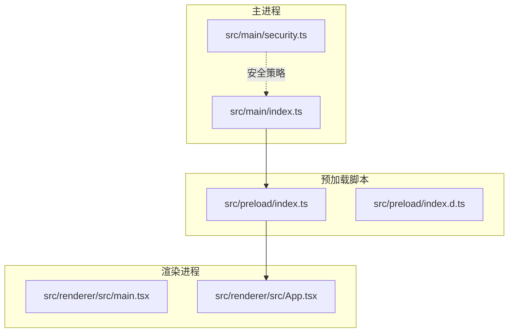
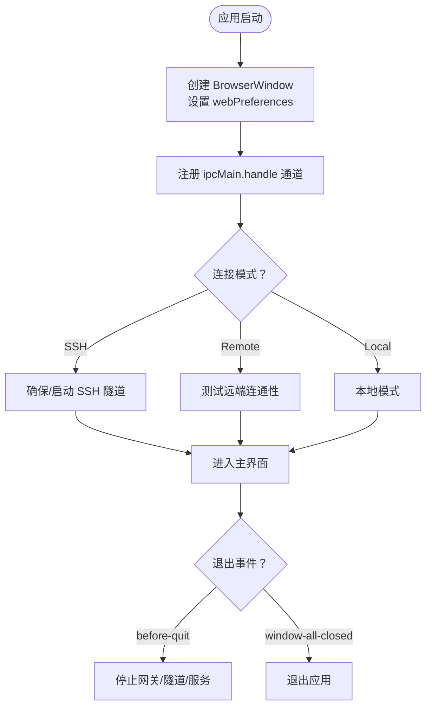
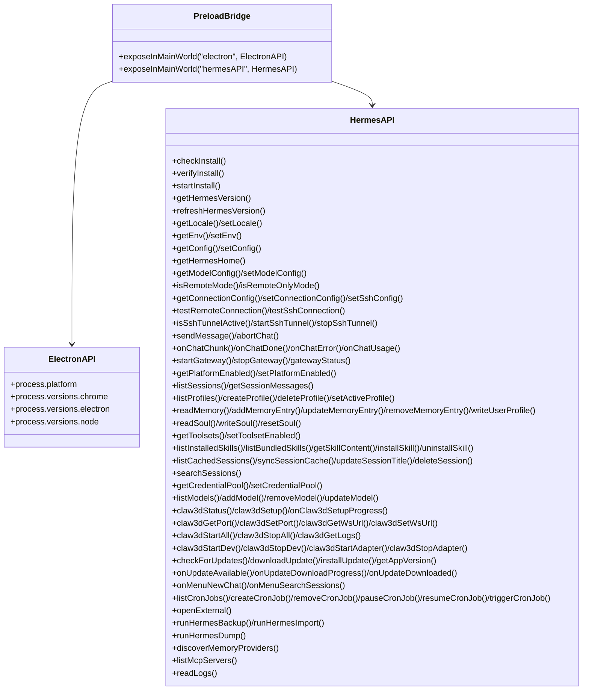
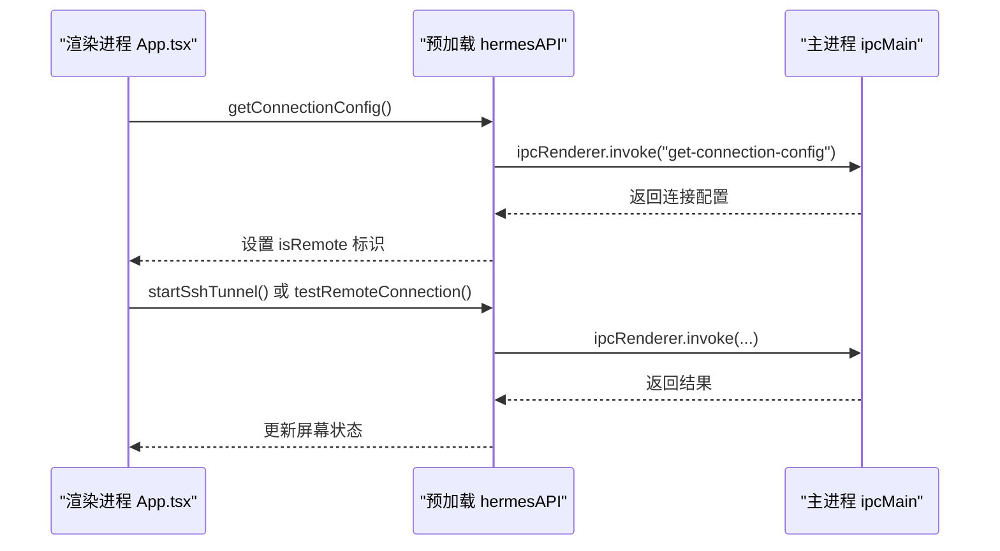
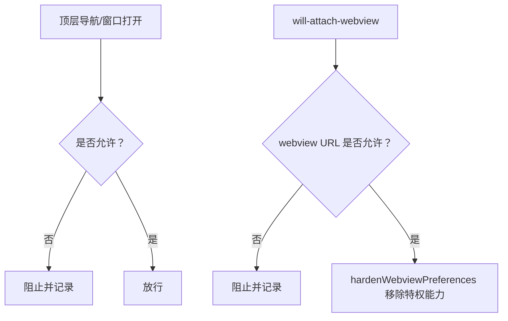
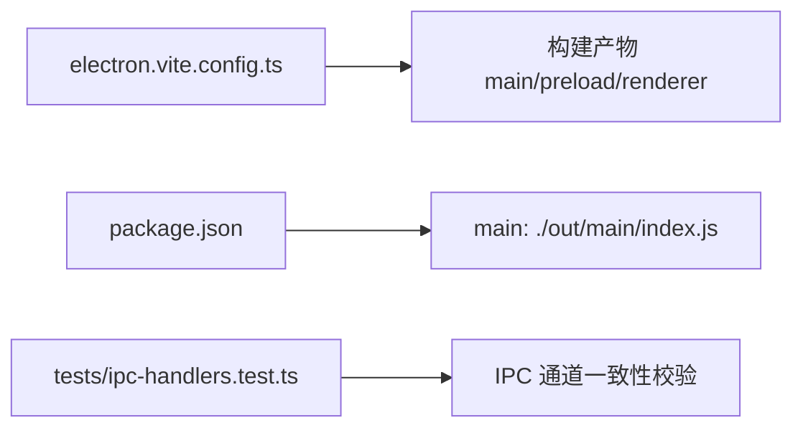

# 进程模型

<cite>
**本文引用的文件**
- [src/main/index.ts](file://src/main/index.ts)
- [src/preload/index.ts](file://src/preload/index.ts)
- [src/preload/index.d.ts](file://src/preload/index.d.ts)
- [src/renderer/src/main.tsx](file://src/renderer/src/main.tsx)
- [src/renderer/src/App.tsx](file://src/renderer/src/App.tsx)
- [src/main/security.ts](file://src/main/security.ts)
- [electron.vite.config.ts](file://electron.vite.config.ts)
- [package.json](file://package.json)
- [tests/ipc-handlers.test.ts](file://tests/ipc-handlers.test.ts)
- [tests/electron-security.test.ts](file://tests/electron-security.test.ts)
</cite>

## 目录
1. [引言](#引言)
2. [项目结构](#项目结构)
3. [核心组件](#核心组件)
4. [架构总览](#架构总览)
5. [详细组件分析](#详细组件分析)
6. [依赖关系分析](#依赖关系分析)
7. [性能考量](#性能考量)
8. [故障排查指南](#故障排查指南)
9. [结论](#结论)
10. [附录](#附录)

## 引言
本文件系统性阐述 Hermes Desktop 的进程模型与三层架构：主进程（Main Process）、预加载脚本（Preload Script）与渲染进程（Renderer Process）。文档聚焦以下主题：
- 各进程的职责边界与协作机制
- 生命周期管理与退出清理
- 内存隔离、安全边界与权限控制
- 进程间通信（IPC）实现与上下文隔离
- 进程启动流程与数据流图
- 常见问题定位与最佳实践

## 项目结构
Hermes Desktop 采用标准 Electron 三进程模型，并通过 Vite 构建器分离 main、preload、renderer 三类产物。关键文件分布如下：
- 主进程入口与窗口管理：src/main/index.ts
- 预加载脚本与 API 暴露：src/preload/index.ts 及类型声明 src/preload/index.d.ts
- 渲染进程入口与应用逻辑：src/renderer/src/main.tsx、src/renderer/src/App.tsx
- 安全策略与导航限制：src/main/security.ts
- 构建配置：electron.vite.config.ts、package.json



图表来源
- [src/main/index.ts:196-288](file://src/main/index.ts#L196-L288)
- [src/preload/index.ts:688-701](file://src/preload/index.ts#L688-L701)
- [src/renderer/src/main.tsx:1-15](file://src/renderer/src/main.tsx#L1-L15)
- [src/renderer/src/App.tsx:16-99](file://src/renderer/src/App.tsx#L16-L99)
- [src/main/security.ts:25-77](file://src/main/security.ts#L25-L77)

章节来源
- [electron.vite.config.ts:1-33](file://electron.vite.config.ts#L1-L33)
- [package.json:1-70](file://package.json#L1-L70)

## 核心组件
- 主进程（Main）
  - 负责创建 BrowserWindow、注册 IPC 处理器、管理应用生命周期事件、执行系统级任务（安装、更新、日志、备份等）、启动/停止网关与 SSH 隧道、安全策略校验与窗口行为控制。
  - 关键职责包括：窗口初始化、IPC 注册、远程模式与 SSH 隧道集成、安全导航与 webview 硬化、崩溃监控与日志记录。

- 预加载脚本（Preload）
  - 通过 contextBridge 将受控 API 暴露到渲染进程全局命名空间，仅暴露白名单方法，避免直接暴露 Node/Electron 全能 API。
  - 提供统一的 IPC 调用封装与事件监听器注册/移除接口，保证调用一致性与资源释放。

- 渲染进程（Renderer）
  - React 应用入口负责 UI 初始化与屏幕切换；业务逻辑通过 hermesAPI 发起 IPC 请求，接收事件回调并驱动界面状态。

章节来源
- [src/main/index.ts:196-288](file://src/main/index.ts#L196-L288)
- [src/preload/index.ts:688-701](file://src/preload/index.ts#L688-L701)
- [src/renderer/src/main.tsx:1-15](file://src/renderer/src/main.tsx#L1-L15)
- [src/renderer/src/App.tsx:16-99](file://src/renderer/src/App.tsx#L16-L99)

## 架构总览
下图展示三进程交互与 IPC 通道映射关系，体现“主进程集中控制、预加载脚本桥接、渲染进程专注 UI”的分层设计。

```mermaid
sequenceDiagram
participant R as "渲染进程<br/>src/renderer/src/App.tsx"
participant P as "预加载脚本<br/>src/preload/index.ts"
participant M as "主进程<br/>src/main/index.ts"
R->>P : 调用 window.hermesAPI.*ipcRenderer.invoke
P->>M : ipcMain.handle 注册的通道名
M-->>P : 返回 Promise 结果或触发事件
P-->>R : 分发事件回调onXxx
Note over R,P,M : 仅通过白名单通道通信，严格上下文隔离
```

图表来源
- [src/renderer/src/App.tsx:34-66](file://src/renderer/src/App.tsx#L34-L66)
- [src/preload/index.ts:15-686](file://src/preload/index.ts#L15-L686)
- [src/main/index.ts:290-800](file://src/main/index.ts#L290-L800)

章节来源
- [tests/ipc-handlers.test.ts:38-56](file://tests/ipc-handlers.test.ts#L38-L56)

## 详细组件分析

### 主进程（Main）
- 窗口创建与偏好
  - 禁用 nodeIntegration，启用 contextIsolation、sandbox、webSecurity，限制 webviewTag 并设置 webPreferences。
  - 监听渲染进程崩溃、控制台错误与加载失败事件，便于诊断。
  - 顶层导航与 webview 附加均受安全策略拦截与硬化处理。

- IPC 注册与业务编排
  - 注册大量 ipcMain.handle 通道，覆盖安装、配置、会话、记忆体、技能、工具集、定时任务、Claw3D、更新、日志等。
  - 对远程/SSH 模式进行分支处理，必要时自动启动网关与隧道，缓存远端密钥以支持后续聊天认证。

- 生命周期与退出清理
  - activate：无窗口时重建主窗口
  - window-all-closed：非 macOS 退出并停止网关/隧道/服务
  - before-quit：停止健康轮询、中断在途聊天、关闭网关/隧道/服务



图表来源
- [src/main/index.ts:196-288](file://src/main/index.ts#L196-L288)
- [src/main/index.ts:1210-1234](file://src/main/index.ts#L1210-L1234)
- [src/main/index.ts:290-800](file://src/main/index.ts#L290-L800)

章节来源
- [src/main/index.ts:174-180](file://src/main/index.ts#L174-L180)
- [src/main/index.ts:226-248](file://src/main/index.ts#L226-L248)
- [src/main/index.ts:250-281](file://src/main/index.ts#L250-L281)
- [src/main/index.ts:1210-1234](file://src/main/index.ts#L1210-L1234)

### 预加载脚本（Preload）
- 上下文隔离与 API 暴露
  - 在 contextIsolated 环境中使用 contextBridge.exposeInMainWorld 暴露 window.electron 与 window.hermesAPI。
  - hermesAPI 方法均为 ipcRenderer.invoke 包装，事件监听通过 ipcRenderer.on/on(channel, handler) 订阅，返回值为移除监听的函数，便于组件卸载时清理。

- 类型安全与契约
  - 通过 src/preload/index.d.ts 明确 hermesAPI 接口签名，确保主进程与渲染进程之间的调用契约一致。



图表来源
- [src/preload/index.ts:4-686](file://src/preload/index.ts#L4-L686)
- [src/preload/index.d.ts:29-471](file://src/preload/index.d.ts#L29-L471)

章节来源
- [src/preload/index.ts:688-701](file://src/preload/index.ts#L688-L701)
- [src/preload/index.d.ts:1-479](file://src/preload/index.d.ts#L1-L479)

### 渲染进程（Renderer）
- 入口与初始化
  - React 根节点在 src/renderer/src/main.tsx 中创建，I18nProvider 包裹应用。
  - App.tsx 在挂载后执行安装检查与模式判定，决定进入欢迎页、安装页、设置页或主界面。

- 与预加载脚本的交互
  - 通过 window.hermesAPI.* 发起 IPC 请求，订阅 onChatXxx、onUpdateXxx 等事件，实现增量消息、进度与更新提示。
  - 在菜单事件（Cmd+N、Cmd+K）等场景下，通过 onMenuXxx 回调响应原生菜单动作。



图表来源
- [src/renderer/src/App.tsx:34-66](file://src/renderer/src/App.tsx#L34-L66)
- [src/preload/index.ts:106-156](file://src/preload/index.ts#L106-L156)
- [src/main/index.ts:473-542](file://src/main/index.ts#L473-L542)

章节来源
- [src/renderer/src/main.tsx:1-15](file://src/renderer/src/main.tsx#L1-L15)
- [src/renderer/src/App.tsx:16-99](file://src/renderer/src/App.tsx#L16-L99)

### 安全边界与权限控制
- 导航与外部链接
  - isAllowedAppNavigationUrl 与 isAllowedExternalUrl 控制顶层导航与外部打开行为，防止跳转至不受信任地址。
- webview 安全
  - isAllowedWebviewUrl 限定 webview 源地址为本地主机与合法端口范围；hardenWebviewPreferences 移除特权能力并强制隔离。
- 窗口与重定向
  - hardenAttachedWebContents 对已附加 webContents 设置 will-navigate/will-redirect 阻断策略。



图表来源
- [src/main/security.ts:25-77](file://src/main/security.ts#L25-L77)
- [src/main/index.ts:255-281](file://src/main/index.ts#L255-L281)

章节来源
- [tests/electron-security.test.ts:18-31](file://tests/electron-security.test.ts#L18-L31)
- [tests/electron-security.test.ts:138-167](file://tests/electron-security.test.ts#L138-L167)

## 依赖关系分析
- 构建与打包
  - electron.vite.config.ts 配置 main/preload/renderer 三类构建，preload 支持多入口（index 与 askpass）。
  - package.json 指定主进程入口 main 字段为 out/main/index.js，开发/构建脚本由 electron-vite 统一调度。

- IPC 一致性保障
  - 测试用例验证主进程与预加载脚本之间 IPC 通道名称一一对应，确保调用与处理不遗漏。



图表来源
- [electron.vite.config.ts:7-31](file://electron.vite.config.ts#L7-L31)
- [package.json:5](file://package.json#L5)
- [tests/ipc-handlers.test.ts:38-56](file://tests/ipc-handlers.test.ts#L38-L56)

章节来源
- [electron.vite.config.ts:1-33](file://electron.vite.config.ts#L1-L33)
- [package.json:1-70](file://package.json#L1-L70)
- [tests/ipc-handlers.test.ts:38-56](file://tests/ipc-handlers.test.ts#L38-L56)

## 性能考量
- 渲染进程稳定性
  - 主进程监听 render-process-gone 事件，便于快速发现崩溃并记录原因与退出码。
- 事件监听清理
  - 预加载脚本对所有 onXxx 事件返回移除监听函数，避免内存泄漏与重复订阅。
- 本地/远程模式选择
  - 优先使用 SSH 隧道或远端模式可减少本地资源占用，同时确保网络延迟可控。
- 网关与隧道生命周期
  - before-quit 与 window-all-closed 中统一停止网关/隧道/服务，避免僵尸进程与资源泄露。

章节来源
- [src/main/index.ts:226-232](file://src/main/index.ts#L226-L232)
- [src/preload/index.ts:175-228](file://src/preload/index.ts#L175-L228)
- [src/main/index.ts:1215-1234](file://src/main/index.ts#L1215-L1234)

## 故障排查指南
- 安装与配置
  - 若渲染进程无法进入主界面，检查 window.hermesAPI.getConnectionConfig() 返回的 mode 与 remoteUrl/apiKey，确认 isRemote 逻辑与 startSshTunnel/testRemoteConnection 的返回值。
- IPC 不一致
  - 使用测试用例思路核对主进程 ipcMain.handle 与预加载 ipcRenderer.invoke 的通道名称是否匹配，避免调用方找不到处理器或主进程未注册。
- 安全拦截导致的异常
  - 若外部链接或 webview 无法打开，检查 isAllowedExternalUrl/isAllowedWebviewUrl 与 hardenWebviewPreferences 的策略，确认 URL 协议、主机与端口符合白名单。
- 崩溃与错误日志
  - 关注主进程控制台输出的 RENDERER ERROR、LOAD FAIL、CRASH 等信息，结合渲染进程控制台级别过滤，定位具体错误位置。

章节来源
- [src/renderer/src/App.tsx:34-66](file://src/renderer/src/App.tsx#L34-L66)
- [tests/ipc-handlers.test.ts:47-55](file://tests/ipc-handlers.test.ts#L47-L55)
- [tests/electron-security.test.ts:138-167](file://tests/electron-security.test.ts#L138-L167)
- [src/main/index.ts:234-248](file://src/main/index.ts#L234-L248)

## 结论
Hermes Desktop 的三进程模型通过严格的上下文隔离与最小化 API 暴露，实现了安全与功能的平衡。主进程集中控制与编排，预加载脚本作为可信桥梁，渲染进程专注于用户体验。完善的 IPC 一致性校验与安全策略，配合生命周期清理，共同保障了应用的稳定性与安全性。

## 附录
- 进程启动流程（简化）
  - 主进程启动 → 创建 BrowserWindow 并加载渲染页面 → 注册 IPC 处理器 → 判定连接模式 → 必要时启动 SSH 隧道/网关 → 渲染进程初始化并进入相应屏幕。
- 进程间数据流（简化）
  - 渲染进程通过 hermesAPI 发起请求 → 预加载脚本转发到主进程 → 主进程执行业务逻辑并返回结果/事件 → 预加载脚本分发给渲染进程回调。