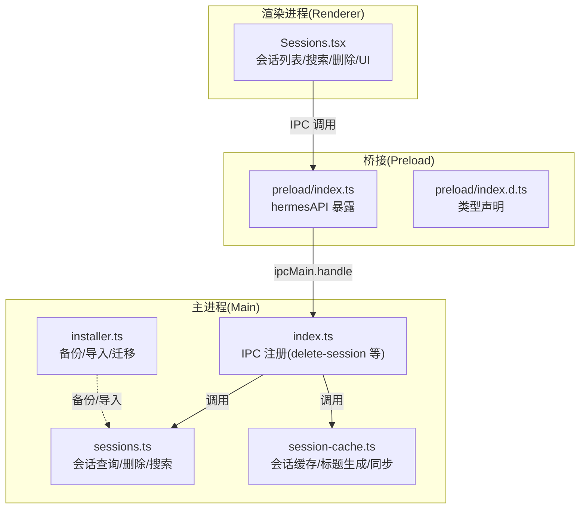
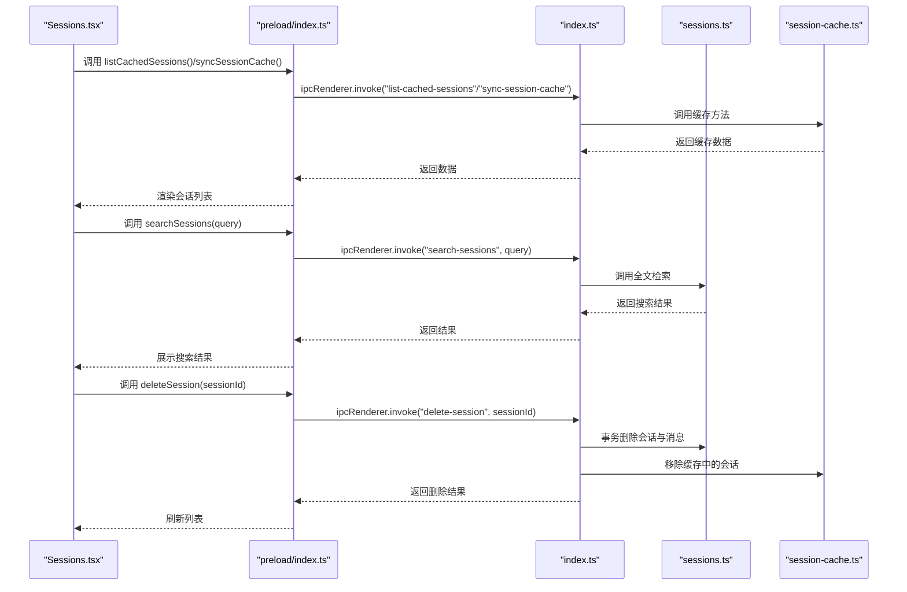
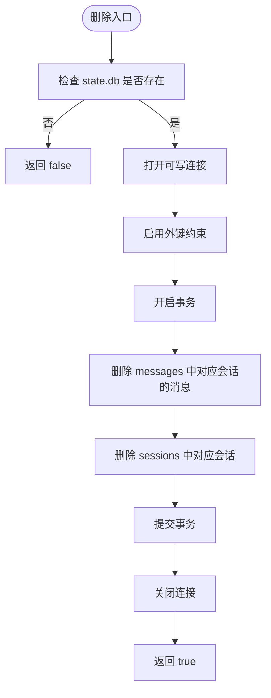
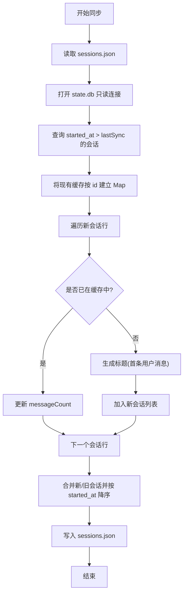
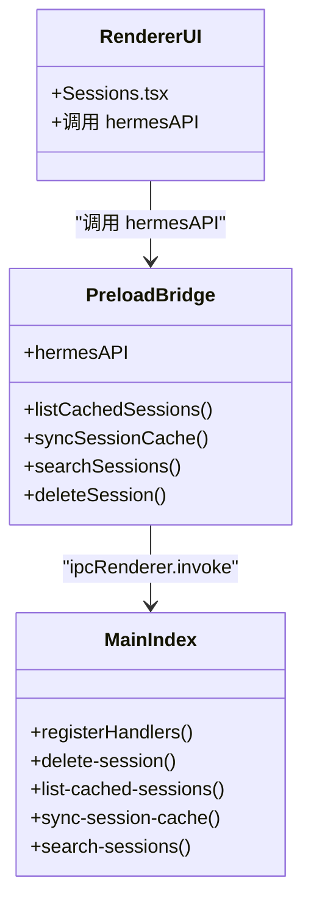
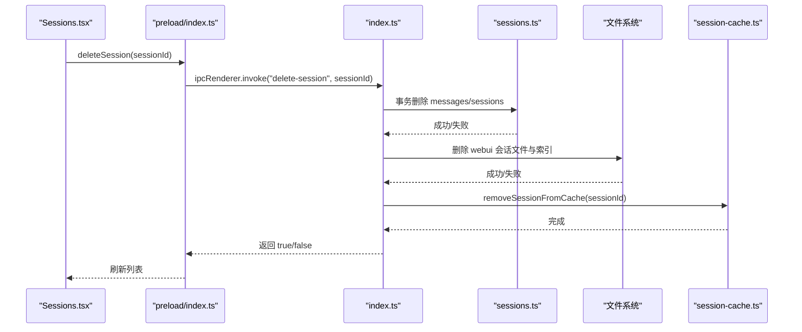
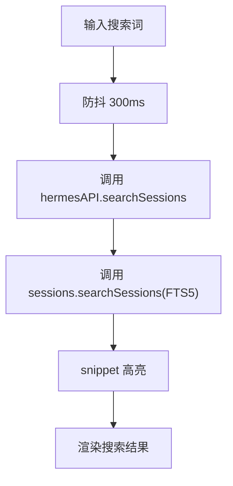
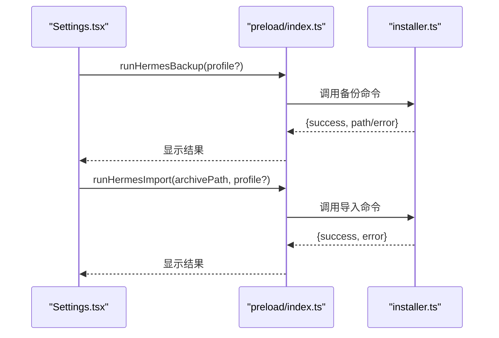
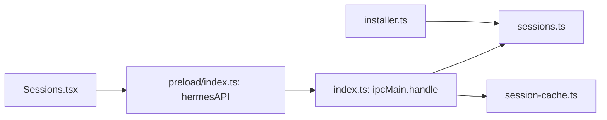

# 会话管理

<cite>
**本文引用的文件**
- [sessions.ts](file://src/main/sessions.ts)
- [session-cache.ts](file://src/main/session-cache.ts)
- [index.ts](file://src/main/index.ts)
- [index.ts](file://src/preload/index.ts)
- [index.d.ts](file://src/preload/index.d.ts)
- [Sessions.tsx](file://src/renderer/src/screens/Sessions/Sessions.tsx)
- [installer.ts](file://src/main/installer.ts)
- [sessions.ts](file://src/shared/i18n/locales/zh-CN/sessions.ts)
- [sessions.ts](file://src/shared/i18n/locales/en/sessions.ts)
- [sessions-delete-feature.md](file://docs/sessions-delete-feature.md)
- [sessions-delete-fix-2026-05-14.md](file://docs/sessions-delete-fix-2026-05-14.md)
- [hermes-desktop-architecture.md](file://docs/hermes-desktop-architecture.md)
- [session-cache-sync.test.ts](file://tests/session-cache-sync.test.ts)
</cite>

## 目录
1. [简介](#简介)
2. [项目结构](#项目结构)
3. [核心组件](#核心组件)
4. [架构总览](#架构总览)
5. [详细组件分析](#详细组件分析)
6. [依赖关系分析](#依赖关系分析)
7. [性能考量](#性能考量)
8. [故障排查指南](#故障排查指南)
9. [结论](#结论)
10. [附录](#附录)

## 简介
本文件系统性阐述 Hermes Desktop 的会话管理系统，覆盖会话生命周期（创建、更新、删除、恢复）、数据存储与索引、缓存与内存管理、搜索与标签、同步与一致性、API 使用示例、导入导出与迁移、以及大数据量场景下的性能优化建议。目标是帮助开发者与使用者全面理解会话子系统的实现与最佳实践。

## 项目结构
会话管理涉及三大层次：
- 主进程数据库层：负责 SQLite 数据库存取与全文检索。
- 本地缓存层：负责会话摘要的快速读取与标题生成。
- 渲染进程 UI 层：负责展示、搜索、删除与交互。

图示来源
- [sessions.ts:1-212](file://src/main/sessions.ts#L1-L212)
- [session-cache.ts:1-252](file://src/main/session-cache.ts#L1-L252)
- [index.ts:80-90](file://src/main/index.ts#L80-L90)
- [index.ts:409-411](file://src/preload/index.ts#L409-L411)
- [Sessions.tsx:171-383](file://src/renderer/src/screens/Sessions/Sessions.tsx#L171-L383)

章节来源
- [hermes-desktop-architecture.md:43-110](file://docs/hermes-desktop-architecture.md#L43-L110)

## 核心组件
- 会话数据库接口：提供会话列表、消息查询、全文搜索、删除会话等能力。
- 会话缓存：提供本地 JSON 缓存，加速会话列表渲染与标题生成。
- IPC 桥接：在渲染进程暴露统一的 hermesAPI，屏蔽底层细节。
- 删除流程：主进程处理删除（含事务与文件系统清理），并同步更新缓存。
- 备份/导入：通过 installer.ts 调用 Hermes CLI 执行备份与导入。

章节来源
- [sessions.ts:46-212](file://src/main/sessions.ts#L46-L212)
- [session-cache.ts:82-167](file://src/main/session-cache.ts#L82-L167)
- [index.ts:80-90](file://src/main/index.ts#L80-L90)
- [index.ts:409-411](file://src/preload/index.ts#L409-L411)
- [installer.ts:813-862](file://src/main/installer.ts#L813-L862)

## 架构总览
会话管理遵循“主进程数据库 + 本地缓存 + 渲染层 UI”的分层设计。IPC 层统一暴露 API，UI 层负责交互与展示，主进程负责数据一致性与持久化。

图示来源
- [Sessions.tsx:199-238](file://src/renderer/src/screens/Sessions/Sessions.tsx#L199-L238)
- [index.ts:80-90](file://src/main/index.ts#L80-L90)
- [sessions.ts:91-156](file://src/main/sessions.ts#L91-L156)
- [session-cache.ts:191-251](file://src/main/session-cache.ts#L191-L251)

## 详细组件分析

### 会话数据库层（sessions.ts）
- 数据库路径：基于 HERMES_HOME 的 state.db。
- 接口职责：
  - 列出会话：按开始时间倒序，支持分页。
  - 搜索会话：基于 FTS5 全文检索，返回高亮片段。
  - 获取消息：按时间戳排序返回用户与助手消息。
  - 删除会话：开启外键约束，事务删除消息与会话。
- 性能与一致性：
  - 使用只读连接进行查询，避免写锁干扰。
  - 删除采用事务，确保数据一致性。

图示来源
- [sessions.ts:188-212](file://src/main/sessions.ts#L188-L212)

章节来源
- [sessions.ts:36-212](file://src/main/sessions.ts#L36-L212)

### 会话缓存层（session-cache.ts）
- 缓存文件：desktop/sessions.json，包含会话摘要与最后同步时间。
- 标题生成：从首条用户消息提取文本，清洗与截断生成短标题。
- 同步策略：仅拉取 lastSync 之后的新/更新会话，合并旧缓存，保持 O(N) 查找效率。
- 删除同步：删除会话后同步从缓存移除，确保 UI 即时更新。

图示来源
- [session-cache.ts:82-167](file://src/main/session-cache.ts#L82-L167)

章节来源
- [session-cache.ts:29-58](file://src/main/session-cache.ts#L29-L58)
- [session-cache.ts:82-167](file://src/main/session-cache.ts#L82-L167)
- [session-cache.ts:191-251](file://src/main/session-cache.ts#L191-L251)
- [session-cache-sync.test.ts:345-371](file://tests/session-cache-sync.test.ts#L345-L371)

### IPC 与桥接（index.ts + preload/index.ts + preload/index.d.ts）
- 主进程注册 IPC：delete-session、list-cached-sessions、sync-session-cache、search-sessions 等。
- preload 暴露 hermesAPI：统一的 Promise 接口，屏蔽 IPC 细节。
- 类型声明：确保 TypeScript 在渲染进程安全调用。

图示来源
- [index.ts:80-90](file://src/main/index.ts#L80-L90)
- [index.ts:409-411](file://src/preload/index.ts#L409-L411)
- [index.d.ts:281-283](file://src/preload/index.d.ts#L281-L283)

章节来源
- [index.ts:80-90](file://src/main/index.ts#L80-L90)
- [index.ts:409-411](file://src/preload/index.ts#L409-L411)
- [index.d.ts:281-283](file://src/preload/index.d.ts#L281-L283)

### 删除功能（Sessions.tsx + 主进程 + 缓存）
- UI 触发：点击会话卡片右侧删除按钮，弹出确认框。
- 主进程处理：删除数据库记录与文件系统中的会话 JSON/索引，同时清理缓存。
- 修复逻辑：即使数据库/文件系统未命中，只要缓存中存在即视为删除成功，确保 UI 即时更新。

图示来源
- [Sessions.tsx:186-197](file://src/renderer/src/screens/Sessions/Sessions.tsx#L186-L197)
- [index.ts:93-99](file://src/main/index.ts#L93-L99)
- [sessions.ts:188-212](file://src/main/sessions.ts#L188-L212)
- [session-cache.ts:191-198](file://src/main/session-cache.ts#L191-L198)
- [sessions-delete-fix-2026-05-14.md:44-58](file://docs/sessions-delete-fix-2026-05-14.md#L44-L58)

章节来源
- [sessions-delete-feature.md:27-54](file://docs/sessions-delete-feature.md#L27-L54)
- [sessions-delete-fix-2026-05-14.md:24-59](file://docs/sessions-delete-fix-2026-05-14.md#L24-L59)

### 搜索与标签（Sessions.tsx + sessions.ts）
- 搜索：输入防抖，调用 searchSessions，返回带高亮片段的结果。
- 标签：来源、消息数、模型（简短化显示）。
- 分组：按“今天/昨天/本周/更早”分组展示。

图示来源
- [Sessions.tsx:222-238](file://src/renderer/src/screens/Sessions/Sessions.tsx#L222-L238)
- [sessions.ts:91-156](file://src/main/sessions.ts#L91-L156)

章节来源
- [Sessions.tsx:31-105](file://src/renderer/src/screens/Sessions/Sessions.tsx#L31-L105)
- [Sessions.tsx:222-350](file://src/renderer/src/screens/Sessions/Sessions.tsx#L222-L350)
- [sessions.ts:91-156](file://src/main/sessions.ts#L91-L156)

### 备份/导入与迁移（installer.ts + Settings UI）
- 备份：调用 Hermes CLI backup，解析输出路径，返回结果。
- 导入：选择归档文件，调用 Hermes CLI import，提示迁移完成或失败。
- 迁移：与会话数据一致，确保历史会话与消息保留。

图示来源
- [installer.ts:813-862](file://src/main/installer.ts#L813-L862)
- [Sessions.tsx:254-285](file://src/renderer/src/screens/Settings/Settings.tsx#L254-L285)

章节来源
- [installer.ts:813-862](file://src/main/installer.ts#L813-L862)
- [Sessions.tsx:254-285](file://src/renderer/src/screens/Settings/Settings.tsx#L254-L285)

## 依赖关系分析
- 主进程模块耦合度低：sessions.ts 与 session-cache.ts 各司其职，互不直接依赖，通过 IPC 与缓存文件交互。
- IPC 层提供稳定契约：preload/index.ts 将主进程能力以统一 API 暴露给渲染进程。
- UI 与数据解耦：Sessions.tsx 仅依赖 hermesAPI，不关心具体实现细节。

图示来源
- [Sessions.tsx:171-238](file://src/renderer/src/screens/Sessions/Sessions.tsx#L171-L238)
- [index.ts:409-411](file://src/preload/index.ts#L409-L411)
- [index.ts:80-90](file://src/main/index.ts#L80-L90)
- [sessions.ts:46-156](file://src/main/sessions.ts#L46-L156)
- [session-cache.ts:82-167](file://src/main/session-cache.ts#L82-L167)
- [installer.ts:813-862](file://src/main/installer.ts#L813-L862)

章节来源
- [index.ts:80-90](file://src/main/index.ts#L80-L90)
- [index.ts:409-411](file://src/preload/index.ts#L409-L411)

## 性能考量
- 会话列表渲染：
  - 优先读取本地缓存，减少数据库 IO。
  - 同步时使用 Map 建立 id->会话映射，避免 O(N²) 合并。
- 搜索性能：
  - 使用 FTS5 虚拟表与 MATCH 查询，配合 snippet 高亮。
  - 输入防抖降低查询频率。
- 删除性能：
  - 事务内删除消息与会话，避免部分删除。
  - 同步清理缓存，避免后续重复读取。
- 大数据量优化：
  - 仅增量同步会话，lastSync 偏差加 300s 容差，避免重复扫描。
  - 会话列表分页查询，避免一次性加载过多。

章节来源
- [session-cache.ts:106-111](file://src/main/session-cache.ts#L106-L111)
- [session-cache-sync.test.ts:345-371](file://tests/session-cache-sync.test.ts#L345-L371)
- [Sessions.tsx:222-238](file://src/renderer/src/screens/Sessions/Sessions.tsx#L222-L238)
- [sessions.ts:91-156](file://src/main/sessions.ts#L91-L156)

## 故障排查指南
- 删除无效或 UI 不更新：
  - 确认主进程 delete-session handler 是否被调用。
  - 检查缓存是否被移除（removeSessionFromCache）。
  - 参考修复记录：即使数据库/文件系统未命中，只要缓存中存在即返回 true，确保 UI 正确刷新。
- 搜索无结果：
  - 确认 FTS5 表是否存在（messages_fts）。
  - 检查查询词是否为空或被清洗为空。
- 同步异常：
  - 检查 sessions.json 是否损坏或权限问题。
  - 确认 lastSync 时间戳是否合理。
- 备份/导入失败：
  - 查看 CLI 输出与错误信息，确认归档格式与路径有效。

章节来源
- [sessions-delete-fix-2026-05-14.md:9-14](file://docs/sessions-delete-fix-2026-05-14.md#L9-L14)
- [sessions.ts:96-103](file://src/main/sessions.ts#L96-L103)
- [session-cache.ts:60-75](file://src/main/session-cache.ts#L60-L75)
- [installer.ts:813-862](file://src/main/installer.ts#L813-L862)

## 结论
Hermes Desktop 的会话管理以“数据库 + 本地缓存 + IPC 桥接 + UI 展示”的清晰分层实现，兼顾性能与一致性。通过事务删除、增量同步、FTS5 搜索与缓存优化，系统在大数据量场景下仍能保持良好体验。删除功能的修复进一步提升了用户体验的一致性。备份/导入能力保障了数据可移植性与可恢复性。

## 附录

### 会话生命周期与数据结构
- 会话摘要（缓存）：包含 id、title、startedAt、source、messageCount、model。
- 会话摘要（数据库）：包含 id、source、startedAt、endedAt、messageCount、model、title。
- 消息：包含 id、role、content、timestamp。
- 搜索结果：包含 sessionId、title、startedAt、source、messageCount、model、snippet。

章节来源
- [sessions.ts:8-34](file://src/main/sessions.ts#L8-L34)
- [session-cache.ts:15-27](file://src/main/session-cache.ts#L15-L27)

### API 使用示例（路径参考）
- 获取会话列表
  - 路径参考：[Sessions.tsx:199-209](file://src/renderer/src/screens/Sessions/Sessions.tsx#L199-L209)
  - IPC 调用：[index.ts:409-411](file://src/preload/index.ts#L409-L411)
  - 主进程实现：[index.ts:80-90](file://src/main/index.ts#L80-L90)
- 搜索会话
  - 路径参考：[Sessions.tsx:222-238](file://src/renderer/src/screens/Sessions/Sessions.tsx#L222-L238)
  - 实现：[sessions.ts:91-156](file://src/main/sessions.ts#L91-L156)
- 删除会话
  - 路径参考：[Sessions.tsx:186-197](file://src/renderer/src/screens/Sessions/Sessions.tsx#L186-L197)
  - 主进程处理：[sessions.ts:188-212](file://src/main/sessions.ts#L188-L212)
  - 缓存清理：[session-cache.ts:191-198](file://src/main/session-cache.ts#L191-L198)
- 获取会话消息
  - 路径参考：[Sessions.tsx:300-308](file://src/renderer/src/screens/Sessions/Sessions.tsx#L300-L308)
  - 实现：[sessions.ts:158-186](file://src/main/sessions.ts#L158-L186)
- 备份/导入
  - 路径参考：[Settings.tsx:254-285](file://src/renderer/src/screens/Settings/Settings.tsx#L254-L285)
  - 实现：[installer.ts:813-862](file://src/main/installer.ts#L813-L862)

### 国际化与 UI 文案
- 中文文案：[sessions.ts:1-19](file://src/shared/i18n/locales/zh-CN/sessions.ts#L1-L19)
- 英文文案：[sessions.ts:1-19](file://src/shared/i18n/locales/en/sessions.ts#L1-L19)