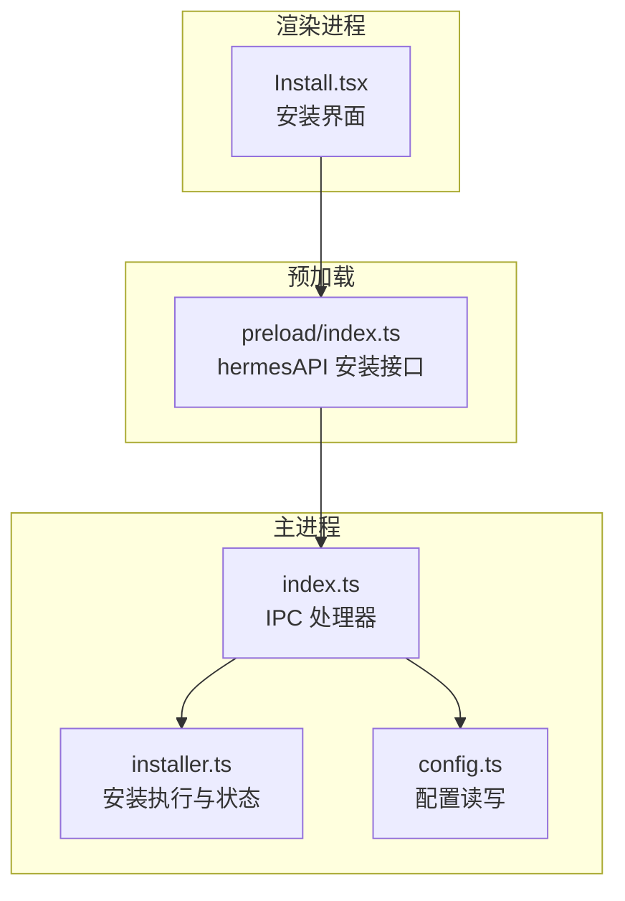
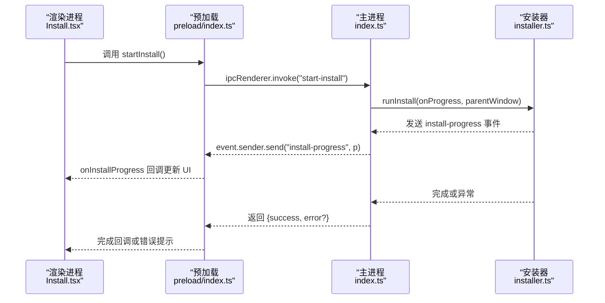
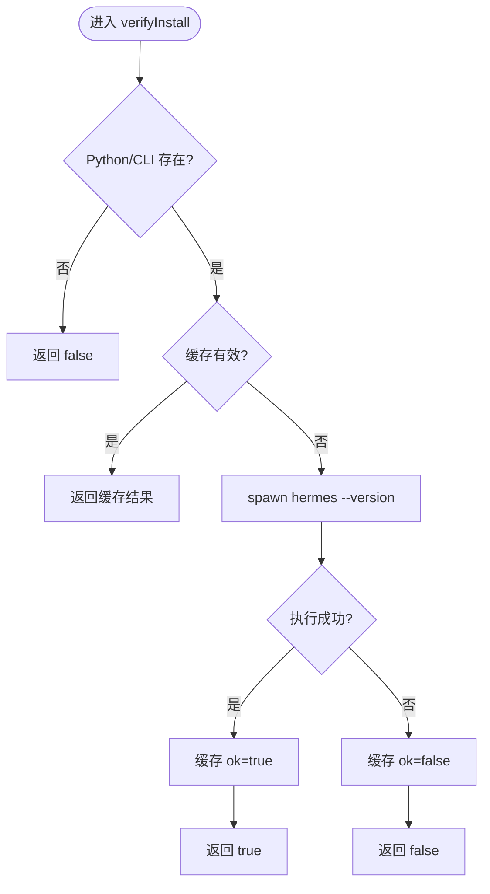
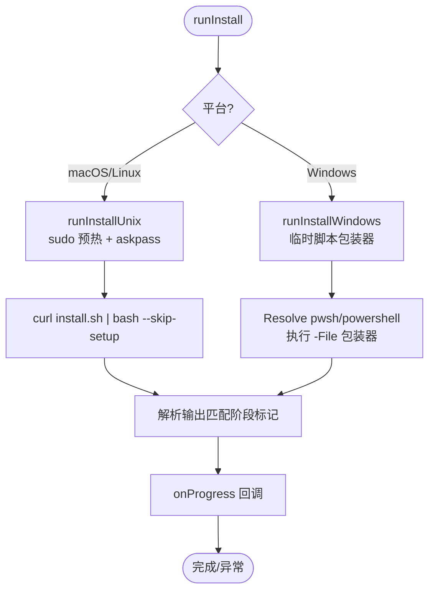
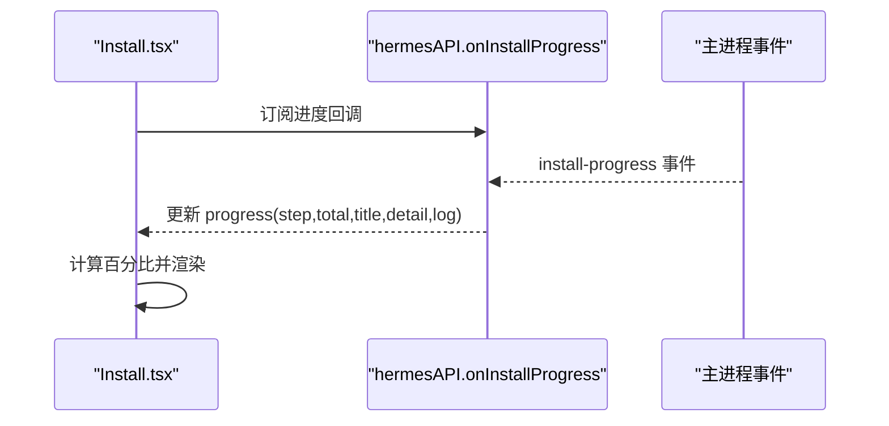
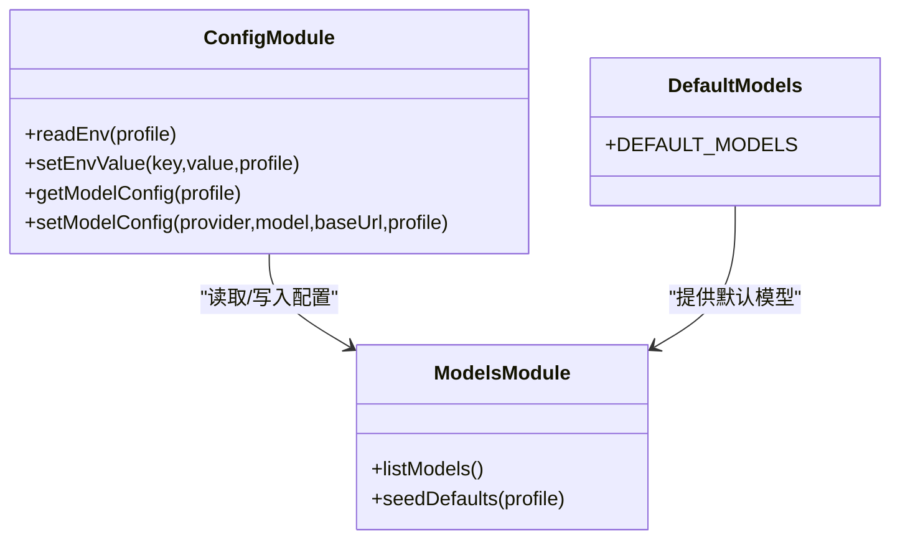
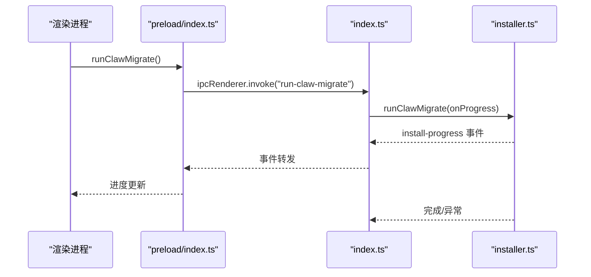

# 安装管理器

<cite>
**本文档引用的文件**
- [src/main/installer.ts](file://src/main/installer.ts)
- [src/main/index.ts](file://src/main/index.ts)
- [src/preload/index.ts](file://src/preload/index.ts)
- [src/renderer/src/screens/Install/Install.tsx](file://src/renderer/src/screens/Install/Install.tsx)
- [src/shared/i18n/locales/en/install.ts](file://src/shared/i18n/locales/en/install.ts)
- [src/shared/i18n/locales/zh-CN/install.ts](file://src/shared/i18n/locales/zh-CN/install.ts)
- [tests/installer-platform.test.ts](file://tests/installer-platform.test.ts)
- [tests/installer-utils.test.ts](file://tests/installer-utils.test.ts)
- [src/main/config.ts](file://src/main/config.ts)
- [src/main/default-models.ts](file://src/main/default-models.ts)
- [src/main/models.ts](file://src/main/models.ts)
- [docs/hermes-desktop-architecture.md](file://docs/hermes-desktop-architecture.md)
</cite>

## 目录
1. [简介](#简介)
2. [项目结构](#项目结构)
3. [核心组件](#核心组件)
4. [架构总览](#架构总览)
5. [详细组件分析](#详细组件分析)
6. [依赖关系分析](#依赖关系分析)
7. [性能考虑](#性能考虑)
8. [故障排除指南](#故障排除指南)
9. [结论](#结论)
10. [附录](#附录)

## 简介
本文件为 Hermes Desktop 安装管理器的综合技术文档，覆盖安装流程全生命周期：Python 环境检测、Hermes Agent 下载与安装、依赖安装与配置初始化；同时阐述不同平台（Windows、macOS、Linux）的差异与特定处理逻辑；包含安装状态管理、进度跟踪、错误恢复与重试机制；说明默认模型配置、环境变量设置与路径管理；提供故障排除指南与离线安装、增量更新、版本兼容性处理建议，并给出安装 API 的使用示例。

## 项目结构
安装管理器由三部分协作构成：
- 主进程（Main）：负责实际安装执行、状态检查、版本查询、进度广播与 IPC 处理
- 预加载（Preload）：桥接渲染进程与主进程，暴露安装相关的 API
- 渲染进程（Renderer）：安装界面与用户交互，接收进度事件并展示

图表来源
- [src/renderer/src/screens/Install/Install.tsx:1-171](file://src/renderer/src/screens/Install/Install.tsx#L1-L171)
- [src/preload/index.ts:15-52](file://src/preload/index.ts#L15-L52)
- [src/main/index.ts:290-351](file://src/main/index.ts#L290-L351)
- [src/main/installer.ts:517-650](file://src/main/installer.ts#L517-L650)
- [src/main/config.ts:101-167](file://src/main/config.ts#L101-L167)

章节来源
- [src/main/installer.ts:1-1130](file://src/main/installer.ts#L1-L1130)
- [src/main/index.ts:290-489](file://src/main/index.ts#L290-L489)
- [src/preload/index.ts:15-52](file://src/preload/index.ts#L15-L52)
- [src/renderer/src/screens/Install/Install.tsx:1-171](file://src/renderer/src/screens/Install/Install.tsx#L1-L171)

## 核心组件
- 安装状态与进度数据结构
  - InstallStatus：installed、configured、hasApiKey、verified
  - InstallProgress：step、totalSteps、title、detail、log
- 平台路径增强 getEnhancedPath：自动拼接系统 PATH 与 Python/Node/Git 等工具路径，提升跨平台可发现性
- 安装执行 runInstall：根据平台调用不同安装策略，输出进度事件
- Windows 安装 runInstallWindows：通过临时 PowerShell 脚本包装器执行 install.ps1
- macOS/Linux 安装：前置 sudo 凭据缓存与 askpass 桥接，避免无头环境下的阻塞
- 版本与验证：getHermesVersion、verifyInstall、runHermesDoctor
- OpenClaw 迁移：checkOpenClawExists、runClawMigrate
- 更新：runHermesUpdate
- API 暴露：preload/index.ts 中的 hermesAPI.install*

章节来源
- [src/main/installer.ts:41-54](file://src/main/installer.ts#L41-L54)
- [src/main/installer.ts:153-213](file://src/main/installer.ts#L153-L213)
- [src/main/installer.ts:517-650](file://src/main/installer.ts#L517-L650)
- [src/main/installer.ts:676-799](file://src/main/installer.ts#L676-L799)
- [src/main/installer.ts:252-296](file://src/main/installer.ts#L252-L296)
- [src/main/installer.ts:298-319](file://src/main/installer.ts#L298-L319)
- [src/main/installer.ts:333-396](file://src/main/installer.ts#L333-L396)
- [src/main/installer.ts:398-454](file://src/main/installer.ts#L398-L454)
- [src/preload/index.ts:15-52](file://src/preload/index.ts#L15-L52)

## 架构总览
安装流程从渲染层触发，经由 preload 的 hermesAPI 调用主进程 IPC，主进程启动安装执行器并实时推送进度事件到渲染层。

图表来源
- [src/renderer/src/screens/Install/Install.tsx:40-53](file://src/renderer/src/screens/Install/Install.tsx#L40-L53)
- [src/preload/index.ts:25-26](file://src/preload/index.ts#L25-L26)
- [src/main/index.ts:298-307](file://src/main/index.ts#L298-L307)
- [src/main/installer.ts:517-650](file://src/main/installer.ts#L517-L650)

## 详细组件分析

### 安装状态管理与验证
- checkInstallStatus：快速判断是否已安装/配置/有密钥/已验证
- verifyInstall：延迟深度验证，调用 Python CLI 获取版本号，带缓存与超时
- hasHermesAuthCredential：从 auth.json 识别 OAuth 类凭据池中的活跃提供者

图表来源
- [src/main/installer.ts:220-246](file://src/main/installer.ts#L220-L246)
- [src/main/installer.ts:153-213](file://src/main/installer.ts#L153-L213)
- [src/main/installer.ts:136-151](file://src/main/installer.ts#L136-L151)

章节来源
- [src/main/installer.ts:153-213](file://src/main/installer.ts#L153-L213)
- [src/main/installer.ts:220-246](file://src/main/installer.ts#L220-L246)
- [src/main/installer.ts:136-151](file://src/main/installer.ts#L136-L151)

### 跨平台安装执行
- Windows：解析 PowerShell 可执行文件，写入临时脚本包装器，调用 install.ps1，处理非零退出但二进制树存在的容错
- macOS/Linux：前置 sudo 凭据缓存与 askpass 桥接，避免 Playwright 依赖安装时的 sudo 挂起；通过官方 install.sh 执行，解析输出以识别安装阶段

图表来源
- [src/main/installer.ts:517-650](file://src/main/installer.ts#L517-L650)
- [src/main/installer.ts:676-799](file://src/main/installer.ts#L676-L799)
- [src/main/installer.ts:470-515](file://src/main/installer.ts#L470-L515)

章节来源
- [src/main/installer.ts:517-650](file://src/main/installer.ts#L517-L650)
- [src/main/installer.ts:676-799](file://src/main/installer.ts#L676-L799)
- [src/main/installer.ts:470-515](file://src/main/installer.ts#L470-L515)

### 进度跟踪与 UI 展示
- 渲染层订阅 onInstallProgress，实时更新进度条、步骤标题与日志
- 支持复制日志、重试安装、跳转社区支持等操作

图表来源
- [src/renderer/src/screens/Install/Install.tsx:36-65](file://src/renderer/src/screens/Install/Install.tsx#L36-L65)
- [src/preload/index.ts:28-52](file://src/preload/index.ts#L28-L52)
- [src/main/index.ts:300-302](file://src/main/index.ts#L300-L302)

章节来源
- [src/renderer/src/screens/Install/Install.tsx:1-171](file://src/renderer/src/screens/Install/Install.tsx#L1-L171)
- [src/preload/index.ts:15-52](file://src/preload/index.ts#L15-L52)
- [src/main/index.ts:298-307](file://src/main/index.ts#L298-L307)

### 环境变量与配置初始化
- 环境变量读取与写入：readEnv、setEnvValue，含键名校验与单行值限制
- 模型配置：getModelConfig、setModelConfig，含智能路由禁用与流式开启
- 默认模型：首次安装时写入默认模型列表，支持自定义提供者注入

图表来源
- [src/main/config.ts:101-167](file://src/main/config.ts#L101-L167)
- [src/main/config.ts:215-301](file://src/main/config.ts#L215-L301)
- [src/main/default-models.ts:20-45](file://src/main/default-models.ts#L20-L45)
- [src/main/models.ts:116-114](file://src/main/models.ts#L116-L114)

章节来源
- [src/main/config.ts:101-167](file://src/main/config.ts#L101-L167)
- [src/main/config.ts:215-301](file://src/main/config.ts#L215-L301)
- [src/main/default-models.ts:1-48](file://src/main/default-models.ts#L1-L48)
- [src/main/models.ts:1-169](file://src/main/models.ts#L1-L169)

### OpenClaw 迁移与增量更新
- 检测 OpenClaw 目录存在性，若存在则执行迁移命令，输出进度事件
- 增量更新：调用 hermes update，支持本地与 SSH 远端模式

图表来源
- [src/main/installer.ts:333-396](file://src/main/installer.ts#L333-L396)
- [src/main/index.ts:355-364](file://src/main/index.ts#L355-L364)
- [src/preload/index.ts:65-68](file://src/preload/index.ts#L65-L68)

章节来源
- [src/main/installer.ts:333-396](file://src/main/installer.ts#L333-L396)
- [src/main/index.ts:355-364](file://src/main/index.ts#L355-L364)
- [src/preload/index.ts:65-68](file://src/preload/index.ts#L65-L68)

### 错误恢复与重试机制
- 安装脚本允许非零退出但只要二进制树存在即视为成功
- Windows 安装失败时提供手动执行建议
- 渲染层提供“重试安装”按钮与日志复制能力
- 深度验证失败时提供软警告，允许用户选择重新安装或忽略

章节来源
- [src/main/installer.ts:624-644](file://src/main/installer.ts#L624-L644)
- [src/main/installer.ts:776-782](file://src/main/installer.ts#L776-L782)
- [src/renderer/src/screens/Install/Install.tsx:104-119](file://src/renderer/src/screens/Install/Install.tsx#L104-L119)
- [src/renderer/src/components/VerifyWarningBanner.tsx:1-42](file://src/renderer/src/components/VerifyWarningBanner.tsx#L1-L42)

## 依赖关系分析
- 渲染层依赖 preload 的 hermesAPI 安装接口
- preload 通过 ipcRenderer.invoke 与主进程通信
- 主进程注册 IPC 处理器，调用 installer.ts 实际执行
- installer.ts 依赖 config.ts 提供的配置与路径常量

图表来源
- [src/renderer/src/screens/Install/Install.tsx:1-171](file://src/renderer/src/screens/Install/Install.tsx#L1-L171)
- [src/preload/index.ts:15-52](file://src/preload/index.ts#L15-L52)
- [src/main/index.ts:290-351](file://src/main/index.ts#L290-L351)
- [src/main/installer.ts:1-32](file://src/main/installer.ts#L1-L32)

章节来源
- [src/main/index.ts:290-351](file://src/main/index.ts#L290-L351)
- [src/main/installer.ts:1-32](file://src/main/installer.ts#L1-L32)

## 性能考虑
- 验证与版本查询采用缓存与去抖策略，避免重复调用 Python CLI
- PATH 增强仅在必要时构建，减少字符串拼接开销
- 进度解析基于正则匹配，匹配集有限且稳定，性能可接受
- macOS/Linux 在安装前预热 sudo 凭据，避免后续子进程阻塞

## 故障排除指南
- 安装失败但二进制树存在：可能是上游安装脚本非零退出但仍成功安装，可直接进入下一步
- Windows 缺少 PowerShell 或被策略阻止：检查系统是否安装了 PowerShell，或改用手动执行安装脚本
- macOS/Linux 安装卡在浏览器依赖：需管理员权限，确保 sudo 凭据缓存成功
- 深度验证失败：出现软警告，可选择重新安装或忽略
- 日志定位：渲染层支持复制完整日志，便于社区支持排查

章节来源
- [src/main/installer.ts:624-644](file://src/main/installer.ts#L624-L644)
- [src/main/installer.ts:776-797](file://src/main/installer.ts#L776-L797)
- [src/renderer/src/components/VerifyWarningBanner.tsx:1-42](file://src/renderer/src/components/VerifyWarningBanner.tsx#L1-L42)
- [src/renderer/src/screens/Install/Install.tsx:120-137](file://src/renderer/src/screens/Install/Install.tsx#L120-L137)

## 结论
该安装管理器通过清晰的三层架构实现了跨平台、可观测、可恢复的安装体验。主进程负责安装执行与状态管理，预加载层提供稳定的 API 接口，渲染层提供直观的进度反馈与交互。平台差异通过统一的执行策略与路径增强得到妥善处理，错误恢复与重试机制提升了安装成功率。结合默认模型与配置初始化，用户可在安装后快速进入使用状态。

## 附录

### 安装 API 使用示例（集成要点）
- 在渲染层通过 window.hermesAPI.startInstall() 触发安装
- 订阅 window.hermesAPI.onInstallProgress() 实时更新 UI
- 完成后进入设置流程，失败时提供重试与日志复制入口

章节来源
- [src/renderer/src/screens/Install/Install.tsx:40-53](file://src/renderer/src/screens/Install/Install.tsx#L40-L53)
- [src/preload/index.ts:25-52](file://src/preload/index.ts#L25-L52)
- [src/main/index.ts:298-307](file://src/main/index.ts#L298-L307)

### 默认模型配置
- 默认模型列表包含 OpenRouter、Anthropic、OpenAI 等多提供商模型
- 首次安装时写入 models.json，并支持从配置文件注入自定义提供者

章节来源
- [src/main/default-models.ts:20-45](file://src/main/default-models.ts#L20-L45)
- [src/main/models.ts:77-114](file://src/main/models.ts#L77-L114)

### 平台差异与路径管理
- Windows：优先使用 pwsh，否则回退 powershell.exe；强制 TLS 1.2，解决旧版主机解析问题
- macOS/Linux：增强 PATH，包含 nvm、volta、asdf、homebrew 等常用路径；解析 .zshrc/.bashrc 以继承用户 PATH

章节来源
- [src/main/installer.ts:660-674](file://src/main/installer.ts#L660-L674)
- [src/main/installer.ts:56-104](file://src/main/installer.ts#L56-L104)
- [tests/installer-platform.test.ts:10-31](file://tests/installer-platform.test.ts#L10-L31)

### 离线安装、增量更新与版本兼容
- 离线安装：通过本地脚本或包源进行安装（具体取决于平台），安装器不内置离线包
- 增量更新：调用 hermes update，支持本地与 SSH 远端模式
- 版本兼容：verifyInstall 与 getHermesVersion 提供版本探测与缓存，避免频繁调用 CLI

章节来源
- [src/main/installer.ts:398-454](file://src/main/installer.ts#L398-L454)
- [src/main/installer.ts:252-296](file://src/main/installer.ts#L252-L296)
- [src/main/index.ts:326-351](file://src/main/index.ts#L326-L351)