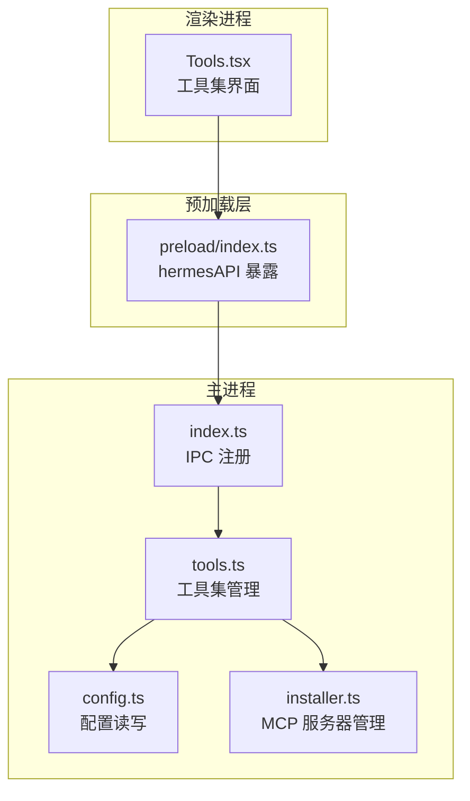
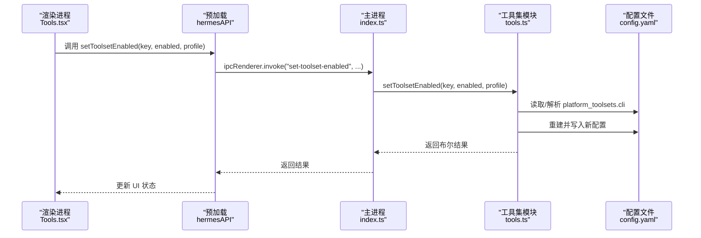
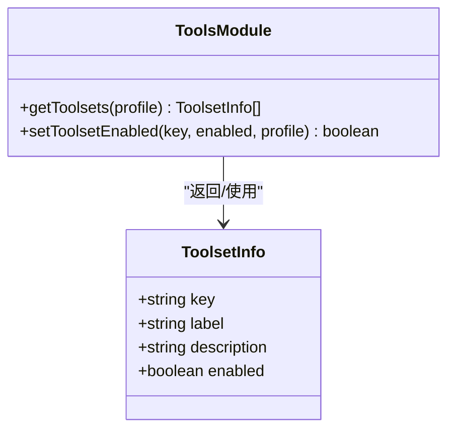
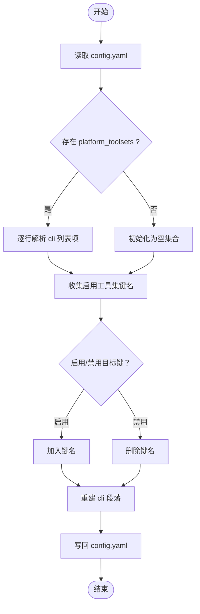
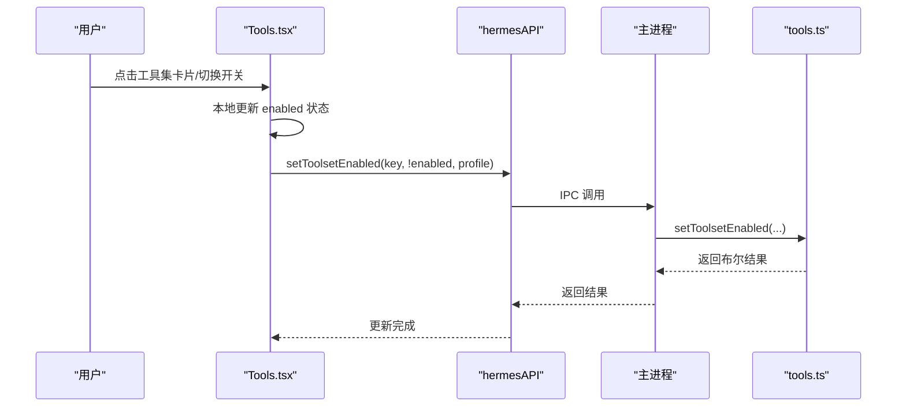
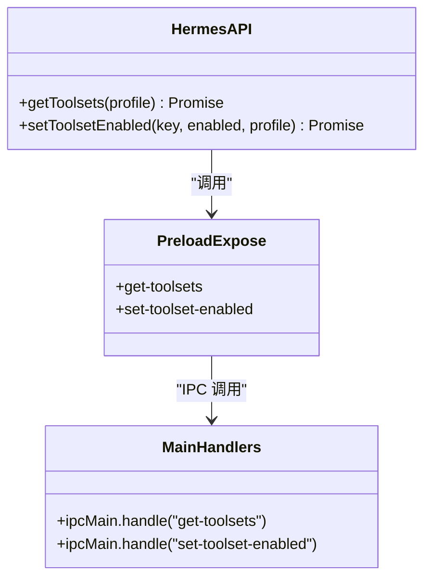
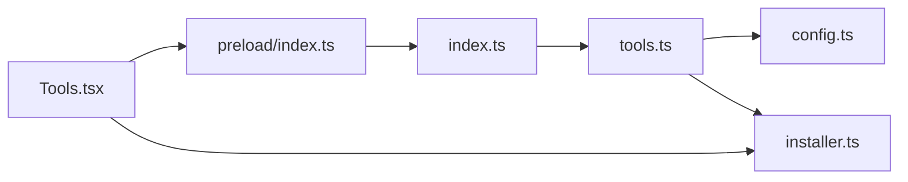

# 工具集管理

<cite>
**本文引用的文件**
- [src/main/tools.ts](file://src/main/tools.ts)
- [src/renderer/src/screens/Tools/Tools.tsx](file://src/renderer/src/screens/Tools/Tools.tsx)
- [src/preload/index.ts](file://src/preload/index.ts)
- [src/main/index.ts](file://src/main/index.ts)
- [src/shared/i18n/locales/zh-CN/tools.ts](file://src/shared/i18n/locales/zh-CN/tools.ts)
- [src/shared/i18n/locales/en/tools.ts](file://src/shared/i18n/locales/en/tools.ts)
- [docs/hermes-desktop-architecture.md](file://docs/hermes-desktop-architecture.md)
- [src/main/installer.ts](file://src/main/installer.ts)
- [src/main/hermes.ts](file://src/main/hermes.ts)
- [src/main/config.ts](file://src/main/config.ts)
- [README.md](file://README.md)
</cite>

## 目录
1. [简介](#简介)
2. [项目结构](#项目结构)
3. [核心组件](#核心组件)
4. [架构总览](#架构总览)
5. [详细组件分析](#详细组件分析)
6. [依赖关系分析](#依赖关系分析)
7. [性能考量](#性能考量)
8. [故障排除指南](#故障排除指南)
9. [结论](#结论)
10. [附录](#附录)

## 简介
本文件系统性阐述 Hermes Desktop 工具集管理系统的架构设计与管理机制，覆盖工具的发现、注册、启用/禁用流程，配置管理与参数设置，运行时控制，分类体系与依赖关系，安装/卸载与版本更新，API 接口规范与调用约定，以及用户界面与安全机制。文档同时提供工具开发指南，帮助开发者创建自定义工具、集成第三方服务与实现扩展。

## 项目结构
Hermes Desktop 采用 Electron + React 架构，前端为 React 19，后端为主进程（Node.js）。工具集管理位于主进程模块 tools.ts，前端 Tools 屏幕负责展示与交互，preload 暴露 hermesAPI 给渲染进程调用。

**图表来源**
- [src/renderer/src/screens/Tools/Tools.tsx:259-387](file://src/renderer/src/screens/Tools/Tools.tsx#L259-L387)
- [src/preload/index.ts:339-351](file://src/preload/index.ts#L339-L351)
- [src/main/index.ts:104-104](file://src/main/index.ts#L104-L104)
- [src/main/tools.ts:170-191](file://src/main/tools.ts#L170-L191)
- [src/main/config.ts:181-200](file://src/main/config.ts#L181-L200)
- [src/main/installer.ts:1045-1102](file://src/main/installer.ts#L1045-L1102)

**章节来源**
- [docs/hermes-desktop-architecture.md:18-90](file://docs/hermes-desktop-architecture.md#L18-L90)
- [README.md:80-102](file://README.md#L80-L102)

## 核心组件
- 工具集定义与本地化：工具集键名、标签与描述来自集中定义，按当前语言动态本地化。
- 配置解析与写入：从 config.yaml 读取 platform_toolsets.cli 列表，支持启用/禁用工具集并回写配置。
- 前端展示与交互：Tools.tsx 提供卡片式 UI，支持点击切换与复选框切换，异步加载 MCP 服务器列表。
- IPC 与 API：preload 暴露 getToolsets、setToolsetEnabled 等方法，主进程注册对应 IPC 处理器。

**章节来源**
- [src/main/tools.ts:7-99](file://src/main/tools.ts#L7-L99)
- [src/main/tools.ts:170-191](file://src/main/tools.ts#L170-L191)
- [src/main/tools.ts:193-293](file://src/main/tools.ts#L193-L293)
- [src/renderer/src/screens/Tools/Tools.tsx:259-387](file://src/renderer/src/screens/Tools/Tools.tsx#L259-L387)
- [src/preload/index.ts:339-351](file://src/preload/index.ts#L339-L351)

## 架构总览
工具集管理贯穿“前端展示 → 预加载 API → 主进程 IPC → 工具集模块 → 配置文件”的链路。前端触发切换后，通过 hermesAPI.setToolsetEnabled 调用主进程处理器，主进程解析/写入 config.yaml 并返回结果；前端即时更新 UI 状态。

**图表来源**
- [src/renderer/src/screens/Tools/Tools.tsx:280-288](file://src/renderer/src/screens/Tools/Tools.tsx#L280-L288)
- [src/preload/index.ts:345-350](file://src/preload/index.ts#L345-L350)
- [src/main/index.ts:104-104](file://src/main/index.ts#L104-L104)
- [src/main/tools.ts:193-293](file://src/main/tools.ts#L193-L293)

## 详细组件分析

### 工具集定义与分类体系
- 工具集键名集合集中定义，覆盖网络搜索、浏览器、终端、文件操作、代码执行、视觉分析、图像生成、TTS、技能、记忆、会话搜索、澄清提问、任务委派、计划任务、多代理协作、任务规划等。
- 每个工具集包含键名、本地化标签与描述，便于 UI 展示与国际化。

**图表来源**
- [src/main/tools.ts:7-12](file://src/main/tools.ts#L7-L12)
- [src/main/tools.ts:170-191](file://src/main/tools.ts#L170-L191)
- [src/main/tools.ts:193-293](file://src/main/tools.ts#L193-L293)

**章节来源**
- [src/main/tools.ts:14-99](file://src/main/tools.ts#L14-L99)
- [src/shared/i18n/locales/zh-CN/tools.ts:1-29](file://src/shared/i18n/locales/zh-CN/tools.ts#L1-L29)
- [src/shared/i18n/locales/en/tools.ts:1-68](file://src/shared/i18n/locales/en/tools.ts#L1-L68)

### 配置解析与写入流程
- 解析逻辑：逐行扫描 config.yaml，识别 platform_toolsets.cli 列表项，收集启用的工具集键名。
- 写入逻辑：根据当前状态添加/删除目标键名，重新排序并重建 cli 段落；若不存在 platform_toolsets 段落则追加；最终安全写回文件。

**图表来源**
- [src/main/tools.ts:123-168](file://src/main/tools.ts#L123-L168)
- [src/main/tools.ts:193-293](file://src/main/tools.ts#L193-L293)

**章节来源**
- [src/main/tools.ts:123-168](file://src/main/tools.ts#L123-L168)
- [src/main/tools.ts:193-293](file://src/main/tools.ts#L193-L293)

### 前端展示与交互
- 工具集卡片：每个工具集以卡片形式展示，包含图标、开关与标签/描述。
- 交互行为：点击卡片区域或切换开关均可触发切换；UI 先本地翻转状态，再异步调用后端接口，确保响应迅速。
- MCP 服务器：在工具集下方展示 MCP 服务器列表，显示类型（HTTP/stdio）与启用状态。

**图表来源**
- [src/renderer/src/screens/Tools/Tools.tsx:280-288](file://src/renderer/src/screens/Tools/Tools.tsx#L280-L288)
- [src/preload/index.ts:345-350](file://src/preload/index.ts#L345-L350)
- [src/main/index.ts:104-104](file://src/main/index.ts#L104-L104)
- [src/main/tools.ts:193-293](file://src/main/tools.ts#L193-L293)

**章节来源**
- [src/renderer/src/screens/Tools/Tools.tsx:259-387](file://src/renderer/src/screens/Tools/Tools.tsx#L259-L387)

### API 接口规范与调用约定
- hermesAPI.getToolsets(profile?)：返回工具集数组，包含键名、标签、描述与启用状态。
- hermesAPI.setToolsetEnabled(key, enabled, profile?)：设置指定工具集的启用状态，返回布尔结果。
- preload 暴露的 IPC 名称：get-toolsets、set-toolset-enabled。
- 主进程处理器：index.ts 中注册对应 ipcMain.handle。

**图表来源**
- [src/preload/index.ts:339-351](file://src/preload/index.ts#L339-L351)
- [src/main/index.ts:104-104](file://src/main/index.ts#L104-L104)

**章节来源**
- [src/preload/index.ts:339-351](file://src/preload/index.ts#L339-L351)
- [src/main/index.ts:104-104](file://src/main/index.ts#L104-L104)

### 安全机制与权限控制
- 安全导航与外链打开：主进程对外部 URL 打开进行白名单校验，避免不安全跳转。
- SSH 隧道与远程访问：通过 SSH 隧道建立安全通道，远程模式下携带认证头；本地模式下直接访问本机端口。
- 环境变量与配置缓存：配置读写带缓存与校验，避免注入与越界。

**章节来源**
- [src/main/index.ts:185-194](file://src/main/index.ts#L185-L194)
- [src/main/hermes.ts:22-62](file://src/main/hermes.ts#L22-L62)
- [src/main/config.ts:169-179](file://src/main/config.ts#L169-L179)

### 运行时控制与状态监控
- 工具集状态：前端 Tools 屏幕展示每个工具集的启用状态，MCP 服务器状态通过 listMcpServers 获取并在 UI 中标注。
- 网关与远程模式：通过 hermes.ts 控制网关启停与健康检查，支持本地/远程/SSH 三种模式。

**章节来源**
- [src/renderer/src/screens/Tools/Tools.tsx:334-382](file://src/renderer/src/screens/Tools/Tools.tsx#L334-L382)
- [src/main/installer.ts:1045-1102](file://src/main/installer.ts#L1045-L1102)
- [src/main/hermes.ts:127-147](file://src/main/hermes.ts#L127-L147)

### 安装、卸载、版本与更新机制
- 安装与验证：通过 installer.ts 提供安装状态检查、验证与进度回调。
- 版本与诊断：提供获取/刷新 Hermes 版本、运行诊断与更新命令。
- 备份/导入/调试：支持完整数据备份、导入与调试转储。

**章节来源**
- [src/main/installer.ts:1-200](file://src/main/installer.ts#L1-L200)
- [src/preload/index.ts:55-63](file://src/preload/index.ts#L55-L63)
- [src/preload/index.ts:658-659](file://src/preload/index.ts#L658-L659)

### 工具开发指南
- 新增工具集：在工具集定义处添加新的键名与本地化词条，确保前端 UI 与国际化覆盖。
- 集成第三方服务：通过 MCP 服务器机制在 config.yaml 中配置 HTTP 或 stdio 服务器，工具集管理模块会读取并展示。
- 本地化：在各语言的 tools.ts 中补充标签与描述，保证多语言一致。

**章节来源**
- [src/main/tools.ts:14-99](file://src/main/tools.ts#L14-L99)
- [src/shared/i18n/locales/zh-CN/tools.ts:1-29](file://src/shared/i18n/locales/zh-CN/tools.ts#L1-L29)
- [src/shared/i18n/locales/en/tools.ts:1-68](file://src/shared/i18n/locales/en/tools.ts#L1-L68)
- [src/main/installer.ts:1045-1102](file://src/main/installer.ts#L1045-L1102)

## 依赖关系分析
- 前端依赖预加载 API：Tools.tsx 通过 window.hermesAPI 调用 IPC。
- 预加载依赖主进程处理器：preload/index.ts 暴露方法，index.ts 注册 ipcMain.handle。
- 主进程依赖工具集模块：index.ts 引入 tools.ts 的 getToolsets 与 setToolsetEnabled。
- 工具集模块依赖配置模块：读取/写入 config.yaml，解析/重建 platform_toolsets.cli。
- MCP 服务器：通过 installer.ts 的 listMcpServers 读取 config.yaml 中的 mcp_servers 段落。

**图表来源**
- [src/renderer/src/screens/Tools/Tools.tsx:267-270](file://src/renderer/src/screens/Tools/Tools.tsx#L267-L270)
- [src/preload/index.ts:339-351](file://src/preload/index.ts#L339-L351)
- [src/main/index.ts:104-104](file://src/main/index.ts#L104-L104)
- [src/main/tools.ts:170-191](file://src/main/tools.ts#L170-L191)
- [src/main/installer.ts:1045-1102](file://src/main/installer.ts#L1045-L1102)

**章节来源**
- [src/main/index.ts:104-104](file://src/main/index.ts#L104-L104)
- [src/main/tools.ts:170-191](file://src/main/tools.ts#L170-L191)
- [src/main/installer.ts:1045-1102](file://src/main/installer.ts#L1045-L1102)

## 性能考量
- 前端即时反馈：切换 UI 状态先本地翻转，减少等待时间。
- 配置读写最小化：仅在变更时写入，避免频繁 I/O。
- 缓存策略：config.ts 对环境变量读取使用短 TTL 缓存，降低重复解析成本。
- 流式通信：聊天与工具进度通过 SSE/IPC 事件推送，提升交互体验。

[本节为通用指导，无需特定文件引用]

## 故障排除指南
- 工具集未生效：检查 config.yaml 中 platform_toolsets.cli 是否正确写入；确认 profile 路径是否正确。
- 前端切换无效：确认 preload hermesAPI 方法已正确暴露，主进程已注册对应 IPC 处理器。
- 远程模式异常：检查 SSH 隧道状态与认证头，确认远程 URL 与 API Key 正确。
- MCP 服务器不可用：检查 config.yaml 中 mcp_servers 段落语法与 enabled 标记。

**章节来源**
- [src/main/tools.ts:170-191](file://src/main/tools.ts#L170-L191)
- [src/main/tools.ts:193-293](file://src/main/tools.ts#L193-L293)
- [src/main/hermes.ts:64-69](file://src/main/hermes.ts#L64-L69)
- [src/main/installer.ts:1045-1102](file://src/main/installer.ts#L1045-L1102)

## 结论
Hermes Desktop 的工具集管理以简洁的键值集合为核心，结合本地化与配置文件解析，实现了灵活的启用/禁用控制。前端通过预加载 API 与主进程 IPC 协作，提供即时反馈与一致的用户体验。配合 MCP 服务器机制，系统可扩展第三方能力。未来可在 IPC 类型安全、错误日志统一与测试覆盖方面进一步优化。

[本节为总结，无需特定文件引用]

## 附录
- 工具集键名清单：web、browser、terminal、file、code_execution、vision、image_gen、tts、skills、memory、session_search、clarify、delegation、cronjob、moa、todo。
- 国际化词条：各语言的 tools.ts 文件提供标签与描述映射。
- 架构参考：详见文档“Hermes Desktop 项目架构分析”。

**章节来源**
- [src/main/tools.ts:14-99](file://src/main/tools.ts#L14-L99)
- [src/shared/i18n/locales/zh-CN/tools.ts:1-29](file://src/shared/i18n/locales/zh-CN/tools.ts#L1-L29)
- [docs/hermes-desktop-architecture.md:1-374](file://docs/hermes-desktop-architecture.md#L1-L374)