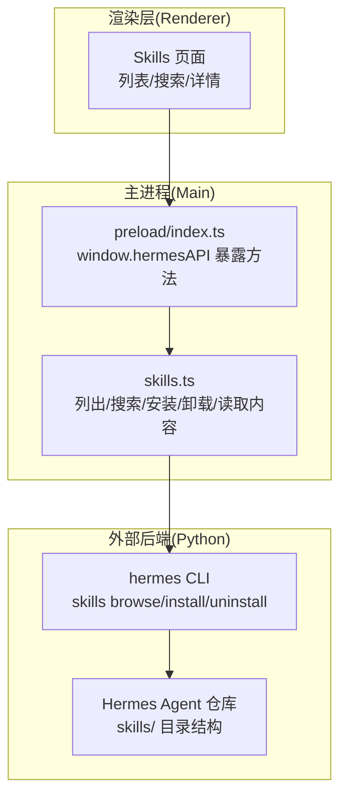
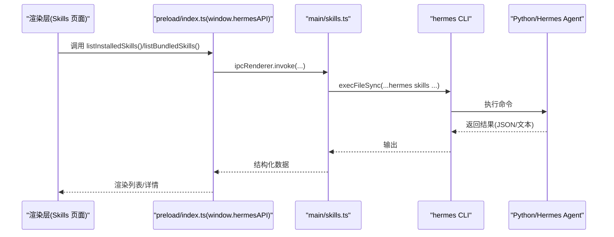
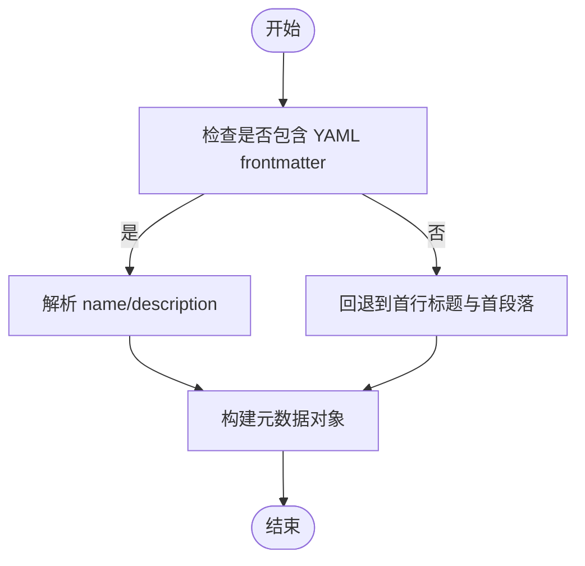
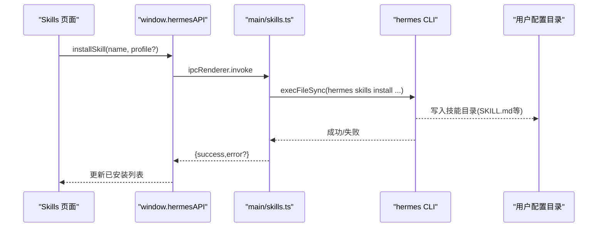
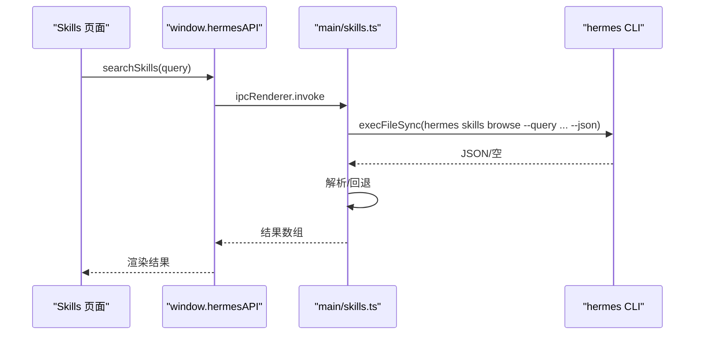

# 技能系统

<cite>
**本文引用的文件**
- [src/main/skills.ts](file://src/main/skills.ts)
- [src/renderer/src/screens/Skills/Skills.tsx](file://src/renderer/src/screens/Skills/Skills.tsx)
- [skills-lock.json](file://skills-lock.json)
- [.agents/skills/electron-pro/SKILL.md](file://.agents/skills/electron-pro/SKILL.md)
- [.agents/skills/hermes-agent/SKILL.md](file://.agents/skills/hermes-agent/SKILL.md)
- [.agents/skills/typescript-expert/SKILL.md](file://.agents/skills/typescript-expert/SKILL.md)
- [src/shared/i18n/locales/zh-CN/skills.ts](file://src/shared/i18n/locales/zh-CN/skills.ts)
- [src/shared/i18n/locales/en/skills.ts](file://src/shared/i18n/locales/en/skills.ts)
- [src/preload/index.ts](file://src/preload/index.ts)
- [docs/hermes-desktop-architecture.md](file://docs/hermes-desktop-architecture.md)
- [src/main/ssh-remote.ts](file://src/main/ssh-remote.ts)
</cite>

## 目录
1. [简介](#简介)
2. [项目结构](#项目结构)
3. [核心组件](#核心组件)
4. [架构总览](#架构总览)
5. [详细组件分析](#详细组件分析)
6. [依赖分析](#依赖分析)
7. [性能考虑](#性能考虑)
8. [故障排查指南](#故障排查指南)
9. [结论](#结论)
10. [附录](#附录)

## 简介
本文件系统性阐述 Hermes Desktop 的技能系统，覆盖技能定义格式、安装与运行时加载、内置技能特性与使用方法、生命周期与版本控制、依赖解析、配置与参数传递、结果处理、安全沙箱与权限控制、以及自定义技能开发指南与调试技巧。目标是帮助开发者与用户高效理解并扩展 Hermes 的技能生态。

## 项目结构
技能系统由三层组成：
- 渲染层（Renderer）：提供“已安装/浏览”双标签页界面，支持搜索、分类过滤、详情查看、安装/卸载操作。
- 主进程（Main）：封装技能清单读取、内容解析、通过 hermes CLI 执行安装/卸载、搜索等操作。
- 外部后端（Python/Hermes Agent）：通过 hermes 命令行提供技能注册表浏览、安装、卸载等能力；技能以目录形式存放，每个技能包含描述文件 SKILL.md。

图表来源
- [src/renderer/src/screens/Skills/Skills.tsx:1-363](file://src/renderer/src/screens/Skills/Skills.tsx#L1-L363)
- [src/main/skills.ts:1-293](file://src/main/skills.ts#L1-L293)
- [src/preload/index.ts:15-200](file://src/preload/index.ts#L15-L200)
- [docs/hermes-desktop-architecture.md:43-181](file://docs/hermes-desktop-architecture.md#L43-L181)

章节来源
- [src/renderer/src/screens/Skills/Skills.tsx:1-363](file://src/renderer/src/screens/Skills/Skills.tsx#L1-L363)
- [src/main/skills.ts:1-293](file://src/main/skills.ts#L1-L293)
- [src/preload/index.ts:15-200](file://src/preload/index.ts#L15-L200)
- [docs/hermes-desktop-architecture.md:43-181](file://docs/hermes-desktop-architecture.md#L43-L181)

## 核心组件
- 技能清单与元数据
  - 已安装技能：从用户配置目录下的 skills 子目录扫描，按类别与名称排序，提取 SKILL.md 中的 name/description 作为元数据。
  - 内置技能：从 Hermes Agent 仓库的 skills 目录扫描，同样解析 SKILL.md 获取元数据。
  - 技能内容：读取 SKILL.md 的完整内容用于详情面板展示。
- 搜索与浏览
  - 通过 hermes CLI 的 skills browse 子命令进行搜索，支持 JSON 输出与查询参数。
- 安装与卸载
  - 调用 hermes CLI 的 skills install/uninstall 子命令，支持指定 profile。
- 国际化
  - 技能页面文案在多语言资源中维护，确保不同语言环境一致体验。

章节来源
- [src/main/skills.ts:14-131](file://src/main/skills.ts#L14-L131)
- [src/main/skills.ts:133-178](file://src/main/skills.ts#L133-L178)
- [src/main/skills.ts:180-234](file://src/main/skills.ts#L180-L234)
- [src/main/skills.ts:236-292](file://src/main/skills.ts#L236-L292)
- [src/shared/i18n/locales/zh-CN/skills.ts:1-24](file://src/shared/i18n/locales/zh-CN/skills.ts#L1-L24)
- [src/shared/i18n/locales/en/skills.ts:1-25](file://src/shared/i18n/locales/en/skills.ts#L1-L25)

## 架构总览
技能系统遵循“渲染层调用 API → 主进程执行 CLI → Python 后端提供能力”的分层设计。IPC 层通过 contextBridge 将方法桥接到渲染层，确保安全隔离。

图表来源
- [src/renderer/src/screens/Skills/Skills.tsx:41-49](file://src/renderer/src/screens/Skills/Skills.tsx#L41-L49)
- [src/preload/index.ts:15-200](file://src/preload/index.ts#L15-L200)
- [src/main/skills.ts:133-178](file://src/main/skills.ts#L133-L178)
- [src/main/skills.ts:180-234](file://src/main/skills.ts#L180-L234)

章节来源
- [docs/hermes-desktop-architecture.md:151-174](file://docs/hermes-desktop-architecture.md#L151-L174)
- [src/preload/index.ts:15-200](file://src/preload/index.ts#L15-L200)
- [src/main/skills.ts:133-178](file://src/main/skills.ts#L133-L178)

## 详细组件分析

### 技能定义格式与元数据解析
- 文件结构
  - 每个技能位于 skills/<category>/<skill-name>/SKILL.md，其中 SKILL.md 为技能描述与元数据文件。
- 元数据解析
  - 支持 YAML frontmatter（以三横线包裹），优先读取 name 与 description 字段。
  - 若无 frontmatter，则回退到首行标题与首段落前 120 字作为默认 name/description。
- 列表与详情
  - 已安装技能与内置技能均返回 name、category、description、path 等字段，详情页读取完整 SKILL.md 内容。

图表来源
- [src/main/skills.ts:29-62](file://src/main/skills.ts#L29-L62)

章节来源
- [src/main/skills.ts:68-117](file://src/main/skills.ts#L68-L117)
- [src/main/skills.ts:122-131](file://src/main/skills.ts#L122-L131)

### 安装流程与运行时加载
- 安装
  - 调用 hermes CLI 的 skills install 子命令，自动确认交互（--yes），支持指定 profile。
  - 主进程捕获 stderr 并返回错误消息，便于 UI 显示。
- 卸载
  - 调用 hermes CLI 的 skills uninstall 子命令，支持指定 profile。
- 运行时加载
  - 已安装技能通过扫描用户配置目录下的 skills 子目录加载，无需重启应用即可生效。
  - 内置技能来自 Hermes Agent 仓库，用于“浏览”标签页展示。

图表来源
- [src/renderer/src/screens/Skills/Skills.tsx:67-77](file://src/renderer/src/screens/Skills/Skills.tsx#L67-L77)
- [src/main/skills.ts:236-263](file://src/main/skills.ts#L236-L263)

章节来源
- [src/main/skills.ts:236-292](file://src/main/skills.ts#L236-L292)
- [src/renderer/src/screens/Skills/Skills.tsx:67-90](file://src/renderer/src/screens/Skills/Skills.tsx#L67-L90)

### 搜索与浏览
- 搜索
  - 通过 hermes CLI 的 skills browse 子命令执行查询，并尝试解析 JSON 输出。
  - 若 CLI 不支持 --json 或输出为空，回退到内置技能匹配逻辑。
- 浏览
  - 从 Hermes Agent 仓库的 skills 目录扫描，生成“浏览”列表供用户选择安装。

图表来源
- [src/main/skills.ts:133-178](file://src/main/skills.ts#L133-L178)
- [src/main/skills.ts:180-234](file://src/main/skills.ts#L180-L234)

章节来源
- [src/main/skills.ts:133-178](file://src/main/skills.ts#L133-L178)
- [src/main/skills.ts:180-234](file://src/main/skills.ts#L180-L234)

### 生命周期管理、版本控制与依赖解析
- 生命周期
  - 安装：写入用户配置目录的 skills 子目录，技能即刻可用。
  - 卸载：删除对应技能目录，立即生效。
  - 更新：当前实现通过重新安装覆盖旧版本；建议结合版本锁定策略。
- 版本控制
  - 仓库提供 skills-lock.json，记录内置技能的来源与哈希，便于追踪与复现。
- 依赖解析
  - 技能本身不直接声明依赖；安装后由 hermes CLI 管理技能目录与元数据。

章节来源
- [skills-lock.json:1-26](file://skills-lock.json#L1-L26)
- [src/main/skills.ts:236-292](file://src/main/skills.ts#L236-L292)

### 配置、参数传递与结果处理
- 参数传递
  - 列表/详情：通过路径 path 传递，主进程读取 SKILL.md。
  - 搜索：通过 query 字符串传递给 hermes CLI。
  - 安装/卸载：通过 identifier/name 与 profile 参数传递。
- 结果处理
  - 主进程解析 CLI 输出（JSON/文本），构造统一的数据结构返回给渲染层。
  - UI 层根据 success/error 字段更新状态与提示。

章节来源
- [src/renderer/src/screens/Skills/Skills.tsx:61-90](file://src/renderer/src/screens/Skills/Skills.tsx#L61-L90)
- [src/main/skills.ts:133-178](file://src/main/skills.ts#L133-L178)
- [src/main/skills.ts:236-292](file://src/main/skills.ts#L236-L292)

### 内置技能详解

#### Electron Pro
- 角色定位：跨平台桌面应用开发专家，专注 Electron 架构、IPC、系统集成与性能优化。
- 使用场景：跨平台桌面应用、IPC 设计、内存优化、自动更新、签名与公证。
- 关键模式：决策框架、IPC 模式、启动性能优化、Worker Threads、深度链接协议处理器等。
- 参考路径：[SKILL.md:1-153](file://.agents/skills/electron-pro/SKILL.md#L1-L153)

章节来源
- [.agents/skills/electron-pro/SKILL.md:1-153](file://.agents/skills/electron-pro/SKILL.md#L1-L153)

#### Hermes Agent
- 角色定位：自改进 AI Agent 专家，具备工具使用、多平台消息、闭合学习回路等能力。
- 使用场景：对话编排、工具编排、会话管理、跨平台消息网关、计划与自动化。
- 关键模块：AIAgent 类、工具编排、工具集、工具注册表、会话数据库、CLI 系统、技能系统、插件系统、内存系统、MCP/ACP 集成等。
- 参考路径：[SKILL.md:1-1766](file://.agents/skills/hermes-agent/SKILL.md#L1-L1766)

章节来源
- [.agents/skills/hermes-agent/SKILL.md:1-1766](file://.agents/skills/hermes-agent/SKILL.md#L1-L1766)

#### TypeScript Expert
- 角色定位：TypeScript/JavaScript 专家，擅长类型级编程、性能优化、Monorepo 管理与迁移策略。
- 使用场景：类型系统、性能诊断、迁移方案、现代工具链（Biome/ESLint）、测试策略。
- 关键主题：高级类型模式、性能优化、复杂错误模式、迁移决策矩阵、Monorepo 配置、现代工具链、调试技巧、最佳实践清单。
- 参考路径：[SKILL.md:1-427](file://.agents/skills/typescript-expert/SKILL.md#L1-L427)

章节来源
- [.agents/skills/typescript-expert/SKILL.md:1-427](file://.agents/skills/typescript-expert/SKILL.md#L1-L427)

### 自定义技能开发指南
- 技能模板
  - 在 skills/<category>/<skill-name>/ 目录下放置 SKILL.md 描述文件，遵循 YAML frontmatter（name/description）或回退规则。
- 接口规范
  - 渲染层通过 window.hermesAPI 调用 listInstalledSkills、listBundledSkills、getSkillContent、installSkill、uninstallSkill。
  - 主进程通过 hermes CLI 执行具体操作，保持与 Python 后端的一致行为。
- 最佳实践
  - 使用清晰的分类与简短描述，确保搜索与浏览体验。
  - 在 SKILL.md 中提供可执行的工作流步骤与注意事项，便于用户快速上手。
  - 对于复杂技能，建议配套脚本与参考材料，提升可维护性。

章节来源
- [src/main/skills.ts:68-117](file://src/main/skills.ts#L68-L117)
- [src/main/skills.ts:122-131](file://src/main/skills.ts#L122-L131)
- [src/preload/index.ts:15-200](file://src/preload/index.ts#L15-L200)

### 技能 API 使用示例（聊天中调用）
- 在聊天中调用技能
  - 通过窗口右下角的“技能”入口进入技能管理界面，选择已安装技能进行使用。
  - 技能内容以 Markdown 形式展示，便于阅读与执行。
- 处理技能输出与错误
  - 安装/卸载成功后刷新列表；失败时显示错误信息并允许重试。
- 权限与安全
  - 技能安装涉及系统命令执行，需确保用户授权与环境安全。
  - 建议仅安装可信来源的技能，并定期核对 skills-lock.json 中的来源与哈希。

章节来源
- [src/renderer/src/screens/Skills/Skills.tsx:61-90](file://src/renderer/src/screens/Skills/Skills.tsx#L61-L90)
- [skills-lock.json:1-26](file://skills-lock.json#L1-L26)

### 安全沙箱、权限控制与资源限制
- 安全模型
  - 技能安装与执行通过 hermes CLI 进行，避免直接在渲染层执行系统命令。
  - 主进程负责权限校验与错误捕获，确保异常不会泄露到 UI。
- 权限控制
  - 安装/卸载操作需要用户确认；profile 支持多实例隔离，降低误操作风险。
- 资源限制
  - CLI 执行设置超时时间，防止长时间阻塞；UI 层提供加载状态与取消机制。

章节来源
- [src/main/skills.ts:236-292](file://src/main/skills.ts#L236-L292)
- [src/renderer/src/screens/Skills/Skills.tsx:67-90](file://src/renderer/src/screens/Skills/Skills.tsx#L67-L90)

### 扩展开发与调试技巧
- 扩展开发
  - 在本地创建技能目录，编写 SKILL.md 并放置到用户配置目录的 skills 子目录，即可在“已安装”列表中看到。
  - 使用 hermes CLI 的 skills browse 与 skills install 进行验证与迭代。
- 调试技巧
  - 查看安装进度与日志，定位 CLI 执行问题。
  - 使用 skills-lock.json 校验技能来源一致性，避免版本漂移。
  - 在 SSH/远程模式下，通过 sshListInstalledSkills/sshInstallSkill 等函数验证远端技能加载。

章节来源
- [src/main/ssh-remote.ts:127-221](file://src/main/ssh-remote.ts#L127-L221)
- [skills-lock.json:1-26](file://skills-lock.json#L1-L26)

## 依赖分析
- 组件耦合
  - 渲染层与主进程通过 IPC 强解耦；主进程与 Python 后端通过 CLI 弱耦合。
- 外部依赖
  - hermes CLI 提供技能注册表浏览、安装、卸载能力；Hermes Agent 仓库提供内置技能集合。
- 潜在循环依赖
  - 技能系统不引入循环依赖；主进程仅负责桥接与执行，不直接依赖技能内部逻辑。

图表来源
- [src/renderer/src/screens/Skills/Skills.tsx:41-49](file://src/renderer/src/screens/Skills/Skills.tsx#L41-L49)
- [src/preload/index.ts:15-200](file://src/preload/index.ts#L15-L200)
- [src/main/skills.ts:133-178](file://src/main/skills.ts#L133-L178)

章节来源
- [src/main/skills.ts:133-178](file://src/main/skills.ts#L133-L178)
- [src/preload/index.ts:15-200](file://src/preload/index.ts#L15-L200)

## 性能考虑
- I/O 与解析
  - 技能扫描与 SKILL.md 读取采用同步 I/O，建议限制扫描范围与内容大小（默认截断 4000 字符）。
- CLI 调用
  - 设置合理超时（安装 60s、卸载 30s、搜索 30s），避免阻塞 UI。
- 并发与缓存
  - 列表加载采用并发 Promise.all，减少等待时间；详情内容按需加载，避免一次性渲染大量 Markdown。

章节来源
- [src/main/skills.ts:68-117](file://src/main/skills.ts#L68-L117)
- [src/main/skills.ts:133-178](file://src/main/skills.ts#L133-L178)
- [src/renderer/src/screens/Skills/Skills.tsx:51-55](file://src/renderer/src/screens/Skills/Skills.tsx#L51-L55)

## 故障排查指南
- 安装失败
  - 检查 CLI 输出与 stderr 消息，确认网络、权限与 hermes 版本。
  - 使用 runHermesDoctor 获取诊断信息。
- 卸载失败
  - 确认技能名称正确且已安装；检查用户配置目录权限。
- 搜索无结果
  - 确认 hermes CLI 支持 --json 参数；尝试回退到内置技能匹配。
- SSH/远程模式
  - 使用 sshListInstalledSkills/sshInstallSkill 等函数验证远端连接与权限。

章节来源
- [src/main/skills.ts:236-292](file://src/main/skills.ts#L236-L292)
- [src/main/ssh-remote.ts:127-221](file://src/main/ssh-remote.ts#L127-L221)
- [src/preload/index.ts:59-62](file://src/preload/index.ts#L59-L62)

## 结论
Hermes Desktop 的技能系统以“描述文件 + CLI + 目录结构”的轻量设计实现了可扩展、可维护的技能生态。通过清晰的 IPC 分层、合理的错误处理与国际化支持，既满足了用户日常使用，也为自定义技能与团队协作提供了良好基础。建议在团队内建立技能发布与版本管理流程，配合 skills-lock.json 保障一致性与可追溯性。

## 附录
- 相关文件
  - 技能定义与解析：[src/main/skills.ts:1-293](file://src/main/skills.ts#L1-L293)
  - 技能页面与交互：[src/renderer/src/screens/Skills/Skills.tsx:1-363](file://src/renderer/src/screens/Skills/Skills.tsx#L1-L363)
  - 国际化文案：[src/shared/i18n/locales/zh-CN/skills.ts:1-24](file://src/shared/i18n/locales/zh-CN/skills.ts#L1-L24)、[src/shared/i18n/locales/en/skills.ts:1-25](file://src/shared/i18n/locales/en/skills.ts#L1-L25)
  - IPC 暴露方法：[src/preload/index.ts:15-200](file://src/preload/index.ts#L15-L200)
  - 架构概览：[docs/hermes-desktop-architecture.md:43-181](file://docs/hermes-desktop-architecture.md#L43-L181)
  - SSH/远程技能：[src/main/ssh-remote.ts:127-221](file://src/main/ssh-remote.ts#L127-L221)
  - 技能版本锁定：[skills-lock.json:1-26](file://skills-lock.json#L1-L26)