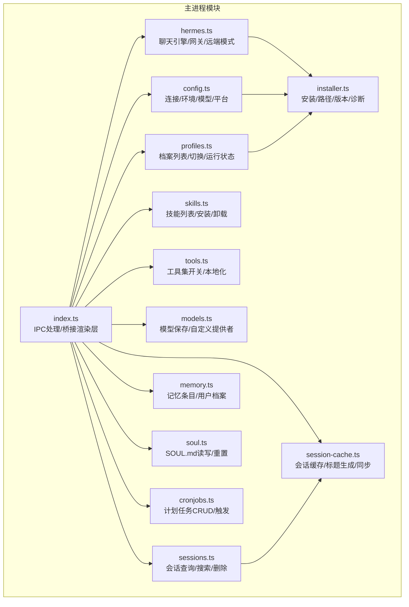
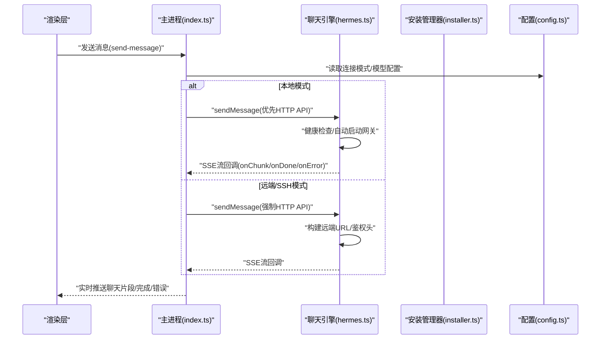
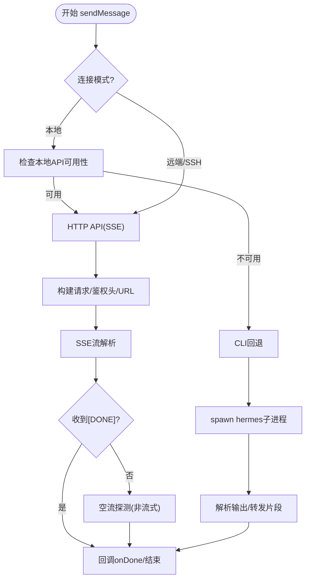
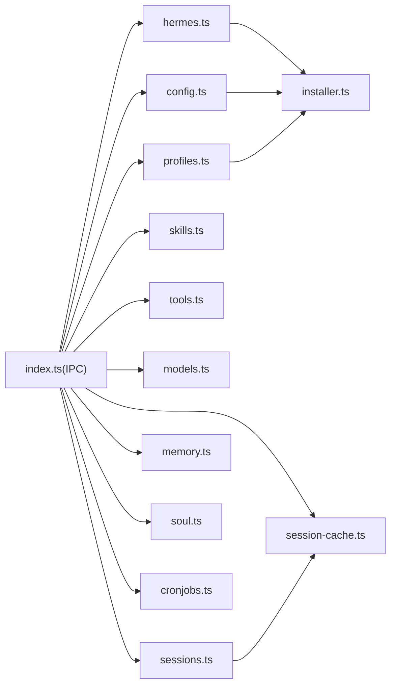

# 核心功能模块

<cite>
**本文引用的文件**
- [hermes.ts](file://src/main/hermes.ts)
- [index.ts](file://src/main/index.ts)
- [config.ts](file://src/main/config.ts)
- [sessions.ts](file://src/main/sessions.ts)
- [session-cache.ts](file://src/main/session-cache.ts)
- [skills.ts](file://src/main/skills.ts)
- [tools.ts](file://src/main/tools.ts)
- [models.ts](file://src/main/models.ts)
- [profiles.ts](file://src/main/profiles.ts)
- [memory.ts](file://src/main/memory.ts)
- [soul.ts](file://src/main/soul.ts)
- [installer.ts](file://src/main/installer.ts)
- [cronjobs.ts](file://src/main/cronjobs.ts)
- [README.md](file://README.md)
</cite>

## 目录
1. [简介](#简介)
2. [项目结构](#项目结构)
3. [核心组件](#核心组件)
4. [架构总览](#架构总览)
5. [详细组件分析](#详细组件分析)
6. [依赖关系分析](#依赖关系分析)
7. [性能考量](#性能考量)
8. [故障排查指南](#故障排查指南)
9. [结论](#结论)
10. [附录](#附录)

## 简介
本文件面向开发者与高级用户，系统性梳理 Hermes Desktop 的核心功能模块：聊天引擎、安装管理器、配置系统、会话管理、技能系统、工具集管理、模型管理、档案（Profile）管理、记忆与灵魂（SOUL）、计划任务（Cron）以及 SSH 隧道与远程模式支持。文档从架构、数据流、接口设计到使用示例与最佳实践进行深入说明，并通过图示展示模块间协作关系，帮助读者快速理解系统内部机制与扩展点。

## 项目结构
Hermes Desktop 的主进程模块集中于 src/main 下，采用按功能域划分的组织方式：
- 安装与环境：installer.ts
- 聊天与网关：hermes.ts、index.ts（IPC）
- 配置与凭证：config.ts
- 会话与缓存：sessions.ts、session-cache.ts
- 技能：skills.ts
- 工具集：tools.ts
- 模型：models.ts
- 档案：profiles.ts
- 记忆与灵魂：memory.ts、soul.ts
- 计划任务：cronjobs.ts

图表来源
- [index.ts:290-800](file://src/main/index.ts#L290-L800)
- [hermes.ts:1-887](file://src/main/hermes.ts#L1-L887)
- [config.ts:1-440](file://src/main/config.ts#L1-L440)
- [sessions.ts:1-212](file://src/main/sessions.ts#L1-L212)
- [session-cache.ts:1-252](file://src/main/session-cache.ts#L1-L252)
- [skills.ts:1-293](file://src/main/skills.ts#L1-L293)
- [tools.ts:1-294](file://src/main/tools.ts#L1-L294)
- [models.ts:1-169](file://src/main/models.ts#L1-L169)
- [profiles.ts:1-284](file://src/main/profiles.ts#L1-L284)
- [memory.ts:1-207](file://src/main/memory.ts#L1-L207)
- [soul.ts:1-38](file://src/main/soul.ts#L1-L38)
- [cronjobs.ts:1-281](file://src/main/cronjobs.ts#L1-L281)
- [installer.ts:1-800](file://src/main/installer.ts#L1-L800)

章节来源
- [README.md:80-282](file://README.md#L80-L282)

## 核心组件
- 聊天引擎（Hermes Engine）
  - 支持本地 HTTP API（SSE 流式）与 CLI 回退路径；自动健康检查与隧道管理；远端模式（HTTP/SSH）认证头注入。
- 安装管理器（Installer）
  - 统一的安装流程、进度上报、版本缓存、诊断命令、OpenClaw 迁移、更新流程；跨平台路径增强与 sudo 凭据预热。
- 配置系统（Config）
  - 连接模式（本地/远程/SSH）、环境变量（.env）、模型配置（provider/default/base_url）、平台启用（platforms: cli）与凭据池（auth.json）。
- 会话管理（Sessions）
  - SQLite 数据库存储，支持全文检索（FTS5），提供会话列表、消息查询与删除；配合桌面缓存提升启动性能。
- 技能系统（Skills）
  - 技能目录扫描、元数据解析（SKILL.md 前言）、注册表搜索、安装/卸载与已安装技能列表。
- 工具集管理（Tools）
  - 平台工具集（CLI 可用工具集合）解析与持久化，支持启用/禁用与本地化标签。
- 模型管理（Models）
  - 保存模型配置、自定义提供者（custom_providers）解析、默认模型种子与 API Key 注入。
- 档案（Profiles）
  - 多档案管理、活动档案切换、网关运行状态检测、技能计数与配置摘要。
- 记忆与灵魂（Memory/SOUL）
  - 记忆条目增删改查与容量限制、用户档案写入；SOUL.md 读写与重置。
- 计划任务（Cron Jobs）
  - 本地 jobs.json 或远端 API 列表、创建/删除/暂停/恢复/触发；支持多交付目标与技能选择。
- SSH 隧道与远程模式
  - 远端连接测试、隧道健康检查、API Key 缓存与注入、远程网关启停与重启。

章节来源
- [hermes.ts:1-887](file://src/main/hermes.ts#L1-L887)
- [installer.ts:1-800](file://src/main/installer.ts#L1-L800)
- [config.ts:1-440](file://src/main/config.ts#L1-L440)
- [sessions.ts:1-212](file://src/main/sessions.ts#L1-L212)
- [session-cache.ts:1-252](file://src/main/session-cache.ts#L1-L252)
- [skills.ts:1-293](file://src/main/skills.ts#L1-L293)
- [tools.ts:1-294](file://src/main/tools.ts#L1-L294)
- [models.ts:1-169](file://src/main/models.ts#L1-L169)
- [profiles.ts:1-284](file://src/main/profiles.ts#L1-L284)
- [memory.ts:1-207](file://src/main/memory.ts#L1-L207)
- [soul.ts:1-38](file://src/main/soul.ts#L1-L38)
- [cronjobs.ts:1-281](file://src/main/cronjobs.ts#L1-L281)

## 架构总览
下图展示了主进程如何通过 IPC 将渲染层请求路由到各子系统，并在本地或远端模式下选择不同执行路径（HTTP API 或 CLI）。

图表来源
- [index.ts:544-640](file://src/main/index.ts#L544-L640)
- [hermes.ts:654-711](file://src/main/hermes.ts#L654-L711)
- [config.ts:47-74](file://src/main/config.ts#L47-L74)

## 详细组件分析

### 聊天引擎（Hermes Engine）
- 功能职责
  - 自动探测本地 API 服务器可用性，优先使用 HTTP API（SSE 流）；不可用时回退到 CLI。
  - 远端模式（HTTP/SSH）下统一走 HTTP API，自动注入鉴权头与隧道 URL。
  - 解析 SSE 事件，提取内容增量、工具进度、用量统计与最终完成信号。
  - 提供网关启停、健康轮询与停止轮询能力。
- 关键接口
  - sendMessage(message, callbacks, profile?, resumeSessionId?, history?)
  - startGateway(profile?), stopGateway(), isGatewayRunning()
  - isRemoteMode(), isRemoteOnlyMode(), getApiUrl(), getRemoteAuthHeader()
  - ensureSshTunnelIfNeeded(), setSshRemoteApiKey()
- 数据流
  - 渲染层通过 IPC 发送消息，主进程调用 hermes.sendMessage，内部根据连接模式选择 HTTP 或 CLI。
  - HTTP 路径下，建立到本地/远端的 HTTPS/HTTP 请求，解析 SSE 块，分发到 onChunk/onDone/onError。
  - CLI 路径下，派生 hermes 子进程，解析输出并转发到渲染层。
- 使用示例
  - 在本地模式首次发送消息时，若网关未运行则自动启动；若本地 API 不可用则回退 CLI。
  - 远端模式下，先确保 SSH 隧道健康，再发起请求。
- 最佳实践
  - 合理设置超时与中断控制（AbortController）。
  - 对空流响应进行探测性非流式请求以暴露真实错误。
  - 在 SSH 模式下缓存远端 API Key，避免每次请求重复读取。

图表来源
- [hermes.ts:654-711](file://src/main/hermes.ts#L654-L711)
- [hermes.ts:168-434](file://src/main/hermes.ts#L168-L434)
- [hermes.ts:442-646](file://src/main/hermes.ts#L442-L646)

章节来源
- [hermes.ts:1-887](file://src/main/hermes.ts#L1-L887)
- [index.ts:544-640](file://src/main/index.ts#L544-L640)

### 安装管理器（Installer）
- 功能职责
  - 统一安装入口（runInstall），跨平台路径增强（getEnhancedPath），版本缓存与验证（getHermesVersion/verifyInstall）。
  - 诊断与更新（runHermesDoctor/runHermesUpdate），OpenClaw 迁移（runClawMigrate）。
  - 进度上报（InstallProgress），Windows PowerShell 包装器与错误提示。
- 关键接口
  - runInstall(onProgress, parentWindow?)
  - getHermesVersion(), verifyInstall()
  - runHermesDoctor(), runHermesUpdate()
  - runClawMigrate(onProgress)
  - getEnhancedPath()
- 使用示例
  - 首次运行或点击“刷新版本”时调用 verifyInstall/getHermesVersion。
  - 执行更新或迁移时，通过 onProgress 推送步骤与日志。
- 最佳实践
  - 在 Linux 上预热 sudo 凭据，避免 Playwright 安装阶段卡住。
  - Windows 使用包装脚本确保 UTF-8 BOM 与 TLS 1.2。

章节来源
- [installer.ts:1-800](file://src/main/installer.ts#L1-L800)

### 配置系统（Config）
- 功能职责
  - 连接模式（本地/远程/SSH）与 SSH 参数持久化。
  - 环境变量读写（.env），带缓存与校验。
  - 模型配置读写（provider/default/base_url），智能路由关闭与流式开启。
  - 平台工具集（platforms: cli）解析与启用/禁用。
  - 凭据池（auth.json）读写。
- 关键接口
  - getConnectionConfig()/setConnectionConfig()
  - readEnv()/setEnvValue()/validateEnvEntry()
  - getModelConfig()/setModelConfig()
  - getPlatformEnabled()/setPlatformEnabled()
  - getCredentialPool()/setCredentialPool()
- 使用示例
  - 设置新 API Key 后，如为网关运行中且涉及敏感键，可触发重启以加载新凭据。
  - 修改模型配置后，如提供者/模型/基础地址变化，重启网关以生效。
- 最佳实践
  - 使用缓存减少频繁读取 YAML/ENV 文件。
  - 写入配置时保持缩进与注释一致性，避免破坏手写注释。

章节来源
- [config.ts:1-440](file://src/main/config.ts#L1-L440)

### 会话管理（Sessions）
- 功能职责
  - 会话列表、消息查询、全文搜索（SQLite FTS5）。
  - 会话删除（事务删除消息与会话）。
- 关键接口
  - listSessions(limit?, offset?)
  - getSessionMessages(sessionId)
  - searchSessions(query, limit?)
  - deleteSession(sessionId)
- 使用示例
  - 在“会话”页面分页加载最近会话，点击进入查看对话详情。
  - 使用搜索框输入关键词，返回高亮片段与匹配会话。
- 最佳实践
  - 先读取只读数据库，避免阻塞写操作。
  - 删除会话时同时清理缓存与 WebUI 文件索引。

章节来源
- [sessions.ts:1-212](file://src/main/sessions.ts#L1-L212)

### 会话缓存（Session Cache）
- 功能职责
  - 将数据库中的会话增量同步到本地 JSON 缓存，生成可读标题，支持快速列表与标题更新。
- 关键接口
  - syncSessionCache(): 同步新增/更新会话，生成标题。
  - listCachedSessions(limit?, offset?)
  - updateSessionTitle(sessionId, title)
  - removeSessionFromCache(sessionId)
  - deleteSessionComplete(sessionId): 清理数据库/WebUI 文件与缓存。
- 使用示例
  - 应用启动时异步同步缓存，后续列表直接读取缓存。
  - 用户手动修改标题后，更新缓存并持久化。
- 最佳实践
  - 使用 Map 快速定位现有会话，避免 O(N^2)。
  - 删除时尽量保证文件系统与数据库一致性。

章节来源
- [session-cache.ts:1-252](file://src/main/session-cache.ts#L1-L252)

### 技能系统（Skills）
- 功能职责
  - 扫描已安装技能目录，解析 SKILL.md 前言元数据。
  - 通过 hermes CLI 搜索注册表，列出内置技能。
  - 安装/卸载技能（支持指定档案）。
- 关键接口
  - listInstalledSkills(profile?): 已安装技能列表。
  - getSkillContent(skillPath): 技能详情内容。
  - searchSkills(query): 注册表搜索结果。
  - listBundledSkills(): 内置技能列表。
  - installSkill(identifier, profile?): 安装技能。
  - uninstallSkill(name, profile?): 卸载技能。
- 使用示例
  - 在“技能”页面浏览已安装与可安装技能，点击查看详情或安装。
- 最佳实践
  - 安装前确认档案参数，避免误装到错误环境。
  - 解析 SKILL.md 时注意容错与长度限制。

章节来源
- [skills.ts:1-293](file://src/main/skills.ts#L1-L293)

### 工具集管理（Tools）
- 功能职责
  - 解析 config.yaml 中 platform_toolsets.cli，映射为 UI 可用的工具集清单。
  - 支持启用/禁用单个工具集，并写回配置。
- 关键接口
  - getToolsets(profile?): 获取工具集列表（含启用状态与本地化标签）。
  - setToolsetEnabled(key, enabled, profile?): 更新工具集启用状态。
- 使用示例
  - 在“工具”页面勾选/取消勾选工具集，立即生效。
- 最佳实践
  - 若无 platform_toolsets 部分，默认全部启用。
  - 写回配置时保持缩进与层级正确。

章节来源
- [tools.ts:1-294](file://src/main/tools.ts#L1-L294)

### 模型管理（Models）
- 功能职责
  - 保存模型配置（provider/model/base_url），支持自定义提供者（custom_providers）解析与 API Key 注入。
  - 种子默认模型，去重插入，支持增删改查。
- 关键接口
  - listModels(): 读取/种子默认模型。
  - addModel(name, provider, model, baseUrl)
  - removeModel(id)
  - updateModel(id, fields)
  - loadCustomProviders(profile?): 解析 custom_providers。
- 使用示例
  - 在“模型”页面添加本地/自定义提供者模型，设置 base_url 与可选 api_mode。
- 最佳实践
  - 自定义提供者 API Key 写入 .env 时避免重复。
  - 更新模型配置后重启网关以加载新设置。

章节来源
- [models.ts:1-169](file://src/main/models.ts#L1-L169)

### 档案（Profiles）
- 功能职责
  - 列出默认与命名档案，统计技能数量、是否运行网关、是否激活。
  - 创建/删除档案（基于 hermes CLI），切换活动档案。
- 关键接口
  - listProfiles(): 返回档案信息数组。
  - createProfile(name, clone?)
  - deleteProfile(name)
  - setActiveProfile(name)
- 使用示例
  - 在“Agents”页面切换档案，查看当前模型与技能数量。
- 最佳实践
  - 活动档案文件位于 HERMES_HOME/active_profile。
  - 删除前确认非默认档案且名称有效。

章节来源
- [profiles.ts:1-284](file://src/main/profiles.ts#L1-L284)

### 记忆与灵魂（Memory/SOUL）
- 功能职责
  - 记忆条目增删改查，限制字符上限，统计会话与消息总数。
  - 用户档案写入，限制字符上限。
  - SOUL.md 读写与重置。
- 关键接口
  - readMemory(profile?): 返回内存与用户档案信息及统计。
  - addMemoryEntry/content/updateMemoryEntry/removeMemoryEntry
  - writeUserProfile(content, profile?)
  - readSoul(profile?), writeSoul(content, profile?), resetSoul(profile?)
- 使用示例
  - 在“Memory”页面编辑记忆条目，或在“Soul”页面重置人格设定。
- 最佳实践
  - 写入前检查字符限制，避免截断。
  - 记忆条目使用固定分隔符，便于序列化/反序列化。

章节来源
- [memory.ts:1-207](file://src/main/memory.ts#L1-L207)
- [soul.ts:1-38](file://src/main/soul.ts#L1-L38)

### 计划任务（Cron Jobs）
- 功能职责
  - 本地 jobs.json 或远端 API 列表，支持创建/删除/暂停/恢复/触发。
  - 支持多交付目标与技能选择。
- 关键接口
  - listCronJobs(includeDisabled?, profile?)
  - createCronJob(schedule, prompt?, name?, deliver?, profile?)
  - removeCronJob(jobId, profile?)
  - pauseCronJob(jobId, profile?)
  - resumeCronJob(jobId, profile?)
  - triggerCronJob(jobId, profile?)
- 使用示例
  - 在“Schedules”页面创建定时任务，设置表达式与提示词，选择交付目标。
- 最佳实践
  - 远端模式下通过 API 访问，注意鉴权头注入。
  - 触发前检查任务状态与启用标志。

章节来源
- [cronjobs.ts:1-281](file://src/main/cronjobs.ts#L1-L281)

## 依赖关系分析
- 主进程 IPC（index.ts）作为统一入口，将渲染层请求路由到具体模块。
- hermes.ts 依赖 installer.ts（路径/版本/诊断）、config.ts（模型/连接）、ssh-tunnel.ts（远端/隧道）。
- sessions.ts 与 session-cache.ts 共同维护会话数据一致性。
- skills.ts、models.ts、tools.ts、profiles.ts、memory.ts、soul.ts、cronjobs.ts 均依赖 installer.ts 提供的路径常量与 hermes-cli 调用。
- config.ts 与 installer.ts 互相影响：安装状态与版本缓存会影响 UI 行为与诊断。

图表来源
- [index.ts:290-800](file://src/main/index.ts#L290-L800)
- [hermes.ts:1-887](file://src/main/hermes.ts#L1-L887)
- [config.ts:1-440](file://src/main/config.ts#L1-L440)
- [sessions.ts:1-212](file://src/main/sessions.ts#L1-L212)
- [session-cache.ts:1-252](file://src/main/session-cache.ts#L1-L252)
- [skills.ts:1-293](file://src/main/skills.ts#L1-L293)
- [tools.ts:1-294](file://src/main/tools.ts#L1-L294)
- [models.ts:1-169](file://src/main/models.ts#L1-L169)
- [profiles.ts:1-284](file://src/main/profiles.ts#L1-L284)
- [memory.ts:1-207](file://src/main/memory.ts#L1-L207)
- [soul.ts:1-38](file://src/main/soul.ts#L1-L38)
- [cronjobs.ts:1-281](file://src/main/cronjobs.ts#L1-L281)
- [installer.ts:1-800](file://src/main/installer.ts#L1-L800)

## 性能考量
- 缓存策略
  - config.ts 对 .env 与模型配置使用短 TTL 缓存，降低频繁读取开销。
  - hermes.ts 对 API 服务器可用性进行轮询与缓存，避免冷启动延迟。
  - session-cache.ts 使用 Map 加速会话查找，避免 O(N^2)。
- 数据库访问
  - sessions.ts 默认只读打开数据库，避免写锁阻塞。
  - 删除会话采用事务，保证原子性。
- I/O 优化
  - installer.ts 使用安全写入函数，减少磁盘抖动。
  - tools.ts 与 models.ts 写回配置时保持格式一致性，避免大范围重写。
- 网络与流式
  - hermes.ts 优先使用 SSE 流，减少中间缓冲与内存占用。
  - 对空流进行探测性非流式请求，避免长时间等待。

## 故障排查指南
- 安装失败
  - 检查 verifyInstall 结果与 getHermesVersion 缓存，必要时 clearVersionCache。
  - Windows：确认 PowerShell 可用与 UTF-8 BOM；Linux：确保 sudo 凭据预热成功。
  - runHermesDoctor 输出可用于定位依赖问题。
- 聊天无响应
  - 检查 isRemoteMode/isRemoteOnlyMode 与 getApiUrl 是否正确。
  - 远端模式下确保 SSH 隧道健康，必要时重新 startSshTunnel 并 setSshRemoteApiKey。
  - 若本地 API 不可用，确认网关已启动且端口未被占用。
- 会话搜索/列表异常
  - 确认 state.db 存在与 FTS5 表 messages_fts 是否存在。
  - 同步缓存失败时，检查 session-cache.json 权限与磁盘空间。
- 技能安装失败
  - 检查 hermes-cli 输出与 stderr 日志，确认网络可达与权限足够。
  - 指定档案参数时确保 -p/--profile 正确传递。
- 工具集/模型/配置不生效
  - 确认写回配置成功且网关处于重启或重新加载状态。
  - 检查 YAML 缩进与注释，避免破坏原有结构。

章节来源
- [installer.ts:298-319](file://src/main/installer.ts#L298-L319)
- [hermes.ts:64-89](file://src/main/hermes.ts#L64-L89)
- [sessions.ts:91-156](file://src/main/sessions.ts#L91-L156)
- [session-cache.ts:82-167](file://src/main/session-cache.ts#L82-L167)
- [skills.ts:236-292](file://src/main/skills.ts#L236-L292)
- [config.ts:337-394](file://src/main/config.ts#L337-L394)

## 结论
Hermes Desktop 通过清晰的模块边界与稳健的 IPC 设计，将复杂的聊天、安装、配置、会话、技能、工具、模型、档案、记忆、计划任务等功能整合为统一的桌面体验。其核心优势在于：
- 本地/远端双栈支持与自动降级策略；
- 以缓存与增量同步提升性能；
- 以 YAML/JSON 配置与 CLI 交互实现可扩展性；
- 严格的错误处理与可观测性（日志、进度、通知）。

建议在生产环境中结合上述最佳实践，持续优化安装与聊天路径的稳定性与用户体验。

## 附录
- 使用示例（路径参考）
  - 发送消息：[index.ts:544-640](file://src/main/index.ts#L544-L640)
  - 安装流程：[installer.ts:517-650](file://src/main/installer.ts#L517-L650)
  - 会话列表/搜索：[sessions.ts:46-156](file://src/main/sessions.ts#L46-L156)
  - 技能安装/卸载：[skills.ts:236-292](file://src/main/skills.ts#L236-L292)
  - 工具集启用/禁用：[tools.ts:193-293](file://src/main/tools.ts#L193-L293)
  - 模型增删改查：[models.ts:123-168](file://src/main/models.ts#L123-L168)
  - 档案切换：[profiles.ts:263-283](file://src/main/profiles.ts#L263-L283)
  - 记忆与 SOUL：[memory.ts:132-207](file://src/main/memory.ts#L132-L207)、[soul.ts:23-37](file://src/main/soul.ts#L23-L37)
  - 计划任务：[cronjobs.ts:171-280](file://src/main/cronjobs.ts#L171-L280)