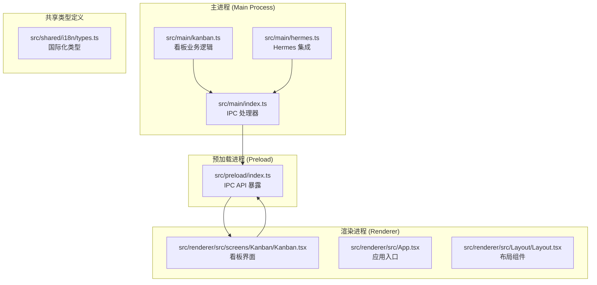
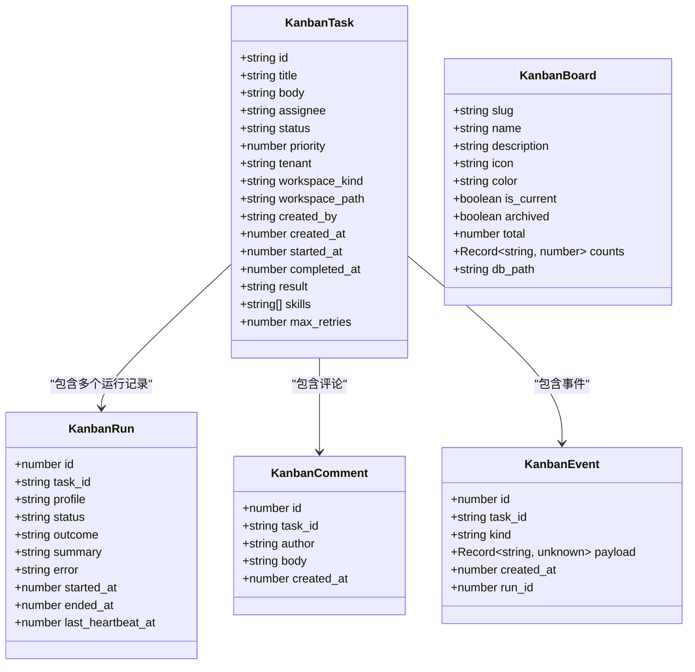
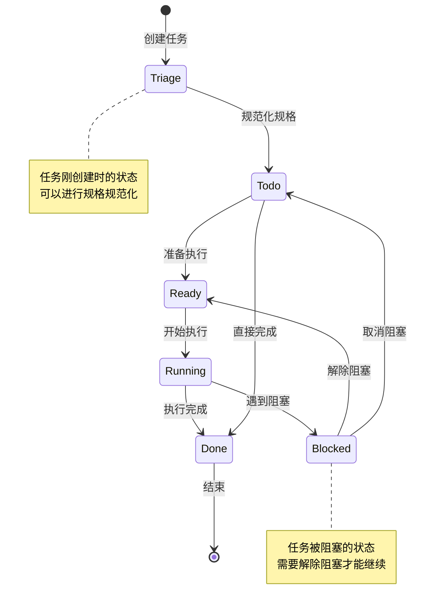
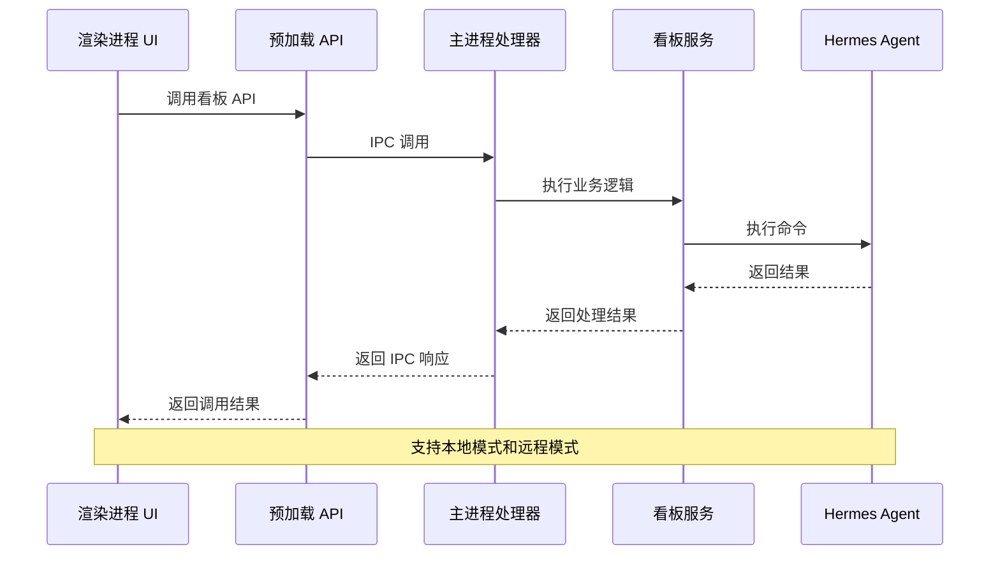
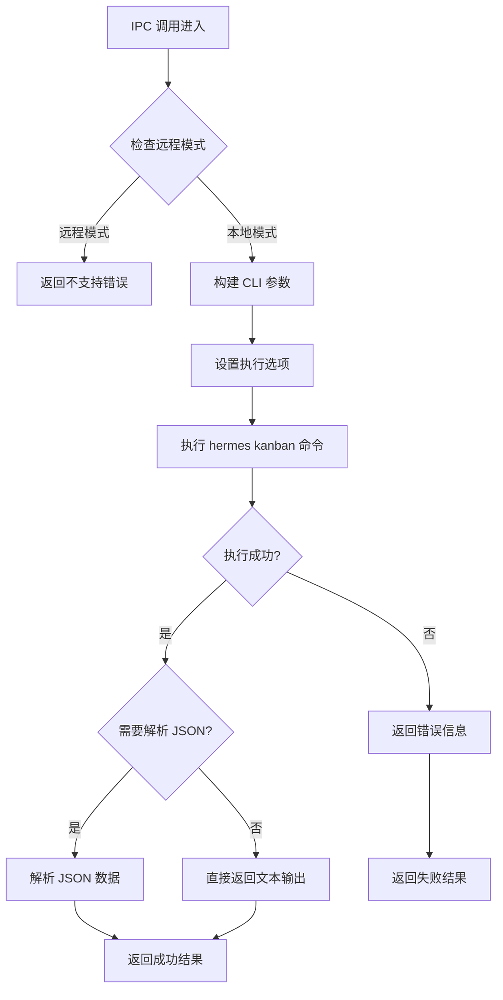
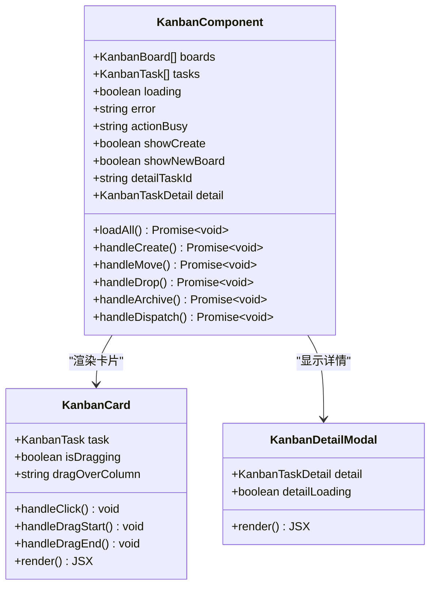

# 看板任务管理系统

<cite>
**本文档引用的文件**
- [src/main/kanban.ts](file://src/main/kanban.ts)
- [src/renderer/src/screens/Kanban/Kanban.tsx](file://src/renderer/src/screens/Kanban/Kanban.tsx)
- [src/preload/index.ts](file://src/preload/index.ts)
- [src/main/index.ts](file://src/main/index.ts)
- [src/main/hermes.ts](file://src/main/hermes.ts)
- [README.md](file://README.md)
- [package.json](file://package.json)
- [electron.vite.config.ts](file://electron.vite.config.ts)
</cite>

## 目录
1. [项目概述](#项目概述)
2. [项目结构](#项目结构)
3. [核心组件](#核心组件)
4. [架构概览](#架构概览)
5. [详细组件分析](#详细组件分析)
6. [依赖关系分析](#依赖关系分析)
7. [性能考虑](#性能考虑)
8. [故障排除指南](#故障排除指南)
9. [结论](#结论)

## 项目概述

看板任务管理系统是 Hermes Desktop 应用程序中的一个核心功能模块，为用户提供了可视化的任务管理界面。该系统基于看板方法论，支持多阶段的任务流转，包括 Triage（待处理）、To-do（待办）、Ready（准备中）、Running（执行中）、Blocked（阻塞）和 Done（完成）等状态。

Hermes Desktop 是一个原生桌面应用程序，用于安装、配置和与 Hermes Agent 进行交互。它使用官方的 Hermes 安装脚本，将 Hermes 存储在 `~/.hermes` 中，并为聊天、会话、配置文件、记忆、技能、工具、调度、消息网关等提供图形界面。

## 项目结构

该项目采用 Electron + React 架构，主要分为以下层次：



**图表来源**
- [src/main/index.ts:986-1090](file://src/main/index.ts#L986-L1090)
- [src/preload/index.ts:648-722](file://src/preload/index.ts#L648-L722)
- [src/renderer/src/screens/Kanban/Kanban.tsx:119-190](file://src/renderer/src/screens/Kanban/Kanban.tsx#L119-L190)

**章节来源**
- [README.md:17-283](file://README.md#L17-L283)
- [package.json:1-69](file://package.json#L1-L69)
- [electron.vite.config.ts:1-33](file://electron.vite.config.ts#L1-L33)

## 核心组件

### 数据模型

看板系统定义了以下核心数据结构：



**图表来源**
- [src/main/kanban.ts:11-81](file://src/main/kanban.ts#L11-L81)

### 看板状态流转

看板系统支持以下状态流转：



**图表来源**
- [src/renderer/src/screens/Kanban/Kanban.tsx:92-99](file://src/renderer/src/screens/Kanban/Kanban.tsx#L92-L99)
- [src/renderer/src/screens/Kanban/Kanban.tsx:375-385](file://src/renderer/src/screens/Kanban/Kanban.tsx#L375-L385)

**章节来源**
- [src/main/kanban.ts:11-81](file://src/main/kanban.ts#L11-L81)
- [src/renderer/src/screens/Kanban/Kanban.tsx:92-99](file://src/renderer/src/screens/Kanban/Kanban.tsx#L92-L99)

## 架构概览

看板系统采用三层架构设计，通过 IPC 机制实现跨进程通信：



**图表来源**
- [src/preload/index.ts:648-722](file://src/preload/index.ts#L648-L722)
- [src/main/index.ts:986-1090](file://src/main/index.ts#L986-L1090)
- [src/main/kanban.ts:98-141](file://src/main/kanban.ts#L98-L141)

## 详细组件分析

### 主进程看板处理器

主进程负责处理所有看板相关的 IPC 调用，实现了完整的业务逻辑：



**图表来源**
- [src/main/kanban.ts:98-141](file://src/main/kanban.ts#L98-L141)
- [src/main/kanban.ts:143-149](file://src/main/kanban.ts#L143-L149)

### 渲染进程看板界面

渲染进程提供了完整的看板用户界面，支持拖拽操作和实时更新：



**图表来源**
- [src/renderer/src/screens/Kanban/Kanban.tsx:119-190](file://src/renderer/src/screens/Kanban/Kanban.tsx#L119-L190)
- [src/renderer/src/screens/Kanban/Kanban.tsx:572-690](file://src/renderer/src/screens/Kanban/Kanban.tsx#L572-L690)

### 预加载进程 API 暴露

预加载进程为渲染进程提供了安全的 API 访问接口：

| API 方法 | 功能描述 | 参数 | 返回值 |
|---------|----------|------|--------|
| `kanbanListBoards` | 列出看板 | `includeArchived?: boolean, profile?: string` | `Promise<KanbanBoard[]>` |
| `kanbanListTasks` | 列出任务 | `filters?: TaskFilters` | `Promise<KanbanTask[]>` |
| `kanbanCreateTask` | 创建任务 | `input: CreateTaskInput, profile?: string` | `Promise<{id: string}>` |
| `kanbanCompleteTask` | 完成任务 | `taskId: string, result?: string, profile?: string` | `Promise<void>` |
| `kanbanBlockTask` | 阻塞任务 | `taskId: string, reason?: string, profile?: string` | `Promise<void>` |
| `kanbanUnblockTask` | 解除阻塞 | `taskId: string, profile?: string` | `Promise<void>` |
| `kanbanArchiveTask` | 归档任务 | `taskId: string, profile?: string` | `Promise<void>` |
| `kanbanDispatchOnce` | 执行一次调度 | `dryRun?: boolean, profile?: string` | `Promise<any>` |

**章节来源**
- [src/preload/index.ts:648-722](file://src/preload/index.ts#L648-L722)
- [src/main/index.ts:986-1090](file://src/main/index.ts#L986-L1090)

**章节来源**
- [src/renderer/src/screens/Kanban/Kanban.tsx:153-190](file://src/renderer/src/screens/Kanban/Kanban.tsx#L153-L190)
- [src/renderer/src/screens/Kanban/Kanban.tsx:330-362](file://src/renderer/src/screens/Kanban/Kanban.tsx#L330-L362)

## 依赖关系分析

看板系统与其他系统组件的依赖关系如下：

```mermaid
graph TB
subgraph "看板系统"
K1[Kanban.tsx]
K2[kanban.ts]
end
subgraph "IPC 层"
P1[index.ts (preload)]
P2[index.ts (main)]
end
subgraph "Hermes 集成"
H1[hermes.ts]
H2[installer.ts]
end
subgraph "外部系统"
E1[Hermes Agent]
E2[Python 环境]
E3[文件系统]
end
K1 --> P1
P1 --> P2
P2 --> K2
K2 --> H1
H1 --> H2
K2 --> E1
K2 --> E2
K2 --> E3
```

**图表来源**
- [src/main/kanban.ts:1-10](file://src/main/kanban.ts#L1-L10)
- [src/main/hermes.ts:1-18](file://src/main/hermes.ts#L1-L18)

### 关键依赖特性

1. **远程模式支持**: 看板功能在远程/SSH 模式下不可用，会提示用户切换到本地模式
2. **超时控制**: 所有命令执行都有 20 秒超时限制
3. **JSON 解析**: 支持自动解析 JSON 格式的输出
4. **错误处理**: 统一的错误处理和用户友好的错误消息

**章节来源**
- [src/main/kanban.ts:90-96](file://src/main/kanban.ts#L90-L96)
- [src/main/kanban.ts:143-149](file://src/main/kanban.ts#L143-L149)

## 性能考虑

### 实时更新机制

看板系统采用了轻量级的轮询机制来保持界面更新：

- **轮询间隔**: 6 秒
- **条件更新**: 仅在标签页可见时进行轮询
- **批量请求**: 同时获取看板列表和任务列表

### 内存优化

- **懒加载**: 看板界面只有在首次访问时才挂载
- **状态缓存**: 使用 React 的 useMemo 优化状态计算
- **事件清理**: 自动清理轮询定时器和事件监听器

### 网络优化

- **超时控制**: 20 秒超时避免长时间等待
- **错误重试**: 自动检测和报告错误
- **进度反馈**: 提供操作状态指示

## 故障排除指南

### 常见问题及解决方案

| 问题类型 | 症状 | 可能原因 | 解决方案 |
|---------|------|----------|----------|
| 远程模式不支持 | 显示"需要本地 Hermes 安装" | 当前处于远程/SSH 模式 | 切换到本地模式或使用 CLI |
| 任务无法移动 | 拖拽无效或报错 | 状态转换规则不支持 | 检查任务状态是否允许此转换 |
| 看板无数据 | 页面空白或加载失败 | hermes kanban 命令执行失败 | 检查 Hermes 安装和权限 |
| 超时错误 | 操作超时 | 网络延迟或系统负载高 | 检查网络连接和系统资源 |

### 调试技巧

1. **检查远程模式**: 使用 `window.hermesAPI.isRemoteMode()` 确认当前模式
2. **查看错误日志**: 在控制台中查看具体的错误信息
3. **验证权限**: 确保有足够的文件系统权限
4. **检查环境变量**: 验证 HERMES_HOME 和 PATH 设置

**章节来源**
- [src/renderer/src/screens/Kanban/Kanban.tsx:431-445](file://src/renderer/src/screens/Kanban/Kanban.tsx#L431-L445)
- [src/main/kanban.ts:115-141](file://src/main/kanban.ts#L115-L141)

## 结论

看板任务管理系统是一个功能完整、架构清晰的任务管理解决方案。它成功地将复杂的看板概念简化为直观的可视化界面，同时保持了强大的后端功能。

### 主要优势

1. **用户体验友好**: 直观的拖拽操作和实时更新
2. **功能完整性**: 支持完整的看板生命周期管理
3. **架构清晰**: 清晰的分层架构便于维护和扩展
4. **错误处理**: 完善的错误处理和用户反馈机制

### 技术亮点

1. **跨进程通信**: 通过 IPC 实现安全的跨进程调用
2. **状态管理**: 使用 React Hooks 实现高效的状态管理
3. **异步处理**: 支持异步操作和进度反馈
4. **远程支持**: 兼容多种连接模式

### 发展建议

1. **增强远程支持**: 逐步完善远程模式下的看板功能
2. **性能优化**: 考虑 WebSocket 实现实时同步
3. **移动端适配**: 优化移动端的触摸交互体验
4. **高级功能**: 添加任务依赖、优先级排序等高级功能

该系统为 Hermes Desktop 提供了强大的任务管理能力，是整个应用程序的重要组成部分。