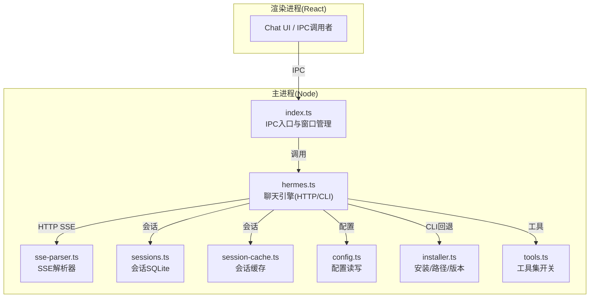
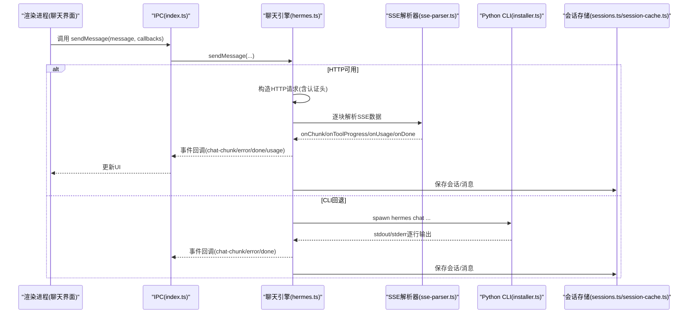
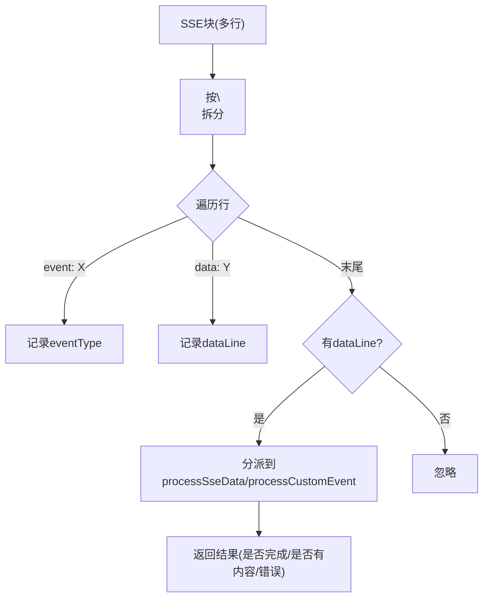
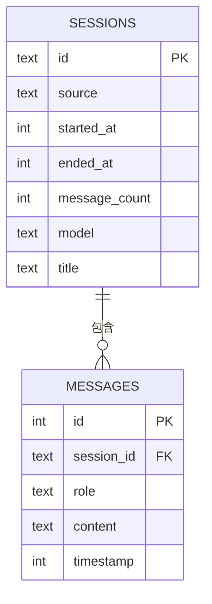
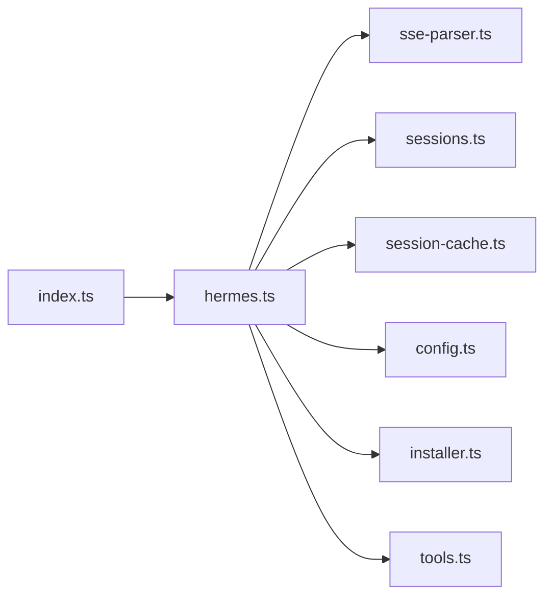

# 聊天引擎

<cite>
**本文引用的文件列表**
- [hermes.ts](file://src/main/hermes.ts)
- [sse-parser.ts](file://src/main/sse-parser.ts)
- [index.ts](file://src/main/index.ts)
- [sessions.ts](file://src/main/sessions.ts)
- [session-cache.ts](file://src/main/session-cache.ts)
- [config.ts](file://src/main/config.ts)
- [installer.ts](file://src/main/installer.ts)
- [tools.ts](file://src/main/tools.ts)
- [hermes-desktop-architecture.md](file://docs/hermes-desktop-architecture.md)
- [README.md](file://README.md)
- [sse-parser.test.ts](file://tests/sse-parser.test.ts)
</cite>

## 目录
1. [简介](#简介)
2. [项目结构](#项目结构)
3. [核心组件](#核心组件)
4. [架构总览](#架构总览)
5. [详细组件分析](#详细组件分析)
6. [依赖关系分析](#依赖关系分析)
7. [性能考量](#性能考量)
8. [故障排查指南](#故障排查指南)
9. [结论](#结论)
10. [附录](#附录)

## 简介
本文件面向Hermes Desktop聊天引擎，系统性阐述其核心架构与实现细节，重点覆盖：
- HTTP API流式传输与CLI回退机制
- SSE（服务器发送事件）解析器工作机制
- 流式响应处理流程与工具调用进度监控
- sendMessage函数的两条执行路径：HTTP API快速路径与CLI慢速路径
- 会话管理、错误处理、超时机制与中断控制
- 与Python Hermes Agent的交互协议、消息格式、认证机制与性能优化策略

## 项目结构
Hermes Desktop采用Electron + React架构，聊天引擎位于主进程（Node.js），通过IPC向渲染进程暴露API。核心聊天逻辑集中在src/main/hermes.ts，配合独立的SSE解析器src/main/sse-parser.ts，以及会话与配置管理模块。

图表来源
- [hermes-desktop-architecture.md](file://docs/hermes-desktop-architecture.md)
- [index.ts](file://src/main/index.ts)
- [hermes.ts](file://src/main/hermes.ts)
- [sse-parser.ts](file://src/main/sse-parser.ts)
- [sessions.ts](file://src/main/sessions.ts)
- [session-cache.ts](file://src/main/session-cache.ts)
- [config.ts](file://src/main/config.ts)
- [installer.ts](file://src/main/installer.ts)
- [tools.ts](file://src/main/tools.ts)

章节来源
- [hermes-desktop-architecture.md](file://docs/hermes-desktop-architecture.md)
- [README.md](file://README.md)

## 核心组件
- 聊天引擎（HTTP/CLI双路径）
  - HTTP API快速路径：通过本地或远程HTTP API进行SSE流式对话，具备低延迟、实时进度反馈与工具进度通知能力。
  - CLI回退路径：当HTTP不可用时，通过spawn Python子进程执行hermes CLI，逐行输出解析为流式内容。
- SSE解析器：独立可测试模块，负责SSE块解析、事件类型识别、[DONE]信号、错误捕获、使用量统计与工具进度提取。
- 会话管理：SQLite持久化与本地JSON缓存，支持全文检索、标题生成、消息查询与删除。
- 配置与认证：连接模式（本地/远程/SSH）、API密钥注入、模型配置、平台工具集开关。
- 网关生命周期：自动检测、启动、停止、健康轮询与SSH隧道集成。

章节来源
- [hermes.ts](file://src/main/hermes.ts)
- [sse-parser.ts](file://src/main/sse-parser.ts)
- [sessions.ts](file://src/main/sessions.ts)
- [session-cache.ts](file://src/main/session-cache.ts)
- [config.ts](file://src/main/config.ts)
- [installer.ts](file://src/main/installer.ts)

## 架构总览
聊天请求从渲染进程发起，经IPC进入主进程，由聊天引擎选择HTTP SSE或CLI路径，实时回调渲染进程更新UI，并在完成后持久化会话。

图表来源
- [index.ts](file://src/main/index.ts)
- [hermes.ts](file://src/main/hermes.ts)
- [sse-parser.ts](file://src/main/sse-parser.ts)
- [sessions.ts](file://src/main/sessions.ts)
- [session-cache.ts](file://src/main/session-cache.ts)
- [installer.ts](file://src/main/installer.ts)

## 详细组件分析

### 聊天引擎：sendMessage与双路径执行
- 路径选择
  - 远程模式（remote/ssh）：强制走HTTP API路径，不触发CLI回退。
  - 本地模式：先探测本地API服务器健康状态；若可用则走HTTP SSE；否则回退到CLI。
- HTTP API路径
  - 构造OpenAI风格的消息数组，启用stream=true，发送POST至/v1/chat/completions。
  - 通过SSE解析器处理事件：标准数据块与自定义事件（如hermes.tool.progress）。
  - 支持工具进度回调、使用量统计回调与完成回调。
  - 超时控制与中断：AbortController、请求超时与流结束处理。
- CLI回退路径
  - 通过spawn执行Python hermes CLI，注入增强PATH与API密钥环境变量。
  - 从stdout/stderr逐行解析，过滤噪声，将可见输出作为流式内容推送。
  - 退出码处理与错误上报，支持SIGTERM/SIGKILL中断。
- 网关生命周期
  - 首次聊天时确保API服务器配置并启动网关；健康轮询维护可用性缓存；支持手动启动/停止/重启。

图表来源
- [hermes.ts](file://src/main/hermes.ts)

章节来源
- [hermes.ts](file://src/main/hermes.ts)
- [index.ts](file://src/main/index.ts)

### SSE解析器：事件解析与进度监控
- 解析流程
  - 块级解析：从SSE块中提取event与data行，支持多行数据合并。
  - 数据处理：识别[DONE]、错误消息、增量内容(delta.content)、使用量统计。
  - 工具进度：支持自定义事件hermes.tool.progress与遗留inline模式（反引号包裹）。
- 独立可测试设计
  - 将SSE解析逻辑抽取为纯函数，便于单元测试覆盖边界情况与错误处理。

图表来源
- [sse-parser.ts](file://src/main/sse-parser.ts)

章节来源
- [sse-parser.ts](file://src/main/sse-parser.ts)
- [sse-parser.test.ts](file://tests/sse-parser.test.ts)

### 会话管理：持久化与缓存
- SQLite持久化
  - sessions.ts提供会话列表、全文检索（FTS5）、消息查询与删除。
- 本地缓存加速
  - session-cache.ts维护JSON缓存，按时间戳增量同步，避免频繁访问DB。
  - 自动生成标题、去噪与排序，提升启动与浏览体验。
- 删除策略
  - 支持同时清理WebUI会话文件与DB记录，保证一致性。

图表来源
- [sessions.ts](file://src/main/sessions.ts)
- [session-cache.ts](file://src/main/session-cache.ts)

章节来源
- [sessions.ts](file://src/main/sessions.ts)
- [session-cache.ts](file://src/main/session-cache.ts)

### 配置与认证：连接模式与API密钥注入
- 连接模式
  - local/remote/ssh三种模式，分别对应不同API端点与认证方式。
- API密钥注入
  - HTTP路径：根据URL模式自动注入Bearer Token或特定Provider Key。
  - CLI路径：将所有已知API Key注入环境变量，确保CLI可访问。
- 模型与平台
  - config.ts提供模型配置读写、平台开关读写与凭证池管理。

章节来源
- [hermes.ts](file://src/main/hermes.ts)
- [config.ts](file://src/main/config.ts)

### 工具集与平台开关
- 工具集开关
  - tools.ts解析config.yaml中的platform_toolsets.cli，动态启用/禁用工具集。
- 平台开关
  - 通过config.yaml的platforms段落控制各平台（如Telegram、Discord等）的启用状态。

章节来源
- [tools.ts](file://src/main/tools.ts)
- [config.ts](file://src/main/config.ts)

## 依赖关系分析
- 主进程模块耦合
  - index.ts集中注册50+IPC处理器，协调聊天、会话、配置、工具、技能、定时任务等功能。
  - hermes.ts依赖installer.ts（路径/版本/Python可执行）、config.ts（模型/连接）、sessions.ts/session-cache.ts（会话）、sse-parser.ts（SSE解析）。
- 外部依赖
  - Python Hermes Agent CLI（本地/远程）与第三方LLM提供商API。
  - better-sqlite3用于本地会话数据库。

图表来源
- [index.ts](file://src/main/index.ts)
- [hermes.ts](file://src/main/hermes.ts)
- [sse-parser.ts](file://src/main/sse-parser.ts)
- [sessions.ts](file://src/main/sessions.ts)
- [session-cache.ts](file://src/main/session-cache.ts)
- [config.ts](file://src/main/config.ts)
- [installer.ts](file://src/main/installer.ts)
- [tools.ts](file://src/main/tools.ts)

章节来源
- [hermes-desktop-architecture.md](file://docs/hermes-desktop-architecture.md)

## 性能考量
- HTTP SSE路径
  - 低延迟、实时回调、细粒度进度反馈；适合大多数本地与远程场景。
- CLI回退路径
  - 启动开销较大，但兼容性更强；适用于HTTP不可用或特殊环境。
- 缓存与增量同步
  - 会话缓存按时间戳增量同步，减少DB访问频率。
- 超时与中断
  - 请求超时与AbortController结合，避免长时间阻塞；支持SIGTERM/SIGKILL优雅终止。

## 故障排查指南
- HTTP 401/403
  - 检查config.yaml中的provider与.env中的API Key是否匹配。
- 远程连接失败
  - 使用testRemoteConnection验证URL与API Key；SSH模式下检查隧道健康。
- CLI无法启动
  - 确认Python可执行路径与虚拟环境；检查PATH增强逻辑。
- SSE解析异常
  - 观察SSE块格式与事件类型；确保自定义事件payload结构正确。
- 会话缺失或标题异常
  - 检查session-cache同步与FTS5索引；必要时重建索引。

章节来源
- [hermes.ts](file://src/main/hermes.ts)
- [config.ts](file://src/main/config.ts)
- [sessions.ts](file://src/main/sessions.ts)
- [session-cache.ts](file://src/main/session-cache.ts)

## 结论
Hermes Desktop聊天引擎通过“HTTP SSE快速路径 + CLI回退路径”的双轨设计，在保证兼容性的前提下最大化用户体验。SSE解析器的独立化提升了可测试性与可维护性；会话管理与配置体系为复杂场景提供了稳定支撑。结合合理的超时与中断控制，系统在多种部署形态（本地/远程/SSH）下均能提供一致的流式对话体验。

## 附录

### sendMessage API使用要点
- 回调函数
  - onChunk：接收增量文本片段，用于实时渲染。
  - onToolProgress：接收工具进度标签（含emoji），用于UI提示。
  - onUsage：接收token用量与成本信息，用于计费与限额提示。
  - onDone：对话完成，可选返回会话ID。
  - onError：错误回调，包含错误描述。
- 会话恢复与历史
  - 通过resumeSessionId与history参数实现上下文延续与历史注入。
- 中断控制
  - sendMessage返回的handle包含abort方法，可在渲染层绑定取消按钮。

章节来源
- [hermes.ts](file://src/main/hermes.ts)
- [index.ts](file://src/main/index.ts)

### 与Python Hermes Agent的交互协议
- HTTP协议
  - 端点：/v1/chat/completions，启用stream=true。
  - 认证：根据连接模式自动附加Authorization头（Bearer Token或空）。
  - SSE事件：标准data块与自定义事件hermes.tool.progress。
- CLI协议
  - 命令：python hermes chat -q "<message>" -Q --source desktop。
  - 环境：注入增强PATH与API Key；支持自定义Provider与Base URL。
  - 输出：stdout逐行解析为增量内容；stderr用于错误与警告。

章节来源
- [hermes.ts](file://src/main/hermes.ts)
- [installer.ts](file://src/main/installer.ts)