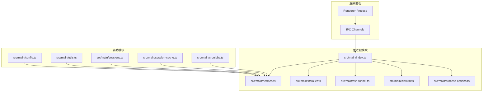
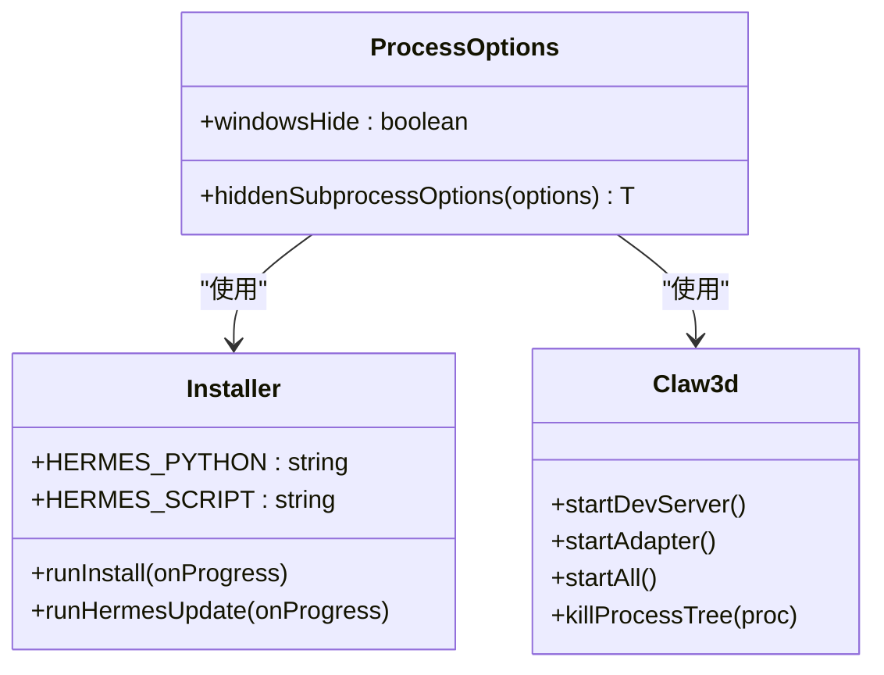
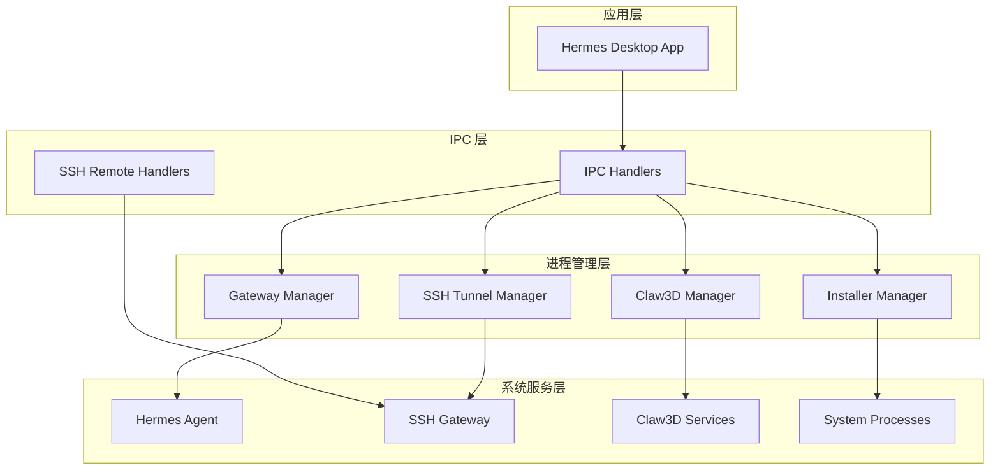
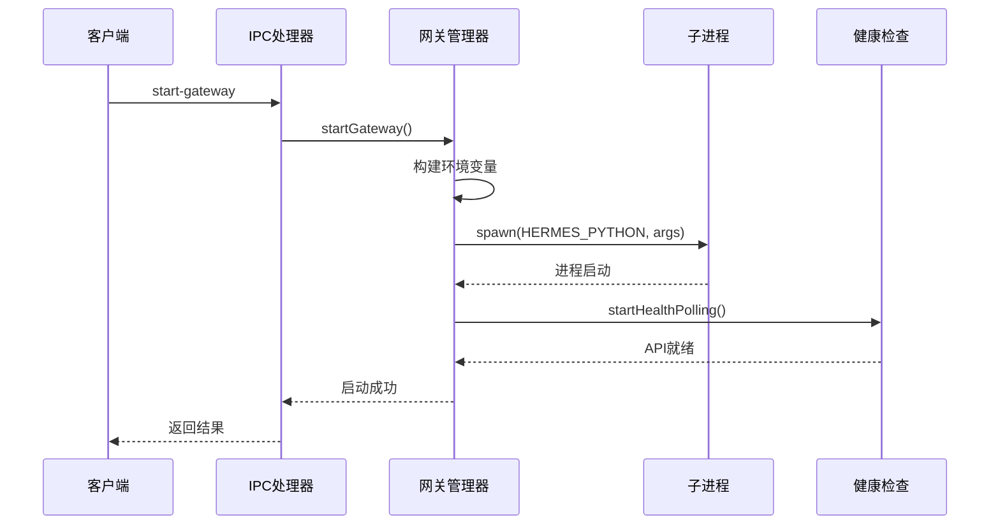
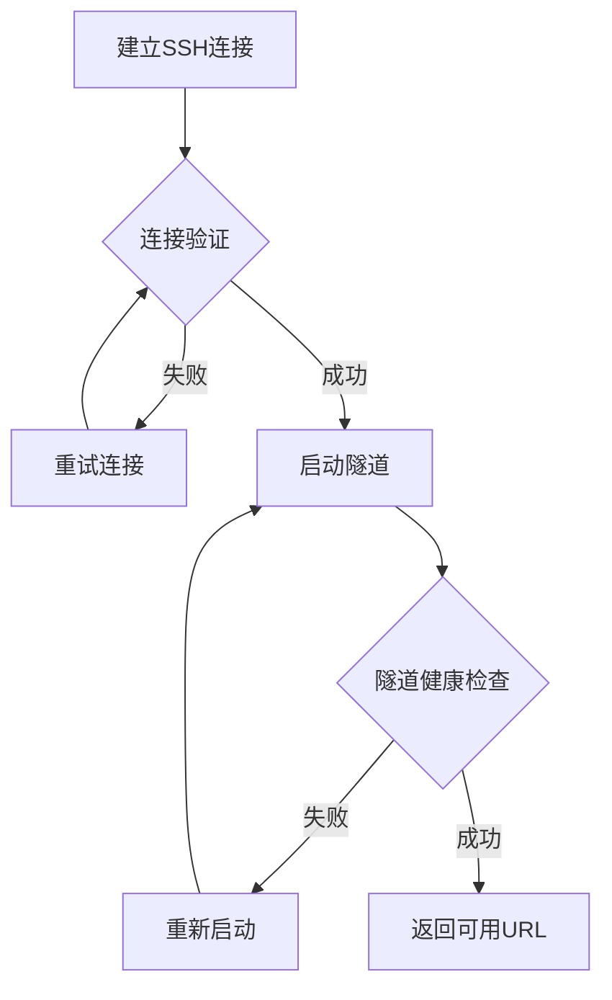
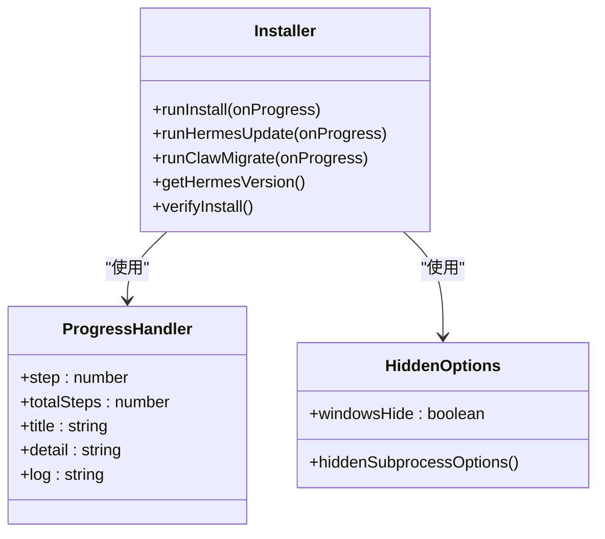
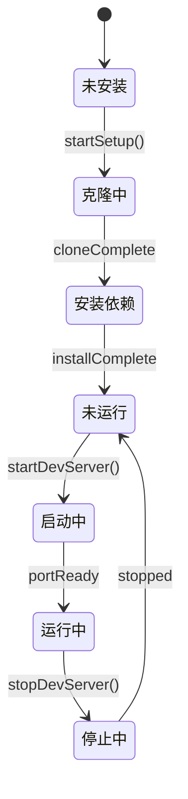
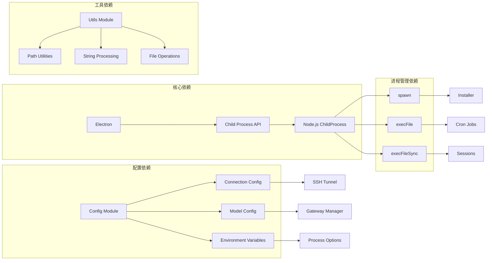
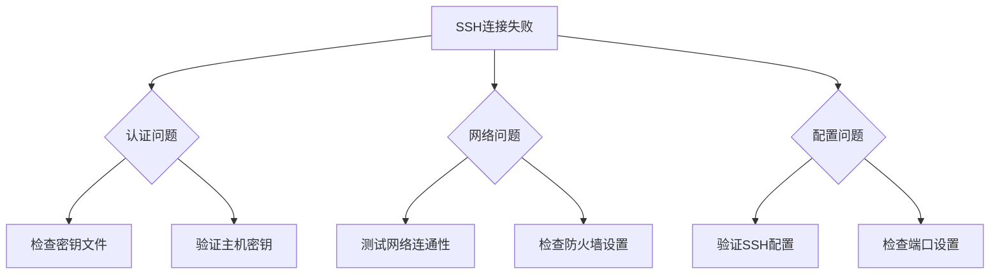

# 进程管理

<cite>
**本文档引用的文件**
- [src/main/index.ts](file://src/main/index.ts)
- [src/main/hermes.ts](file://src/main/hermes.ts)
- [src/main/installer.ts](file://src/main/installer.ts)
- [src/main/ssh-tunnel.ts](file://src/main/ssh-tunnel.ts)
- [src/main/claw3d.ts](file://src/main/claw3d.ts)
- [src/main/process-options.ts](file://src/main/process-options.ts)
- [src/main/config.ts](file://src/main/config.ts)
- [src/main/utils.ts](file://src/main/utils.ts)
- [src/main/sessions.ts](file://src/main/sessions.ts)
- [src/main/session-cache.ts](file://src/main/session-cache.ts)
- [src/main/cronjobs.ts](file://src/main/cronjobs.ts)
</cite>

## 目录
1. [简介](#简介)
2. [项目结构](#项目结构)
3. [核心组件](#核心组件)
4. [架构概览](#架构概览)
5. [详细组件分析](#详细组件分析)
6. [依赖关系分析](#依赖关系分析)
7. [性能考虑](#性能考虑)
8. [故障排除指南](#故障排除指南)
9. [结论](#结论)

## 简介

Hermes Desktop 是一个基于 Electron 的桌面应用程序，专门用于管理 Hermes Agent 智能体的进程生命周期。该系统通过精心设计的进程管理机制，实现了本地和远程两种运行模式，支持 SSH 隧道连接、子进程隐藏、进程健康检查等功能。

本项目的核心价值在于提供了一个完整的进程管理系统，能够智能地启动、监控和终止各种服务进程，包括本地的 Hermes Agent 网关、SSH 隧道、Claw3D 开发环境等。系统采用异步进程管理策略，确保用户界面的流畅性和系统的稳定性。

## 项目结构

项目采用模块化架构，主要的进程管理相关文件分布在以下目录：

**图表来源**
- [src/main/index.ts:1-800](file://src/main/index.ts#L1-L800)
- [src/main/hermes.ts:1-864](file://src/main/hermes.ts#L1-L864)
- [src/main/installer.ts:1-800](file://src/main/installer.ts#L1-L800)

**章节来源**
- [src/main/index.ts:1-800](file://src/main/index.ts#L1-L800)
- [src/main/hermes.ts:1-864](file://src/main/hermes.ts#L1-L864)

## 核心组件

### 进程管理器 (Process Manager)

系统的核心是进程管理器，负责协调所有子进程的生命周期。主要功能包括：

- **进程启动控制**：智能启动本地或远程进程
- **进程状态监控**：实时监控进程健康状况
- **进程通信管理**：处理进程间的数据交换
- **资源清理**：确保进程退出时的资源正确释放

### 子进程选项管理

为了确保跨平台兼容性，系统提供了统一的子进程选项管理：

**图表来源**
- [src/main/process-options.ts:1-8](file://src/main/process-options.ts#L1-L8)
- [src/main/installer.ts:1-800](file://src/main/installer.ts#L1-L800)
- [src/main/claw3d.ts:1-800](file://src/main/claw3d.ts#L1-L800)

**章节来源**
- [src/main/process-options.ts:1-8](file://src/main/process-options.ts#L1-L8)
- [src/main/installer.ts:1-800](file://src/main/installer.ts#L1-L800)
- [src/main/claw3d.ts:1-800](file://src/main/claw3d.ts#L1-L800)

## 架构概览

系统采用分层架构设计，每层都有明确的职责分工：

**图表来源**
- [src/main/index.ts:311-800](file://src/main/index.ts#L311-L800)
- [src/main/hermes.ts:718-864](file://src/main/hermes.ts#L718-L864)
- [src/main/ssh-tunnel.ts:121-167](file://src/main/ssh-tunnel.ts#L121-L167)

## 详细组件分析

### 网关管理器 (Gateway Manager)

网关管理器是系统的核心组件，负责管理 Hermes Agent 网关进程：

**图表来源**
- [src/main/hermes.ts:721-768](file://src/main/hermes.ts#L721-L768)
- [src/main/hermes.ts:695-705](file://src/main/hermes.ts#L695-L705)

网关管理器的关键特性：

1. **智能启动策略**：根据配置自动选择本地或远程模式
2. **环境变量注入**：自动注入所有必要的 API 密钥
3. **健康监控**：持续监控网关状态并自动重启
4. **进程隔离**：使用独立的子进程避免阻塞主进程

**章节来源**
- [src/main/hermes.ts:718-864](file://src/main/hermes.ts#L718-L864)

### SSH 隧道管理器

SSH 隧道管理器提供了安全的远程连接能力：

**图表来源**
- [src/main/ssh-tunnel.ts:121-154](file://src/main/ssh-tunnel.ts#L121-L154)
- [src/main/ssh-tunnel.ts:31-58](file://src/main/ssh-tunnel.ts#L31-L58)

SSH 隧道管理器的主要功能：

- **动态端口分配**：自动寻找可用的本地端口
- **健康状态监控**：定期检查隧道连接质量
- **自动故障转移**：连接中断时自动重连
- **安全认证**：支持多种 SSH 认证方式

**章节来源**
- [src/main/ssh-tunnel.ts:1-224](file://src/main/ssh-tunnel.ts#L1-L224)

### 安装器管理器

安装器管理器负责处理所有安装和更新操作：

**图表来源**
- [src/main/installer.ts:521-654](file://src/main/installer.ts#L521-L654)
- [src/main/process-options.ts:1-8](file://src/main/process-options.ts#L1-L8)

安装器管理器的特点：

- **进度跟踪**：实时显示安装进度和状态
- **错误恢复**：安装失败时提供详细的错误信息
- **跨平台支持**：同时支持 Windows 和 Unix 系统
- **缓存优化**：智能缓存版本信息减少重复查询

**章节来源**
- [src/main/installer.ts:1-800](file://src/main/installer.ts#L1-L800)
- [src/main/process-options.ts:1-8](file://src/main/process-options.ts#L1-L8)

### Claw3D 管理器

Claw3D 管理器提供了完整的开发环境管理：

**图表来源**
- [src/main/claw3d.ts:839-875](file://src/main/claw3d.ts#L839-L875)
- [src/main/claw3d.ts:667-731](file://src/main/claw3d.ts#L667-L731)

Claw3D 管理器的功能特性：

- **自动环境检测**：智能检测和配置开发环境
- **多服务管理**：同时管理开发服务器和适配器
- **日志聚合**：统一收集和展示服务日志
- **进程树管理**：正确处理子进程的层级关系

**章节来源**
- [src/main/claw3d.ts:1-892](file://src/main/claw3d.ts#L1-L892)

## 依赖关系分析

系统中的关键依赖关系如下：

**图表来源**
- [src/main/index.ts:1-800](file://src/main/index.ts#L1-L800)
- [src/main/config.ts:1-440](file://src/main/config.ts#L1-L440)
- [src/main/utils.ts:1-85](file://src/main/utils.ts#L1-L85)

**章节来源**
- [src/main/index.ts:1-800](file://src/main/index.ts#L1-L800)
- [src/main/config.ts:1-440](file://src/main/config.ts#L1-L440)
- [src/main/utils.ts:1-85](file://src/main/utils.ts#L1-L85)

## 性能考虑

### 进程启动优化

系统采用了多种优化策略来提升进程启动性能：

1. **延迟初始化**：只有在需要时才启动网关进程
2. **健康检查缓存**：缓存 API 服务器的可用性状态
3. **异步操作**：所有进程操作都是异步执行的
4. **资源池管理**：复用已存在的进程实例

### 内存管理

- **进程句柄清理**：及时清理不再使用的进程引用
- **事件监听器移除**：防止内存泄漏的事件监听器
- **超时机制**：设置合理的进程超时时间
- **错误处理**：完善的异常处理机制

### 网络性能

- **连接复用**：在 SSH 隧道中复用连接
- **批量操作**：支持批量的配置更新操作
- **缓存策略**：智能缓存配置和状态信息
- **并发限制**：控制同时运行的进程数量

## 故障排除指南

### 常见问题诊断

#### 进程启动失败

当遇到进程启动失败时，可以按照以下步骤进行诊断：

1. **检查进程状态**：确认目标进程是否已经在运行
2. **验证权限**：确保有足够的权限启动目标进程
3. **检查依赖**：确认所有必需的依赖都已正确安装
4. **查看日志**：检查进程的标准输出和错误输出

#### SSH 连接问题

SSH 连接问题是最常见的进程管理问题：

**图表来源**
- [src/main/ssh-tunnel.ts:169-223](file://src/main/ssh-tunnel.ts#L169-L223)

#### 进程监控问题

如果发现进程监控失效：

1. **检查健康检查间隔**：确认健康检查定时器正常工作
2. **验证进程PID文件**：检查PID文件是否存在且有效
3. **查看进程信号**：确认进程正确响应停止信号
4. **检查资源限制**：验证系统资源是否充足

**章节来源**
- [src/main/ssh-tunnel.ts:1-224](file://src/main/ssh-tunnel.ts#L1-L224)
- [src/main/hermes.ts:815-825](file://src/main/hermes.ts#L815-L825)

## 结论

Hermes Desktop 的进程管理系统展现了现代桌面应用的最佳实践。通过精心设计的架构和实现，系统成功地解决了复杂的进程管理挑战，包括：

1. **跨平台兼容性**：统一的进程管理接口支持 Windows、macOS 和 Linux
2. **安全性保障**：严格的进程隔离和权限控制
3. **可靠性保证**：完善的错误处理和自动恢复机制
4. **用户体验优化**：非阻塞的异步操作和实时状态反馈

该系统为类似的应用程序提供了一个优秀的参考模型，展示了如何在桌面环境中有效地管理复杂的进程生态系统。通过模块化的架构设计和清晰的职责分离，系统既保持了高度的可维护性，又确保了良好的性能表现。

未来的发展方向可能包括进一步的性能优化、更多的自动化功能，以及对新平台和新技术的支持。但目前的实现已经为这些发展奠定了坚实的基础。