# 配置系统

<cite>
**本文引用的文件**
- [src/main/config.ts](file://src/main/config.ts)
- [src/main/utils.ts](file://src/main/utils.ts)
- [src/main/profiles.ts](file://src/main/profiles.ts)
- [src/main/models.ts](file://src/main/models.ts)
- [src/main/default-models.ts](file://src/main/default-models.ts)
- [src/main/installer.ts](file://src/main/installer.ts)
- [src/main/ssh-options.ts](file://src/main/ssh-options.ts)
- [src/shared/i18n/config.ts](file://src/shared/i18n/config.ts)
- [src/shared/i18n/types.ts](file://src/shared/i18n/types.ts)
- [src/preload/index.ts](file://src/preload/index.ts)
- [src/preload/index.d.ts](file://src/preload/index.d.ts)
</cite>

## 目录
1. [简介](#简介)
2. [项目结构](#项目结构)
3. [核心组件](#核心组件)
4. [架构总览](#架构总览)
5. [详细组件分析](#详细组件分析)
6. [依赖关系分析](#依赖关系分析)
7. [性能考量](#性能考量)
8. [故障排查指南](#故障排查指南)
9. [结论](#结论)
10. [附录：配置项与文件格式参考](#附录配置项与文件格式参考)

## 简介
本文件系统性阐述 Hermes Desktop 的配置体系，覆盖以下方面：
- 配置层次与优先级：全局配置、用户配置、个人配置文件的组织方式与生效顺序
- 连接配置：本地、远程、SSH 模式及其参数
- 模型配置：默认模型、自定义提供者、模型持久化
- 环境变量管理：.env 文件解析、校验与写入
- 多配置文件支持：基于“个人配置档案”的多环境隔离
- 验证、热重载与迁移：安装状态检查、缓存与迁移流程
- 国际化与主题：语言选择与可用语言集
- 安全与敏感信息：凭据池、认证文件与安全注意事项
- 配置 API 使用指南：读取、修改与监听配置变更
- 配置文件格式与完整参考：键名、值类型与注释约定

## 项目结构
Hermes Desktop 的配置系统由三部分组成：
- 主进程配置模块：负责连接、模型、平台开关、凭据池等核心配置的读写与缓存
- 预加载层 API：通过 IPC 将主进程能力暴露给渲染进程，统一提供 profile-aware 的配置接口
- 工具与路径模块：提供 profile 路径解析、正则转义、安全写入等通用能力

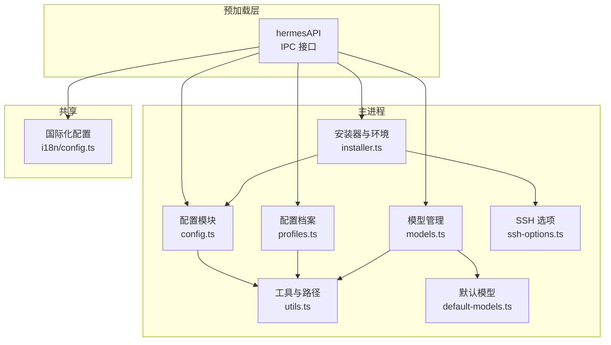

**图表来源**
- [src/preload/index.ts:15-686](file://src/preload/index.ts#L15-L686)
- [src/main/config.ts:1-440](file://src/main/config.ts#L1-L440)
- [src/main/profiles.ts:1-284](file://src/main/profiles.ts#L1-L284)
- [src/main/utils.ts:1-85](file://src/main/utils.ts#L1-L85)
- [src/main/models.ts:1-169](file://src/main/models.ts#L1-L169)
- [src/main/default-models.ts:1-48](file://src/main/default-models.ts#L1-L48)
- [src/main/installer.ts:1-1130](file://src/main/installer.ts#L1-L1130)
- [src/main/ssh-options.ts:1-22](file://src/main/ssh-options.ts#L1-L22)
- [src/shared/i18n/config.ts:1-7](file://src/shared/i18n/config.ts#L1-L7)

**章节来源**
- [src/preload/index.ts:15-686](file://src/preload/index.ts#L15-L686)
- [src/main/config.ts:1-440](file://src/main/config.ts#L1-L440)
- [src/main/profiles.ts:1-284](file://src/main/profiles.ts#L1-L284)
- [src/main/utils.ts:1-85](file://src/main/utils.ts#L1-L85)
- [src/main/models.ts:1-169](file://src/main/models.ts#L1-L169)
- [src/main/default-models.ts:1-48](file://src/main/default-models.ts#L1-L48)
- [src/main/installer.ts:1-1130](file://src/main/installer.ts#L1-L1130)
- [src/main/ssh-options.ts:1-22](file://src/main/ssh-options.ts#L1-L22)
- [src/shared/i18n/config.ts:1-7](file://src/shared/i18n/config.ts#L1-L7)

## 核心组件
- 连接配置（本地/远程/SSH）：集中于 desktop.json，支持模式切换与 SSH 参数持久化
- 模型配置：config.yaml 中的 provider/default/base_url，支持默认值与缓存
- 平台开关：config.yaml 中 platforms: 下的 enabled 开关
- 环境变量：.env 文件解析与写入，含键名与值的严格校验
- 凭据池：auth.json 中的 credential_pool，按 provider 分组
- 模型库：models.json，保存用户添加/删除/更新的模型条目
- 配置档案：profiles/ 目录下的命名档案，配合 active_profile 实现多环境隔离
- 国际化：i18n 配置与可用语言集合

**章节来源**
- [src/main/config.ts:47-74](file://src/main/config.ts#L47-L74)
- [src/main/config.ts:215-301](file://src/main/config.ts#L215-L301)
- [src/main/config.ts:317-394](file://src/main/config.ts#L317-L394)
- [src/main/config.ts:101-179](file://src/main/config.ts#L101-L179)
- [src/main/config.ts:421-439](file://src/main/config.ts#L421-L439)
- [src/main/models.ts:20-169](file://src/main/models.ts#L20-L169)
- [src/main/profiles.ts:111-193](file://src/main/profiles.ts#L111-L193)
- [src/shared/i18n/config.ts:1-7](file://src/shared/i18n/config.ts#L1-L7)

## 架构总览
配置系统通过“预加载 API -> 主进程配置模块”的双层设计实现：
- 预加载层提供统一的 IPC 接口，渲染层以 hermesAPI 调用
- 主进程配置模块负责实际文件读写、缓存与校验
- 工具模块提供路径解析、安全写入与正则转义
- 安装器模块在安装/迁移时读取/写入配置，并与 SSH 选项协同

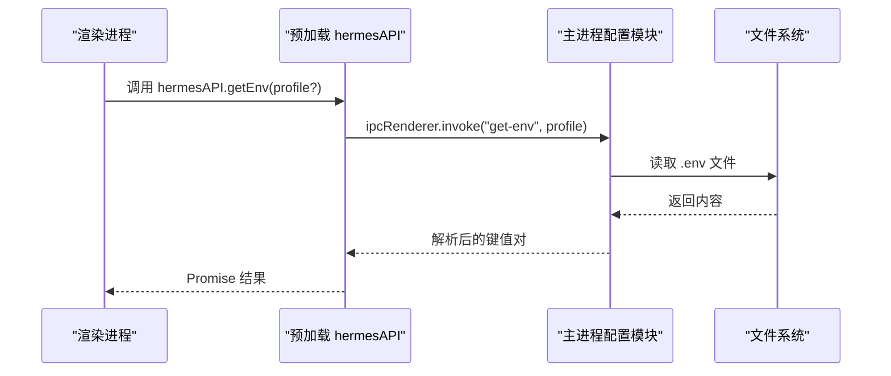

**图表来源**
- [src/preload/index.ts:75-79](file://src/preload/index.ts#L75-L79)
- [src/main/config.ts:101-132](file://src/main/config.ts#L101-L132)

**章节来源**
- [src/preload/index.ts:15-686](file://src/preload/index.ts#L15-L686)
- [src/main/config.ts:101-132](file://src/main/config.ts#L101-L132)

## 详细组件分析

### 配置层次与优先级
- 全局配置：位于 ~/.hermes/desktop.json，存储连接模式、远程地址、API Key 与 SSH 配置
- 用户配置：位于 ~/.hermes/config.yaml，存储模型 provider/default/base_url、平台开关等
- 个人配置档案：~/.hermes/profiles/<name>/config.yaml 与 .env，配合 active_profile 切换
- 生效顺序：渲染层通过 hermesAPI 的 profile? 参数决定读取目标；若未指定，则回退到默认档案

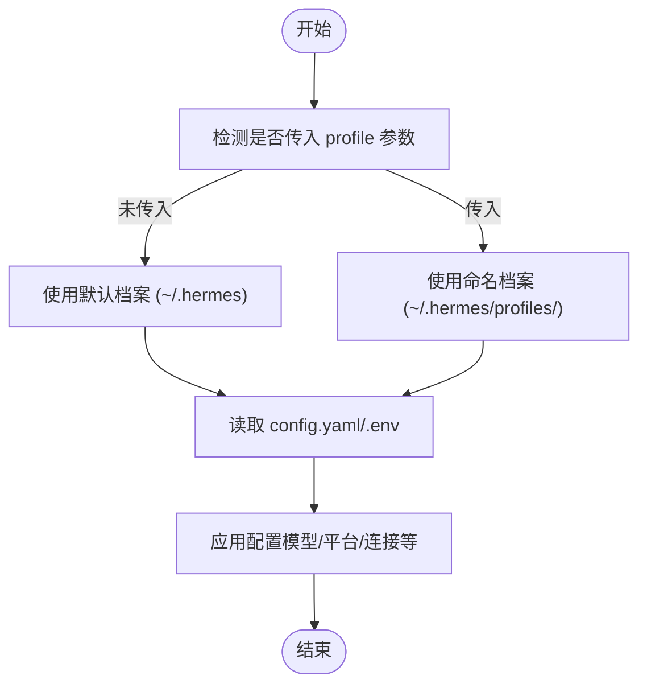

**图表来源**
- [src/main/utils.ts:46-66](file://src/main/utils.ts#L46-L66)
- [src/main/profiles.ts:92-100](file://src/main/profiles.ts#L92-L100)

**章节来源**
- [src/main/utils.ts:46-66](file://src/main/utils.ts#L46-L66)
- [src/main/profiles.ts:92-100](file://src/main/profiles.ts#L92-L100)

### 连接配置（本地/远程/SSH）
- 数据结构：mode、remoteUrl、apiKey、ssh（host/port/username/keyPath/remotePort/localPort）
- 读取：getConnectionConfig 从 desktop.json 合并默认值
- 写入：setConnectionConfig 更新 desktop.json
- SSH 控制选项：buildSshControlOptions 基于平台生成控制参数

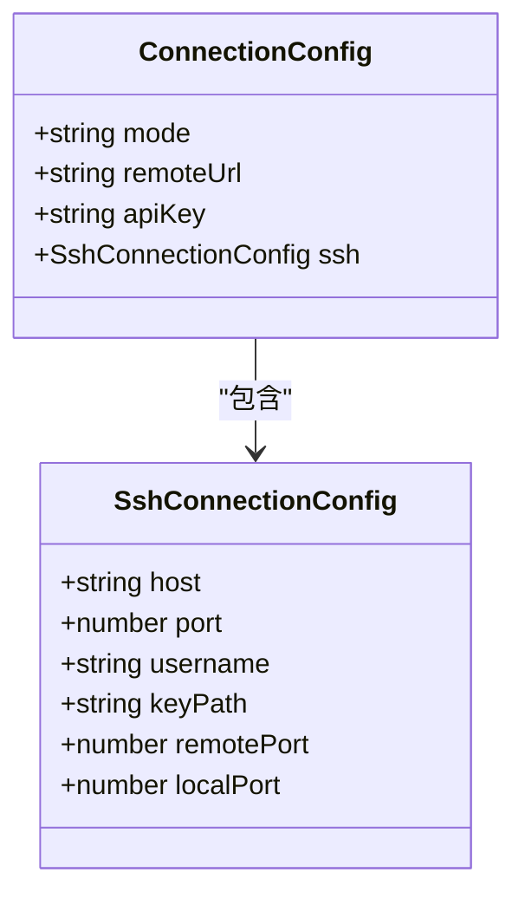

**图表来源**
- [src/main/config.ts:8-22](file://src/main/config.ts#L8-L22)
- [src/main/config.ts:47-74](file://src/main/config.ts#L47-L74)
- [src/main/ssh-options.ts:1-22](file://src/main/ssh-options.ts#L1-L22)

**章节来源**
- [src/main/config.ts:47-74](file://src/main/config.ts#L47-L74)
- [src/main/ssh-options.ts:1-22](file://src/main/ssh-options.ts#L1-L22)

### 模型配置与模型库
- 模型配置：config.yaml 中的 provider/default/base_url，读取带缓存，写入时自动启用 streaming 并禁用 smart_model_routing
- 自定义提供者：custom_providers: 列表，支持 name/model/base_url/api_key/api_mode
- 模型库：models.json，保存用户新增/删除/更新的模型条目，首次运行会播种默认模型
- 默认模型：default-models.ts 提供内置默认模型清单

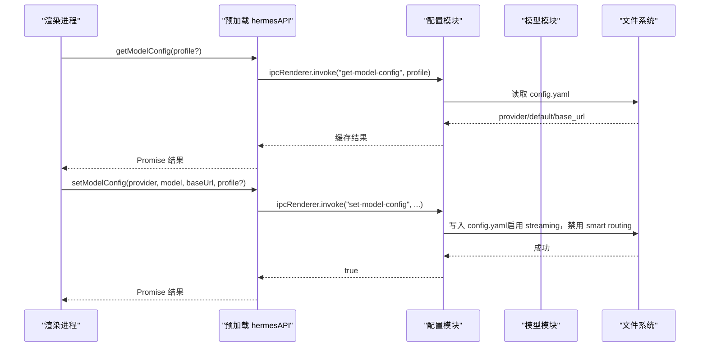

**图表来源**
- [src/preload/index.ts:90-101](file://src/preload/index.ts#L90-L101)
- [src/main/config.ts:215-301](file://src/main/config.ts#L215-L301)
- [src/main/models.ts:20-169](file://src/main/models.ts#L20-L169)
- [src/main/default-models.ts:1-48](file://src/main/default-models.ts#L1-L48)

**章节来源**
- [src/main/config.ts:215-301](file://src/main/config.ts#L215-L301)
- [src/main/models.ts:20-169](file://src/main/models.ts#L20-L169)
- [src/main/default-models.ts:1-48](file://src/main/default-models.ts#L1-L48)

### 环境变量管理
- 读取：readEnv(profile?) 从 .env 解析键值对，支持单引号/双引号包裹值，忽略注释行与无等号行
- 写入：setEnvValue(key, value, profile?) 在存在时更新，不存在时追加；同时进行键名与值的严格校验
- 校验：键名仅允许字母数字下划线且不能以数字开头；值必须为单行字符串，不允许包含换行/空字符
- 缓存：内存缓存（TTL=5s），按 profile 前缀失效

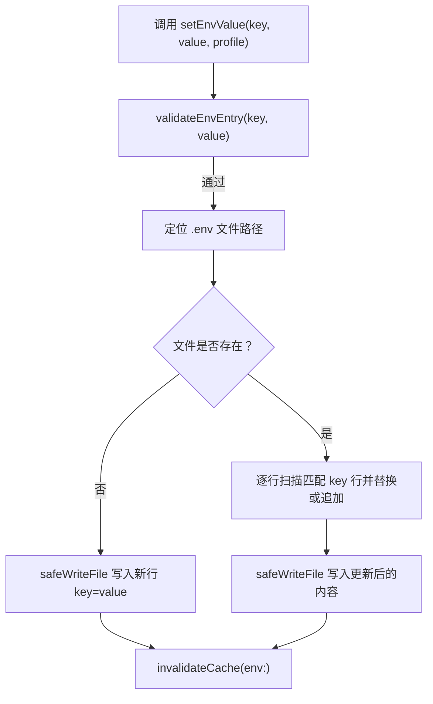

**图表来源**
- [src/main/config.ts:134-179](file://src/main/config.ts#L134-L179)
- [src/main/config.ts:101-132](file://src/main/config.ts#L101-L132)
- [src/main/utils.ts:80-84](file://src/main/utils.ts#L80-L84)

**章节来源**
- [src/main/config.ts:101-179](file://src/main/config.ts#L101-L179)
- [src/main/utils.ts:80-84](file://src/main/utils.ts#L80-L84)

### 平台开关与凭据池
- 平台开关：getPlatformEnabled/setPlatformEnabled 在 config.yaml 的 platforms: 区块中读取/写入 enabled
- 凭据池：getCredentialPool/setCredentialPool 在 auth.json 的 credential_pool 中按 provider 维度管理

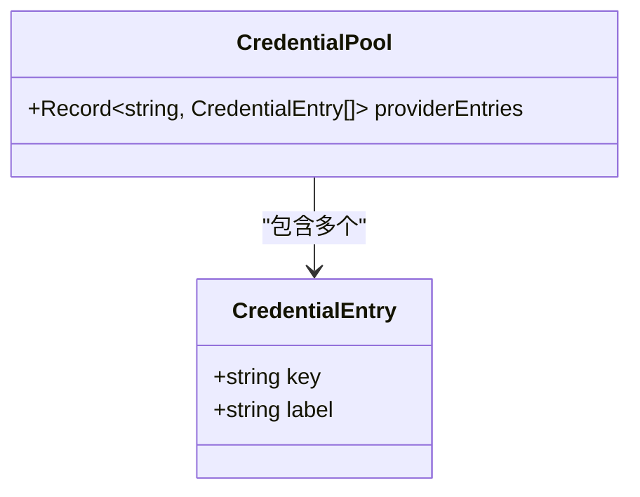

**图表来源**
- [src/main/config.ts:421-439](file://src/main/config.ts#L421-L439)

**章节来源**
- [src/main/config.ts:317-394](file://src/main/config.ts#L317-L394)
- [src/main/config.ts:421-439](file://src/main/config.ts#L421-L439)

### 多配置文件支持与档案管理
- 档案发现：listProfiles 支持默认档案与命名档案，统计技能数量、网关运行状态、.env 与 SOUL.md 存在性
- 活动档案：通过 active_profile 文件标记当前活动档案
- 创建/删除/切换：createProfile/deleteProfile/setActiveProfile 委托给 hermes CLI

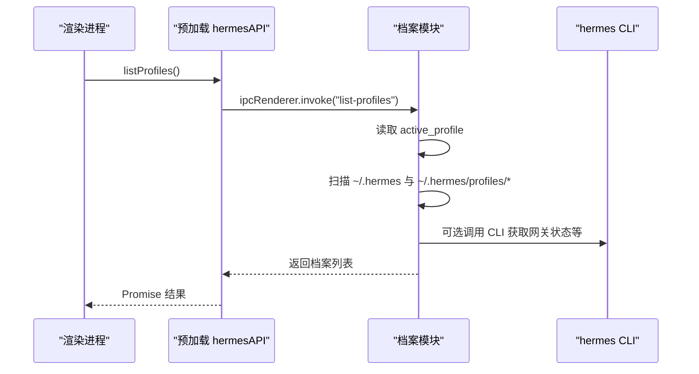

**图表来源**
- [src/preload/index.ts:274-301](file://src/preload/index.ts#L274-L301)
- [src/main/profiles.ts:111-193](file://src/main/profiles.ts#L111-L193)
- [src/main/profiles.ts:263-283](file://src/main/profiles.ts#L263-L283)

**章节来源**
- [src/main/profiles.ts:111-193](file://src/main/profiles.ts#L111-L193)
- [src/main/profiles.ts:263-283](file://src/main/profiles.ts#L263-L283)

### 国际化与主题设置
- 语言配置：SOURCE_LOCALE/FALLBACK_LOCALE/DEFAULT_ACTIVE_LOCALE/APP_LOCALES
- 渲染层语言切换：getLocale/setLocale 通过 IPC 与 i18n 提供者协作

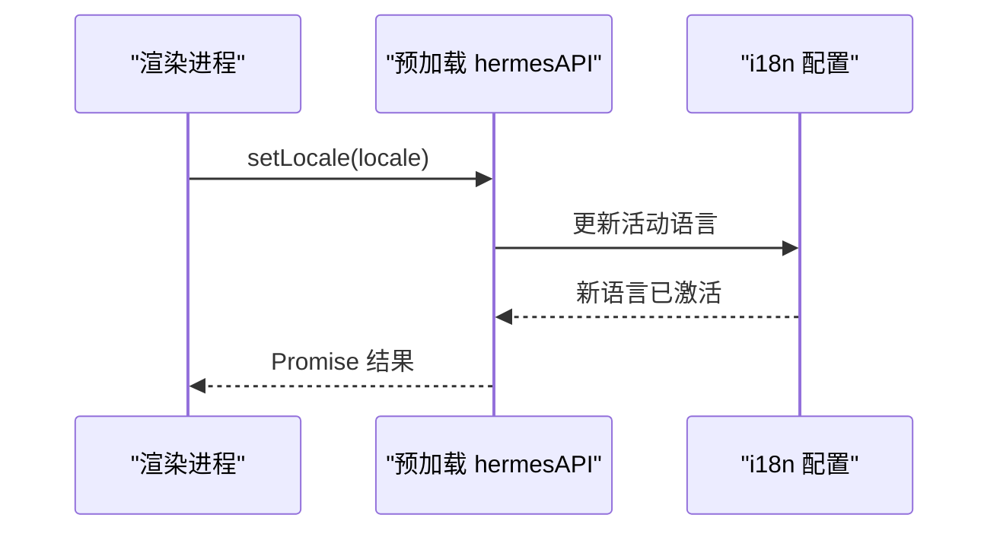

**图表来源**
- [src/preload/index.ts:70-72](file://src/preload/index.ts#L70-L72)
- [src/shared/i18n/config.ts:1-7](file://src/shared/i18n/config.ts#L1-L7)
- [src/shared/i18n/types.ts:1-6](file://src/shared/i18n/types.ts#L1-L6)

**章节来源**
- [src/shared/i18n/config.ts:1-7](file://src/shared/i18n/config.ts#L1-L7)
- [src/shared/i18n/types.ts:1-6](file://src/shared/i18n/types.ts#L1-L6)
- [src/preload/index.ts:70-72](file://src/preload/index.ts#L70-L72)

### 配置验证、热重载与迁移
- 安装状态检查：checkInstallStatus 根据连接模式与 .env/模型配置判断是否具备 API Key
- 版本缓存：getHermesVersion/verifyInstall 使用 TTL 缓存避免重复调用
- 迁移：runClawMigrate 从 OpenClaw 迁移数据，进度通过 IPC 事件推送
- SSH 隧道：测试连接与隧道启停通过 IPC 调用

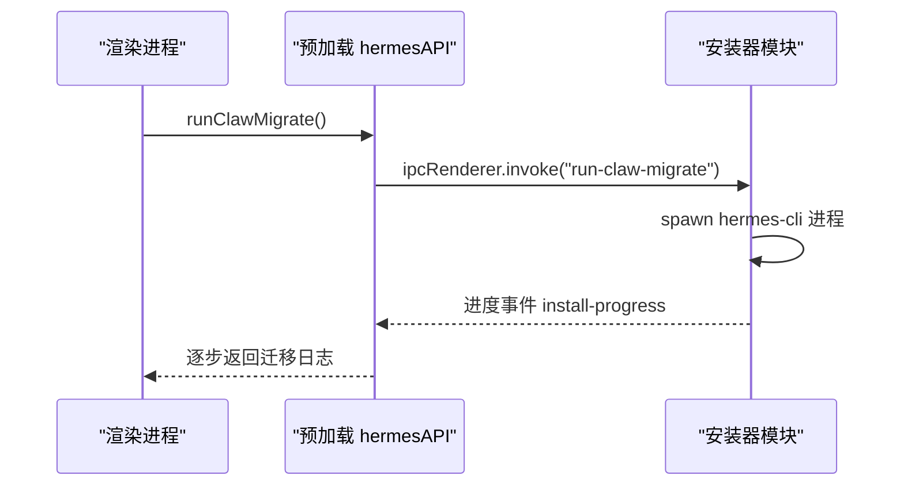

**图表来源**
- [src/preload/index.ts:67-68](file://src/preload/index.ts#L67-L68)
- [src/main/installer.ts:333-396](file://src/main/installer.ts#L333-L396)

**章节来源**
- [src/main/installer.ts:153-213](file://src/main/installer.ts#L153-L213)
- [src/main/installer.ts:252-296](file://src/main/installer.ts#L252-L296)
- [src/main/installer.ts:333-396](file://src/main/installer.ts#L333-L396)

### 配置 API 使用指南
- 读取配置
  - 环境变量：getEnv(profile?)
  - 键值配置：getConfig(key, profile?)
  - 模型配置：getModelConfig(profile?)
  - 连接配置：getConnectionConfig()
  - 平台开关：getPlatformEnabled(profile?)
  - 凭据池：getCredentialPool()
- 修改配置
  - 环境变量：setEnv(key, value, profile?)
  - 键值配置：setConfig(key, value, profile?)
  - 模型配置：setModelConfig(provider, model, baseUrl, profile?)
  - 连接配置：setConnectionConfig(mode, remoteUrl, apiKey?)
  - SSH 配置：setSshConfig(...)
  - 平台开关：setPlatformEnabled(platform, enabled, profile?)
  - 凭据池：setCredentialPool(provider, entries)
- 监听配置变化
  - 渲染层通过订阅 IPC 事件（如 chat-chunk/chat-done 等）感知运行期变化
  - 对静态配置建议采用轮询或在写入后主动刷新缓存

**章节来源**
- [src/preload/index.ts:75-101](file://src/preload/index.ts#L75-L101)
- [src/preload/index.ts:120-156](file://src/preload/index.ts#L120-L156)
- [src/preload/index.ts:236-243](file://src/preload/index.ts#L236-L243)
- [src/preload/index.ts:429-436](file://src/preload/index.ts#L429-L436)
- [src/preload/index.ts:175-228](file://src/preload/index.ts#L175-L228)

## 依赖关系分析
- 预加载 API 依赖主进程配置模块与安装器模块
- 配置模块依赖工具模块（路径解析、安全写入、正则转义）
- 模型模块依赖默认模型清单与配置模块（读取 custom_providers）
- 安装器模块依赖配置模块（读取连接配置）与 SSH 选项模块

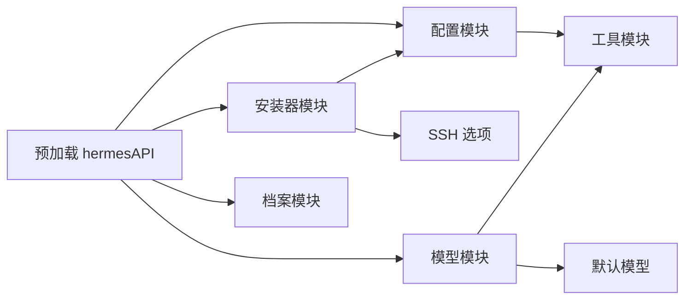

**图表来源**
- [src/preload/index.ts:15-686](file://src/preload/index.ts#L15-L686)
- [src/main/config.ts:1-440](file://src/main/config.ts#L1-L440)
- [src/main/profiles.ts:1-284](file://src/main/profiles.ts#L1-L284)
- [src/main/models.ts:1-169](file://src/main/models.ts#L1-L169)
- [src/main/default-models.ts:1-48](file://src/main/default-models.ts#L1-L48)
- [src/main/installer.ts:1-1130](file://src/main/installer.ts#L1-L1130)
- [src/main/ssh-options.ts:1-22](file://src/main/ssh-options.ts#L1-L22)
- [src/main/utils.ts:1-85](file://src/main/utils.ts#L1-L85)

**章节来源**
- [src/preload/index.ts:15-686](file://src/preload/index.ts#L15-L686)
- [src/main/config.ts:1-440](file://src/main/config.ts#L1-L440)
- [src/main/models.ts:1-169](file://src/main/models.ts#L1-L169)
- [src/main/installer.ts:1-1130](file://src/main/installer.ts#L1-L1130)

## 性能考量
- 内存缓存：环境变量与模型配置读取带有 TTL（5 秒），减少频繁 IO
- 并发读取：档案列表与网关状态等通过 Promise.all 并行获取
- 版本缓存：Hermes 版本查询带 TTL，避免重复执行外部进程
- 写入安全：safeWriteFile 自动创建父目录，防止 ENOENT 异常

**章节来源**
- [src/main/config.ts:77-99](file://src/main/config.ts#L77-L99)
- [src/main/profiles.ts:111-193](file://src/main/profiles.ts#L111-L193)
- [src/main/installer.ts:218-296](file://src/main/installer.ts#L218-L296)
- [src/main/utils.ts:80-84](file://src/main/utils.ts#L80-L84)

## 故障排查指南
- 安装状态异常
  - 检查 checkInstallStatus 的 installed/configured/hasApiKey 字段
  - 若为远程模式，直接视为已配置
- SSH 连接失败
  - 使用 testSshConnection(host, port, username, keyPath, remotePort)
  - 核对 SSH 控制选项 buildSshControlOptions 的平台差异
- 环境变量写入失败
  - 确认键名符合 validateEnvEntry 规则（字母数字下划线、非数字开头、单行）
  - 检查 .env 文件权限与路径
- 模型配置未生效
  - 确认 config.yaml 中 provider/default/base_url 是否正确
  - 注意 setModelConfig 会自动启用 streaming 并禁用 smart_model_routing
- 档案切换无效
  - 确认 active_profile 文件内容与 set 操作一致
  - 检查命名规范与目录存在性

**章节来源**
- [src/main/installer.ts:153-213](file://src/main/installer.ts#L153-L213)
- [src/main/ssh-options.ts:1-22](file://src/main/ssh-options.ts#L1-L22)
- [src/main/config.ts:169-179](file://src/main/config.ts#L169-L179)
- [src/main/config.ts:295-298](file://src/main/config.ts#L295-L298)
- [src/main/profiles.ts:263-283](file://src/main/profiles.ts#L263-L283)

## 结论
Hermes Desktop 的配置系统以“档案隔离 + 主进程配置模块 + 预加载 API”为核心，实现了：
- 明确的层次与优先级（全局/用户/个人档案）
- 完整的连接、模型、平台、凭据与环境变量管理
- 缓存与并发优化，保障性能与稳定性
- 通过 IPC 将配置能力暴露给渲染层，便于 UI 与业务逻辑集成

## 附录：配置项与文件格式参考

### 文件与位置
- 全局连接配置：~/.hermes/desktop.json
- 用户配置：~/.hermes/config.yaml
- 个人档案配置：~/.hermes/profiles/<name>/config.yaml
- 环境变量：~/.hermes/.env 与 ~/.hermes/profiles/<name>/.env
- 模型库：~/.hermes/models.json
- 凭据池：~/.hermes/auth.json
- 活动档案：~/.hermes/active_profile

**章节来源**
- [src/main/config.ts:26-45](file://src/main/config.ts#L26-L45)
- [src/main/utils.ts:46-66](file://src/main/utils.ts#L46-L66)
- [src/main/profiles.ts:92-100](file://src/main/profiles.ts#L92-L100)
- [src/main/models.ts:8-31](file://src/main/models.ts#L8-L31)
- [src/main/config.ts:398-419](file://src/main/config.ts#L398-L419)

### 连接配置键
- connectionMode: "local" | "remote" | "ssh"
- remoteUrl: 字符串
- remoteApiKey: 字符串
- sshConfig.host: 字符串
- sshConfig.port: 数字（默认 22）
- sshConfig.username: 字符串
- sshConfig.keyPath: 字符串
- sshConfig.remotePort: 数字（默认 8642）
- sshConfig.localPort: 数字（默认 18642）

**章节来源**
- [src/main/config.ts:17-22](file://src/main/config.ts#L17-L22)
- [src/main/config.ts:54-62](file://src/main/config.ts#L54-L62)

### 模型配置键
- provider: 字符串（默认 "auto"）
- default: 字符串（默认空）
- base_url: 字符串（可选）
- custom_providers: 列表（每项含 name/model/base_url/api_key/api_mode）

**章节来源**
- [src/main/config.ts:215-246](file://src/main/config.ts#L215-L246)
- [src/main/models.ts:42-75](file://src/main/models.ts#L42-L75)

### 平台开关键
- platforms.<platform>.enabled: true | false
- 支持平台：telegram、discord、slack、whatsapp、signal

**章节来源**
- [src/main/config.ts:317-335](file://src/main/config.ts#L317-L335)
- [src/main/config.ts:337-394](file://src/main/config.ts#L337-L394)

### 环境变量键规则
- 键名：字母、数字、下划线，必须以字母或下划线开头
- 值：单行字符串，不允许包含换行/空字符
- 注释：以 # 开头的行被忽略
- 引号：可使用单引号或双引号包裹值

**章节来源**
- [src/main/config.ts:169-179](file://src/main/config.ts#L169-L179)
- [src/main/config.ts:112-128](file://src/main/config.ts#L112-L128)

### 凭据池键
- auth.credential_pool.<provider>: [{ key: string, label: string }]

**章节来源**
- [src/main/config.ts:421-439](file://src/main/config.ts#L421-L439)

### 国际化键
- SOURCE_LOCALE: 默认源语言
- FALLBACK_LOCALE: 回退语言
- DEFAULT_ACTIVE_LOCALE: 默认激活语言
- APP_LOCALES: 可用语言数组

**章节来源**
- [src/shared/i18n/config.ts:1-7](file://src/shared/i18n/config.ts#L1-L7)
- [src/shared/i18n/types.ts:1-6](file://src/shared/i18n/types.ts#L1-L6)