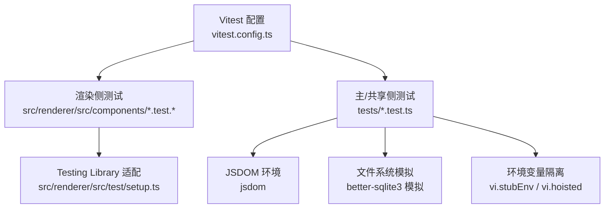
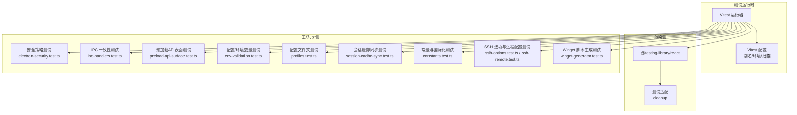
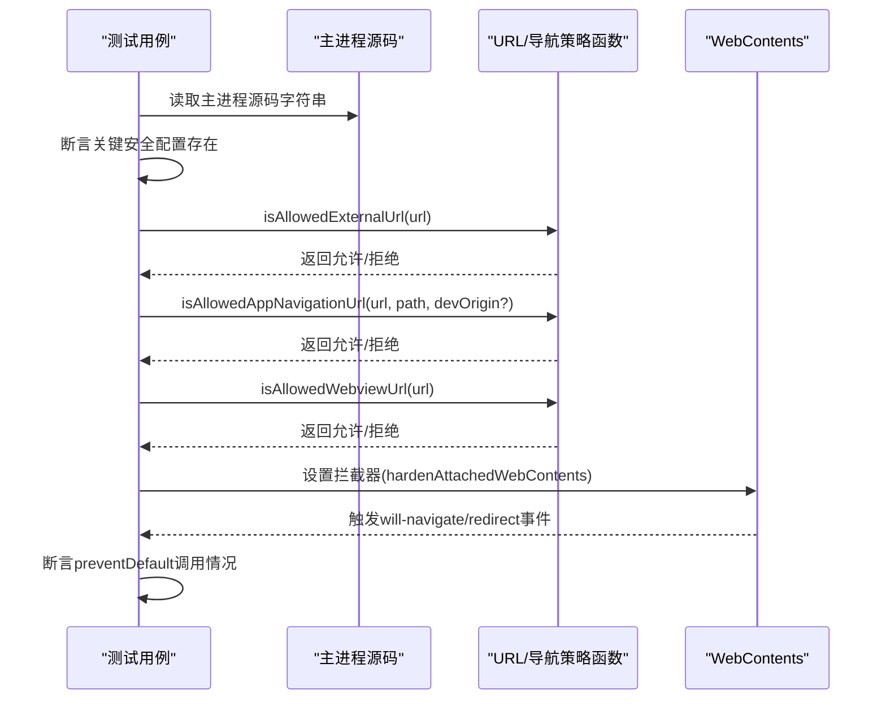
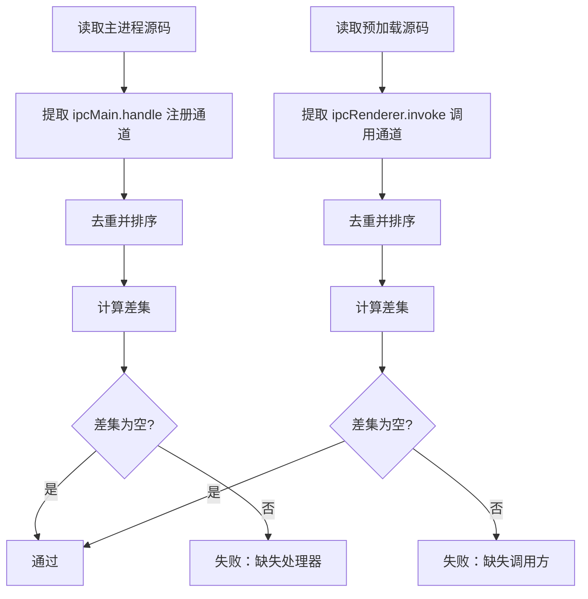
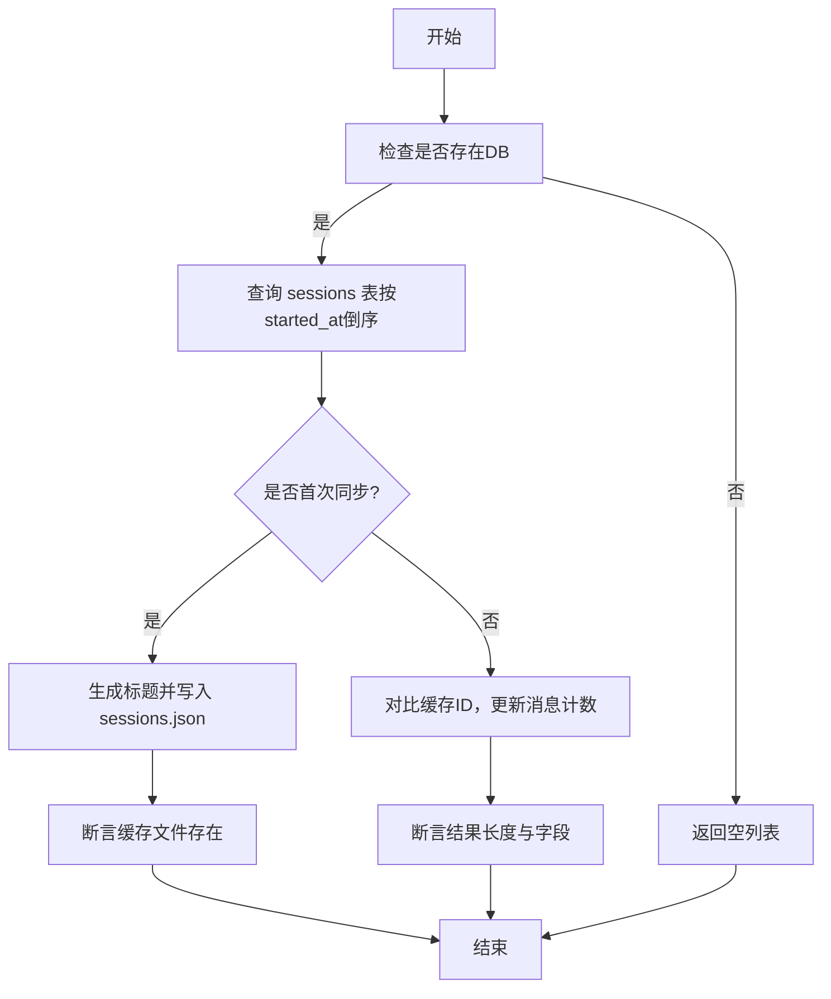
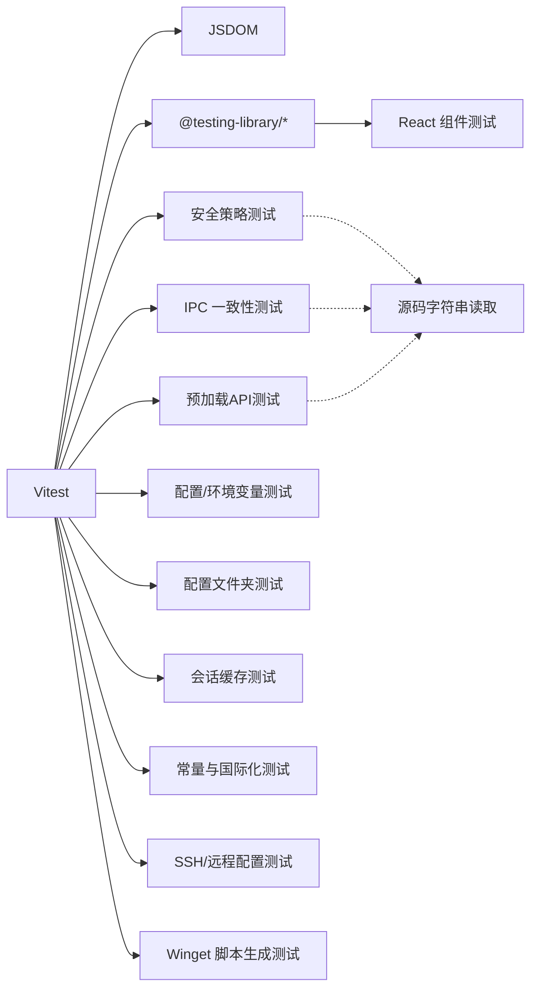

# 测试策略

<cite>
**本文引用的文件**
- [vitest.config.ts](file://vitest.config.ts)
- [package.json](file://package.json)
- [src/renderer/src/test/setup.ts](file://src/renderer/src/test/setup.ts)
- [tests/electron-security.test.ts](file://tests/electron-security.test.ts)
- [tests/askpass-security.test.ts](file://tests/askpass-security.test.ts)
- [tests/ipc-handlers.test.ts](file://tests/ipc-handlers.test.ts)
- [tests/preload-api-surface.test.ts](file://tests/preload-api-surface.test.ts)
- [tests/profiles.test.ts](file://tests/profiles.test.ts)
- [tests/session-cache-sync.test.ts](file://tests/session-cache-sync.test.ts)
- [tests/constants.test.ts](file://tests/constants.test.ts)
- [tests/env-validation.test.ts](file://tests/env-validation.test.ts)
- [tests/ssh-options.test.ts](file://tests/ssh-options.test.ts)
- [tests/ssh-remote.test.ts](file://tests/ssh-remote.test.ts)
- [tests/winget-generator.test.ts](file://tests/winget-generator.test.ts)
- [src/renderer/src/components/I18nProvider.test.tsx](file://src/renderer/src/components/I18nProvider.test.tsx)
</cite>

## 目录
1. [引言](#引言)
2. [项目结构](#项目结构)
3. [核心组件](#核心组件)
4. [架构总览](#架构总览)
5. [详细组件分析](#详细组件分析)
6. [依赖分析](#依赖分析)
7. [性能考虑](#性能考虑)
8. [故障排查指南](#故障排查指南)
9. [结论](#结论)
10. [附录](#附录)

## 引言
本文件面向Hermes Desktop的开发者与质量保障团队，系统化阐述应用的测试策略与实践，覆盖单元测试、集成测试与安全测试等维度；明确测试框架配置、测试用例编写规范、测试数据管理与环境隔离方法；给出测试执行流程、在持续集成中的策略建议以及覆盖率目标建议。文档同时提供可操作的测试指导与最佳实践，帮助在多平台（Windows/Linux/macOS）与多模块（主进程、渲染进程、预加载脚本、共享层）之间建立稳定可靠的测试体系。

## 项目结构
Hermes Desktop采用Vitest作为测试运行器，结合JSDOM环境与Testing Library进行前端组件测试；测试文件主要分布在两类位置：
- tests 目录：存放主进程与共享逻辑的单元/集成测试，覆盖安全策略、IPC一致性、配置与环境变量、SSH与远程配置、安装包发布辅助脚本等。
- src/renderer/src/components 目录：存放React组件的UI测试，使用Testing Library进行交互与断言。

测试配置通过vitest.config.ts集中管理，包含别名、测试环境、全局设置与扫描范围；渲染侧测试通过统一的setup文件完成清理与适配。

图表来源
- [vitest.config.ts:1-19](file://vitest.config.ts#L1-L19)
- [src/renderer/src/test/setup.ts:1-8](file://src/renderer/src/test/setup.ts#L1-L8)

章节来源
- [vitest.config.ts:1-19](file://vitest.config.ts#L1-L19)
- [package.json:8-26](file://package.json#L8-L26)
- [src/renderer/src/test/setup.ts:1-8](file://src/renderer/src/test/setup.ts#L1-L8)

## 核心组件
- 测试运行器与环境
  - 使用Vitest运行器，JSDOM作为DOM环境，支持React组件测试与DOM API断言。
  - 通过别名映射简化导入路径，便于跨模块测试。
- 渲染侧测试适配
  - 统一在setup中注册Testing Library的适配与每次测试后的清理，避免副作用累积。
- 主/共享侧测试
  - 覆盖主进程安全策略、IPC通道一致性、预加载API表面、配置与环境变量、会话缓存同步、常量与国际化、SSH与远程配置、安装包发布脚本生成等。

章节来源
- [vitest.config.ts:11-18](file://vitest.config.ts#L11-L18)
- [src/renderer/src/test/setup.ts:1-8](file://src/renderer/src/test/setup.ts#L1-L8)
- [package.json:40-67](file://package.json#L40-L67)

## 架构总览
下图展示测试架构的关键交互：Vitest驱动测试执行，JSDOM提供DOM上下文，Testing Library用于组件断言；主/共享侧测试通过模块模拟与环境隔离确保确定性；部分测试读取源码字符串进行静态检查，以验证安全策略与配置约束。

图表来源
- [vitest.config.ts:1-19](file://vitest.config.ts#L1-L19)
- [src/renderer/src/test/setup.ts:1-8](file://src/renderer/src/test/setup.ts#L1-L8)
- [tests/electron-security.test.ts:1-206](file://tests/electron-security.test.ts#L1-L206)
- [tests/ipc-handlers.test.ts:1-118](file://tests/ipc-handlers.test.ts#L1-L118)
- [tests/preload-api-surface.test.ts:1-213](file://tests/preload-api-surface.test.ts#L1-L213)
- [tests/env-validation.test.ts:1-76](file://tests/env-validation.test.ts#L1-L76)
- [tests/profiles.test.ts:1-144](file://tests/profiles.test.ts#L1-L144)
- [tests/session-cache-sync.test.ts:1-372](file://tests/session-cache-sync.test.ts#L1-L372)
- [tests/constants.test.ts:1-215](file://tests/constants.test.ts#L1-L215)
- [tests/ssh-options.test.ts:1-27](file://tests/ssh-options.test.ts#L1-L27)
- [tests/ssh-remote.test.ts:1-26](file://tests/ssh-remote.test.ts#L1-L26)
- [tests/winget-generator.test.ts:1-181](file://tests/winget-generator.test.ts#L1-L181)

## 详细组件分析

### 安全测试：Electron 主进程加固与导航/WebView 策略
- 目标
  - 验证主进程窗口与预加载脚本的安全配置（禁用Node集成、启用上下文隔离、沙箱、Web安全等）。
  - 验证外部URL、应用内导航与WebView URL白名单策略。
  - 验证已附加载入的WebView能力被移除或收紧。
- 关键点
  - 通过读取源码字符串断言关键配置存在。
  - 对URL策略函数进行正反用例断言。
  - 对已附加载入的webContents设置拦截器，验证will-navigate/redirect行为。
- 建议
  - 将安全策略检查纳入CI的“安全门禁”步骤，确保每次变更都满足最小安全基线。
  - 对新增的导航/弹窗/WebView场景补充用例，保持策略覆盖完整。

图表来源
- [tests/electron-security.test.ts:18-205](file://tests/electron-security.test.ts#L18-L205)

章节来源
- [tests/electron-security.test.ts:1-206](file://tests/electron-security.test.ts#L1-L206)

### 安全测试：askpass 与 sudo 凭据对话框加固
- 目标
  - 确保密码输入对话框与sudo凭据预加载对话框具备同等安全基线。
  - 确保密码提交通道绑定到正确的webContents，防止跨窗口提交。
  - 确保对话框页面使用CSP与预加载DOM绑定，不使用内联脚本。
- 关键点
  - 读取源码字符串断言安全配置与CSP策略。
  - 断言ASKPASS_SUBMIT_CHANNEL仅由对应窗口发送。
  - 断言预加载脚本通过ipcRenderer与后端通信。

章节来源
- [tests/askpass-security.test.ts:1-95](file://tests/askpass-security.test.ts#L1-L95)

### IPC 一致性测试：主进程处理器与预加载调用匹配
- 目标
  - 确保所有ipcRenderer.invoke调用都有对应的ipcMain.handle处理器，反之亦然。
  - 新增功能的IPC通道与预加载API需保持双向一致。
- 方法
  - 从主进程与预加载脚本中解析所有IPC通道名称，进行集合比对。
  - 对新旧通道分别进行分组断言，确保向后兼容。

图表来源
- [tests/ipc-handlers.test.ts:35-56](file://tests/ipc-handlers.test.ts#L35-L56)

章节来源
- [tests/ipc-handlers.test.ts:1-118](file://tests/ipc-handlers.test.ts#L1-L118)

### 预加载API表面测试：类型声明与实现一致性
- 目标
  - 确保HermesAPI接口声明与预加载实现一一对应，避免类型与实现脱节。
  - 对新旧API进行分组断言，保证向后兼容。
- 方法
  - 解析接口定义与实现对象，提取方法名并进行集合比对。
  - 对IPC调用命名风格（短横线）进行一致性校验。

章节来源
- [tests/preload-api-surface.test.ts:1-213](file://tests/preload-api-surface.test.ts#L1-L213)

### 配置与环境变量测试：.env 写入与校验
- 目标
  - 验证环境变量写入的合法性（变量名格式、单行值、禁止换行/NUL）。
  - 通过vi.stubEnv与模块重载，确保测试在独立的HERMES_HOME下运行。
- 方法
  - 使用vi.resetModules与vi.stubEnv隔离不同测试用例。
  - 对非法输入抛出预期错误，对合法输入写入并断言内容。

章节来源
- [tests/env-validation.test.ts:1-76](file://tests/env-validation.test.ts#L1-L76)

### 配置文件夹与默认配置：profiles 列表与激活
- 目标
  - 验证配置文件夹扫描规则（忽略隐藏文件/非目录、非法名称）、默认配置保留、活动配置标记正确。
  - 对创建/删除/激活等操作进行边界条件测试。
- 方法
  - vi.hoisted在模块导入前设置TEST_HOME，vi.mock安装器模块以指向临时目录。
  - 通过文件系统操作模拟真实场景，断言返回结果与文件状态。

章节来源
- [tests/profiles.test.ts:1-144](file://tests/profiles.test.ts#L1-L144)

### 会话缓存同步：数据库与JSON缓存的一致性
- 目标
  - 验证首次同步时从数据库读取并生成标题，后续同步不会重复插入、仅更新消息计数。
  - 在大量历史缓存场景下，确保同步算法复杂度为O(N)，避免性能退化。
- 方法
  - vi.mock better-sqlite3，构建内存存储模拟数据库，按需实现prepare/exec/get/all等。
  - 种子数据后执行两次同步，断言结果数量、字段与耗时阈值。

图表来源
- [tests/session-cache-sync.test.ts:252-371](file://tests/session-cache-sync.test.ts#L252-L371)

章节来源
- [tests/session-cache-sync.test.ts:1-372](file://tests/session-cache-sync.test.ts#L1-L372)

### 常量与国际化：提供商、网关平台、设置项与主题
- 目标
  - 验证常量定义的完整性与唯一性（提供商、网关平台、设置项键等）。
  - 验证主题选项与本地预设的存在性。
- 方法
  - 对数组与映射进行去重与存在性断言，确保无重复键与缺失字段。

章节来源
- [tests/constants.test.ts:1-215](file://tests/constants.test.ts#L1-L215)

### 国际化组件测试：I18nProvider 与 useI18n
- 目标
  - 验证默认语言渲染、切换语言后文案更新、setLocale调用链路。
- 方法
  - 通过window.hermeAPI注入get/setLocale的mock实现，使用fireEvent触发切换，断言文案与调用参数。

章节来源
- [src/renderer/src/components/I18nProvider.test.tsx:1-77](file://src/renderer/src/components/I18nProvider.test.tsx#L1-L77)

### SSH 与远程配置：控制选项与YAML安全
- 目标
  - Windows平台禁用SSH多路复用；非Windows平台启用自动复用与持久化。
  - 远程配置写入前拒绝包含破坏YAML的字符。
- 方法
  - 对buildSshControlOptions与sshSetConfigValue进行参数化断言。

章节来源
- [tests/ssh-options.test.ts:1-27](file://tests/ssh-options.test.ts#L1-L27)
- [tests/ssh-remote.test.ts:1-26](file://tests/ssh-remote.test.ts#L1-L26)

### 安装包发布辅助：Winget 脚本生成
- 目标
  - 验证模板替换（版本、下载地址、SHA256、发布日期、发行说明）与输出目录结构。
  - 对缺失安装包或模板目录给出清晰错误提示。
- 方法
  - 临时目录准备模板与安装包，断言生成的三个清单文件存在且内容替换正确。

章节来源
- [tests/winget-generator.test.ts:1-181](file://tests/winget-generator.test.ts#L1-L181)

## 依赖分析
- 测试框架与工具
  - Vitest：测试运行器与断言库。
  - JSDOM：DOM环境，支持浏览器API与React组件测试。
  - Testing Library：DOM查询与用户交互模拟。
  - jsdom、@testing-library/*：测试适配与断言扩展。
- 模块间耦合
  - 主/共享侧测试与源码存在静态耦合（读取源码字符串进行断言），用于验证安全策略与配置约束。
  - 渲染侧测试与hermesAPI接口存在运行时耦合（通过window.hermeAPI注入），需在测试中进行mock。
- 外部依赖与集成点
  - better-sqlite3：通过vi.mock在测试环境中提供内存数据库实现，避免原生模块ABI差异。
  - 环境变量：通过vi.stubEnv隔离HERMES_HOME，确保配置读写测试的确定性。

图表来源
- [vitest.config.ts:11-18](file://vitest.config.ts#L11-L18)
- [tests/session-cache-sync.test.ts:37-181](file://tests/session-cache-sync.test.ts#L37-L181)
- [tests/env-validation.test.ts:8-14](file://tests/env-validation.test.ts#L8-L14)

章节来源
- [vitest.config.ts:1-19](file://vitest.config.ts#L1-L19)
- [tests/session-cache-sync.test.ts:37-181](file://tests/session-cache-sync.test.ts#L37-L181)
- [tests/env-validation.test.ts:8-14](file://tests/env-validation.test.ts#L8-L14)

## 性能考虑
- 数据库同步性能
  - 通过内存数据库模拟与参数化大样本数据，验证同步算法在大规模历史缓存下的时间复杂度为O(N)，避免二次方膨胀。
- 测试执行效率
  - 使用vi.hoisted与vi.mock减少真实文件系统与原生模块依赖，缩短测试启动与执行时间。
  - 合理拆分测试文件，避免单文件过大导致串行执行时间过长。
- 建议
  - 对涉及文件系统与网络的测试，优先使用内存模拟或本地临时目录。
  - 对长时间运行的测试（如大样本同步），在CI中单独标记为“性能回归”任务，定期运行。

章节来源
- [tests/session-cache-sync.test.ts:345-370](file://tests/session-cache-sync.test.ts#L345-L370)

## 故障排查指南
- 测试无法启动或找不到测试文件
  - 检查vitest.config.ts中的include模式与工作目录，确认测试文件位于src/**/*.{test.ts,test.tsx}或tests/**/*.{test.ts}。
- 渲染侧测试报错或DOM泄漏
  - 确认已引入src/renderer/src/test/setup.ts并在afterEach中执行cleanup。
- IPC/预加载API不一致
  - 使用ipc-handlers.test.ts与preload-api-surface.test.ts快速定位缺失的通道或方法。
- better-sqlite3相关错误
  - 确认已在测试中vi.mock该模块，并检查模拟实现是否覆盖所需API。
- 环境变量写入失败
  - 检查变量名格式与值是否包含换行/NUL字符；确保vi.stubEnv与模块重载顺序正确。
- askpass/安全对话框问题
  - 确认源码字符串断言与CSP策略、窗口绑定逻辑符合预期。

章节来源
- [vitest.config.ts:15-16](file://vitest.config.ts#L15-L16)
- [src/renderer/src/test/setup.ts:5-7](file://src/renderer/src/test/setup.ts#L5-L7)
- [tests/ipc-handlers.test.ts:47-55](file://tests/ipc-handlers.test.ts#L47-L55)
- [tests/preload-api-surface.test.ts:54-62](file://tests/preload-api-surface.test.ts#L54-L62)
- [tests/session-cache-sync.test.ts:37-181](file://tests/session-cache-sync.test.ts#L37-L181)
- [tests/env-validation.test.ts:43-74](file://tests/env-validation.test.ts#L43-L74)
- [tests/askpass-security.test.ts:18-94](file://tests/askpass-security.test.ts#L18-L94)

## 结论
Hermes Desktop的测试策略以Vitest为核心，结合JSDOM与Testing Library，覆盖主进程安全、IPC一致性、预加载API、配置与环境变量、会话缓存、常量与国际化、SSH与远程配置、安装包发布脚本等多个关键领域。通过源码字符串断言、模块模拟与环境隔离，测试在确定性与可维护性上取得良好平衡。建议在CI中强制执行安全与IPC一致性检查，并对性能敏感路径进行回归监控，持续提升质量与稳定性。

## 附录
- 测试执行流程建议
  - 本地开发：npm run test:watch 快速迭代；npm run test 运行全部测试。
  - CI流水线：安装依赖后先运行单元测试，再运行安全与IPC一致性检查，最后运行UI组件测试。
- 覆盖率要求建议
  - 主/共享侧：建议语句/分支/函数/行覆盖率不低于80%，关键安全模块不低于90%。
  - 渲染侧：组件覆盖率不低于70%，关键交互路径（如国际化切换）100%。
- 平台兼容性
  - 在Windows/Linux/macOS上分别运行IPC与安全测试，确保跨平台行为一致。
- 持续集成策略
  - 分阶段执行：基础测试（单元/集成）→ 安全与IPC → UI → 性能回归。
  - 对大样本同步与数据库相关测试设置超时与重试策略，避免偶发失败影响流水线。