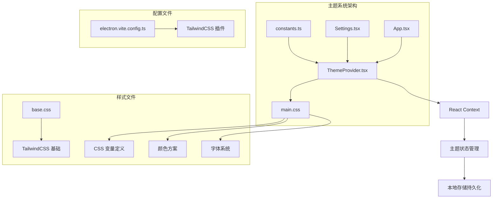
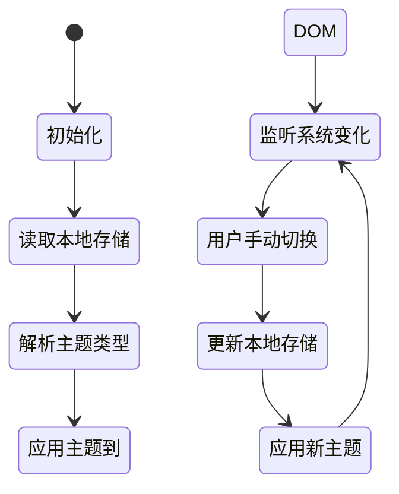
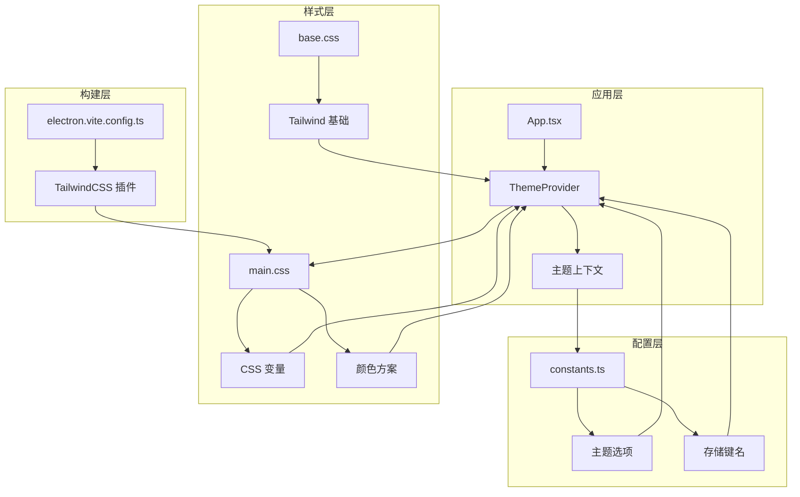
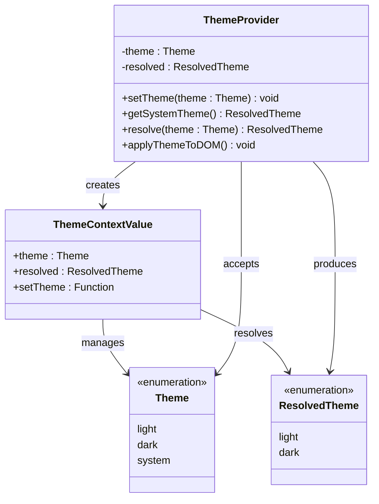
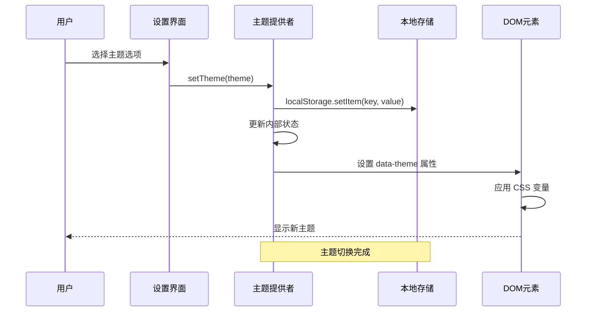
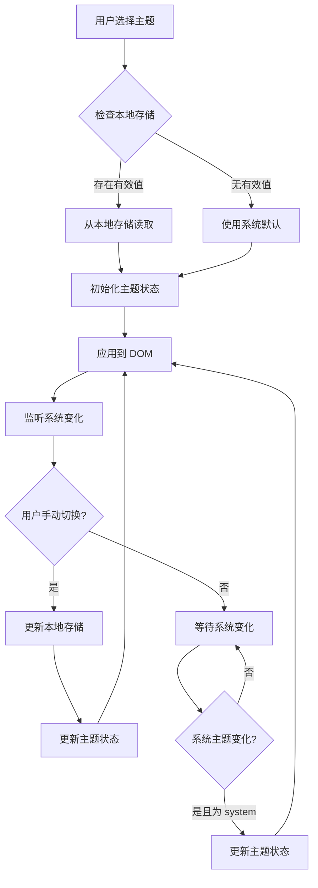
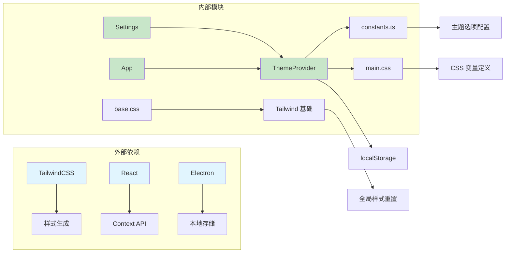

# 主题系统

<cite>
**本文档引用的文件**
- [ThemeProvider.tsx](file://src/renderer/src/components/ThemeProvider.tsx)
- [main.css](file://src/renderer/src/assets/main.css)
- [base.css](file://src/renderer/src/assets/base.css)
- [constants.ts](file://src/renderer/src/constants.ts)
- [Settings.tsx](file://src/renderer/src/screens/Settings/Settings.tsx)
- [App.tsx](file://src/renderer/src/App.tsx)
- [electron.vite.config.ts](file://electron.vite.config.ts)
</cite>

## 目录
1. [简介](#简介)
2. [项目结构](#项目结构)
3. [核心组件](#核心组件)
4. [架构概览](#架构概览)
5. [详细组件分析](#详细组件分析)
6. [依赖关系分析](#依赖关系分析)
7. [性能考虑](#性能考虑)
8. [故障排除指南](#故障排除指南)
9. [结论](#结论)
10. [附录](#附录)

## 简介

Hermes Desktop 的主题系统是一个基于 CSS 变量的现代化设计系统，支持深色模式和浅色模式的无缝切换。该系统采用 React Context 提供者模式，结合 CSS 自定义属性和 TailwindCSS 框架，实现了完整的主题管理解决方案。

系统的核心特性包括：
- 基于 CSS 变量的颜色方案管理
- 支持系统级主题检测
- 本地存储的主题偏好持久化
- 渐进式 Web 组件设计
- 完整的 TailwindCSS 集成

## 项目结构

主题系统在项目中的组织结构如下：

**图表来源**
- [ThemeProvider.tsx:1-80](file://src/renderer/src/components/ThemeProvider.tsx#L1-L80)
- [main.css:1-141](file://src/renderer/src/assets/main.css#L1-L141)
- [electron.vite.config.ts:1-33](file://electron.vite.config.ts#L1-L33)

**章节来源**
- [ThemeProvider.tsx:1-80](file://src/renderer/src/components/ThemeProvider.tsx#L1-L80)
- [main.css:1-141](file://src/renderer/src/assets/main.css#L1-L141)
- [electron.vite.config.ts:1-33](file://electron.vite.config.ts#L1-L33)

## 核心组件

### 主题提供者 (ThemeProvider)

主题提供者是整个主题系统的核心组件，负责管理主题状态和提供主题上下文。

**主要功能：**
- 管理主题状态（light/dark/system）
- 处理系统主题检测
- 实现本地存储持久化
- 提供 React Context API

**状态管理流程：**

**图表来源**
- [ThemeProvider.tsx:30-75](file://src/renderer/src/components/ThemeProvider.tsx#L30-L75)

**章节来源**
- [ThemeProvider.tsx:1-80](file://src/renderer/src/components/ThemeProvider.tsx#L1-L80)

### 样式变量系统

系统使用 CSS 自定义属性（CSS 变量）来实现统一的颜色管理和主题切换。

**颜色变量定义：**
- 背景层次：`--bg-primary`, `--bg-secondary`, `--bg-tertiary`, `--bg-elevated`
- 文本颜色：`--text-primary`, `--text-secondary`, `--text-muted`
- 边框系统：`--border`, `--border-bright`, `--border-focus`
- 状态色彩：`--accent`, `--success`, `--error`, `--warning`
- 交互效果：`--bg-hover`, `--bg-active`, `--selection`

**章节来源**
- [main.css:6-72](file://src/renderer/src/assets/main.css#L6-L72)

### 字体系统

系统采用渐进增强的字体加载策略，确保在不同环境下都能获得最佳的阅读体验。

**字体层次结构：**
- 主字体：Google Sans（可选）
- 系统回退：-apple-system, BlinkMacSystemFont, "Segoe UI", Roboto
- 等宽字体：SF Mono, Fira Code, JetBrains Mono

**章节来源**
- [main.css:74-116](file://src/renderer/src/assets/main.css#L74-L116)
- [main.css:118-130](file://src/renderer/src/assets/main.css#L118-L130)

## 架构概览

主题系统的整体架构采用分层设计，确保了模块间的松耦合和高内聚。

**图表来源**
- [App.tsx:175-184](file://src/renderer/src/App.tsx#L175-L184)
- [constants.ts:208-217](file://src/renderer/src/constants.ts#L208-L217)
- [electron.vite.config.ts:4-30](file://electron.vite.config.ts#L4-L30)

## 详细组件分析

### 主题提供者类图

**图表来源**
- [ThemeProvider.tsx:3-16](file://src/renderer/src/components/ThemeProvider.tsx#L3-L16)
- [ThemeProvider.tsx:30-75](file://src/renderer/src/components/ThemeProvider.tsx#L30-L75)

### 主题切换序列图

**图表来源**
- [Settings.tsx:739-752](file://src/renderer/src/screens/Settings/Settings.tsx#L739-L752)
- [ThemeProvider.tsx:43-46](file://src/renderer/src/components/ThemeProvider.tsx#L43-L46)
- [ThemeProvider.tsx:65-68](file://src/renderer/src/components/ThemeProvider.tsx#L65-L68)

### 主题配置持久化流程

**图表来源**
- [ThemeProvider.tsx:35-46](file://src/renderer/src/components/ThemeProvider.tsx#L35-L46)
- [ThemeProvider.tsx:48-68](file://src/renderer/src/components/ThemeProvider.tsx#L48-L68)

**章节来源**
- [Settings.tsx:739-752](file://src/renderer/src/screens/Settings/Settings.tsx#L739-L752)
- [constants.ts:208-217](file://src/renderer/src/constants.ts#L208-L217)

### TailwindCSS 集成分析

系统采用渐进式 TailwindCSS 集成，通过 Vite 插件实现构建时的样式处理。

**集成特点：**
- 使用 `@tailwindcss/vite` 插件进行构建时处理
- 支持原子化样式与自定义 CSS 变量的协同工作
- 保持 TailwindCSS 的响应式和工具类优势
- 兼容现有的 CSS 变量主题系统

**章节来源**
- [electron.vite.config.ts:4-30](file://electron.vite.config.ts#L4-L30)
- [base.css:1](file://src/renderer/src/assets/base.css#L1)

## 依赖关系分析

主题系统的依赖关系清晰明确，各组件间耦合度低，便于维护和扩展。

**图表来源**
- [ThemeProvider.tsx:18](file://src/renderer/src/components/ThemeProvider.tsx#L18)
- [constants.ts:208-217](file://src/renderer/src/constants.ts#L208-L217)
- [electron.vite.config.ts:4](file://electron.vite.config.ts#L4)

**章节来源**
- [App.tsx:175-184](file://src/renderer/src/App.tsx#L175-L184)
- [Settings.tsx:2-4](file://src/renderer/src/screens/Settings/Settings.tsx#L2-L4)

## 性能考虑

主题系统的性能优化策略包括：

### 1. 渲染性能优化
- 使用 React Context 避免不必要的组件重渲染
- 仅在主题状态变化时更新相关组件
- 利用 CSS 变量实现硬件加速的样式切换

### 2. 加载性能优化
- CSS 变量在运行时动态计算，无需额外的样式文件加载
- 字体资源采用 `font-display: swap` 确保快速渲染
- TailwindCSS 通过构建时优化减少运行时开销

### 3. 存储性能优化
- 本地存储操作最小化，仅在主题切换时写入
- 使用内存缓存避免重复的存储读取操作

## 故障排除指南

### 常见问题及解决方案

**问题1：主题切换后样式未更新**
- 检查 `data-theme` 属性是否正确设置到 `<html>` 元素
- 验证 CSS 变量是否在正确的选择器中定义
- 确认浏览器是否支持 CSS 自定义属性

**问题2：系统主题检测不生效**
- 检查 `prefers-color-scheme` 媒体查询是否被正确监听
- 验证主题提供者的状态更新逻辑
- 确认用户代理是否支持系统主题检测

**问题3：主题偏好未持久化**
- 检查本地存储权限是否正常
- 验证存储键名是否一致
- 确认浏览器隐私设置不影响本地存储

**章节来源**
- [ThemeProvider.tsx:48-68](file://src/renderer/src/components/ThemeProvider.tsx#L48-L68)
- [constants.ts:216](file://src/renderer/src/constants.ts#L216)

## 结论

Hermes Desktop 的主题系统通过精心设计的架构实现了现代化的用户体验。系统采用的技术栈和设计理念具有以下优势：

1. **技术先进性**：基于 CSS 变量和现代 React Context API
2. **用户体验**：无缝的主题切换和系统级主题检测
3. **可维护性**：清晰的模块分离和依赖关系
4. **扩展性**：易于添加新的主题变量和颜色方案
5. **性能优化**：高效的渲染和存储策略

该系统为开发者提供了完整的主题定制框架，支持企业级的品牌化需求和个性化配置。

## 附录

### 开发者定制指南

**添加新的颜色变量：**
1. 在 `main.css` 中定义新的 CSS 变量
2. 在相应的主题块中提供对应的值
3. 在组件中使用 `var(--variable-name)` 引用

**创建新的主题变体：**
1. 在 `constants.ts` 中添加新的主题选项
2. 在 `main.css` 中定义新的主题块
3. 更新 `ThemeProvider` 的解析逻辑

**品牌化建议：**
1. 保持颜色方案的一致性和可访问性
2. 考虑不同文化背景下的颜色含义
3. 确保足够的对比度以满足可访问性标准
4. 提供足够的颜色层次以支持复杂的界面设计

**最佳实践：**
1. 遵循渐进增强的设计原则
2. 保持 CSS 变量命名的一致性
3. 定期审查和优化主题性能
4. 测试不同设备和浏览器的兼容性