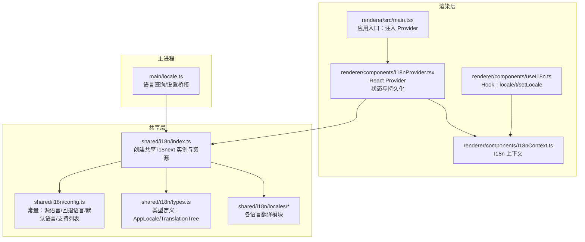
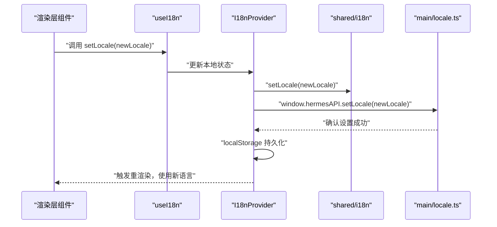
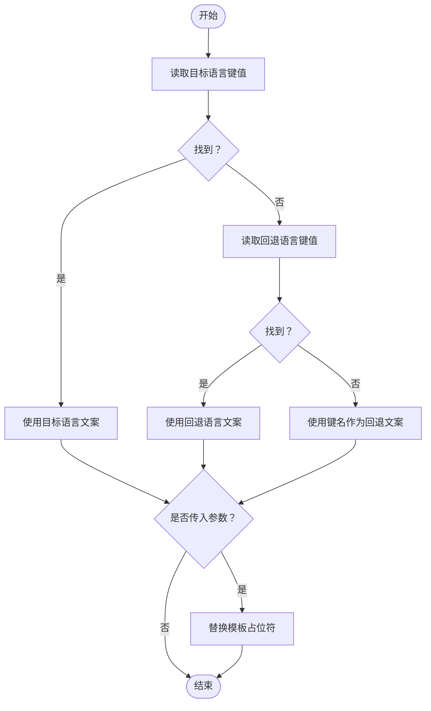
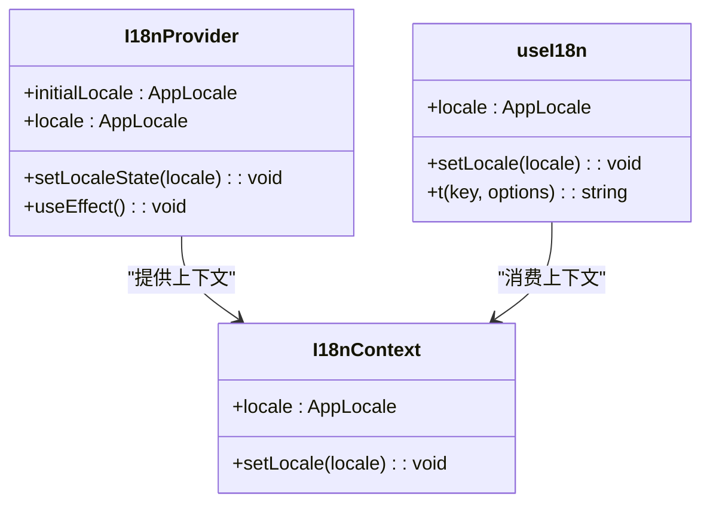
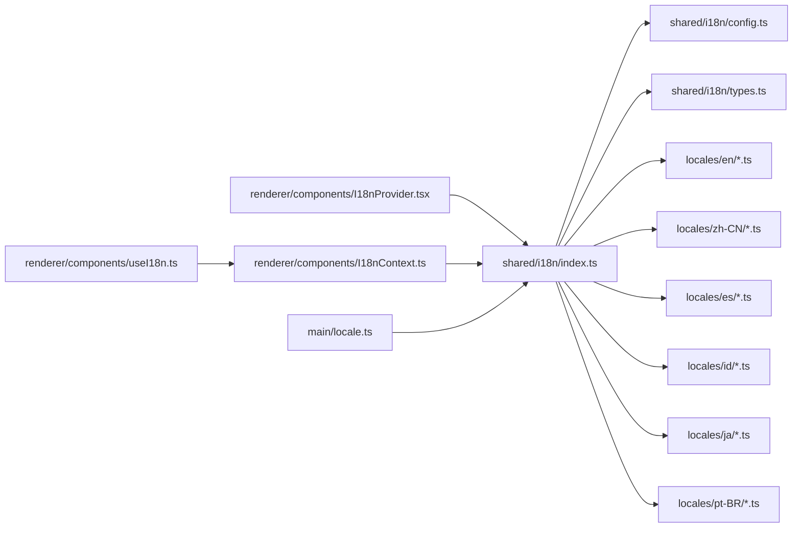

# 国际化

<cite>
**本文引用的文件**
- [src/shared/i18n/index.ts](file://src/shared/i18n/index.ts)
- [src/shared/i18n/config.ts](file://src/shared/i18n/config.ts)
- [src/shared/i18n/types.ts](file://src/shared/i18n/types.ts)
- [src/shared/i18n/locales/en/common.ts](file://src/shared/i18n/locales/en/common.ts)
- [src/shared/i18n/locales/zh-CN/common.ts](file://src/shared/i18n/locales/zh-CN/common.ts)
- [src/shared/i18n/locales/es/common.ts](file://src/shared/i18n/locales/es/common.ts)
- [src/shared/i18n/locales/id/common.ts](file://src/shared/i18n/locales/id/common.ts)
- [src/shared/i18n/locales/ja/common.ts](file://src/shared/i18n/locales/ja/common.ts)
- [src/shared/i18n/locales/ja/navigation.ts](file://src/shared/i18n/locales/ja/navigation.ts)
- [src/shared/i18n/locales/ja/chat.ts](file://src/shared/i18n/locales/ja/chat.ts)
- [src/shared/i18n/locales/ja/settings.ts](file://src/shared/i18n/locales/ja/settings.ts)
- [src/shared/i18n/locales/ja/models.ts](file://src/shared/i18n/locales/ja/models.ts)
- [src/shared/i18n/locales/ja/welcome.ts](file://src/shared/i18n/locales/ja/welcome.ts)
- [src/shared/i18n/locales/ja/agents.ts](file://src/shared/i18n/locales/ja/agents.ts)
- [src/shared/i18n/locales/ja/skills.ts](file://src/shared/i18n/locales/ja/skills.ts)
- [src/shared/i18n/locales/ja/schedules.ts](file://src/shared/i18n/locales/ja/schedules.ts)
- [src/shared/i18n/locales/pt-BR/common.ts](file://src/shared/i18n/locales/pt-BR/common.ts)
- [src/renderer/src/components/I18nContext.ts](file://src/renderer/src/components/I18nContext.ts)
- [src/renderer/src/components/I18nProvider.tsx](file://src/renderer/src/components/I18nProvider.tsx)
- [src/renderer/src/components/useI18n.ts](file://src/renderer/src/components/useI18n.ts)
- [src/main/locale.ts](file://src/main/locale.ts)
- [src/renderer/src/main.tsx](file://src/renderer/src/main.tsx)
</cite>

## 更新摘要
**所做更改**
- 新增日语本地化支持章节，包含完整的翻译文件分析
- 更新支持语言列表，将日语添加为官方支持语言
- 扩展翻译文件组织结构说明，涵盖日语各功能模块
- 更新语言包完整性和质量保证指南

## 目录
1. [简介](#简介)
2. [项目结构](#项目结构)
3. [核心组件](#核心组件)
4. [架构总览](#架构总览)
5. [详细组件分析](#详细组件分析)
6. [依赖关系分析](#依赖关系分析)
7. [性能考量](#性能考量)
8. [故障排查指南](#故障排查指南)
9. [结论](#结论)
10. [附录](#附录)

## 简介
本文件面向内容创作者与本地化团队，系统梳理 Hermes Desktop 的国际化（i18n）体系：从架构设计、多语言支持、翻译文件组织到动态语言切换与文化适配策略。文档覆盖英语、西班牙语、印尼语、日语、葡萄牙语（巴西）与简体中文等语言包，并提供翻译工作流程与质量保障建议。

## 项目结构
国际化相关代码主要分布在以下位置：
- 共享层（共享 i18n 实例与资源）：src/shared/i18n
- 渲染层（React Provider 与上下文）：src/renderer/src/components
- 主进程桥接（语言同步）：src/main/locale.ts
- 应用入口（初始化 Provider）：src/renderer/src/main.tsx

**图表来源**
- [src/shared/i18n/index.ts:1-331](file://src/shared/i18n/index.ts#L1-L331)
- [src/shared/i18n/config.ts:1-7](file://src/shared/i18n/config.ts#L1-L7)
- [src/shared/i18n/types.ts:1-6](file://src/shared/i18n/types.ts#L1-L6)
- [src/renderer/src/components/I18nProvider.tsx:1-84](file://src/renderer/src/components/I18nProvider.tsx#L1-L84)
- [src/renderer/src/components/I18nContext.ts:1-10](file://src/renderer/src/components/I18nContext.ts#L1-L10)
- [src/renderer/src/components/useI18n.ts:1-23](file://src/renderer/src/components/useI18n.ts#L1-L23)
- [src/main/locale.ts:1-15](file://src/main/locale.ts#L1-L15)
- [src/renderer/src/main.tsx:1-15](file://src/renderer/src/main.tsx#L1-L15)

**章节来源**
- [src/shared/i18n/index.ts:1-331](file://src/shared/i18n/index.ts#L1-L331)
- [src/shared/i18n/config.ts:1-7](file://src/shared/i18n/config.ts#L1-L7)
- [src/shared/i18n/types.ts:1-6](file://src/shared/i18n/types.ts#L1-L6)
- [src/renderer/src/components/I18nProvider.tsx:1-84](file://src/renderer/src/components/I18nProvider.tsx#L1-L84)
- [src/renderer/src/components/I18nContext.ts:1-10](file://src/renderer/src/components/I18nContext.ts#L1-L10)
- [src/renderer/src/components/useI18n.ts:1-23](file://src/renderer/src/components/useI18n.ts#L1-L23)
- [src/main/locale.ts:1-15](file://src/main/locale.ts#L1-L15)
- [src/renderer/src/main.tsx:1-15](file://src/renderer/src/main.tsx#L1-L15)

## 核心组件
- 共享 i18n 实例与资源
  - 创建并初始化共享 i18next 实例，注册所有语言资源，设置默认命名空间、回退语言与支持语言列表。
  - 暴露读取当前语言、设置语言与字符串翻译函数；翻译时优先使用目标语言，否则回退至回退语言，最后回退到键名本身。
- 配置与类型
  - 常量：源语言、回退语言、默认激活语言、支持语言列表。
  - 类型：AppLocale 联合类型与 TranslationTree 递归树形结构。
- 渲染层 Provider 与 Hook
  - I18nProvider：在渲染进程中注入 React-i18next，读取本地存储的语言偏好，与主进程同步语言设置，持久化用户选择。
  - I18nContext：提供 locale 与 setLocale。
  - useI18n：组合 React-i18n 的 t 与上下文中的 setLocale，统一对外接口。
- 主进程桥接
  - 提供查询与设置语言的桥接方法，供渲染层调用以保持跨进程一致。

**章节来源**
- [src/shared/i18n/index.ts:288-331](file://src/shared/i18n/index.ts#L288-L331)
- [src/shared/i18n/config.ts:1-7](file://src/shared/i18n/config.ts#L1-L7)
- [src/shared/i18n/types.ts:1-6](file://src/shared/i18n/types.ts#L1-L6)
- [src/renderer/src/components/I18nProvider.tsx:1-84](file://src/renderer/src/components/I18nProvider.tsx#L1-L84)
- [src/renderer/src/components/I18nContext.ts:1-10](file://src/renderer/src/components/I18nContext.ts#L1-L10)
- [src/renderer/src/components/useI18n.ts:1-23](file://src/renderer/src/components/useI18n.ts#L1-L23)
- [src/main/locale.ts:1-15](file://src/main/locale.ts#L1-L15)

## 架构总览
整体采用"共享实例 + 渲染层 Provider + 主进程桥接"的三层架构：
- 共享层负责资源加载与翻译逻辑；
- 渲染层负责 UI 层的语言状态与持久化；
- 主进程负责与系统或外部环境的语言设置保持一致。

**图表来源**
- [src/renderer/src/components/useI18n.ts:1-23](file://src/renderer/src/components/useI18n.ts#L1-L23)
- [src/renderer/src/components/I18nProvider.tsx:1-84](file://src/renderer/src/components/I18nProvider.tsx#L1-L84)
- [src/shared/i18n/index.ts:307-311](file://src/shared/i18n/index.ts#L307-L311)
- [src/main/locale.ts:12-14](file://src/main/locale.ts#L12-L14)

## 详细组件分析

### 共享 i18n 实例与翻译键值管理
- 资源组织
  - 每个语言目录下按功能模块拆分翻译文件（如 common、navigation、chat、settings 等），便于维护与定位。
  - 资源在共享层集中注册，形成"语言 -> 命名空间 -> 键值树"的结构。
- 翻译键值
  - 键名采用层级式命名（如 navigation.menu.home），提升可读性与可维护性。
  - 支持参数插值（如 {{version}}、{{percent}}），通过模板占位符实现动态文案。
- 回退机制
  - 当目标语言缺失键值时，自动回退至回退语言；若仍缺失则回退到键名本身，避免 UI 中出现空白或异常。
- 动态语言切换
  - 通过 setLocale 切换共享实例语言，立即生效于后续渲染。

**图表来源**
- [src/shared/i18n/index.ts:313-327](file://src/shared/i18n/index.ts#L313-L327)

**章节来源**
- [src/shared/i18n/index.ts:130-275](file://src/shared/i18n/index.ts#L130-L275)
- [src/shared/i18n/index.ts:313-327](file://src/shared/i18n/index.ts#L313-L327)

### 渲染层 Provider 与上下文
- 初始化与持久化
  - 启动时从本地存储读取语言偏好，若无效则使用默认语言。
  - 将用户选择写入本地存储，确保刷新后不丢失。
- 与主进程同步
  - 通过 window.hermesAPI.getLocale 查询主进程语言，若有差异则更新本地状态。
  - 通过 window.hermesAPI.setLocale 通知主进程，保持跨进程一致。
- 上下文与 Hook
  - I18nContext 暴露 locale 与 setLocale。
  - useI18n 组合 React-i18n 的 t 与上下文，提供统一的翻译接口。

**图表来源**
- [src/renderer/src/components/I18nContext.ts:1-10](file://src/renderer/src/components/I18nContext.ts#L1-L10)
- [src/renderer/src/components/I18nProvider.tsx:1-84](file://src/renderer/src/components/I18nProvider.tsx#L1-L84)
- [src/renderer/src/components/useI18n.ts:1-23](file://src/renderer/src/components/useI18n.ts#L1-L23)

**章节来源**
- [src/renderer/src/components/I18nProvider.tsx:16-68](file://src/renderer/src/components/I18nProvider.tsx#L16-L68)
- [src/renderer/src/components/I18nContext.ts:1-10](file://src/renderer/src/components/I18nContext.ts#L1-L10)
- [src/renderer/src/components/useI18n.ts:1-23](file://src/renderer/src/components/useI18n.ts#L1-L23)

### 主进程桥接
- 提供 getAppLocale 与 setAppLocale，封装对共享层语言状态的访问与变更，供渲染层通过 IPC 调用。
- 保证主进程语言与渲染层一致，避免跨进程状态漂移。

**章节来源**
- [src/main/locale.ts:1-15](file://src/main/locale.ts#L1-L15)

### 翻译文件组织与语言包
- 语言目录
  - 英语：en
  - 西班牙语：es
  - 印尼语：id
  - 日语：ja
  - 巴西葡萄牙语：pt-BR
  - 简体中文：zh-CN
- 支持语言列表更新
  - 支持语言数组已更新为：["en", "es", "id", "ja", "pt-BR", "zh-CN"]
  - 日语现已正式纳入官方支持语言列表
- 模块划分
  - 每个语言下按功能域拆分模块（common、navigation、chat、settings、models、providers、office、errors、schedules、skills、gateway、agents、soul、memory、install、constants 等），便于多人协作与版本控制。
- 日语翻译完整性
  - 日语翻译覆盖所有核心功能模块，包括界面文本、对话框、设置选项、错误消息等
  - 参数化文案（如 updateAvailable、downloading）通过模板占位符实现动态替换
- 示例键值
  - 常用通用词（如 appName、continue、cancel、loading、save、search、settings、provider、model、baseUrl、port、home、released、engine、desktop、noResults、noData、optional、devOnly、updateAvailable、downloading、restartToUpdate、errorTitle、errorMessage、tryAgain、copied）在各语言中均有对应翻译。

**章节来源**
- [src/shared/i18n/config.ts:6](file://src/shared/i18n/config.ts#L6)
- [src/shared/i18n/locales/ja/common.ts:1-49](file://src/shared/i18n/locales/ja/common.ts#L1-L49)
- [src/shared/i18n/locales/ja/navigation.ts:1-17](file://src/shared/i18n/locales/ja/navigation.ts#L1-L17)
- [src/shared/i18n/locales/ja/chat.ts:1-61](file://src/shared/i18n/locales/ja/chat.ts#L1-L61)
- [src/shared/i18n/locales/ja/settings.ts:1-97](file://src/shared/i18n/locales/ja/settings.ts#L1-L97)
- [src/shared/i18n/locales/ja/models.ts:1-28](file://src/shared/i18n/locales/ja/models.ts#L1-L28)
- [src/shared/i18n/locales/ja/welcome.ts:1-23](file://src/shared/i18n/locales/ja/welcome.ts#L1-L23)
- [src/shared/i18n/locales/ja/agents.ts:1-24](file://src/shared/i18n/locales/ja/agents.ts#L1-L24)
- [src/shared/i18n/locales/ja/skills.ts:1-25](file://src/shared/i18n/locales/ja/skills.ts#L1-L25)
- [src/shared/i18n/locales/ja/schedules.ts:1-57](file://src/shared/i18n/locales/ja/schedules.ts#L1-L57)

## 依赖关系分析
- 共享层依赖
  - shared/i18n/index.ts 依赖 config.ts 与 types.ts，以及各语言的模块文件。
  - 新增日语翻译模块导入与资源配置
- 渲染层依赖
  - I18nProvider 依赖 shared/i18n 的共享实例与常量，同时依赖 window.hermesAPI 进行主进程通信。
  - useI18n 依赖 I18nContext 与 React-i18n 的 useTranslation。
- 主进程依赖
  - main/locale.ts 依赖 shared/i18n 的语言读取与设置函数。

**图表来源**
- [src/shared/i18n/index.ts:1-331](file://src/shared/i18n/index.ts#L1-L331)
- [src/shared/i18n/config.ts:1-7](file://src/shared/i18n/config.ts#L1-L7)
- [src/shared/i18n/types.ts:1-6](file://src/shared/i18n/types.ts#L1-L6)
- [src/renderer/src/components/I18nProvider.tsx:1-84](file://src/renderer/src/components/I18nProvider.tsx#L1-L84)
- [src/renderer/src/components/I18nContext.ts:1-10](file://src/renderer/src/components/I18nContext.ts#L1-L10)
- [src/renderer/src/components/useI18n.ts:1-23](file://src/renderer/src/components/useI18n.ts#L1-L23)
- [src/main/locale.ts:1-15](file://src/main/locale.ts#L1-L15)

**章节来源**
- [src/shared/i18n/index.ts:1-331](file://src/shared/i18n/index.ts#L1-L331)
- [src/renderer/src/components/I18nProvider.tsx:1-84](file://src/renderer/src/components/I18nProvider.tsx#L1-L84)
- [src/renderer/src/components/useI18n.ts:1-23](file://src/renderer/src/components/useI18n.ts#L1-L23)
- [src/main/locale.ts:1-15](file://src/main/locale.ts#L1-L15)

## 性能考量
- 资源预加载
  - 所有语言资源在共享层一次性注册，避免运行时动态导入带来的抖动。
- 渲染层缓存
  - React-i18next 在 Provider 内部进行缓存与订阅，减少重复渲染。
- 本地存储
  - 使用 localStorage 缓存用户语言偏好，避免每次启动都进行 IPC 查询。
- 回退策略
  - 通过键值读取与回退机制，减少缺失键导致的异常开销。

## 故障排查指南
- 问题：切换语言后 UI 未更新
  - 检查 I18nProvider 是否正确调用 setLocale 并写入本地存储。
  - 确认 window.hermesAPI.setLocale 是否被调用且无异常。
- 问题：部分文案显示为键名而非翻译
  - 检查目标语言与回退语言中是否存在该键；必要时补充缺失键。
- 问题：参数化文案未替换
  - 确认调用翻译函数时传入了正确的 options 对象与占位符名称。
- 问题：主进程语言与渲染层不一致
  - 检查 main/locale.ts 的 getAppLocale 与 setAppLocale 是否正常工作，以及 IPC 通道是否可用。
- 问题：日语显示异常或乱码
  - 确认字体支持日语文本渲染
  - 检查翻译文件编码是否为 UTF-8

**章节来源**
- [src/renderer/src/components/I18nProvider.tsx:38-68](file://src/renderer/src/components/I18nProvider.tsx#L38-L68)
- [src/shared/i18n/index.ts:303-327](file://src/shared/i18n/index.ts#L303-L327)
- [src/main/locale.ts:8-14](file://src/main/locale.ts#L8-L14)

## 结论
Hermes Desktop 的国际化系统以共享 i18n 实例为核心，结合渲染层 Provider 与主进程桥接，实现了稳定、可扩展的多语言支持。通过模块化的翻译文件组织与清晰的回退策略，系统既满足快速迭代需求，又便于本地化团队协作与质量把控。随着日语本地化的加入，系统现已支持包括英语、西班牙语、印尼语、日语、葡萄牙语（巴西）与简体中文在内的六种官方语言，进一步扩大了全球用户覆盖范围。

## 附录

### 翻译工作流程与质量保证
- 新增/修改翻译键
  - 在各语言的对应模块中新增或修改键值，保持键名一致。
  - 对于参数化文案，统一使用模板占位符并在调用侧传参。
  - 日语翻译需特别注意假名、汉字与片假名的正确使用
- 本地化测试
  - 在不同语言环境下验证文案显示与参数替换。
  - 检查缺失键是否正确回退至回退语言或键名。
  - 测试日语的文本方向与字符编码
- 版本管理
  - 使用 Git 分支管理不同语言的翻译进度，合并前进行交叉审阅。
- 文化适配
  - 注意日期、时间、数字格式与单位表达的文化差异；必要时引入 ICU 或日期库进行格式化。
  - 日语需特别考虑敬语级别与文化敏感性表达
- 语言包完整性检查
  - 确保每个语言包包含所有核心功能模块的翻译
  - 验证参数化文案在所有语言中的一致性

### 日语本地化特殊注意事项
- 字符编码
  - 确保所有日语翻译文件使用 UTF-8 编码
- 文本长度
  - 日语文本通常比英语更长，需预留足够的 UI 空间
- 文化适应性
  - 注意日语的敬语系统，根据使用场景选择合适的敬语级别
- 输入法支持
  - 确保日语输入法在应用中的正常工作