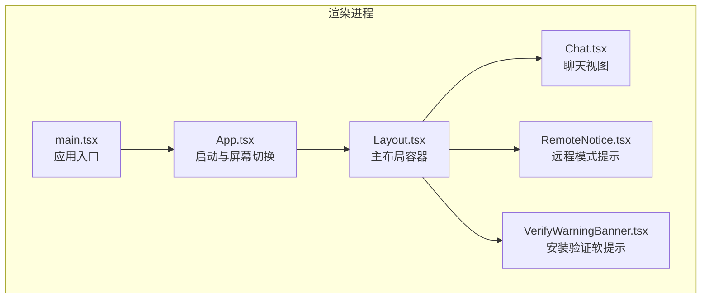
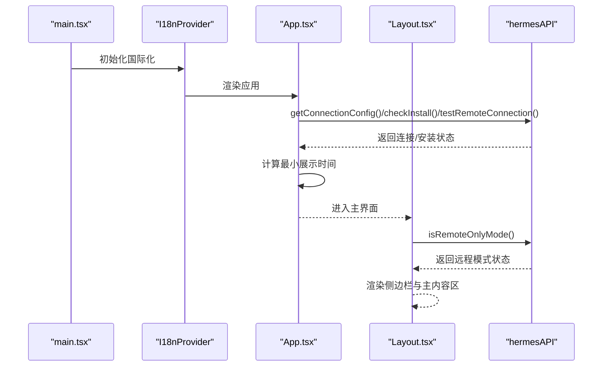
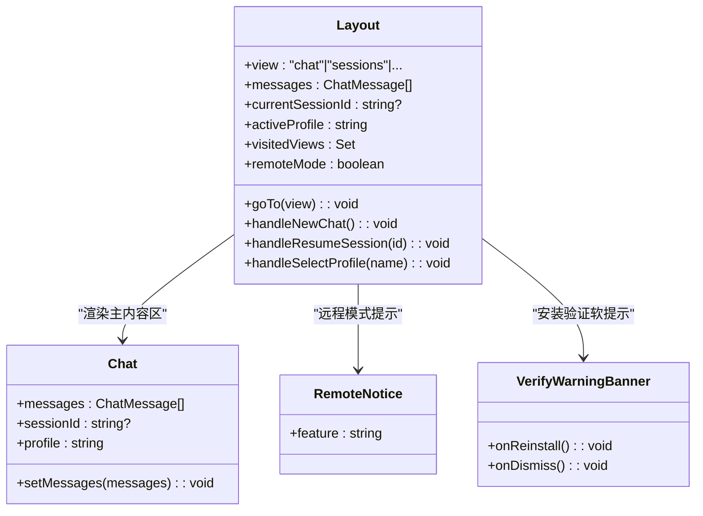
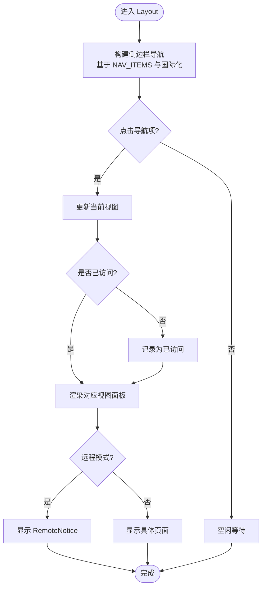
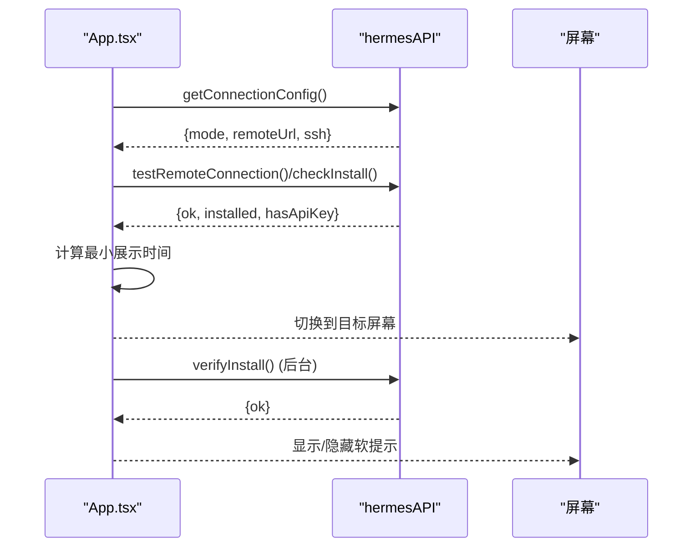
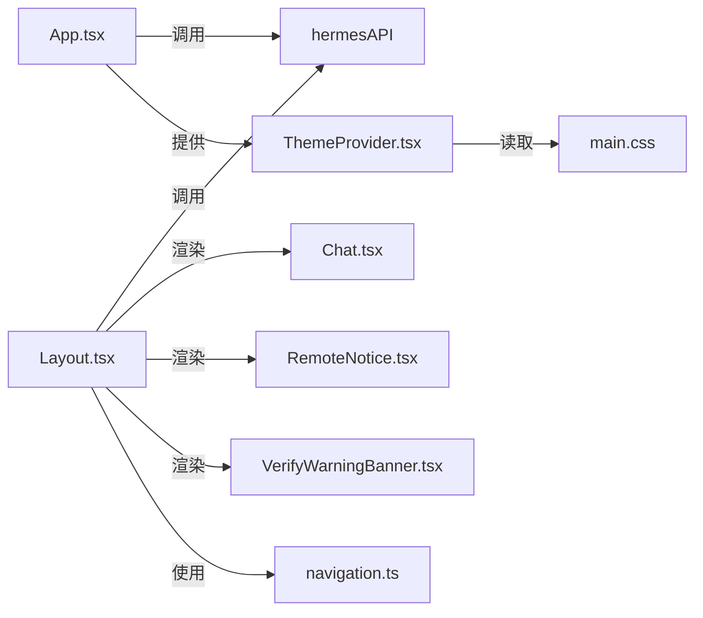

# 布局系统

<cite>
**本文引用的文件**
- [App.tsx](file://src/renderer/src/App.tsx)
- [Layout.tsx](file://src/renderer/src/screens/Layout/Layout.tsx)
- [main.tsx](file://src/renderer/src/main.tsx)
- [main.css](file://src/renderer/src/assets/main.css)
- [base.css](file://src/renderer/src/assets/base.css)
- [ThemeProvider.tsx](file://src/renderer/src/components/ThemeProvider.tsx)
- [Chat.tsx](file://src/renderer/src/screens/Chat/Chat.tsx)
- [RemoteNotice.tsx](file://src/renderer/src/components/RemoteNotice.tsx)
- [VerifyWarningBanner.tsx](file://src/renderer/src/components/VerifyWarningBanner.tsx)
- [navigation.ts（英语）](file://src/shared/i18n/locales/en/navigation.ts)
- [navigation.ts（简体中文）](file://src/shared/i18n/locales/zh-CN/navigation.ts)
- [constants.ts](file://src/renderer/src/constants.ts)
</cite>

## 目录
1. [简介](#简介)
2. [项目结构](#项目结构)
3. [核心组件](#核心组件)
4. [架构总览](#架构总览)
5. [详细组件分析](#详细组件分析)
6. [依赖关系分析](#依赖关系分析)
7. [性能考量](#性能考量)
8. [故障排查指南](#故障排查指南)
9. [结论](#结论)
10. [附录](#附录)

## 简介
本文件系统性阐述 Hermes Desktop 的布局系统，重点覆盖以下方面：
- 应用整体布局架构：屏幕切换机制、导航结构与页面组织方式
- Layout 组件设计理念：侧边栏导航、主内容区域划分与状态管理
- 响应式布局与跨平台适配策略
- 拖拽区域实现与窗口行为控制
- 布局定制指南与最佳实践

## 项目结构
Hermes Desktop 的渲染层采用 React + Electron 架构，布局系统位于渲染进程的屏幕与组件层中。核心入口在 main.tsx 中挂载 I18nProvider 与 App；App 负责启动阶段的屏幕切换；Layout 作为主布局容器承载侧边栏导航与多视图主内容区。

图表来源
- [main.tsx:1-15](file://src/renderer/src/main.tsx#L1-L15)
- [App.tsx:16-188](file://src/renderer/src/App.tsx#L16-L188)
- [Layout.tsx:188-374](file://src/renderer/src/screens/Layout/Layout.tsx#L188-L374)
- [Chat.tsx:1-200](file://src/renderer/src/screens/Chat/Chat.tsx#L1-L200)
- [RemoteNotice.tsx:1-17](file://src/renderer/src/components/RemoteNotice.tsx#L1-L17)
- [VerifyWarningBanner.tsx:1-43](file://src/renderer/src/components/VerifyWarningBanner.tsx#L1-L43)

章节来源
- [main.tsx:1-15](file://src/renderer/src/main.tsx#L1-L15)
- [App.tsx:16-188](file://src/renderer/src/App.tsx#L16-L188)

## 核心组件
- 应用入口与主题提供者
  - main.tsx 使用 I18nProvider 包裹 App，并通过 createRoot 渲染根节点
  - ThemeProvider 提供主题上下文，支持 light/dark/system 三种模式，持久化到本地存储
- 启动与屏幕切换
  - App.tsx 在启动时执行安装检查、远程连接检测与引导流程，决定进入 Welcome/Install/Setup/Main（即 Layout）
  - Splash 屏幕最小显示时间保障品牌动画完整播放
- 主布局容器 Layout
  - 侧边栏导航：基于统一的 NAV_ITEMS 列表生成，使用国际化键值显示标签
  - 主内容区：按需挂载各功能视图，采用“懒加载首次访问 + 已访问缓存”的策略保持切换热路径性能
  - 远程模式适配：根据 isRemoteOnlyMode 动态隐藏或提示部分视图
  - 更新流程：监听更新事件并在侧边栏展示下载进度与重启提示
  - 安装验证软提示：当深层验证失败但文件存在时，以横幅形式提示用户重新安装或忽略

章节来源
- [main.tsx:8-14](file://src/renderer/src/main.tsx#L8-L14)
- [ThemeProvider.tsx:30-80](file://src/renderer/src/components/ThemeProvider.tsx#L30-L80)
- [App.tsx:16-188](file://src/renderer/src/App.tsx#L16-L188)
- [Layout.tsx:37-134](file://src/renderer/src/screens/Layout/Layout.tsx#L37-L134)

## 架构总览
下图展示了从应用启动到主布局呈现的关键流程与组件交互：

图表来源
- [main.tsx:8-14](file://src/renderer/src/main.tsx#L8-L14)
- [App.tsx:27-99](file://src/renderer/src/App.tsx#L27-L99)
- [Layout.tsx:104-107](file://src/renderer/src/screens/Layout/Layout.tsx#L104-L107)

## 详细组件分析

### Layout 组件设计与实现
Layout 是布局系统的核心容器，负责：
- 导航与路由：通过 NAV_ITEMS 生成侧边栏菜单项，点击切换当前视图
- 视图挂载策略：visitedViews 缓存已访问视图，避免每次切换都重建 DOM
- 状态管理：维护当前视图、消息列表、会话 ID、活动 Profile、远程模式等
- 更新与菜单集成：监听更新事件，响应菜单快捷键（新建会话、搜索会话）

图表来源
- [Layout.tsx:37-187](file://src/renderer/src/screens/Layout/Layout.tsx#L37-L187)
- [Chat.tsx:97-113](file://src/renderer/src/screens/Chat/Chat.tsx#L97-L113)
- [RemoteNotice.tsx:3-14](file://src/renderer/src/components/RemoteNotice.tsx#L3-L14)
- [VerifyWarningBanner.tsx:14-40](file://src/renderer/src/components/VerifyWarningBanner.tsx#L14-L40)

章节来源
- [Layout.tsx:37-187](file://src/renderer/src/screens/Layout/Layout.tsx#L37-L187)

### 导航结构与页面组织
- 导航项定义：NAV_ITEMS 统一声明所有可访问视图及其图标与国际化键值
- 国际化：英文与简体中文的 navigation.ts 提供标签翻译
- 页面组织：Layout 的主内容区按 visitedViews 条件渲染对应视图；部分视图在远程模式下由 RemoteNotice 替代

图表来源
- [Layout.tsx:52-102](file://src/renderer/src/screens/Layout/Layout.tsx#L52-L102)
- [navigation.ts（英语）:1-16](file://src/shared/i18n/locales/en/navigation.ts#L1-L16)
- [navigation.ts（简体中文）:1-16](file://src/shared/i18n/locales/zh-CN/navigation.ts#L1-L16)
- [Layout.tsx:250-367](file://src/renderer/src/screens/Layout/Layout.tsx#L250-L367)
- [RemoteNotice.tsx:3-14](file://src/renderer/src/components/RemoteNotice.tsx#L3-L14)

章节来源
- [Layout.tsx:52-102](file://src/renderer/src/screens/Layout/Layout.tsx#L52-L102)
- [navigation.ts（英语）:1-16](file://src/shared/i18n/locales/en/navigation.ts#L1-L16)
- [navigation.ts（简体中文）:1-16](file://src/shared/i18n/locales/zh-CN/navigation.ts#L1-L16)
- [Layout.tsx:250-367](file://src/renderer/src/screens/Layout/Layout.tsx#L250-L367)

### 启动与屏幕切换机制
App.tsx 负责应用启动阶段的屏幕流转，逻辑要点：
- 连接配置检测：区分本地/远程/SSH 隧道模式
- 远程连接测试：对远程 URL 与 API Key 进行连通性校验
- 安装状态判断：installed → hasApiKey → main
- 最小展示时间：确保启动页动画完整播放后再切换
- 安装验证软提示：深层验证失败但文件存在时不强制回退，而是弹出软提示

图表来源
- [App.tsx:27-99](file://src/renderer/src/App.tsx#L27-L99)

章节来源
- [App.tsx:27-99](file://src/renderer/src/App.tsx#L27-L99)

### 响应式布局与跨平台适配
- 基础样式与主题
  - base.css 设置全局字体、滚动与视口高度，禁用文本选择以提升拖拽体验
  - main.css 定义深色/浅色主题变量与通用组件样式，支持 data-theme 切换
  - ThemeProvider 将 resolved 主题写入 <html> 的 data-theme 属性，驱动 CSS 变量生效
- 拖拽区域
  - macOS 平台通过固定在顶部的 drag-region 实现无边框窗口的拖拽移动
- 字体与排版
  - 引入 Google Sans 字体族，提供多种字重与斜体变体，保证跨平台一致性

章节来源
- [base.css:19-44](file://src/renderer/src/assets/base.css#L19-L44)
- [main.css:6-72](file://src/renderer/src/assets/main.css#L6-L72)
- [main.css:143-165](file://src/renderer/src/assets/main.css#L143-L165)
- [main.css:150-158](file://src/renderer/src/assets/main.css#L150-L158)
- [ThemeProvider.tsx:65-68](file://src/renderer/src/components/ThemeProvider.tsx#L65-L68)

### 拖拽区域实现
- 在 App.tsx 中为 macOS 平台渲染一个固定高度的 drag-region 元素
- 该元素使用 -webkit-app-region: drag，使整个区域成为可拖拽的窗口标题栏
- 该实现仅在 macOS 上启用，避免在其他平台产生不一致行为

章节来源
- [App.tsx:25](file://src/renderer/src/App.tsx#L25)
- [App.tsx:179](file://src/renderer/src/App.tsx#L179)
- [main.css:150-158](file://src/renderer/src/assets/main.css#L150-L158)

### 远程模式适配策略
- 运行时检测：Layout 在每次视图切换时调用 isRemoteOnlyMode 获取当前模式
- 视图替换：在远程模式下，部分视图被 RemoteNotice 替代，提示用户数据位于服务器端不可直接访问
- 例外处理：SSH 隧道模式拥有完全访问权限，不受限制

章节来源
- [Layout.tsx:104-107](file://src/renderer/src/screens/Layout/Layout.tsx#L104-L107)
- [Layout.tsx:250-367](file://src/renderer/src/screens/Layout/Layout.tsx#L250-L367)
- [RemoteNotice.tsx:3-14](file://src/renderer/src/components/RemoteNotice.tsx#L3-L14)

### 安装验证软提示
- 触发条件：checkInstall 成功但 verifyInstall 失败
- 行为：在主内容区顶部显示横幅，提供“重新安装”和“忽略”两个操作
- 用户体验：避免受限网络环境下的循环重装陷阱

章节来源
- [App.tsx:88-94](file://src/renderer/src/App.tsx#L88-L94)
- [VerifyWarningBanner.tsx:14-40](file://src/renderer/src/components/VerifyWarningBanner.tsx#L14-L40)

## 依赖关系分析
- 组件耦合
  - Layout 依赖 hermesAPI 进行远程模式检测、更新事件订阅、会话恢复与菜单事件监听
  - App 依赖 hermesAPI 执行安装检查、远程连接测试与隧道启动
  - ThemeProvider 与 main.css 协作实现主题切换
- 国际化依赖
  - Layout 的导航标签来自 i18n 键值，确保多语言支持
- 性能与复用
  - Layout 的 visitedViews 缓存避免频繁挂载/卸载 DOM，减少 IPC 与渲染开销
  - RemoteNotice 与 VerifyWarningBanner 作为通用组件被多处复用

图表来源
- [App.tsx:27-99](file://src/renderer/src/App.tsx#L27-L99)
- [Layout.tsx:104-165](file://src/renderer/src/screens/Layout/Layout.tsx#L104-L165)
- [Chat.tsx:1-200](file://src/renderer/src/screens/Chat/Chat.tsx#L1-L200)
- [RemoteNotice.tsx:1-17](file://src/renderer/src/components/RemoteNotice.tsx#L1-L17)
- [VerifyWarningBanner.tsx:1-43](file://src/renderer/src/components/VerifyWarningBanner.tsx#L1-L43)
- [ThemeProvider.tsx:30-80](file://src/renderer/src/components/ThemeProvider.tsx#L30-L80)
- [main.css:143-165](file://src/renderer/src/assets/main.css#L143-L165)
- [navigation.ts（英语）:1-16](file://src/shared/i18n/locales/en/navigation.ts#L1-L16)

章节来源
- [App.tsx:27-99](file://src/renderer/src/App.tsx#L27-L99)
- [Layout.tsx:104-165](file://src/renderer/src/screens/Layout/Layout.tsx#L104-L165)

## 性能考量
- 视图挂载策略
  - visitedViews 缓存已访问视图，切换时仅做 display:none 切换，避免 IPC 与 DOM 重建
- 懒加载优化
  - 仅在首次访问时挂载视图，降低初始渲染压力
- 主题切换
  - 通过 CSS 变量与 data-theme 属性实现即时切换，避免全量重绘
- 滚动与输入
  - Chat 组件对滚动位置与输入焦点进行精细化控制，减少不必要的重排

章节来源
- [Layout.tsx:84-88](file://src/renderer/src/screens/Layout/Layout.tsx#L84-L88)
- [Chat.tsx:143-159](file://src/renderer/src/screens/Chat/Chat.tsx#L143-L159)
- [ThemeProvider.tsx:65-68](file://src/renderer/src/components/ThemeProvider.tsx#L65-L68)

## 故障排查指南
- 启动后无法进入主界面
  - 检查 getConnectionConfig 与 testRemoteConnection 的返回值，确认远程 URL 与 API Key 正确
  - 关注 verifyInstall 的后台结果，若出现软提示，优先尝试重新安装
- 远程模式下某些功能不可用
  - 确认 isRemoteOnlyMode 的返回值，相关视图会被 RemoteNotice 替代
- 主题切换无效
  - 检查 ThemeProvider 是否正确写入 data-theme，以及 main.css 中的主题变量是否生效
- 拖拽区域无效
  - 确认 macOS 平台且 drag-region 存在，检查 -webkit-app-region 样式是否被覆盖

章节来源
- [App.tsx:46-66](file://src/renderer/src/App.tsx#L46-L66)
- [App.tsx:88-94](file://src/renderer/src/App.tsx#L88-L94)
- [Layout.tsx:104-107](file://src/renderer/src/screens/Layout/Layout.tsx#L104-L107)
- [ThemeProvider.tsx:65-68](file://src/renderer/src/components/ThemeProvider.tsx#L65-L68)
- [App.tsx:179](file://src/renderer/src/App.tsx#L179)
- [main.css:150-158](file://src/renderer/src/assets/main.css#L150-L158)

## 结论
Hermes Desktop 的布局系统以 Layout 为核心，结合 App 的启动流程与 ThemeProvider 的主题体系，实现了清晰的屏幕切换、稳定的导航结构与良好的远程模式适配。通过懒加载与状态缓存优化了性能，配合国际化与跨平台样式策略提升了可用性与一致性。开发者可在现有基础上扩展新视图、完善远程模式下的替代方案，并持续优化 IPC 与渲染路径以获得更流畅的用户体验。

## 附录
- 布局定制指南
  - 新增导航项：在 NAV_ITEMS 中添加条目，确保国际化键值存在
  - 新增视图：在 Layout 的主内容区添加条件渲染块，并在 visitedViews 中默认包含
  - 远程模式适配：对需要服务端数据的视图，提供 RemoteNotice 替代
  - 主题扩展：在 main.css 中新增变量，在 ThemeProvider 中处理 data-theme 切换
- 最佳实践
  - 保持 visitedViews 缓存策略，避免频繁挂载/卸载
  - 对长列表与复杂组件使用懒加载与分页策略
  - 使用 CSS 变量集中管理颜色与间距，便于主题切换
  - 在远程模式下明确提示用户数据来源，避免误操作