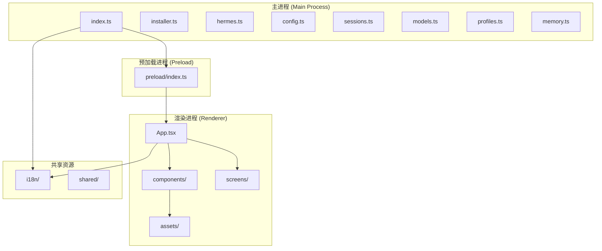
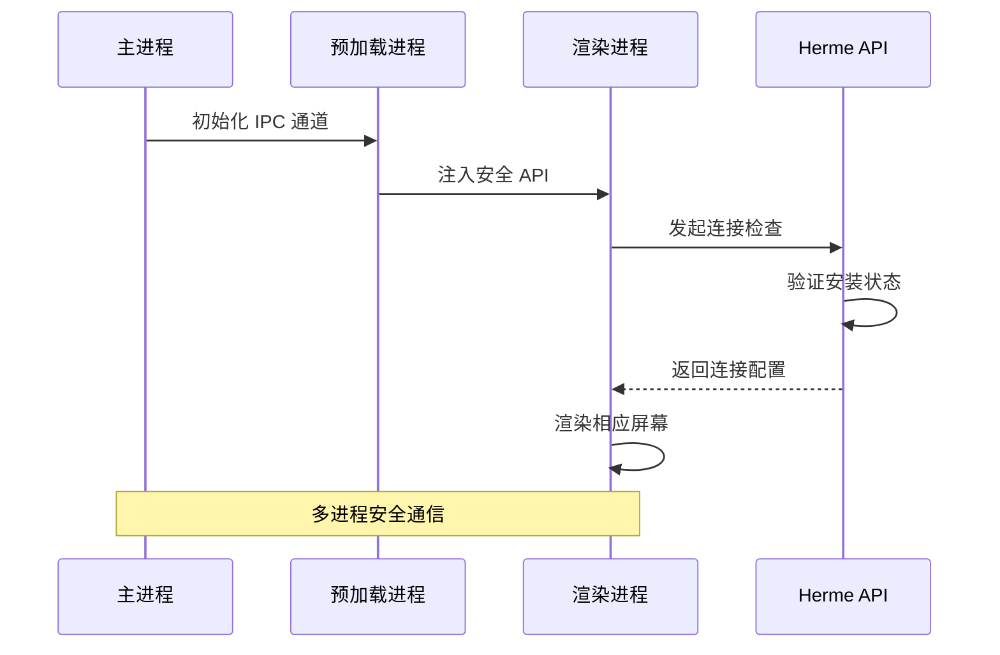
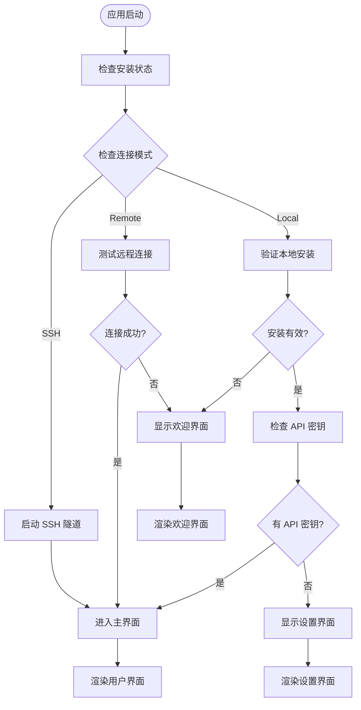
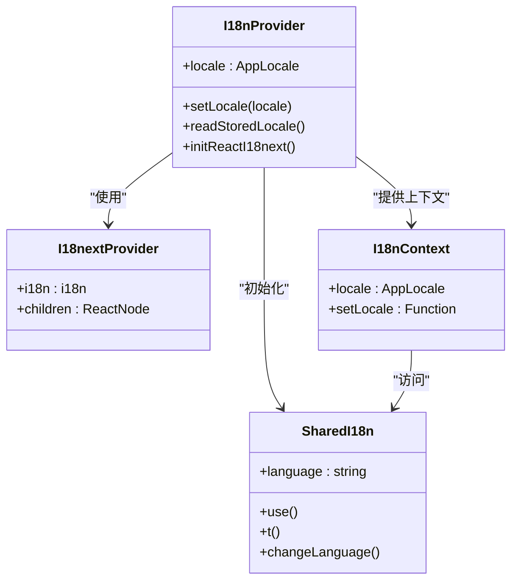
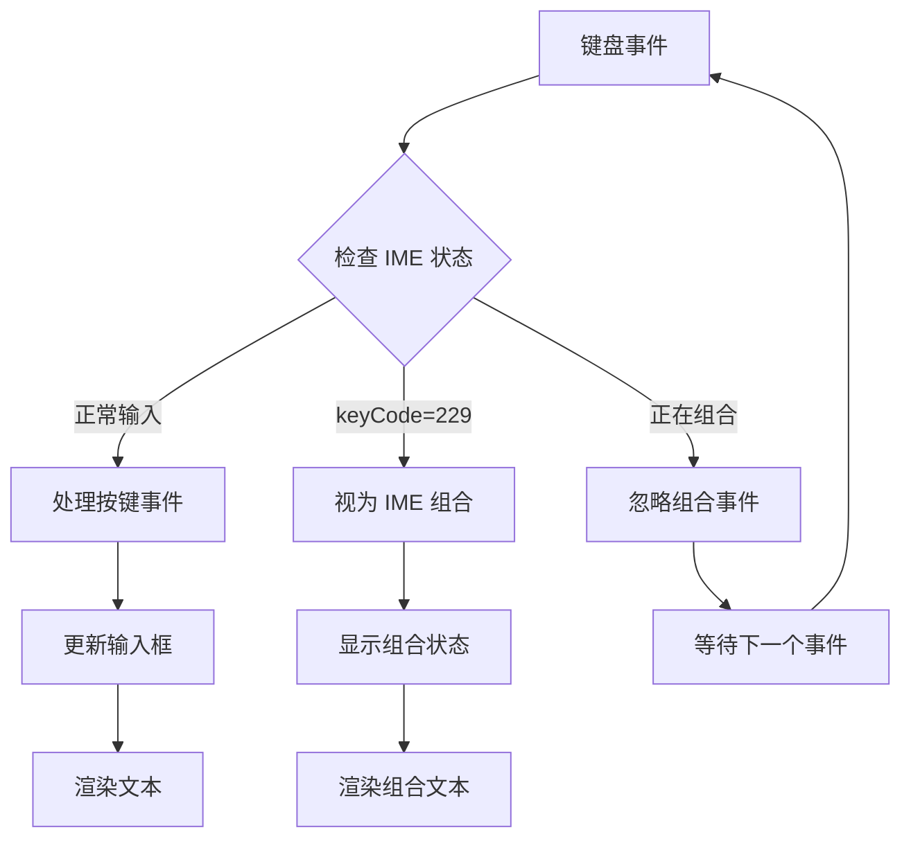

# 无障碍功能增强

<cite>
**本文档引用的文件**
- [README.md](file://README.md)
- [App.tsx](file://src/renderer/src/App.tsx)
- [index.ts](file://src/main/index.ts)
- [I18nProvider.tsx](file://src/renderer/src/components/I18nProvider.tsx)
- [ThemeProvider.tsx](file://src/renderer/src/components/ThemeProvider.tsx)
- [base.css](file://src/renderer/src/assets/base.css)
- [main.css](file://src/renderer/src/assets/main.css)
- [HermesLogo.tsx](file://src/renderer/src/components/common/HermesLogo.tsx)
- [ErrorBoundary.tsx](file://src/renderer/src/components/ErrorBoundary.tsx)
- [keyboard.ts](file://src/renderer/src/screens/Chat/keyboard.ts)
- [askpass.ts](file://src/main/askpass.ts)
- [sudoCreds.ts](file://src/main/sudoCreds.ts)
</cite>

## 目录
1. [简介](#简介)
2. [项目结构](#项目结构)
3. [核心组件](#核心组件)
4. [架构概览](#架构概览)
5. [详细组件分析](#详细组件分析)
6. [依赖关系分析](#依赖关系分析)
7. [性能考虑](#性能考虑)
8. [故障排除指南](#故障排除指南)
9. [结论](#结论)

## 简介

Hermes Desktop 是一个基于 Electron 和 React 的原生桌面应用程序，专为安装、配置和与 Hermes Agent（一个自我改进的 AI 助手）进行聊天而设计。该项目具有强大的无障碍功能支持，包括国际化、主题系统、错误处理和键盘交互优化。

该应用程序提供了本地或远程后端支持，多提供商兼容性，流式聊天界面，会话管理，配置文件切换，工具集管理，内存系统，人格编辑器，模型管理，计划任务，消息网关集成，以及 Claw3D 可视化界面等功能。

## 项目结构

Hermes Desktop 采用模块化的项目结构，主要分为以下几部分：



**图表来源**
- [index.ts:1-1238](file://src/main/index.ts#L1-L1238)
- [App.tsx:1-188](file://src/renderer/src/App.tsx#L1-L188)

**章节来源**
- [README.md:1-282](file://README.md#L1-L282)
- [index.ts:1-1238](file://src/main/index.ts#L1-L1238)
- [App.tsx:1-188](file://src/renderer/src/App.tsx#L1-L188)

## 核心组件

### 国际化系统

应用程序实现了完整的国际化框架，支持多种语言环境：

- **语言支持**: 英语、西班牙语、印尼语、葡萄牙语、简体中文
- **动态语言切换**: 支持运行时语言切换和持久化存储
- **本地化资源**: 每个语言都有完整的翻译资源文件
- **回退机制**: 默认使用英语作为回退语言

### 主题系统

提供三种主题模式：浅色、深色和系统跟随：

- **自动检测**: 基于系统偏好设置自动切换主题
- **手动控制**: 用户可以强制选择特定主题
- **持久化存储**: 主题设置保存在本地存储中
- **CSS 变量**: 使用 CSS 自定义属性实现主题切换

### 错误边界处理

实现了全局错误边界，提供优雅的错误处理机制：

- **组件级错误捕获**: 自动捕获子组件中的 JavaScript 错误
- **用户友好的错误界面**: 提供清晰的错误信息和重试选项
- **错误日志记录**: 记录详细的错误信息用于调试

**章节来源**
- [I18nProvider.tsx:1-84](file://src/renderer/src/components/I18nProvider.tsx#L1-L84)
- [ThemeProvider.tsx:1-80](file://src/renderer/src/components/ThemeProvider.tsx#L1-L80)
- [ErrorBoundary.tsx:1-56](file://src/renderer/src/components/ErrorBoundary.tsx#L1-L56)

## 架构概览

应用程序采用客户端-服务器架构，结合了 Electron 的多进程模型：



**图表来源**
- [index.ts:290-350](file://src/main/index.ts#L290-L350)
- [App.tsx:27-95](file://src/renderer/src/App.tsx#L27-L95)

## 详细组件分析

### 应用启动流程

应用程序的启动过程经过精心设计，确保最佳的用户体验：



**图表来源**
- [App.tsx:27-95](file://src/renderer/src/App.tsx#L27-L95)

### 国际化实现

国际化系统通过以下组件协同工作：



**图表来源**
- [I18nProvider.tsx:1-84](file://src/renderer/src/components/I18nProvider.tsx#L1-L84)

### 主题管理系统

主题系统实现了灵活的主题切换机制：

```mermaid
classDiagram
class ThemeProvider {
+theme : Theme
+resolved : ResolvedTheme
+setTheme(theme)
+getSystemTheme()
+resolve(theme)
}
class ThemeContext {
+theme : Theme
+resolved : ResolvedTheme
+setTheme : Function
}
class ThemeContextValue {
+theme : Theme
+resolved : ResolvedTheme
+setTheme : Function
}
ThemeProvider --> ThemeContext : "创建"
ThemeContext --> ThemeContextValue : "提供"
ThemeProvider --> "localStorage" : "存储主题"
ThemeProvider --> "window.matchMedia" : "监听系统偏好"
```

**图表来源**
- [ThemeProvider.tsx:1-80](file://src/renderer/src/components/ThemeProvider.tsx#L1-L80)

### 键盘输入处理

应用程序对键盘输入进行了专门的优化，特别是针对 IME 输入法：



**图表来源**
- [keyboard.ts:1-10](file://src/renderer/src/screens/Chat/keyboard.ts#L1-L10)

**章节来源**
- [App.tsx:27-95](file://src/renderer/src/App.tsx#L27-L95)
- [I18nProvider.tsx:1-84](file://src/renderer/src/components/I18nProvider.tsx#L1-L84)
- [ThemeProvider.tsx:1-80](file://src/renderer/src/components/ThemeProvider.tsx#L1-L80)
- [keyboard.ts:1-10](file://src/renderer/src/screens/Chat/keyboard.ts#L1-L10)

## 依赖关系分析

应用程序的依赖关系体现了清晰的关注点分离：

```mermaid
graph LR
subgraph "渲染进程依赖"
A[React 19]
B[Tailwind CSS 4]
C[i18next]
D[react-i18next]
E[typescript]
end
subgraph "主进程依赖"
F[Electron 39]
G[better-sqlite3]
H[electron-updater]
I[@electron-toolkit]
end
subgraph "开发工具"
J[Vite 7]
K[Vitest]
L[TypeScript]
M[Eslint]
end
A --> F
C --> A
D --> C
E --> A
F --> H
G --> F
I --> F
```

**图表来源**
- [README.md:255-265](file://README.md#L255-L265)

**章节来源**
- [README.md:255-265](file://README.md#L255-L265)

## 性能考虑

应用程序在多个方面考虑了性能优化：

### 启动性能
- **最小化启动时间**: 启动画面至少显示 1.3 秒以展示品牌动画
- **延迟初始化**: 安装验证在 UI 启动后异步执行
- **懒加载策略**: 屏幕组件按需加载

### 内存管理
- **垃圾回收优化**: 合理的事件监听器清理
- **缓存策略**: 版本信息和配置的智能缓存
- **资源释放**: 窗口关闭时的资源清理

### 网络性能
- **连接池管理**: SSH 隧道的复用和健康检查
- **超时控制**: 远程连接的超时和重试机制
- **进度反馈**: 安装过程的实时进度显示

## 故障排除指南

### 常见问题及解决方案

#### 安装问题
- **问题**: 安装失败或验证失败
- **解决方案**: 查看安装日志，检查网络连接，重新尝试安装
- **预防**: 确保有足够的磁盘空间和网络权限

#### 连接问题
- **问题**: 无法连接到远程 Hermes 服务
- **解决方案**: 验证 URL 和 API 密钥，检查防火墙设置
- **预防**: 使用连接测试功能定期检查连接状态

#### 主题问题
- **问题**: 主题切换不生效
- **解决方案**: 刷新页面，检查浏览器开发者工具中的 CSS 变量
- **预防**: 避免直接修改 CSS 变量值

#### 国际化问题
- **问题**: 语言切换无效
- **解决方案**: 清除浏览器缓存，检查 localStorage 存储
- **预防**: 在设置中正确选择目标语言

**章节来源**
- [App.tsx:105-135](file://src/renderer/src/App.tsx#L105-L135)
- [ErrorBoundary.tsx:25-52](file://src/renderer/src/components/ErrorBoundary.tsx#L25-L52)

## 结论

Hermes Desktop 在无障碍功能方面表现出色，通过以下关键特性提供了优秀的用户体验：

### 主要优势
1. **全面的国际化支持**: 支持多种语言，提供流畅的多语言体验
2. **灵活的主题系统**: 支持浅色、深色和系统跟随模式
3. **健壮的错误处理**: 全局错误边界确保应用稳定性
4. **优化的键盘交互**: 特别针对 IME 输入法的优化
5. **安全的权限管理**: 通过密码对话框和 sudo 凭据管理

### 技术亮点
- **模块化架构**: 清晰的职责分离和依赖管理
- **性能优化**: 启动速度和运行效率的平衡
- **可维护性**: 良好的代码组织和文档结构
- **扩展性**: 易于添加新功能和新语言支持

### 改进建议
1. **ARIA 支持**: 添加适当的 ARIA 属性提升屏幕阅读器兼容性
2. **键盘导航**: 实现完整的键盘快捷键支持
3. **高对比度模式**: 添加高对比度主题选项
4. **语音控制**: 考虑集成语音命令功能

该应用程序为无障碍功能增强提供了坚实的基础，通过持续的改进和优化，能够为更广泛的用户群体提供优质的使用体验。