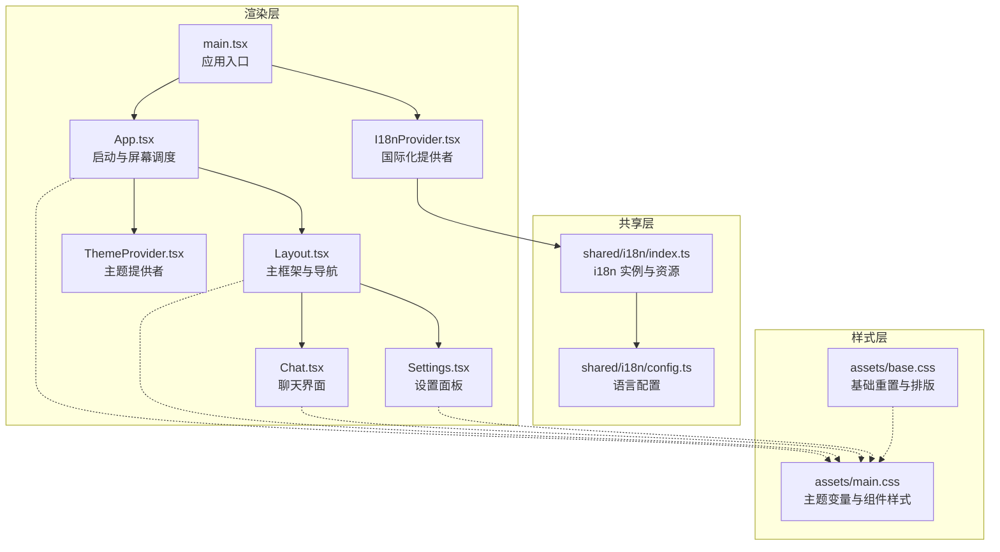
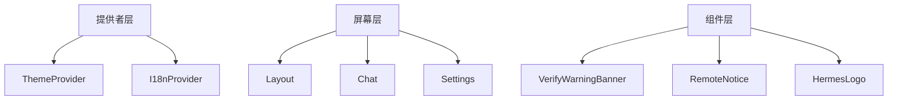
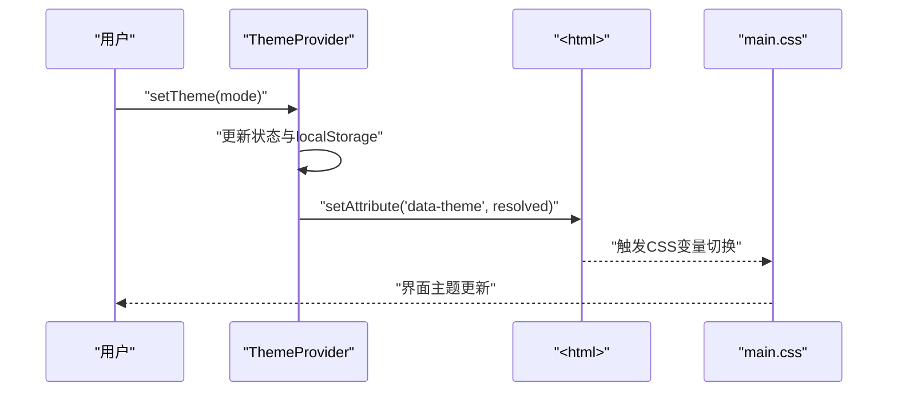
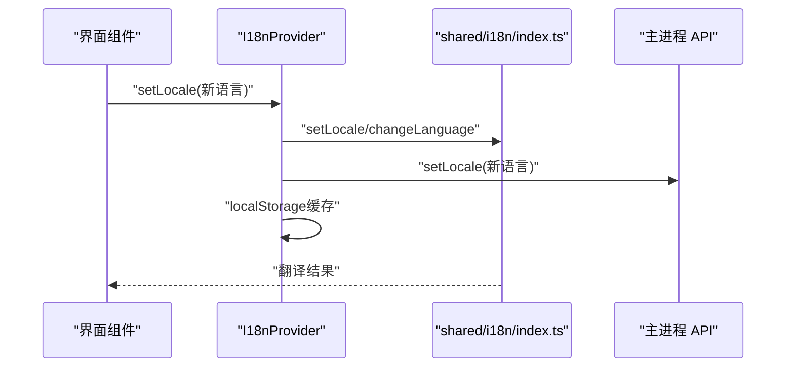
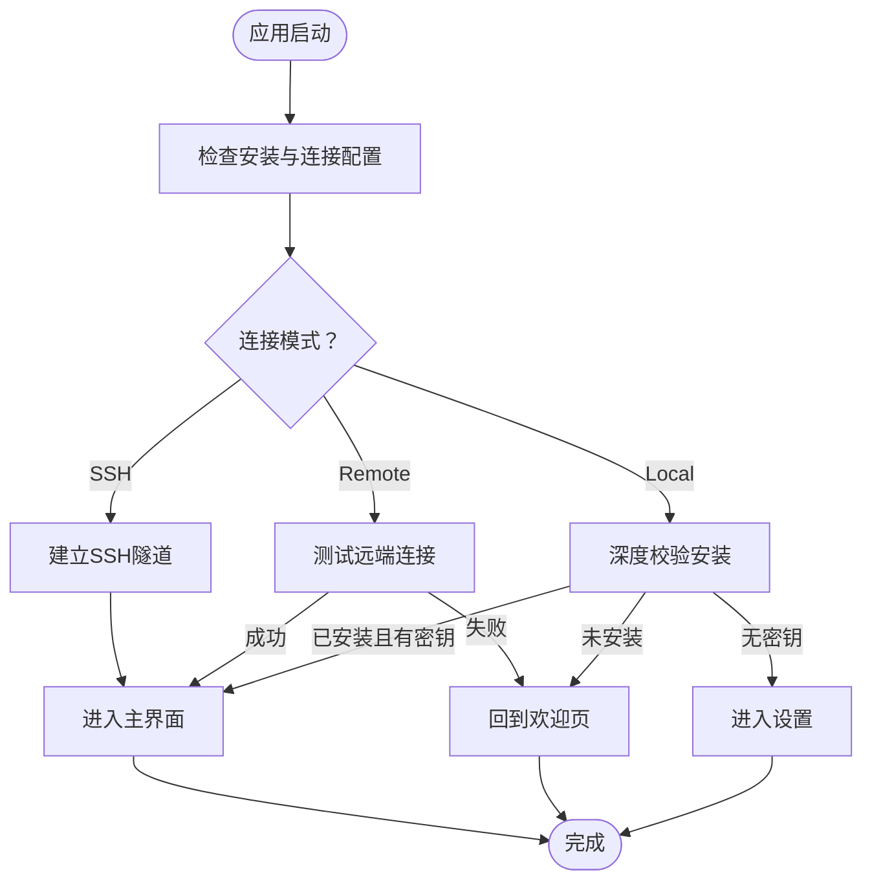
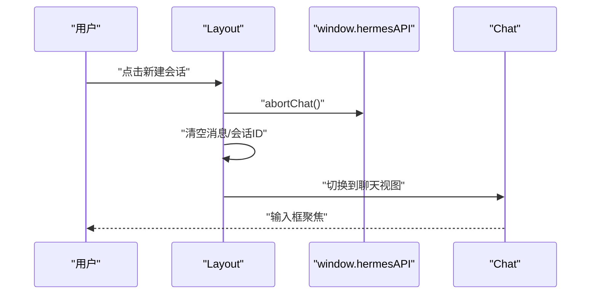
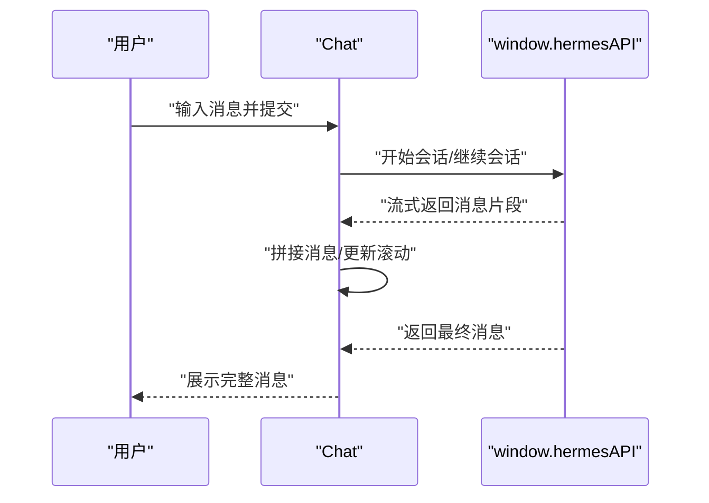
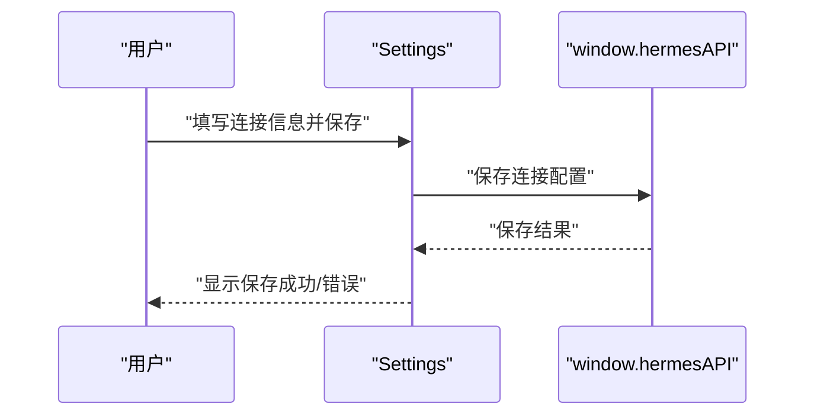
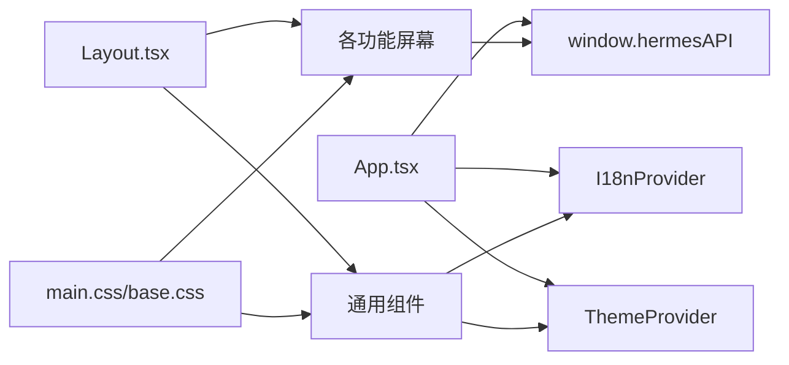

# 用户界面设计

<cite>
**本文档引用的文件**
- [App.tsx](file://src/renderer/src/App.tsx)
- [main.tsx](file://src/renderer/src/main.tsx)
- [ThemeProvider.tsx](file://src/renderer/src/components/ThemeProvider.tsx)
- [I18nProvider.tsx](file://src/renderer/src/components/I18nProvider.tsx)
- [Layout.tsx](file://src/renderer/src/screens/Layout/Layout.tsx)
- [Chat.tsx](file://src/renderer/src/screens/Chat/Chat.tsx)
- [Settings.tsx](file://src/renderer/src/screens/Settings/Settings.tsx)
- [VerifyWarningBanner.tsx](file://src/renderer/src/components/VerifyWarningBanner.tsx)
- [RemoteNotice.tsx](file://src/renderer/src/components/RemoteNotice.tsx)
- [main.css](file://src/renderer/src/assets/main.css)
- [base.css](file://src/renderer/src/assets/base.css)
- [constants.ts](file://src/renderer/src/constants.ts)
- [index.ts](file://src/shared/i18n/index.ts)
- [config.ts](file://src/shared/i18n/config.ts)
</cite>

## 目录
1. [简介](#简介)
2. [项目结构](#项目结构)
3. [核心组件](#核心组件)
4. [架构总览](#架构总览)
5. [详细组件分析](#详细组件分析)
6. [依赖关系分析](#依赖关系分析)
7. [性能考虑](#性能考虑)
8. [故障排除指南](#故障排除指南)
9. [结论](#结论)
10. [附录](#附录)

## 简介
本文件面向设计师与开发者，系统化阐述 Hermes Desktop 的用户界面设计与实现。内容涵盖应用的 UI 架构（屏幕布局、组件系统、主题机制、国际化）、各功能屏幕的设计理念与交互模式（聊天界面、会话管理、设置面板等）、响应式设计原则、无障碍访问支持与用户体验优化策略，并提供组件使用指南、自定义选项与扩展方法。

## 项目结构
渲染层采用 React + TypeScript，主进程通过 window.hermesAPI 暴露能力给渲染层；共享层提供国际化资源与类型。整体结构清晰：入口在 main.tsx，根组件 App.tsx 负责启动流程与屏幕切换；Layout.tsx 提供主框架与导航；各功能屏幕位于 screens 目录；主题与国际化分别由 ThemeProvider 与 I18nProvider 提供。

图表来源
- [main.tsx:1-15](file://src/renderer/src/main.tsx#L1-L15)
- [App.tsx:1-188](file://src/renderer/src/App.tsx#L1-L188)
- [Layout.tsx:1-374](file://src/renderer/src/screens/Layout/Layout.tsx#L1-L374)
- [Chat.tsx:1-200](file://src/renderer/src/screens/Chat/Chat.tsx#L1-L200)
- [Settings.tsx:1-200](file://src/renderer/src/screens/Settings/Settings.tsx#L1-L200)
- [ThemeProvider.tsx:1-80](file://src/renderer/src/components/ThemeProvider.tsx#L1-L80)
- [I18nProvider.tsx:1-84](file://src/renderer/src/components/I18nProvider.tsx#L1-L84)
- [index.ts:1-287](file://src/shared/i18n/index.ts#L1-L287)
- [config.ts:1-7](file://src/shared/i18n/config.ts#L1-L7)
- [main.css:1-800](file://src/renderer/src/assets/main.css#L1-L800)
- [base.css:1-44](file://src/renderer/src/assets/base.css#L1-L44)

章节来源
- [main.tsx:1-15](file://src/renderer/src/main.tsx#L1-L15)
- [App.tsx:1-188](file://src/renderer/src/App.tsx#L1-L188)
- [Layout.tsx:1-374](file://src/renderer/src/screens/Layout/Layout.tsx#L1-L374)
- [main.css:1-800](file://src/renderer/src/assets/main.css#L1-L800)
- [base.css:1-44](file://src/renderer/src/assets/base.css#L1-L44)

## 核心组件
- 主题系统：ThemeProvider 提供 light/dark/system 三态主题，持久化到 localStorage，并通过 data-theme 应用到 <html>，实现全局样式切换。
- 国际化系统：I18nProvider 初始化共享 i18n 实例，读取/写入本地语言偏好，同步到主进程；shared/i18n/index.ts 集中管理多语言资源与工具函数。
- 启动与屏幕调度：App.tsx 执行安装检查、远程连接检测、欢迎/安装/设置/主界面的生命周期切换。
- 主框架与导航：Layout.tsx 定义侧边栏导航、视图懒挂载与复用、远程模式限制提示、更新状态通知。
- 功能屏幕：Chat.tsx 负责消息流、模型选择、工具进度与用量展示；Settings.tsx 提供连接配置、网络设置、备份导入、日志查看等。

章节来源
- [ThemeProvider.tsx:1-80](file://src/renderer/src/components/ThemeProvider.tsx#L1-L80)
- [I18nProvider.tsx:1-84](file://src/renderer/src/components/I18nProvider.tsx#L1-L84)
- [index.ts:1-287](file://src/shared/i18n/index.ts#L1-L287)
- [App.tsx:16-188](file://src/renderer/src/App.tsx#L16-L188)
- [Layout.tsx:74-374](file://src/renderer/src/screens/Layout/Layout.tsx#L74-L374)
- [Chat.tsx:106-200](file://src/renderer/src/screens/Chat/Chat.tsx#L106-L200)
- [Settings.tsx:36-200](file://src/renderer/src/screens/Settings/Settings.tsx#L36-L200)

## 架构总览
应用 UI 架构以“提供者-屏幕-组件”分层组织，强调可组合性与可扩展性。提供者负责状态与上下文（主题、国际化），屏幕负责业务域与数据流，通用组件负责复用与一致性。

图表来源
- [ThemeProvider.tsx:30-80](file://src/renderer/src/components/ThemeProvider.tsx#L30-L80)
- [I18nProvider.tsx:31-84](file://src/renderer/src/components/I18nProvider.tsx#L31-L84)
- [Layout.tsx:188-374](file://src/renderer/src/screens/Layout/Layout.tsx#L188-L374)
- [Chat.tsx:106-200](file://src/renderer/src/screens/Chat/Chat.tsx#L106-L200)
- [Settings.tsx:36-200](file://src/renderer/src/screens/Settings/Settings.tsx#L36-L200)
- [VerifyWarningBanner.tsx:14-43](file://src/renderer/src/components/VerifyWarningBanner.tsx#L14-L43)
- [RemoteNotice.tsx:3-17](file://src/renderer/src/components/RemoteNotice.tsx#L3-L17)

## 详细组件分析

### 主题机制（ThemeProvider）
- 设计要点
  - 支持 system（跟随系统）、light、dark 三种模式，优先从 localStorage 恢复。
  - 通过 window.matchMedia 监听系统主题变化，在 system 模式下自动切换。
  - 将当前解析主题写入 <html> 的 data-theme 属性，使 CSS 变量生效。
- 数据流
  - 初始值读取 -> 设置状态 -> 写入 localStorage -> 应用到 DOM -> 全局样式生效。
- 自定义与扩展
  - 新增主题色板：在 main.css 中添加新的 [data-theme=...] 块，补充变量。
  - 新增存储键：在 constants.ts 中新增 STORAGE_KEY 并在 ThemeProvider 中读取。

图表来源
- [ThemeProvider.tsx:30-80](file://src/renderer/src/components/ThemeProvider.tsx#L30-L80)
- [main.css:6-72](file://src/renderer/src/assets/main.css#L6-L72)
- [constants.ts:216](file://src/renderer/src/constants.ts#L216)

章节来源
- [ThemeProvider.tsx:1-80](file://src/renderer/src/components/ThemeProvider.tsx#L1-L80)
- [main.css:1-800](file://src/renderer/src/assets/main.css#L1-L800)
- [constants.ts:216](file://src/renderer/src/constants.ts#L216)

### 国际化机制（I18nProvider 与共享 i18n）
- 设计要点
  - I18nProvider 初始化共享 i18n 实例，读取本地存储语言偏好，尝试从主进程同步语言。
  - shared/i18n/index.ts 统一加载多语言资源，提供 changeLanguage、t 工具函数与回退逻辑。
  - 支持命名空间拆分（common、navigation、chat、settings 等）便于模块化维护。
- 数据流
  - 读取本地偏好 -> 设置共享实例 -> 同步主进程 -> localStorage 缓存。
- 自定义与扩展
  - 新增语言：在 shared/i18n/config.ts 的 APP_LOCALES 中加入新语言代码。
  - 新增词条：在对应语言目录新增模块文件，或在现有模块追加键值。
  - 使用 t 函数：在组件中通过 useI18n 获取 t，支持插值与命名空间。

图表来源
- [I18nProvider.tsx:31-84](file://src/renderer/src/components/I18nProvider.tsx#L31-L84)
- [index.ts:244-287](file://src/shared/i18n/index.ts#L244-L287)
- [config.ts:1-7](file://src/shared/i18n/config.ts#L1-L7)

章节来源
- [I18nProvider.tsx:1-84](file://src/renderer/src/components/I18nProvider.tsx#L1-L84)
- [index.ts:1-287](file://src/shared/i18n/index.ts#L1-L287)
- [config.ts:1-7](file://src/shared/i18n/config.ts#L1-L7)

### 启动与屏幕调度（App.tsx）
- 设计要点
  - 启动阶段执行安装检查、远程连接测试、SSH 隧道建立，决定初始屏幕。
  - 通过状态机控制 splash/welcome/installing/setup/main 五种屏幕。
  - 提供软警告（verify warning）与错误处理，避免阻断用户路径。
- 流程图

图表来源
- [App.tsx:27-95](file://src/renderer/src/App.tsx#L27-L95)
- [App.tsx:136-173](file://src/renderer/src/App.tsx#L136-L173)

章节来源
- [App.tsx:1-188](file://src/renderer/src/App.tsx#L1-L188)

### 主框架与导航（Layout.tsx）
- 设计要点
  - 侧边栏导航项与图标映射，点击切换视图；首次访问才挂载对应屏幕，后续仅显示/隐藏，提升性能。
  - 远程模式限制：当 isRemoteOnlyMode 为真时，部分屏幕显示 RemoteNotice 提示不可用。
  - 更新状态：监听更新可用/下载进度/下载完成事件，统一在侧边栏展示更新按钮与文案。
  - 会话恢复：从数据库加载历史消息，转换为聊天消息格式并进入聊天视图。
- 交互序列（新建会话）

图表来源
- [Layout.tsx:145-165](file://src/renderer/src/screens/Layout/Layout.tsx#L145-L165)

章节来源
- [Layout.tsx:1-374](file://src/renderer/src/screens/Layout/Layout.tsx#L1-L374)

### 聊天界面（Chat.tsx）
- 设计要点
  - 消息渲染：区分 user/agent 角色，agent 内容使用 Markdown 渲染；支持危险操作审批弹窗。
  - 滚动行为：自动滚动到底部，用户手动上滑时暂停自动滚动，松开后恢复。
  - 模型选择：按提供商分组列出可用模型，支持自定义模型输入与快速切换。
  - 工具进度与用量：显示工具执行进度与 token 用量统计。
- 交互序列（发送消息）

图表来源
- [Chat.tsx:106-200](file://src/renderer/src/screens/Chat/Chat.tsx#L106-L200)

章节来源
- [Chat.tsx:1-200](file://src/renderer/src/screens/Chat/Chat.tsx#L1-L200)

### 设置面板（Settings.tsx）
- 设计要点
  - 连接模式：支持 local/remote/ssh 三种模式，提供测试连接、保存配置。
  - 网络设置：强制 IPv4、HTTP 代理等网络参数。
  - 备份与导入：导出/导入配置文件，支持调试。
  - 日志查看：选择日志文件，展开查看内容。
  - 主题与语言：通过 ThemeProvider 与 I18nProvider 控制全局主题与语言。
- 交互序列（保存连接配置）

图表来源
- [Settings.tsx:200-300](file://src/renderer/src/screens/Settings/Settings.tsx#L200-L300)

章节来源
- [Settings.tsx:1-200](file://src/renderer/src/screens/Settings/Settings.tsx#L1-L200)

### 通用组件
- VerifyWarningBanner：当安装文件存在但深层校验失败时，显示软警告，允许重新安装或忽略。
- RemoteNotice：在远程模式下对不可用功能显示提示。

章节来源
- [VerifyWarningBanner.tsx:1-43](file://src/renderer/src/components/VerifyWarningBanner.tsx#L1-L43)
- [RemoteNotice.tsx:1-17](file://src/renderer/src/components/RemoteNotice.tsx#L1-L17)

## 依赖关系分析
- 组件耦合
  - App.tsx 依赖 window.hermesAPI 与 ThemeProvider/I18nProvider，承担启动与屏幕切换职责。
  - Layout.tsx 作为容器，依赖各功能屏幕与通用组件，负责导航与远程模式控制。
  - Chat.tsx/Settings.tsx 通过 window.hermesAPI 与主进程通信，内部状态驱动 UI。
- 外部依赖
  - 主进程 API：window.hermesAPI 提供连接配置、安装检查、会话管理、更新管理等能力。
  - i18n：shared/i18n/index.ts 提供统一翻译与资源加载。
- 样式依赖
  - main.css 定义主题变量与组件样式，base.css 提供基础排版与重置。

图表来源
- [App.tsx:1-188](file://src/renderer/src/App.tsx#L1-L188)
- [Layout.tsx:1-374](file://src/renderer/src/screens/Layout/Layout.tsx#L1-L374)
- [main.css:1-800](file://src/renderer/src/assets/main.css#L1-L800)
- [base.css:1-44](file://src/renderer/src/assets/base.css#L1-L44)

章节来源
- [App.tsx:1-188](file://src/renderer/src/App.tsx#L1-L188)
- [Layout.tsx:1-374](file://src/renderer/src/screens/Layout/Layout.tsx#L1-L374)
- [main.css:1-800](file://src/renderer/src/assets/main.css#L1-L800)
- [base.css:1-44](file://src/renderer/src/assets/base.css#L1-L44)

## 性能考虑
- 视图懒挂载：Layout.tsx 对非当前视图采用 display:none 策略，避免频繁重建与 IPC 重载。
- 滚动优化：Chat.tsx 使用滚动监听与用户交互标记，减少不必要的滚动动画。
- 本地缓存：Settings.tsx 从 localStorage 读取版本与迁移状态，保证即时反馈。
- 主题与国际化：通过 CSS 变量与共享实例，避免重复渲染与闪烁。

## 故障排除指南
- 安装校验失败但文件存在
  - 现象：出现 VerifyWarningBanner。
  - 处理：点击“重新安装”触发安装流程，或点击“忽略”继续使用。
- 远程模式限制
  - 现象：某些屏幕显示 RemoteNotice。
  - 处理：切换到本地/SSH 模式或等待服务端能力开放。
- 语言/主题不生效
  - 检查 localStorage 是否正确写入；确认 <html> 上 data-theme 是否更新；确保 shared/i18n 资源加载成功。
- 启动卡住
  - 检查 window.hermesAPI 的 getConnectionConfig/testRemoteConnection/startSshTunnel 返回值，必要时清理缓存后重试。

章节来源
- [VerifyWarningBanner.tsx:14-43](file://src/renderer/src/components/VerifyWarningBanner.tsx#L14-L43)
- [RemoteNotice.tsx:3-17](file://src/renderer/src/components/RemoteNotice.tsx#L3-L17)
- [App.tsx:27-95](file://src/renderer/src/App.tsx#L27-L95)

## 结论
Hermes Desktop 的 UI 架构以提供者为核心，结合屏幕与组件的清晰分层，实现了主题与国际化的统一管理、启动流程的稳健控制以及功能屏幕的高性能渲染。通过 CSS 变量与共享 i18n，系统具备良好的可扩展性与可维护性。建议在新增语言与主题时遵循现有约定，保持样式与逻辑的一致性。

## 附录
- 响应式设计原则
  - 使用 CSS 变量与相对单位，适配不同窗口尺寸与缩放比例。
  - 侧边栏导航在小屏下可考虑折叠策略（当前实现为固定宽度导航）。
- 无障碍访问支持
  - 使用语义化标签与 role 属性（如 status），为辅助技术提供上下文。
  - 保持键盘可访问性，确保按钮与表单控件可通过 Tab 键聚焦。
- 用户体验优化策略
  - 懒挂载与状态复用减少切换延迟。
  - 软警告与错误提示明确可操作步骤，避免阻断用户路径。
  - 主题与语言即时生效，减少感知延迟。