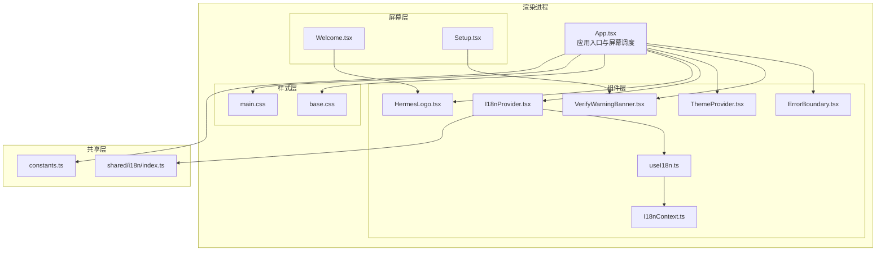
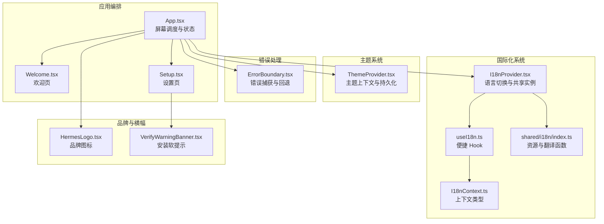
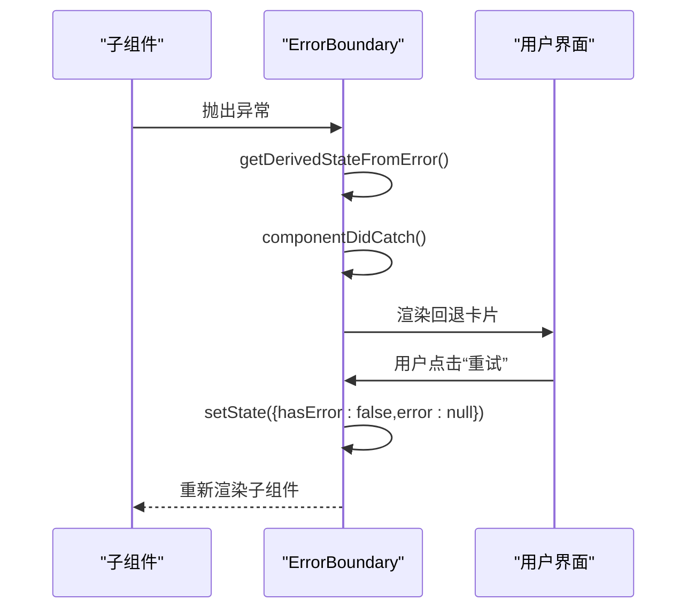
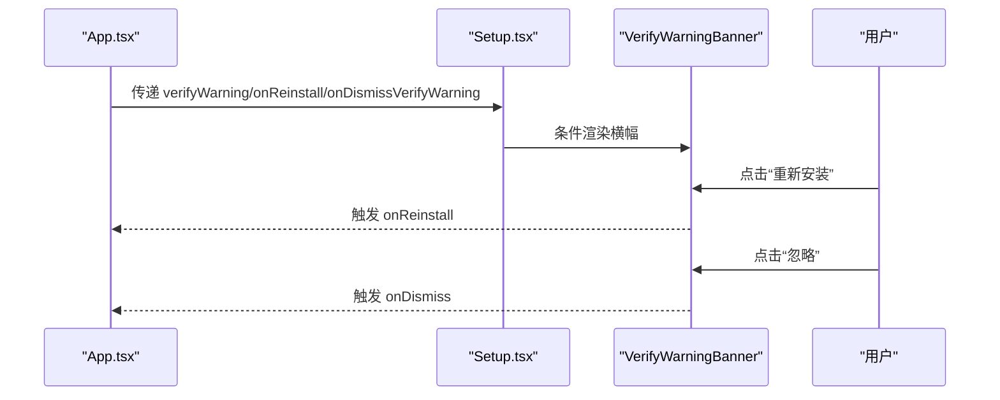
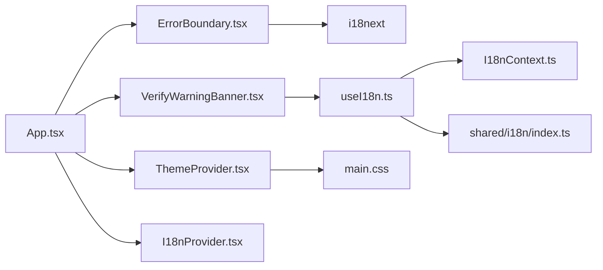

# 组件库

<cite>
**本文档引用的文件**
- [HermesLogo.tsx](file://src/renderer/src/components/common/HermesLogo.tsx)
- [ErrorBoundary.tsx](file://src/renderer/src/components/ErrorBoundary.tsx)
- [VerifyWarningBanner.tsx](file://src/renderer/src/components/VerifyWarningBanner.tsx)
- [ThemeProvider.tsx](file://src/renderer/src/components/ThemeProvider.tsx)
- [I18nProvider.tsx](file://src/renderer/src/components/I18nProvider.tsx)
- [useI18n.ts](file://src/renderer/src/components/useI18n.ts)
- [I18nContext.ts](file://src/renderer/src/components/I18nContext.ts)
- [base.css](file://src/renderer/src/assets/base.css)
- [main.css](file://src/renderer/src/assets/main.css)
- [constants.ts](file://src/renderer/src/constants.ts)
- [index.ts（共享i18n）](file://src/shared/i18n/index.ts)
- [App.tsx](file://src/renderer/src/App.tsx)
- [Welcome.tsx](file://src/renderer/src/screens/Welcome/Welcome.tsx)
- [Setup.tsx](file://src/renderer/src/screens/Setup/Setup.tsx)
</cite>

## 目录
1. [简介](#简介)
2. [项目结构](#项目结构)
3. [核心组件](#核心组件)
4. [架构总览](#架构总览)
5. [组件详解](#组件详解)
6. [依赖关系分析](#依赖关系分析)
7. [性能与可维护性](#性能与可维护性)
8. [故障排查指南](#故障排查指南)
9. [结论](#结论)
10. [附录：设计系统与样式定制](#附录设计系统与样式定制)

## 简介
本文件为 Hermes Desktop 组件库的综合文档，聚焦基础 UI 组件的设计规范与使用方法，覆盖以下核心组件：
- 品牌与标识：HermesLogo
- 错误边界：ErrorBoundary
- 安装验证软提示横幅：VerifyWarningBanner
- 主题系统：ThemeProvider
- 国际化系统：I18nProvider、useI18n、I18nContext、共享 i18n

文档同时阐述组件的属性接口、事件处理、样式定制选项，以及在应用中的组合模式、状态管理与性能优化策略，帮助设计师与开发者快速上手并安全扩展。

## 项目结构
组件库位于渲染进程源码中，采用按功能域分层组织：
- components：通用 UI 组件与上下文
- screens：页面级容器与业务流程
- assets：全局样式与字体资源
- shared：跨进程共享能力（如 i18n 资源）

图表来源
- [App.tsx:175-184](file://src/renderer/src/App.tsx#L175-L184)
- [ErrorBoundary.tsx:15-52](file://src/renderer/src/components/ErrorBoundary.tsx#L15-L52)
- [VerifyWarningBanner.tsx:14-39](file://src/renderer/src/components/VerifyWarningBanner.tsx#L14-L39)
- [ThemeProvider.tsx:30-74](file://src/renderer/src/components/ThemeProvider.tsx#L30-L74)
- [I18nProvider.tsx:31-82](file://src/renderer/src/components/I18nProvider.tsx#L31-L82)
- [useI18n.ts:6-22](file://src/renderer/src/components/useI18n.ts#L6-L22)
- [I18nContext.ts:4-9](file://src/renderer/src/components/I18nContext.ts#L4-L9)
- [HermesLogo.tsx:3-12](file://src/renderer/src/components/common/HermesLogo.tsx#L3-L12)
- [Welcome.tsx:318-411](file://src/renderer/src/screens/Welcome/Welcome.tsx#L318-L411)
- [Setup.tsx:14-97](file://src/renderer/src/screens/Setup/Setup.tsx#L14-L97)
- [base.css:1-44](file://src/renderer/src/assets/base.css#L1-L44)
- [main.css:1-130](file://src/renderer/src/assets/main.css#L1-L130)
- [index.ts（共享i18n）:244-267](file://src/shared/i18n/index.ts#L244-L267)
- [constants.ts:208-216](file://src/renderer/src/constants.ts#L208-L216)

章节来源
- [App.tsx:16-184](file://src/renderer/src/App.tsx#L16-L184)
- [base.css:1-44](file://src/renderer/src/assets/base.css#L1-L44)
- [main.css:1-130](file://src/renderer/src/assets/main.css#L1-L130)

## 核心组件
本节概览三大核心组件的能力边界与典型用法。

- HermesLogo
  - 功能：以固定尺寸显示品牌图标，支持通过 size 属性调整宽高
  - 典型用途：欢迎页、启动屏、标题栏等场景的品牌展示
  - 参考路径：[HermesLogo.tsx:3-12](file://src/renderer/src/components/common/HermesLogo.tsx#L3-L12)

- ErrorBoundary
  - 功能：捕获子树内错误，提供回退 UI 或重试机制
  - 典型用途：包裹关键屏幕或模块，避免整页崩溃
  - 参考路径：[ErrorBoundary.tsx:15-52](file://src/renderer/src/components/ErrorBoundary.tsx#L15-L52)

- VerifyWarningBanner
  - 功能：安装校验失败时的软提示横幅，提供“重新安装”和“忽略”操作
  - 典型用途：安装流程完成后在设置/主界面顶部展示
  - 参考路径：[VerifyWarningBanner.tsx:14-39](file://src/renderer/src/components/VerifyWarningBanner.tsx#L14-L39)

章节来源
- [HermesLogo.tsx:3-12](file://src/renderer/src/components/common/HermesLogo.tsx#L3-L12)
- [ErrorBoundary.tsx:15-52](file://src/renderer/src/components/ErrorBoundary.tsx#L15-L52)
- [VerifyWarningBanner.tsx:14-39](file://src/renderer/src/components/VerifyWarningBanner.tsx#L14-L39)

## 架构总览
组件库围绕“主题系统 + 国际化系统 + 错误边界 + 品牌标识”的基础设施展开，并通过屏幕层进行编排。

图表来源
- [ThemeProvider.tsx:30-74](file://src/renderer/src/components/ThemeProvider.tsx#L30-L74)
- [I18nProvider.tsx:31-82](file://src/renderer/src/components/I18nProvider.tsx#L31-L82)
- [useI18n.ts:6-22](file://src/renderer/src/components/useI18n.ts#L6-L22)
- [I18nContext.ts:4-9](file://src/renderer/src/components/I18nContext.ts#L4-L9)
- [index.ts（共享i18n）:244-267](file://src/shared/i18n/index.ts#L244-L267)
- [ErrorBoundary.tsx:15-52](file://src/renderer/src/components/ErrorBoundary.tsx#L15-L52)
- [HermesLogo.tsx:3-12](file://src/renderer/src/components/common/HermesLogo.tsx#L3-L12)
- [VerifyWarningBanner.tsx:14-39](file://src/renderer/src/components/VerifyWarningBanner.tsx#L14-L39)
- [App.tsx:175-184](file://src/renderer/src/App.tsx#L175-L184)
- [Welcome.tsx:318-411](file://src/renderer/src/screens/Welcome/Welcome.tsx#L318-L411)
- [Setup.tsx:14-97](file://src/renderer/src/screens/Setup/Setup.tsx#L14-L97)

## 组件详解

### ErrorBoundary（错误边界）
- 设计目标
  - 在组件树内捕获运行时错误，防止整页崩溃
  - 提供用户可理解的错误信息与“重试”按钮
- 关键行为
  - 捕获错误后进入“hasError”状态
  - 若传入 fallback 则直接渲染该节点；否则渲染内置卡片式回退 UI
  - 记录错误堆栈到控制台，便于调试
- 使用建议
  - 将关键屏幕（如主界面、设置页）包裹在 ErrorBoundary 内
  - 对于可恢复的错误，结合应用状态重置实现“重试”
- 交互序列

图表来源
- [ErrorBoundary.tsx:21-27](file://src/renderer/src/components/ErrorBoundary.tsx#L21-L27)
- [ErrorBoundary.tsx:29-51](file://src/renderer/src/components/ErrorBoundary.tsx#L29-L51)

章节来源
- [ErrorBoundary.tsx:15-52](file://src/renderer/src/components/ErrorBoundary.tsx#L15-L52)

### VerifyWarningBanner（安装验证软提示横幅）
- 设计目标
  - 当安装文件存在但深层校验失败时，以非侵入方式提示用户
  - 避免将受限网络用户陷入“重新安装循环”
- 关键行为
  - 接收 onReinstall 与 onDismiss 两个回调
  - 使用 useI18n 获取本地化文案
  - 通过 data-attributes（role="status"）提升可访问性
- 使用建议
  - 在设置页或主界面顶部条件渲染
  - 与应用状态（verifyWarning）联动，支持“忽略”后不再显示
- 组合模式

图表来源
- [App.tsx:165-170](file://src/renderer/src/App.tsx#L165-L170)
- [Setup.tsx:92-97](file://src/renderer/src/screens/Setup/Setup.tsx#L92-L97)
- [VerifyWarningBanner.tsx:14-39](file://src/renderer/src/components/VerifyWarningBanner.tsx#L14-L39)

章节来源
- [VerifyWarningBanner.tsx:14-39](file://src/renderer/src/components/VerifyWarningBanner.tsx#L14-L39)
- [Setup.tsx:14-97](file://src/renderer/src/screens/Setup/Setup.tsx#L14-L97)
- [App.tsx:126-134](file://src/renderer/src/App.tsx#L126-L134)

### HermesLogo（品牌图标）
- 设计目标
  - 以统一尺寸与圆角风格呈现品牌标识
  - 支持通过 size 属性灵活适配不同场景
- 关键行为
  - 默认尺寸 32，可通过 props 调整
  - 使用本地静态资源作为图标源
- 使用建议
  - 在欢迎页、启动屏、标题栏等场景复用
  - 与主题系统配合，确保在深浅色模式下均清晰可见

章节来源
- [HermesLogo.tsx:3-12](file://src/renderer/src/components/common/HermesLogo.tsx#L3-L12)
- [Welcome.tsx:318-321](file://src/renderer/src/screens/Welcome/Welcome.tsx#L318-L321)

### 主题系统（ThemeProvider）
- 设计目标
  - 提供 light/dark/system 三种主题选择
  - 通过 data-theme 属性驱动 CSS 变量，实现全站主题切换
- 关键行为
  - 从 localStorage 读取持久化主题偏好
  - 监听系统主题变化（仅当选择“system”时生效）
  - 将当前解析主题写入 <html> 的 data-theme 属性
- 扩展建议
  - 如需第三方主题，可在 constants 中新增枚举值，并在 main.css 中补充对应变量
  - 注意过渡动画与可访问性（对比度、焦点可见性）

章节来源
- [ThemeProvider.tsx:30-74](file://src/renderer/src/components/ThemeProvider.tsx#L30-L74)
- [constants.ts:208-216](file://src/renderer/src/constants.ts#L208-L216)
- [main.css:6-72](file://src/renderer/src/assets/main.css#L6-L72)

### 国际化系统（I18nProvider、useI18n、共享 i18n）
- 设计目标
  - 提供多语言支持与本地化文案
  - 通过共享实例在渲染进程与主进程间同步语言状态
- 关键行为
  - I18nProvider 从 localStorage 读取语言偏好，监听主进程语言变更
  - useI18n 返回 locale、setLocale 与 t 函数
  - 共享 i18n 提供 changeLanguage 与资源读取工具
- 使用建议
  - 在应用根部包裹 I18nProvider，确保全局可用
  - 文案键遵循约定命名空间（如 common、errors、setup），便于维护

章节来源
- [I18nProvider.tsx:31-82](file://src/renderer/src/components/I18nProvider.tsx#L31-L82)
- [useI18n.ts:6-22](file://src/renderer/src/components/useI18n.ts#L6-L22)
- [I18nContext.ts:4-9](file://src/renderer/src/components/I18nContext.ts#L4-L9)
- [index.ts（共享i18n）:244-267](file://src/shared/i18n/index.ts#L244-L267)

## 依赖关系分析
- 组件耦合
  - ErrorBoundary 与 VerifyWarningBanner 均依赖 i18n 能力（通过 useI18n 或 i18next）
  - VerifyWarningBanner 依赖 Setup/App 的状态与回调
  - ThemeProvider 与 main.css 通过 CSS 变量解耦
- 外部依赖
  - react-i18next 用于 React 集成
  - shared/i18n 提供资源与翻译函数
- 潜在风险
  - useI18n 必须在 I18nProvider 内使用，否则抛错
  - 主题切换需确保 data-theme 生效范围覆盖目标组件

图表来源
- [ErrorBoundary.tsx:3-3](file://src/renderer/src/components/ErrorBoundary.tsx#L3-L3)
- [VerifyWarningBanner.tsx:1-1](file://src/renderer/src/components/VerifyWarningBanner.tsx#L1-L1)
- [useI18n.ts:1-2](file://src/renderer/src/components/useI18n.ts#L1-L2)
- [I18nContext.ts:1-9](file://src/renderer/src/components/I18nContext.ts#L1-L9)
- [index.ts（共享i18n）:244-267](file://src/shared/i18n/index.ts#L244-L267)
- [ThemeProvider.tsx:66-68](file://src/renderer/src/components/ThemeProvider.tsx#L66-L68)
- [main.css:6-72](file://src/renderer/src/assets/main.css#L6-L72)
- [App.tsx:175-184](file://src/renderer/src/App.tsx#L175-L184)

章节来源
- [App.tsx:175-184](file://src/renderer/src/App.tsx#L175-L184)
- [useI18n.ts:14-16](file://src/renderer/src/components/useI18n.ts#L14-L16)
- [I18nProvider.tsx:31-82](file://src/renderer/src/components/I18nProvider.tsx#L31-L82)

## 性能与可维护性
- 性能优化策略
  - ErrorBoundary 仅在错误发生时渲染回退 UI，正常路径不引入额外开销
  - VerifyWarningBanner 为轻量横幅组件，条件渲染减少不必要 DOM
  - ThemeProvider 使用 CSS 变量与 data-theme，避免频繁重排
  - I18nProvider 使用 useMemo 缓存上下文值，降低重渲染成本
- 可维护性建议
  - 文案集中管理于 shared/i18n，避免硬编码字符串
  - 主题变量集中在 main.css，便于统一治理
  - 组件职责单一：Logo 仅负责展示，Banner 仅负责提示，Boundary 仅负责兜底

[本节为通用指导，无需列出具体文件来源]

## 故障排查指南
- ErrorBoundary
  - 现象：页面空白或崩溃
  - 排查：检查子组件是否抛出未捕获异常；查看控制台错误堆栈
  - 处理：在调用处包裹 ErrorBoundary；对可恢复错误提供“重试”逻辑
  - 参考路径：[ErrorBoundary.tsx:25-27](file://src/renderer/src/components/ErrorBoundary.tsx#L25-L27)

- VerifyWarningBanner
  - 现象：软提示不出现或无法关闭
  - 排查：确认 verifyWarning 状态与 onDismiss 回调是否正确传递
  - 处理：在 Setup/App 中根据 verifyInstall 结果更新状态
  - 参考路径：[Setup.tsx:92-97](file://src/renderer/src/screens/Setup/Setup.tsx#L92-L97)，[App.tsx:126-134](file://src/renderer/src/App.tsx#L126-L134)

- 主题切换无效
  - 现象：切换主题后样式未更新
  - 排查：确认 data-theme 是否写入 <html>；CSS 变量是否正确
  - 处理：检查 ThemeProvider 的副作用与 main.css 变量定义
  - 参考路径：[ThemeProvider.tsx:66-68](file://src/renderer/src/components/ThemeProvider.tsx#L66-L68)，[main.css:6-72](file://src/renderer/src/assets/main.css#L6-L72)

- 国际化文案未生效
  - 现象：显示英文键名而非翻译文本
  - 排查：确认 useI18n 在 I18nProvider 内使用；共享实例语言是否同步
  - 处理：确保 I18nProvider 初始化完成且 setLocale 已调用
  - 参考路径：[useI18n.ts:14-16](file://src/renderer/src/components/useI18n.ts#L14-L16)，[I18nProvider.tsx:56-62](file://src/renderer/src/components/I18nProvider.tsx#L56-L62)，[index.ts（共享i18n）:263-267](file://src/shared/i18n/index.ts#L263-L267)

章节来源
- [ErrorBoundary.tsx:25-27](file://src/renderer/src/components/ErrorBoundary.tsx#L25-L27)
- [Setup.tsx:92-97](file://src/renderer/src/screens/Setup/Setup.tsx#L92-L97)
- [App.tsx:126-134](file://src/renderer/src/App.tsx#L126-L134)
- [ThemeProvider.tsx:66-68](file://src/renderer/src/components/ThemeProvider.tsx#L66-L68)
- [main.css:6-72](file://src/renderer/src/assets/main.css#L6-L72)
- [useI18n.ts:14-16](file://src/renderer/src/components/useI18n.ts#L14-L16)
- [I18nProvider.tsx:56-62](file://src/renderer/src/components/I18nProvider.tsx#L56-L62)
- [index.ts（共享i18n）:263-267](file://src/shared/i18n/index.ts#L263-L267)

## 结论
本组件库以简洁、稳定为核心设计原则：ErrorBoundary 提供可靠的错误兜底，VerifyWarningBanner 以温和方式处理安装异常，HermesLogo 保证品牌一致性，ThemeProvider 与 I18nProvider 则为主题与多语言提供基础设施。通过明确的属性接口、事件回调与样式变量，组件既易于使用又便于扩展。

[本节为总结性内容，无需列出具体文件来源]

## 附录：设计系统与样式定制
- 设计系统要点
  - 深浅色主题：通过 data-theme 切换，CSS 变量驱动
  - 字体与字号：统一使用 Google Sans 与系统字体栈
  - 交互反馈：按钮、输入框、加载指示器均有明确状态与过渡
- 样式定制建议
  - 新增主题：在 constants.ts 中添加枚举值，在 main.css 中补充变量块
  - 新增组件样式：优先复用 .btn、.input、.screen 等通用类，避免重复定义
  - 可访问性：为横幅与按钮设置 role 与 aria-label，确保键盘可达

章节来源
- [main.css:6-130](file://src/renderer/src/assets/main.css#L6-L130)
- [base.css:19-39](file://src/renderer/src/assets/base.css#L19-L39)
- [constants.ts:208-216](file://src/renderer/src/constants.ts#L208-L216)