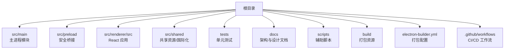
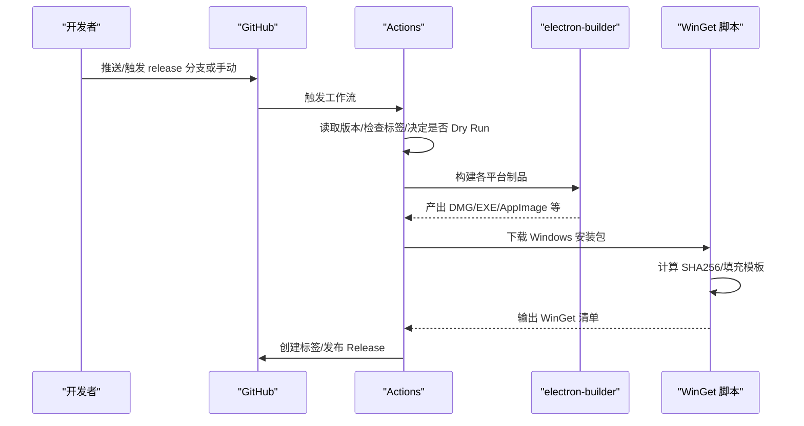
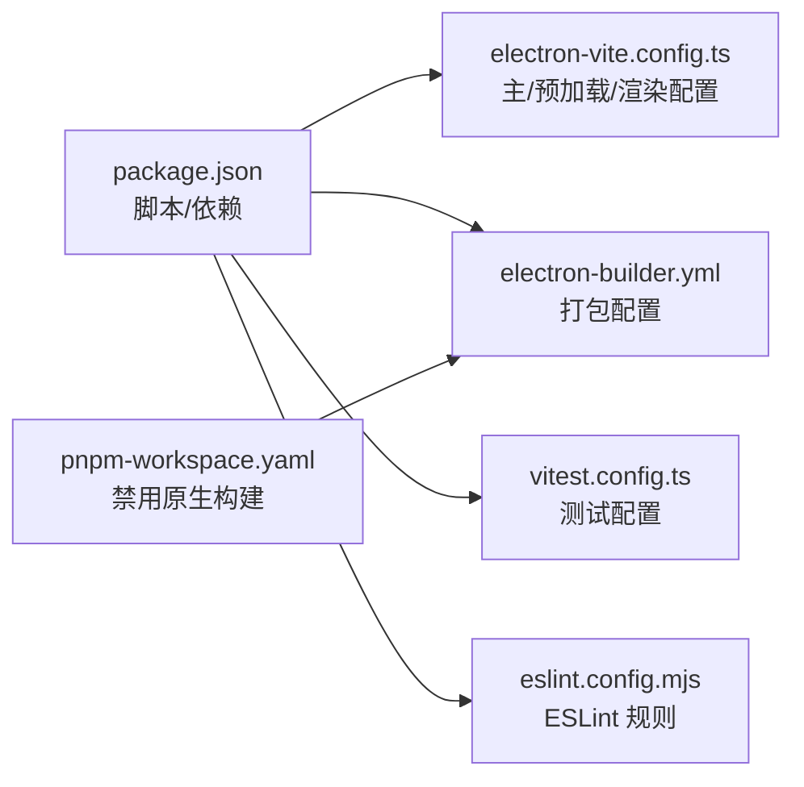

# 贡献指南

<cite>
**本文引用的文件**
- [CONTRIBUTING.md](file://CONTRIBUTING.md)
- [CONTRIBUTING.zh-CN.md](file://CONTRIBUTING.zh-CN.md)
- [README.md](file://README.md)
- [package.json](file://package.json)
- [pnpm-workspace.yaml](file://pnpm-workspace.yaml)
- [electron.vite.config.ts](file://electron.vite.config.ts)
- [eslint.config.mjs](file://eslint.config.mjs)
- [vitest.config.ts](file://vitest.config.ts)
- [electron-builder.yml](file://electron-builder.yml)
- [.github/workflows/release.yml](file://.github/workflows/release.yml)
- [docs/hermes-desktop-architecture.md](file://docs/hermes-desktop-architecture.md)
- [scripts/generate-winget-manifests.mjs](file://scripts/generate-winget-manifests.mjs)
</cite>

## 目录
1. [简介](#简介)
2. [项目结构](#项目结构)
3. [核心组件](#核心组件)
4. [架构总览](#架构总览)
5. [详细组件分析](#详细组件分析)
6. [依赖分析](#依赖分析)
7. [性能考量](#性能考量)
8. [故障排除指南](#故障排除指南)
9. [结论](#结论)
10. [附录](#附录)

## 简介
本指南面向所有希望为 Hermes Desktop 做出贡献的开发者，涵盖代码贡献、文档改进、问题报告、代码审查标准、提交规范、分支管理策略、开发环境设置、测试要求与发布流程。我们鼓励新贡献者从最小可行变更入手，遵循一致的代码风格与质量标准，共同提升项目的稳定性与可维护性。

## 项目结构
Hermes Desktop 采用 Electron + React 技术栈，主进程负责系统集成与后端能力，渲染进程承载 UI 与交互，preload 层作为安全桥接。项目还包含国际化资源、测试用例与打包配置。



图表来源
- [docs/hermes-desktop-architecture.md](file://docs/hermes-desktop-architecture.md)
- [README.md](file://README.md)

章节来源
- [README.md](file://README.md)
- [docs/hermes-desktop-architecture.md](file://docs/hermes-desktop-architecture.md)

## 核心组件
- 开发与构建
  - 开发命令：启动开发服务器与热重载
  - 构建命令：类型检查 + 构建产物
  - 平台打包：分别针对 macOS、Windows、Linux 与 RPM
- 测试
  - 单元测试：Vitest 配置与测试入口
  - 环境：jsdom，支持别名与设置文件
- 代码质量
  - ESLint + TypeScript 规则
  - Prettier 集成
- 打包与发布
  - electron-builder 配置与多目标打包
  - GitHub Actions 自动发布流水线

章节来源
- [package.json](file://package.json)
- [vitest.config.ts](file://vitest.config.ts)
- [eslint.config.mjs](file://eslint.config.mjs)
- [electron-builder.yml](file://electron-builder.yml)
- [.github/workflows/release.yml](file://.github/workflows/release.yml)

## 架构总览
下图展示主进程、preload 与渲染进程之间的职责划分与交互关系，以及外部后端（Hermes Agent、第三方 API、SQLite 数据库）的协作。

```mermaid
graph TB
subgraph "主进程(Node.js)"
M1["index.ts<br/>窗口/菜单/自动更新/IPC 总控"]
M2["hermes.ts<br/>聊天/网关/健康检查"]
M3["installer.ts<br/>安装/迁移/备份/日志"]
M4["sessions.ts / session-cache.ts<br/>会话存储/索引"]
M5["profiles.ts / memory.ts / soul.ts / tools.ts / skills.ts / models.ts<br/>配置/记忆/人格/工具/技能/模型"]
M6["ssh-remote.ts / ssh-tunnel.ts<br/>SSH 远程/隧道"]
M7["claw3d.ts<br/>Claw3D 集成"]
M8["config.ts / cronjobs.ts / utils.ts / locale.ts<br/>配置/定时任务/工具/本地化"]
end
subgraph "预加载(preload)"
P1["contextBridge 暴露 hermesAPI<br/>50+ IPC 方法"]
P2["electron 进程信息"]
end
subgraph "渲染进程(React)"
R1["App.tsx + 屏幕路由"]
R2["UI 组件/主题/国际化/Markdown/代码高亮"]
end
subgraph "外部系统"
E1["Hermes Agent CLI"]
E2["第三方 LLM/网关 API"]
E3["SQLite(state.db)"]
end
R1 --> P1
P1 <- --> M1
M1 --> M2
M1 --> M3
M1 --> M4
M1 --> M5
M1 --> M6
M1 --> M7
M1 --> M8
M2 --> E1
M2 --> E2
M4 --> E3
```

图表来源
- [docs/hermes-desktop-architecture.md](file://docs/hermes-desktop-architecture.md)
- [electron.vite.config.ts](file://electron.vite.config.ts)

章节来源
- [docs/hermes-desktop-architecture.md](file://docs/hermes-desktop-architecture.md)

## 详细组件分析

### 贡献流程与分支策略
- 分支策略
  - 基准分支：main
  - 新功能/修复：从 main 派生特性分支
  - 合并：通过 Pull Request 合并至 main
- 提交规范
  - 一次逻辑变更对应一个 commit
  - 避免将格式化/风格调整与功能性改动混杂
  - PR 描述清晰，必要时关联 Issue
- 代码审查
  - 维护者审阅 PR，可能提出修改意见
  - 通过后合并

章节来源
- [CONTRIBUTING.md](file://CONTRIBUTING.md)
- [CONTRIBUTING.zh-CN.md](file://CONTRIBUTING.zh-CN.md)

### 开发环境设置
- 前置条件
  - Node.js 与 npm
  - 类 Unix Shell（首次安装依赖）
  - 网络访问（首次安装 Hermes）
- 安装与启动
  - 安装依赖
  - 启动开发服务器
- 常用脚本
  - 开发：启动开发服务器
  - 构建：类型检查 + 构建
  - 打包：按平台构建安装包
  - 测试：运行测试与监听模式
  - 类型检查：分别对 Node 与 Web 目标执行

章节来源
- [README.md](file://README.md)
- [package.json](file://package.json)

### 代码风格与质量控制
- 代码风格
  - TypeScript + React + Electron
  - ESLint 规则与 React/React Hooks/React Refresh 集成
  - Prettier 格式化
- 类型安全
  - 分别对 Node 与 Web 目标执行类型检查
- 提交前检查
  - 运行 Lint 与类型检查
  - 在 dev 模式验证功能正常

章节来源
- [CONTRIBUTING.md](file://CONTRIBUTING.md)
- [eslint.config.mjs](file://eslint.config.mjs)
- [package.json](file://package.json)

### 测试要求
- 测试框架
  - Vitest，jsdom 环境
  - 别名：@renderer、@shared
  - 设置文件：src/renderer/src/test/setup.ts
  - 包含范围：src/**/*.{test.ts,test.tsx} 与 tests/**/*.{test.ts}
- 运行方式
  - 运行测试
  - 监听模式（watch）

章节来源
- [vitest.config.ts](file://vitest.config.ts)
- [README.md](file://README.md)

### 发布流程与打包
- 打包配置
  - electron-builder：应用 ID、产品名、资源目录、文件白名单/黑名单、asarUnpack、平台目标、制品命名、发布配置等
  - 平台目标：Windows（NSIS）、macOS（DMG/ZIP）、Linux（AppImage/DEB/RPM）
- 自动发布工作流
  - 触发条件：push 到 release 分支或手动触发
  - 步骤：准备版本/标签、跨平台构建、上传制品、生成 WinGet 清单、发布 GitHub Release
  - WinGet 清单生成：根据最新 NSIS 安装包计算 SHA256，填充模板并输出到 dist/winget
- 并发与权限
  - 并发组：release，遇新任务取消进行中的作业
  - 权限：允许写入内容（创建标签与发布）



图表来源
- [.github/workflows/release.yml](file://.github/workflows/release.yml)
- [scripts/generate-winget-manifests.mjs](file://scripts/generate-winget-manifests.mjs)
- [electron-builder.yml](file://electron-builder.yml)

章节来源
- [.github/workflows/release.yml](file://.github/workflows/release.yml)
- [scripts/generate-winget-manifests.mjs](file://scripts/generate-winget-manifests.mjs)
- [electron-builder.yml](file://electron-builder.yml)

### 问题报告与功能请求
- 报告 Bug
  - 提供清晰标题与描述
  - 重现步骤
  - 预期 vs 实际
  - 操作系统与版本信息
- 功能请求
  - 问题背景
  - 设计思路
  - 替代方案

章节来源
- [CONTRIBUTING.md](file://CONTRIBUTING.md)
- [CONTRIBUTING.zh-CN.md](file://CONTRIBUTING.zh-CN.md)

### 新贡献者入门
- 从 Fork 与克隆开始
- 安装依赖并启动开发服务器
- 遵循小步提交与 PR 规范
- 参考架构文档理解模块职责

章节来源
- [CONTRIBUTING.md](file://CONTRIBUTING.md)
- [docs/hermes-desktop-architecture.md](file://docs/hermes-desktop-architecture.md)

## 依赖分析
- 工作区与构建策略
  - pnpm workspace：允许对部分原生依赖禁用构建，减少打包复杂度
- 构建与打包
  - electron-vite：主进程外部化 better-sqlite3，preload 多入口（index/askpass），渲染别名与插件配置
  - electron-builder：多平台目标、制品命名、发布到 GitHub
- 测试与质量
  - ESLint + TypeScript 规则、Prettier
  - Vitest + jsdom，别名与设置文件



图表来源
- [package.json](file://package.json)
- [electron.vite.config.ts](file://electron.vite.config.ts)
- [electron-builder.yml](file://electron-builder.yml)
- [vitest.config.ts](file://vitest.config.ts)
- [eslint.config.mjs](file://eslint.config.mjs)
- [pnpm-workspace.yaml](file://pnpm-workspace.yaml)

章节来源
- [package.json](file://package.json)
- [pnpm-workspace.yaml](file://pnpm-workspace.yaml)
- [electron.vite.config.ts](file://electron.vite.config.ts)
- [electron-builder.yml](file://electron-builder.yml)
- [vitest.config.ts](file://vitest.config.ts)
- [eslint.config.mjs](file://eslint.config.mjs)

## 性能考量
- 构建与打包
  - electron-vite 提供快速开发与构建体验
  - 外部化原生模块（如 better-sqlite3）降低打包体积与复杂度
- 测试效率
  - Vitest 监听模式便于迭代
  - 类型检查拆分为 Node/Web 目标，缩短等待时间
- 发布效率
  - 并行构建多平台制品
  - WinGet 清单生成自动化，避免重复劳动

## 故障排除指南
- 常见问题定位
  - 聊天 401：核对 provider 与 API Key 配置
  - Office 连接超时：检查端口占用与网关状态
  - Windows DLL 初始化失败：使用推荐方式启动 dev server
- 诊断与日志
  - 使用内置诊断命令与日志查看器
  - 参考架构文档中的排障建议

章节来源
- [docs/hermes-desktop-architecture.md](file://docs/hermes-desktop-architecture.md)

## 结论
通过明确的贡献流程、严格的代码质量标准与自动化发布体系，Hermes Desktop 为贡献者提供了高效、透明的协作路径。建议新贡献者从最小变更开始，关注测试与文档，积极与维护者沟通，共同推动项目演进。

## 附录
- 社区与文档
  - Discord 社区与官方文档
- 许可证
  - 贡献默认以 MIT 许可证授权

章节来源
- [CONTRIBUTING.md](file://CONTRIBUTING.md)
- [CONTRIBUTING.zh-CN.md](file://CONTRIBUTING.zh-CN.md)