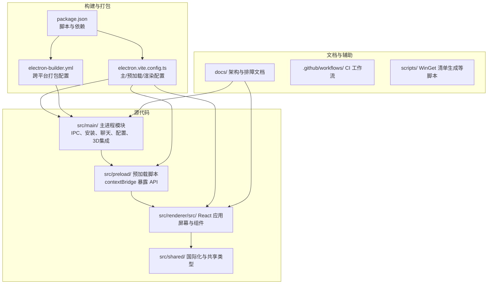
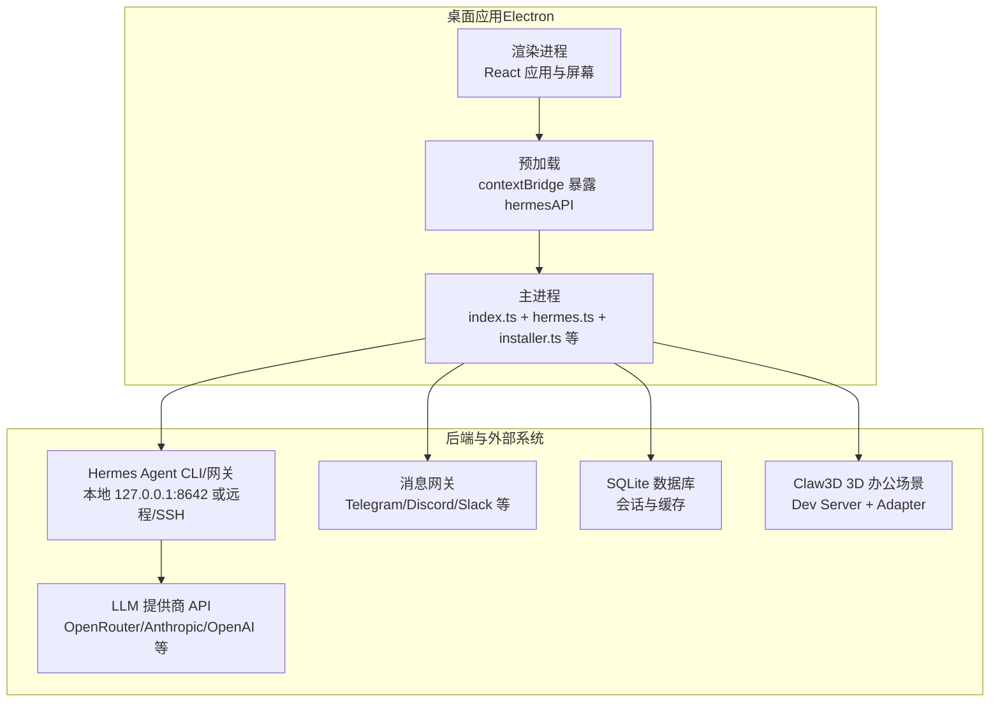
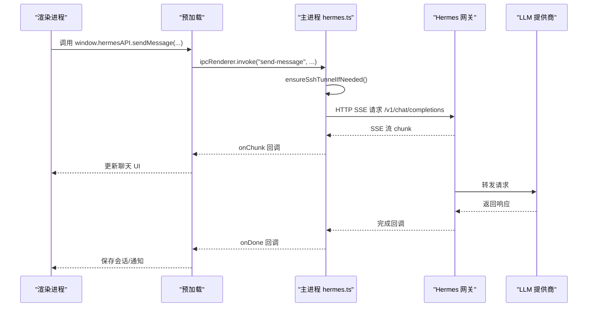
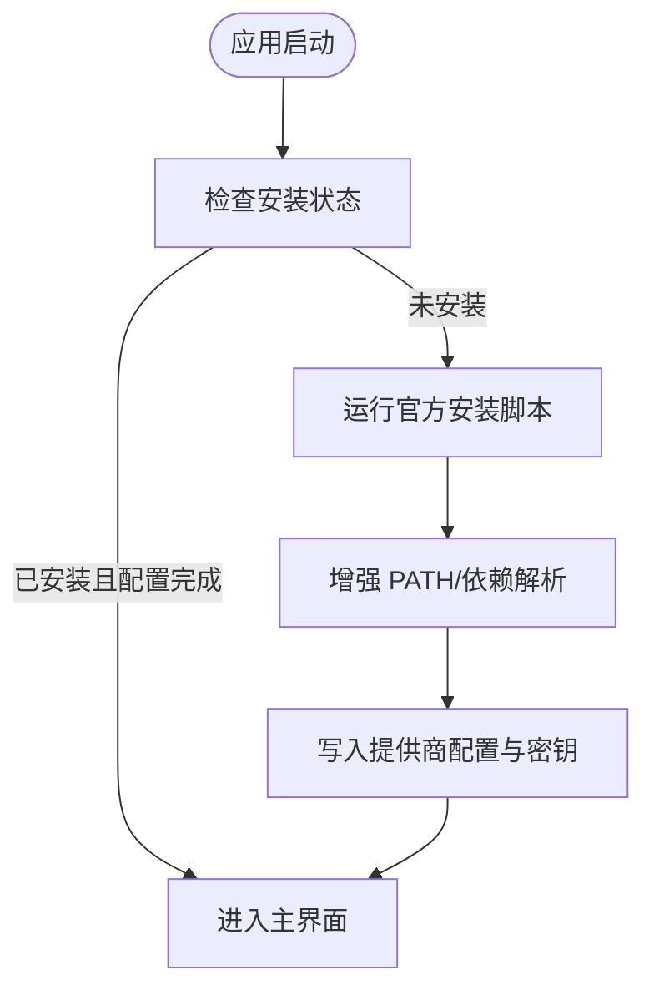
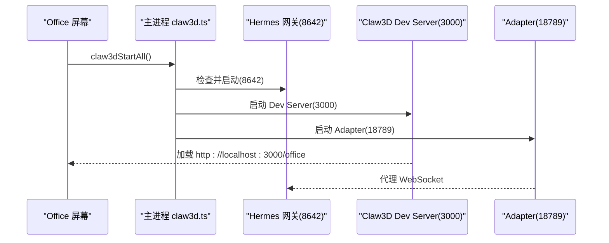
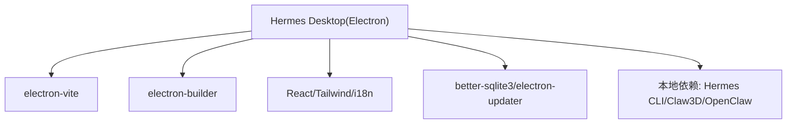

# 项目概述

<cite>
**本文引用的文件**
- [README.md](file://README.md)
- [README.zh-CN.md](file://README.zh-CN.md)
- [CONTRIBUTING.md](file://CONTRIBUTING.md)
- [package.json](file://package.json)
- [electron.vite.config.ts](file://electron.vite.config.ts)
- [electron-builder.yml](file://electron-builder.yml)
- [src/main/index.ts](file://src/main/index.ts)
- [src/main/hermes.ts](file://src/main/hermes.ts)
- [src/main/installer.ts](file://src/main/installer.ts)
- [docs/hermes-desktop-architecture.md](file://docs/hermes-desktop-architecture.md)
- [docs/office-page-fix.md](file://docs/office-page-fix.md)
- [docs/pnpm-dev-fix.md](file://docs/pnpm-dev-fix.md)
</cite>

## 目录
1. [简介](#简介)
2. [项目结构](#项目结构)
3. [核心组件](#核心组件)
4. [架构总览](#架构总览)
5. [详细组件分析](#详细组件分析)
6. [依赖关系分析](#依赖关系分析)
7. [性能考量](#性能考量)
8. [故障排除指南](#故障排除指南)
9. [结论](#结论)
10. [附录](#附录)

## 简介
Hermes Desktop 是一款基于 Electron + React 的原生桌面应用，旨在为用户提供安装、配置与交互 Hermes Agent 的一体化图形界面体验。Hermes Agent 是一个具备工具使用能力、多平台消息集成与闭环学习能力的自改进 AI 助手。Hermes Desktop 通过官方安装脚本将 Hermes 安装至用户主目录的专用工作区，并提供聊天、会话、档案、记忆、技能、工具、网关、3D 可视化办公场景（Claw3D）等丰富的管理与交互功能。

- 设计理念
  - 降低使用门槛：将原本需要 CLI 操作的安装、配置与日常使用整合到图形界面。
  - 多模式连接：支持本地（127.0.0.1:8642）、远程 HTTP 与 SSH 隧道三种连接模式，满足不同部署场景。
  - 与上游项目协作：桌面应用依赖上游 Hermes Agent 项目实现代理行为与工具执行，二者形成“GUI + CLI”的协同关系。
  - 跨平台发布：通过 Electron Builder 针对 Windows、macOS、Linux 提供原生安装包与分发渠道。

- 当前状态
  - 项目处于积极开发阶段，功能持续迭代，部分特性可能随版本调整。欢迎通过 Issues 反馈问题与建议，或通过 Pull Request 贡献代码。

- 许可证
  - 项目采用 MIT 许可证，允许自由使用、复制、修改与再发布，但需保留版权与许可声明。

- 社区参与
  - 提供英文与简体中文双语贡献指南，鼓励通过 GitHub Issues 提交 Bug 与功能请求，或在 Discord 等渠道交流。

**章节来源**
- [README.md:17-282](file://README.md#L17-L282)
- [README.zh-CN.md:10-148](file://README.zh-CN.md#L10-L148)
- [CONTRIBUTING.md:1-104](file://CONTRIBUTING.md#L1-L104)

## 项目结构
项目采用“主进程 + 预加载桥接 + 渲染进程（React）”的经典 Electron 架构，配合多语言文档与自动化打包配置，形成完整的开发与发布体系。

**图表来源**
- [docs/hermes-desktop-architecture.md:18-39](file://docs/hermes-desktop-architecture.md#L18-L39)
- [electron.vite.config.ts:1-33](file://electron.vite.config.ts#L1-L33)
- [electron-builder.yml:1-58](file://electron-builder.yml#L1-L58)
- [package.json:1-70](file://package.json#L1-L70)

**章节来源**
- [docs/hermes-desktop-architecture.md:18-39](file://docs/hermes-desktop-architecture.md#L18-L39)
- [electron.vite.config.ts:1-33](file://electron.vite.config.ts#L1-L33)
- [electron-builder.yml:1-58](file://electron-builder.yml#L1-L58)
- [package.json:1-70](file://package.json#L1-L70)

## 核心组件
- 主进程（Electron 主进程）
  - 负责窗口创建、菜单、自动更新、安全策略、IPC 注册与业务模块编排。
  - 关键职责：安装与迁移、聊天网关生命周期、SSH 隧道、Claw3D 集成、配置读写、会话与记忆管理、工具与技能管理、定时任务等。
- 预加载脚本（Preload）
  - 通过 contextBridge 暴露受控 API 到渲染进程，统一 IPC 调用入口，确保安全与类型约束。
- 渲染进程（React 应用）
  - 采用自研路由状态机组织屏幕，覆盖聊天、会话、档案、模型、网关、记忆、技能、工具、定时任务、3D 办公场景等。
  - 技术栈：React 19、TailwindCSS 4、i18n、Markdown 渲染与代码高亮等。

- 关键模块概览
  - 安装与配置：安装状态检查、官方脚本运行、OpenClaw 迁移、备份/导入/诊断、日志读取。
  - 聊天与网关：HTTP SSE 流式聊天、健康检查、远程连接测试、SSH 隧道与认证头管理。
  - 数据存储：SQLite 会话数据库（FTS5 全文搜索）、本地缓存、模型配置、凭证池。
  - 3D 办公场景（Claw3D）：Dev Server、Adapter 生命周期管理与配置同步。
  - 远程连接：SSH 执行远程操作、端口转发、健康检查与自动端口分配。

**章节来源**
- [src/main/index.ts:1-1234](file://src/main/index.ts#L1-L1234)
- [src/main/hermes.ts:1-887](file://src/main/hermes.ts#L1-L887)
- [src/main/installer.ts:1-1130](file://src/main/installer.ts#L1-L1130)
- [docs/hermes-desktop-architecture.md:93-374](file://docs/hermes-desktop-architecture.md#L93-L374)

## 架构总览
Hermes Desktop 的整体架构围绕“主进程模块 + 预加载桥接 + 渲染进程”的三层设计展开，辅以与上游 Hermes Agent 的 CLI/网关协作，以及与第三方服务（LLM 提供商、消息网关、内存提供者）的对接。

**图表来源**
- [docs/hermes-desktop-architecture.md:43-89](file://docs/hermes-desktop-architecture.md#L43-L89)
- [src/main/index.ts:290-800](file://src/main/index.ts#L290-L800)
- [src/main/hermes.ts:20-120](file://src/main/hermes.ts#L20-L120)

**章节来源**
- [docs/hermes-desktop-architecture.md:43-89](file://docs/hermes-desktop-architecture.md#L43-L89)
- [src/main/index.ts:290-800](file://src/main/index.ts#L290-L800)
- [src/main/hermes.ts:20-120](file://src/main/hermes.ts#L20-L120)

## 详细组件分析

### 聊天与网关组件
- 功能要点
  - 通过 HTTP SSE 流式协议与 Hermes 网关通信，实时渲染工具进度、Markdown 内容与令牌用量。
  - 支持本地（127.0.0.1:8642）、远程 HTTP、SSH 隧道三种模式，自动选择与健康检查。
  - 首次消息时惰性启动网关，必要时自动建立 SSH 隧道并缓存远端密钥。
- 数据流
  - 渲染层触发 sendMessage → 预加载 IPC → 主进程 hermes.ts → 网关（HTTP SSE 或 CLI 回退）→ 回调渲染。

**图表来源**
- [src/main/index.ts:544-640](file://src/main/index.ts#L544-L640)
- [src/main/hermes.ts:168-200](file://src/main/hermes.ts#L168-L200)

**章节来源**
- [src/main/index.ts:544-640](file://src/main/index.ts#L544-L640)
- [src/main/hermes.ts:168-200](file://src/main/hermes.ts#L168-L200)

### 安装与配置组件
- 功能要点
  - 检测与验证安装状态，运行官方安装脚本，处理依赖解析与增强 PATH。
  - 支持 OpenClaw 迁移、备份/导入/诊断、日志读取与版本刷新。
  - 三层配置管理：桌面连接配置、API 密钥（.env）、模型与平台配置（config.yaml）。
- 关键路径
  - 首次启动检测 → 未安装则运行官方脚本 → 完成提供商配置 → 启动主界面。

**图表来源**
- [src/main/installer.ts:153-200](file://src/main/installer.ts#L153-L200)
- [README.md:120-131](file://README.md#L120-L131)

**章节来源**
- [src/main/installer.ts:153-200](file://src/main/installer.ts#L153-L200)
- [README.md:120-131](file://README.md#L120-L131)

### 3D 办公场景（Claw3D）组件
- 功能要点
  - 管理 Claw3D Dev Server 与 Adapter 的生命周期，自动端口检测与启动顺序保证。
  - 写入适配的 settings.json 与 .env，确保 WebSocket 代理链路（webview → ws://localhost:3000 → ws://localhost:18789 → http://127.0.0.1:8642）稳定连通。
- 关键路径
  - Office 屏幕点击 Start → 主进程启动网关 → 启动 Dev Server → 启动 Adapter → webview 加载本地 3D 界面。

**图表来源**
- [docs/office-page-fix.md:15-83](file://docs/office-page-fix.md#L15-L83)
- [docs/office-page-fix.md:162-168](file://docs/office-page-fix.md#L162-L168)

**章节来源**
- [docs/office-page-fix.md:15-83](file://docs/office-page-fix.md#L15-L83)
- [docs/office-page-fix.md:162-168](file://docs/office-page-fix.md#L162-L168)

## 依赖关系分析
- 构建与打包
  - electron-vite：集成 Vite 的 Electron 开发与构建工具链。
  - electron-builder：跨平台打包与发布配置。
- 前端生态
  - React 19、TailwindCSS 4、i18n、Markdown 渲染与代码高亮。
- 后端与系统
  - better-sqlite3：本地 SQLite 存储与全文检索。
  - electron-updater：自动更新。
- 本地依赖
  - Hermes Agent CLI（Python 环境与 hermes 可执行文件）。
  - Claw3D Office（npm 安装的 Next.js 项目）。
  - OpenClaw 设置迁移。

**图表来源**
- [docs/hermes-desktop-architecture.md:316-341](file://docs/hermes-desktop-architecture.md#L316-L341)
- [electron.vite.config.ts:1-33](file://electron.vite.config.ts#L1-L33)
- [electron-builder.yml:1-58](file://electron-builder.yml#L1-L58)

**章节来源**
- [docs/hermes-desktop-architecture.md:316-341](file://docs/hermes-desktop-architecture.md#L316-L341)
- [electron.vite.config.ts:1-33](file://electron.vite.config.ts#L1-L33)
- [electron-builder.yml:1-58](file://electron-builder.yml#L1-L58)

## 性能考量
- 启动优化
  - 主进程模块按需加载，避免一次性 require 大量重型依赖。
  - 预加载脚本与渲染进程间通过 IPC 传递重计算，减少渲染进程负担。
- 渲染层优化
  - 使用 React 19 的并发特性与 TailwindCSS 的原子化样式，减少不必要的重绘。
  - Markdown 与代码高亮按需渲染，避免大文本一次性处理。
- 数据访问
  - SQLite 会话数据库结合 FTS5 全文搜索，提升查询效率；本地缓存减少重复 IO。
- 网络与流式
  - SSE 流式传输减少首字节延迟，工具进度与令牌用量实时反馈。

[本节为通用性能建议，无需特定文件引用]

## 故障排除指南
- 聊天 401 错误
  - 检查模型提供商配置与对应 API 密钥是否匹配。
  - 使用 curl 直接测试提供商 API，确认凭据与网络可达性。
- Office 连接超时
  - 检查端口占用情况（8642、3000、18789），确保网关、Dev Server、Adapter 依序启动。
  - 确认 Claw3D settings.json 的 gateway.url 格式为嵌套对象。
- Windows spawn 问题
  - 避免通过 cmd.exe 启动 dev server，改用 node.exe 直接执行，规避 DLL 初始化失败。
- 开发模式启动失败（pnpm）
  - 为 electron 模块创建 path.txt 或启用 pre/post scripts，或设置 ELECTRON_EXEC_PATH 环境变量。

**章节来源**
- [docs/hermes-desktop-architecture.md:345-374](file://docs/hermes-desktop-architecture.md#L345-L374)
- [docs/office-page-fix.md:146-202](file://docs/office-page-fix.md#L146-L202)
- [docs/pnpm-dev-fix.md:1-126](file://docs/pnpm-dev-fix.md#L1-L126)

## 结论
Hermes Desktop 通过 Electron + React 的组合，将复杂的人工智能助手安装、配置与交互过程简化为直观的桌面应用。其与上游 Hermes Agent 的紧密协作，以及对本地/远程/SSH 多模式连接的支持，使其适用于多种部署与使用场景。项目当前处于积极开发阶段，功能持续完善，建议关注官方文档与 Issues 获取最新动态。

[本节为总结性内容，无需特定文件引用]

## 附录

### 核心功能列表
- 引导式首次安装与依赖解析
- 本地/远程/SSH 三种连接模式
- 多提供商支持（OpenRouter、Anthropic、OpenAI、Google Gemini、xAI、Nous Portal、Qwen、MiniMax、Hugging Face、Groq 等）
- 流式聊天 UI（SSE、工具进度、Markdown 渲染、语法高亮）
- 令牌用量追踪与 /usage 命令
- 22 条斜杠命令（/new、/clear、/fast、/web、/image、/browse、/code、/shell、/help、/tools、/skills、/model、/memory、/persona、/version、/compact、/compress、/undo、/retry、/debug、/status 等）
- 会话管理（SQLite FTS5 全文搜索、按日期分组、跨会话搜索与恢复）
- 档案切换（创建、删除、切换，隔离配置）
- 14 类工具集（Web、浏览器、终端、文件、代码执行、视觉、图像生成、TTS、技能、记忆、会话搜索、澄清、委托、MoA、任务规划）
- 记忆系统（查看/编辑记忆条目、用户画像、容量跟踪、可发现的记忆提供者）
- 人格编辑器（SOUL.md）
- 已保存模型（跨提供商的模型配置 CRUD）
- 定时任务（Cron 任务构建器与 15 种投递目标）
- 16 类消息网关（Telegram、Discord、Slack、WhatsApp、Signal、Matrix、Mattermost、Email、SMS、iMessage、DingTalk、Feishu/Lark、WeCom、WeChat、Webhooks、Home Assistant）
- 3D 办公场景（Claw3D）可视化界面与适配器管理
- 备份、导入与调试转储
- 日志查看器
- 自动更新
- 国际化框架（i18n）
- 测试套件（SSE 解析器、IPC 处理器、预加载 API 表面、安装器工具与常量校验）

**章节来源**
- [README.md:80-102](file://README.md#L80-L102)

### 系统要求与平台支持
- 平台
  - Windows（NSIS 安装器）
  - macOS（DMG）
  - Linux（AppImage、Snap、DEB、RPM）
- 前置条件
  - Node.js 与 npm
  - 可运行 Hermes 安装器的类 Unix shell 环境
  - 首次安装时具备网络访问能力

**章节来源**
- [README.md:28-80](file://README.md#L28-L80)

### 项目截图展示
- Office（3D 办公场景）
- Chat（聊天界面）
- Profiles（档案管理）
- Tools（工具集）
- Settings（设置）
- Skills（技能）

**章节来源**
- [README.md:103-118](file://README.md#L103-L118)

### 相关项目与文档
- 上游项目：Hermes Agent 主仓库
- 文档与帮助：官方文档站点与社区渠道

**章节来源**
- [README.md:277-282](file://README.md#L277-L282)